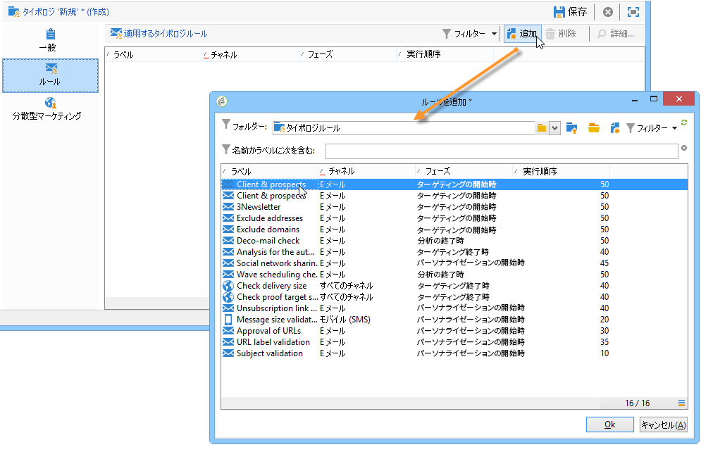
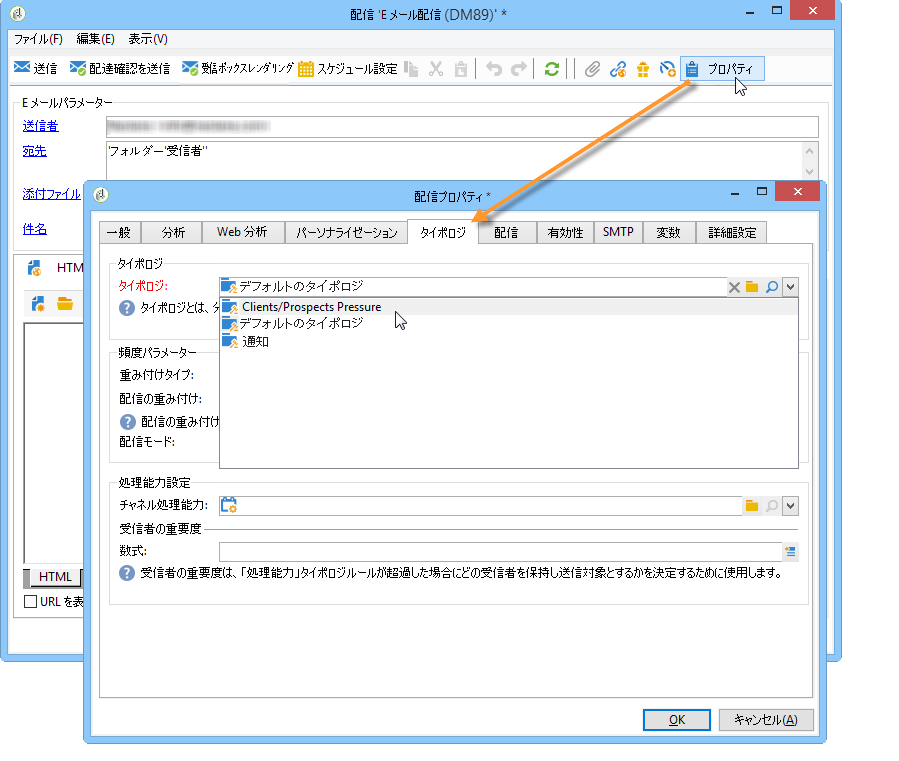
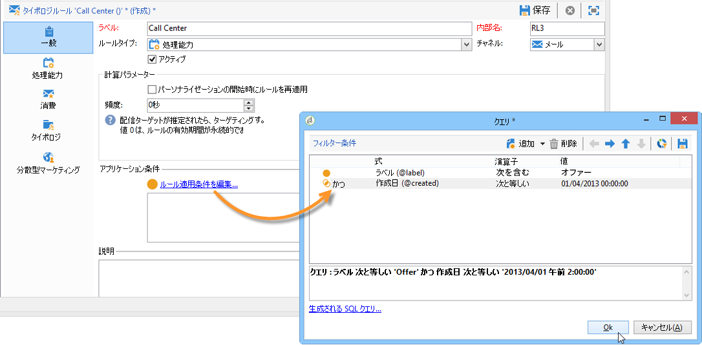
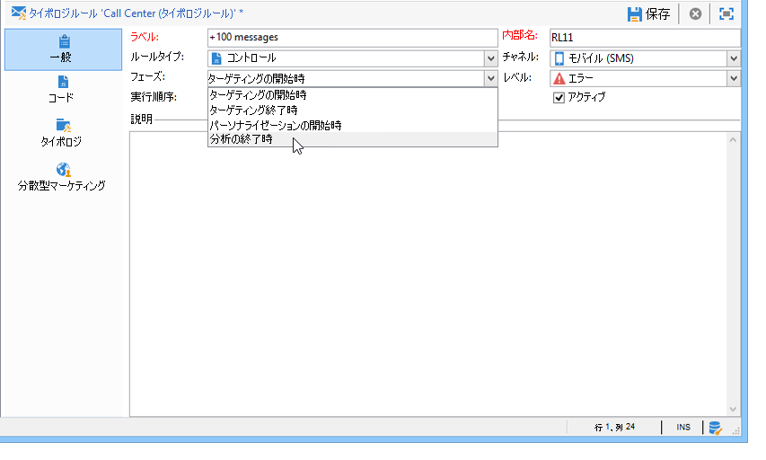
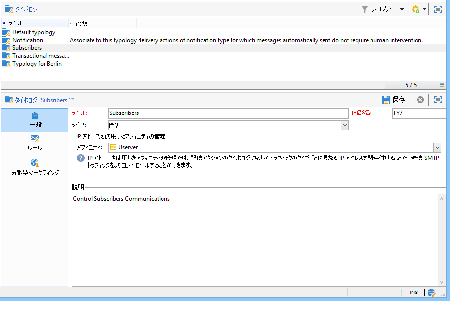
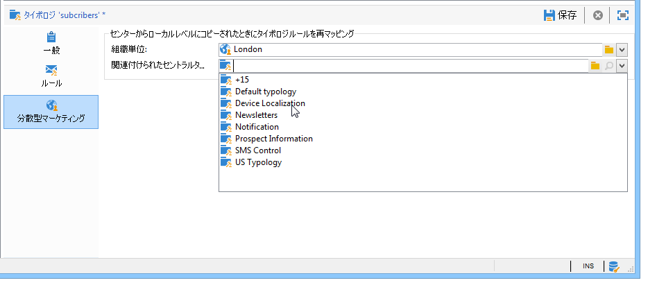

# タイポロジルールの適用{#applying-rules}

## 配信へタイポロジを適用 {#apply-a-typology-to-a-delivery}

作成したタイポロジルールを適用するには、そのルールをタイポロジに関連付けたうえで、配信でこのタイポロジを参照します。

これを行うには、次の手順に従います。

1. キャンペーンタイポロジを作成します。

   タイポロジにアクセスするには、Campaign エクスプローラーの&#x200B;**[!UICONTROL 管理／キャンペーン管理／タイポロジ管理]**／**[!UICONTROL タイポロジ]**&#x200B;フォルダーに移動します。

1. 「**[!UICONTROL ルール]**」タブに移動し、「**[!UICONTROL 追加]**」ボタンをクリックして、このタイポロジによって適用するルールを選択します。

   

1. タイポロジを保存して、既存のタイポロジのリストに追加します。
1. このルールを適用する配信を開きます。
1. 配信プロパティを参照し、「**[!UICONTROL タイポロジ]**」タブを開きます。
1. ドロップダウンリストからタイポロジを選択します。

   

   >[!NOTE]
   >
   >配信テンプレートでタイポロジを定義すると、このテンプレートを使用して作成されるすべての配信に自動的にこのタイポロジを適用できます。

## 適用条件を定義 {#define-application-conditions}

ルールの適用範囲は、必要に応じて制限できます（ただし、コントロールルールは除く）。

例えば、タイポロジルールを設定して、リンク先の特定の配信だけに適用したり、配信のターゲットに含まれる特定の受信者だけに適用したりすることができます。

ルールの適用条件を定義するには、「**[!UICONTROL 一般]**」タブにある「**[!UICONTROL ルール適用条件を編集...]**」リンクをクリックします。

次に、クエリエディターを使用して、フィルター条件を定義します。以下の図では、ラベルに「offer」という語が含まれる配信または現在の日付以降に作成された配信のみに、処理能力ルールが適用されます。

>[!NOTE]
>
>フィルタールールでは、配信または配信の概要に基づいて、フィルターの適用条件を指定できます。[詳細情報](filtering-rules.md#condition-a-filtering-rule)。

## 計算頻度を調整 {#adjust-calculation-frequency}

判別はデータベースのクレンジングワークフローの一環として自動的に毎晩実行されますが、値は 1 日以上保存しておくことができます。

実際、計算で使用される値には、毎日変更はされないものもあります。したがって、毎日データを再計算し、データベースの負荷を増やすことは、適切とは言えません。例えば、顧客の傾向スコアと購入情報が週に一度マーケティングデータベースに保存される場合、これらの値に基づくデータを毎日再計算する必要はありません。

このような場合は、「**[!UICONTROL 一般]**」タブの「**[!UICONTROL 頻度]**」フィールドで、ターゲティングを保存する最大期間を定義できます。デフォルトの値は **0** です。これは、翌日に判別が再び実行されるときまで、計算値が有効であることを示します。

計算結果を 1 日以上保存するには、「**[!UICONTROL 頻度]**」フィールドに 1 以上の値を入力します。この有効期間を過ぎると、すべてのルールが再適用されます。

「**[!UICONTROL パーソナライゼーションの開始時にルールを再適用]**」オプションを使用すると、パーソナライゼーションのフェーズで自動的にルールを適用できます（「**[!UICONTROL 頻度]**」フィールドで指定されている有効期間内であっても、ルールは再適用されます）。

## ルール適用フェーズの選択 {#selecting-the-rule-application-phase}

タイポロジルールは、対象となる配信のターゲティング、分析およびパーソナライゼーションの各フェーズで、特定の順序に従って適用されます。

### 実行順序 {#execution-order}

標準の操作モードでは、ルールは次の順序で適用されます。

1. ターゲティングの開始時に適用されるコントロールルール
1. フィルタールール:

   * ネイティブアプリケーションのアドレス選定ルール（定義されたアドレス／検証されていないアドレス／ブロックリストに登録されたアドレス／強制隔離されたアドレス／アドレスの質）。
   * ユーザーによって定義されたフィルタールール
   * アドレスまたは識別子の重複排除ルール（必要に応じて適用）

1. 頻度ルール
1. 処理能力ルール
1. ターゲティングの終了時に適用されるコントロールルール
1. パーソナライゼーションの開始時に適用されるコントロールルール（ユーザーのルール（フィルター／頻度／処理能力）の有効期限が切れ、再計算が必要な場合は、この段階で適用されます）
1. パーソナライゼーションの終了時に適用されるコントロールルール

>[!NOTE]
>
>キャンペーンインタラクションモジュールを操作する場合、オファーの実施要件ルールはフィルタールールと同じタイミングで適用されるか（オファーが配信の概要に含まれる場合）、パーソナライゼーションのフェーズ、オファーエンジンの呼び出し時に適用されます。

タイプが同じルールの実行順序は、ルールの「**[!UICONTROL 一般]**」タブにある適切なフィールドを使用して、調整することができます。複数のルールが同じメッセージ処理フェーズで実行される場合、「**[!UICONTROL 実行順序]**」フィールドで順序を設定できます。

例えば、実行順序が 20 番目の頻度ルールは、実行順序が 30 番目の頻度ルールより先に実行されます。

### コントロールルール {#control-rules}

**[!UICONTROL コントロール]**&#x200B;ルールの場合は、配信ライフサイクルのどの時点でルールを適用するかを指定することができます（ターゲティングの前または後、パーソナライゼーションの開始時、分析の終了時）。タイポロジルールの「**[!UICONTROL 一般]**」タブにある「**[!UICONTROL フェーズ]**」フィールドで、適用する値をドロップダウンリストから選択してください。

次のような値を選択できます。

* **[!UICONTROL ターゲティングの開始時]**

   エラーが発生した場合にパーソナライゼーションを実行しないようにするには、この段階でコントロールルールを適用します。

* **[!UICONTROL ターゲティングの終了時]**

   コントロールルールを適用する前にターゲットのボリュームを把握しておきたい場合は、このフェーズを選択します。

   例えば、**[!UICONTROL 配達確認のターゲットのサイズを検証]**&#x200B;コントロールルールは、各ターゲティングフェーズの後に適用します。このルールにより、配達確認の受信者数が多い場合は、メッセージのパーソナライゼーションがおこなわれないようにすることができます。

* **[!UICONTROL パーソナライゼーションの開始時]**

   コントロールルールで、メッセージのパーソナライゼーションの承認を検証する場合は、このフェーズを選択します。メッセージのパーソナライゼーションは、分析フェーズで実行されます。

* **[!UICONTROL 分析の終了時]**

   メッセージのパーソナライゼーションが完了している必要がある場合は、このフェーズを選択します。

## その他の設定 {#additional-configurations}

### 送信 SMTP トラフィックの制御 {#control-outgoing-smtp-traffic}

必要に応じて、「**[!UICONTROL IP アドレスを使用したアフィニティの管理]**」フィールドを使用して、アフィニティを管理する配信サーバー（MTA）と配信を関連付けることができます。この設定により、コンピューターや出力アドレスに配信される E メールの数を制限できます。

>[!NOTE]
>
>アフィニティの管理は、**[!UICONTROL フィルター]**&#x200B;タイポロジには適用されません。

<!--
>Affinities are defined in the instance configuration file, on the Adobe Campaign server. For more on this, refer to [this section](../../installation/using/about-initial-configuration.md).-->

### キャンペーンの最適化と分散型マーケティング {#campaign-optimization-and-distributed-marketing}

「**[!UICONTROL 分散型マーケティング]**」タブでは、共有キャンペーンがオーダーまたは予約されているときに適用されるタイポロジまたはタイポロジルールの再マッピングを定義できます。分散型マーケティングでは、ローカルエンティティのタイポロジ／ルール（セントラルエンティティ向けに定義されたタイポロジ／ルールにリンクされる）によって、セントラルエンティティのタイポロジ／ルールが置換されます。再マッピングすると、キャンペーンをオーダーするローカルエンティティに応じて、セントラルエンティティのルールを調整することができます。

>[!NOTE]
>
>ライセンスに分散型マーケティングのオプションが含まれていれば、タイポロジおよびタイポロジルールに「**[!UICONTROL 分散型マーケティング]**」タブが追加されます。オプションの有無については、ライセンス契約をお確かめください。\
>分散型マーケティングについて詳しくは、[この節](../distributed-marketing/about-distributed-marketing.md)を参照してください。
