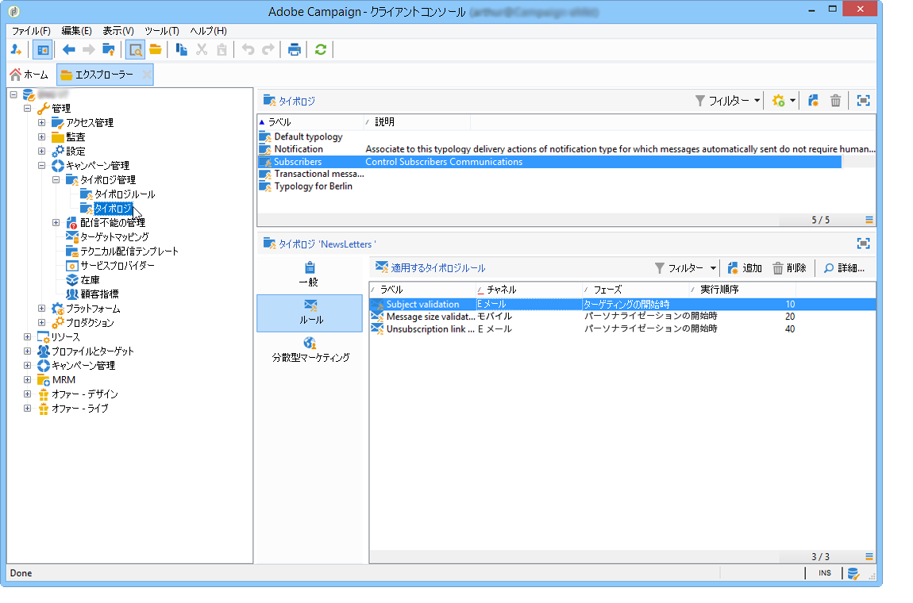

# キャンペーンタイポロジの概要{#about-campaign-typologies}

キャンペーンの最適化は、配信状況を制御、フィルターおよび監視する Adobe Campaign のモジュールです。キャンペーン間の競合を回避するために、Adobe Campaign では特定の制限ルールを適用して、様々な組み合わせをテストできます。このテストにより、企業のコミュニケーションポリシーに準拠し、顧客のニーズと期待に応える最適なメッセージを送信できます。

 [ビデオでこの機能を確認する](#typologies-video)

>[!NOTE]
>
>提供されている内容によって、キャンペーンの最適化は含まれていることも、アドインになっていることもあります。使用許諾契約書を確認してください。

## タイポロジルール およびタイポロジ {#typology-rules}

Adobe Campaignでは、4 種類の **タイポロジルール**:

* **フィルター**&#x200B;ルール：条件に基づいて、ターゲットの一部を除外します。[詳細情報](filtering-rules.md)。
* **頻度**&#x200B;ルール： マーケティング疲労（過剰なマーケティングによる弊害）を抑制します。[詳細情報](pressure-rules.md)。
* **処理能力**&#x200B;ルール：最適な処理環境を確保するために、負荷を制限します。[詳細情報](consistency-rules.md#controlling-capacity)。
* **コントロール**&#x200B;ルール：メッセージを送信する前にメッセージの有効性を確認します。[詳細情報](control-rules.md)。

作成されたタイポロジルールは、キャンペーン内にグループ化されます **タイポロジ** 配信で参照される [詳細情報](#apply-typologies)。

キャンペーンタイポロジには、複数のタイポロジルールを含めることができますが、1 つの配信では 1 つのタイポロジしか参照できません。

組み込みのタイポロジルールとタイポロジは、 **[!UICONTROL 管理/キャンペーン管理/タイポロジ管理]** Campaign エクスプローラーのノード。

タイポロジごとに、 **[!UICONTROL ルール]** 「 」タブでは、適用するタイポロジルールを追加、削除、表示できます。

## タイポロジを適用するための主な手順 {#apply-typologies}

タイポロジを作成して配信に適用するための主な手順を以下に示します。

1. タイポロジルールを作成し、タイポロジを作成して参照します。
詳細な手順を次の節に示します。
   * [頻度ルール](pressure-rules.md)
   * [フィルタリングルール](filtering-rules.md)
   * [処理能力ルール](consistency-rules.md)
   * [コントロールルール](control-rules.md)

1. 作成したタイポロジを使用するように配信を設定します。[詳細情報](apply-rules.md#apply-a-typology-to-a-delivery)。
1. キャンペーンのシミュレーションによって動作をテストして制御する。[詳細情報](campaign-simulations.md)。

配信の準備では、基準を満たした場合に受信者が除外されます。ログを確認して除外を監視できます。

頻度タイポロジルールの使用例については、[このページ](pressure-rules.md#use-cases-on-pressure-rules)を参照してください。

## チュートリアルビデオ {#typologies-video}

### タイポロジルールを使用した疲労管理の設定

このビデオでは、タイポロジルールを活用して Adobe Campaign で疲労管理を実装する方法を説明します。

>[!VIDEO](https://video.tv.adobe.com/v/25090?quality=12)

### 定義済みフィルターを使用した疲労管理の設定

疲労管理では、受信者への過剰勧誘を避けるために、メッセージの頻度と数量を制御します。キャンペーンインスタンスにキャンペーン最適化モジュールがない場合、受信したメッセージの数でターゲット母集団をフィルタリングする定義済みフィルターを設定できます。
このビデオでは、フィルターを使用して Adobe Campaign で疲労管理を実装する方法を説明します。

>[!VIDEO](https://video.tv.adobe.com/v/25091?quality=12)

