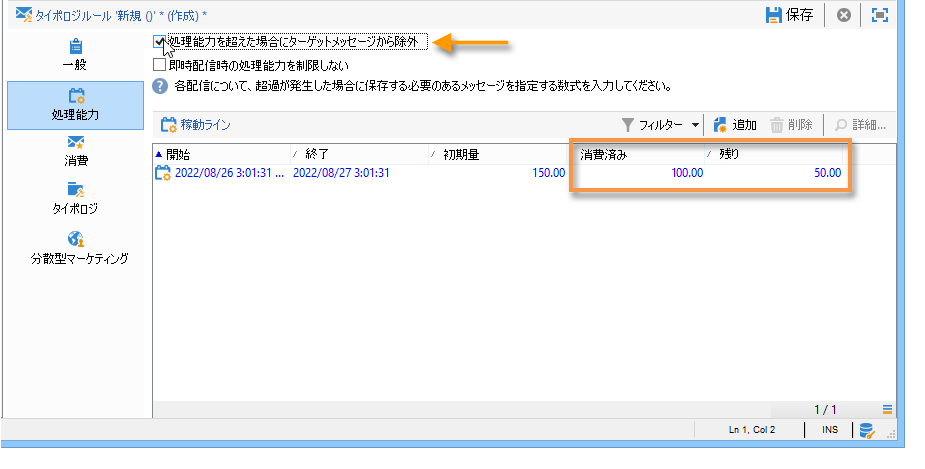

# 一貫性ルール{#consistency-rules}

Adobe Campaign では、キャンペーンタイポロジに含まれる一連のルールによって、コミュニケーションの一貫性を実現しています。一貫性ルールの目的は、受信者に送信される配信のボリューム、特性、関連性などをコントロールすることです。

**処理能力**&#x200B;ルール：例えば、メッセージの配信に関わるプラットフォームに過負荷がかかる状況を回避できます。例えば、ダウンロードリンクを含むスペシャルオファーを一度に大勢の人に送信することは、サーバーのダウンにつながるので、避けるようにします。また、電話キャンペーンを実施する際には、コールセンターの処理能力を超えないよう注意する必要があります。

## 処理能力の制御 {#control-capacity}

メッセージを配信する前に、配信や、その配信によって生成される場合がある応答（インバウンドメッセージ）を処理する能力が組織にあること（物理的インフラストラクチャ）、また購読者に連絡するための通話数を処理できること（コールセンターの処理能力）などを確認する必要があります。

このような確認を実施するには、**[!UICONTROL 処理能力]**&#x200B;タイポロジルールを作成する必要があります。

次の例では、電話によるロイヤルティキャンペーンのタイポロジルールを作成します。
ここでは、1 日あたりのメッセージ数を 20 に制限します（コールセンターの 1 日あたりの処理能力）。2 つの配信にルールを適用したら、消費状況をログによって監視できます。

新しい処理能力ルールを作成するには、次の手順に従います。

1. **[!UICONTROL 管理／キャンペーン管理／タイポロジ管理／タイポロジルール]**&#x200B;ノードで、「**[!UICONTROL 新規]**」をクリックします。
1. **[!UICONTROL 処理能力]**&#x200B;ルールタイプを選択します。

   

1. 「**[!UICONTROL 処理能力]**」タブで、稼動ラインを作成します。今回の例の場合は、電話をかけることのできる期間を指定します。期間として 24 時間を選択し、初期数量を 150 にします。これは、コールセンターが 1 日につき 150 通話を処理できることを意味します。

   

   >[!NOTE]
   >
   >稼動ラインは情報提供のためだけに存在します。処理能力の上限に達してメッセージの除外が必要になった場合は、[この節](#exclude-messages-when-capacity-limit-reached)を参照してください。

1. この処理能力ルールを適用するには、このルールをタイポロジに関連付けたうえでそのタイポロジを配信内で参照します。詳しくは、[この節](apply-rules.md#apply-a-typology-to-a-delivery)を参照してください。
1. ルールの「**[!UICONTROL 消費]**」および「**[!UICONTROL 処理能力]**」タブで消費状況を監視できます。

   配信でルールを使用すると、以下の図のように、**[!UICONTROL 消費済み]**&#x200B;と&#x200B;**[!UICONTROL 残り]**&#x200B;列に負荷の情報が表示されます。

   

   詳しくは、[この節](#monitor-consumption)を参照してください。

## 最大負荷の定義 {#define-the-maximum-load}

最大負荷を定義するには、稼動ラインを定義する必要があります。その方法は 2 つあります。[1 つ以上の稼動ラインを手動で作成する](#add-availability-lines-one-by-one)方法と、稼動の範囲を作成する方法です。これらの期間の頻度は自動的に設定できます。[詳細情報](#add-a-set-of-availability-lines)。

### 稼動ラインの個別追加 {#add-availability-lines-one-by-one}

稼動ラインを作成するには、「**[!UICONTROL 追加]**」ボタンをクリックして、「**[!UICONTROL 稼動ラインを追加]**」を選択します。稼動の期間と負荷を入力します。

処理能力に応じて、必要な数だけラインを追加します。

### 稼動ラインセットの追加 {#add-a-set-of-availability-lines}

一定の範囲にわたる稼動期間を定義するには、「**[!UICONTROL 追加]**」ボタンをクリックして、「**[!UICONTROL 稼動ラインセットを追加]**」オプションを選択します。各期間の長さと作成する期間の数を指定します。

頻度を指定して作成を自動化するには、「**[!UICONTROL 変更]**」ボタンをクリックして、期間のスケジュールを定義します。

例として、平日の午前 9 時から午後 5 時まで、通話を毎時 10 件に制限する稼動期間をスケジュールに従って自動的に作成してみましょう。それには、次の手順に従います。

1. 頻度のタイプを選択し、有効にする曜日と時間を指定します。

   

1. 有効期間を指定します。

   

1. スケジュールを確認してから、承認します。

   

**[!UICONTROL 予測]**&#x200B;ワークフローによって、一致するラインがすべて自動的に作成されます。

>[!NOTE]
>
>稼動ラインは、ファイルのインポートによって作成することをお勧めします。このタブを使用すると、消費ラインを表示および確認できます。

## 処理能力の上限到達時のメッセージ除外 {#exclude-messages-when-capacity-limit-reached}

稼動ラインの目的は、情報を確認することです。処理能力を超えるメッセージを除外するには、「**[!UICONTROL 容量を超えた場合にターゲットメッセージから除外]**」オプションをオンにしてください。この設定により、処理能力をオーバーすることを回避できます。このオプションをオンにすると、消費済みと残りの数値が初期数量を超えることはなくなります（上の図と比較してください）。

処理できるメッセージの数は、均等に分割され、定義されている期間全体に割り当てられます。この設定は、1 日あたりの最大通話数が制限されるコールセンターに特に最適です。E メール配信の場合、「**[!UICONTROL 即時配信時の処理能力を制限しない]**」オプションを指定すると、この稼動期間を無視して E メールを同時に一斉送信できます。

>[!NOTE]
>
>過負荷が生じる場合は、配信プロパティで定義されている数式に従って、保存されているメッセージが選択されます。

## 消費状況の監視 {#monitoring-consumption}

デフォルトでは、処理能力ルールは、情報の確認のために使用されます。「**[!UICONTROL 容量を超えた場合にターゲットメッセージから除外]**」オプションをオンにすると、定義した負荷を超過することを防止できます。この場合、超過したメッセージは、タイポロジルールによって自動的に配信から除外されます。

消費状況を監視するには、タイポロジルールの「**[!UICONTROL 処理能力]**」タブで、**[!UICONTROL 消費済み]**&#x200B;列に表示される値を確認してください。

消費ラインを表示するには、ルールの「**[!UICONTROL 消費]**」タブをクリックしてください。
