# 承認プロセスの設定と管理 {#approval-marketing-campaigns}

マーケティングキャンペーンの作成と承認の方法と担当者は、各組織によって異なります。キャンペーンの承認プロセスでは、デジタルマーケティング担当者、配信担当者、コンテンツマ管理者、パートナーやサプライヤーなどの外部オーナーなど、複数の関係者との調整が必要です。

Adobe Campaign では、キャンペーンの承認フローを設定し、アクションが必要な場合にオペレーターに通知できます。ターゲティング、コンテンツ、予算、抽出、プルーフの送信など、配信の各ステップごとに承認を定義できます。キャンペーンの配信が様々な検証手順を実行すると、Adobe Campaigns は、フィードバック、コメント、変更リクエスト、コメントなど、変更とサインオフの履歴をコンパイルします。

レビュー担当者として指定された Adobe Campaign オペレーターに、承認リクエストを知らせる通知メッセージが送信されます。

オペレーターは、次の方法で承認できます。

* 通知メッセージから。メール内のリンクから、オペレーターは web ブラウザーで Campaign にアクセスできます。接続すると、レビュー担当者はコンテンツを承認するかどうか選択できます。
   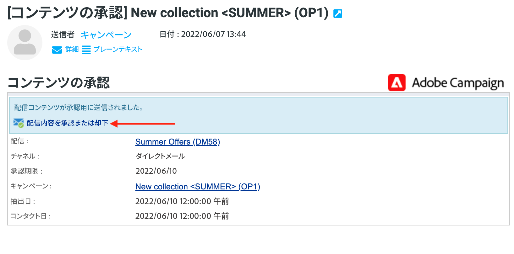

* キャンペーンダッシュボードから。
   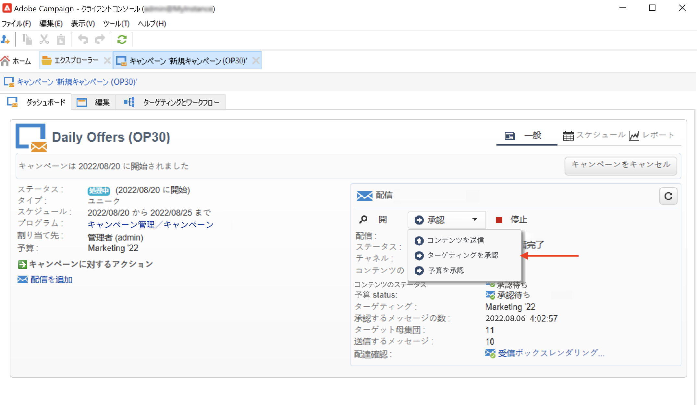

* 配信ダッシュボードから。
   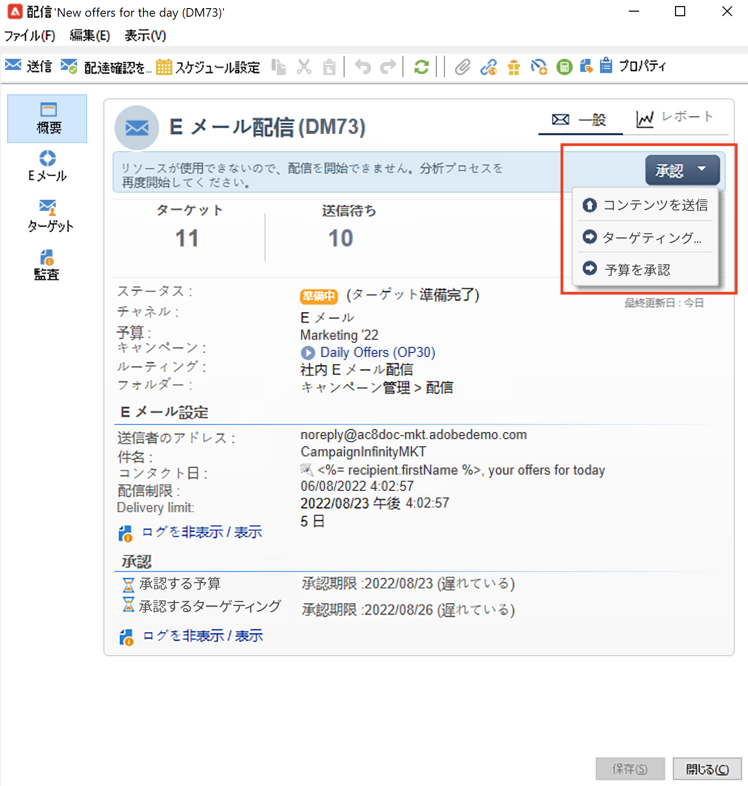

オペレーターは、承認画面からキャンペーンと配信にアクセスできます。コメントを入力することもできます。

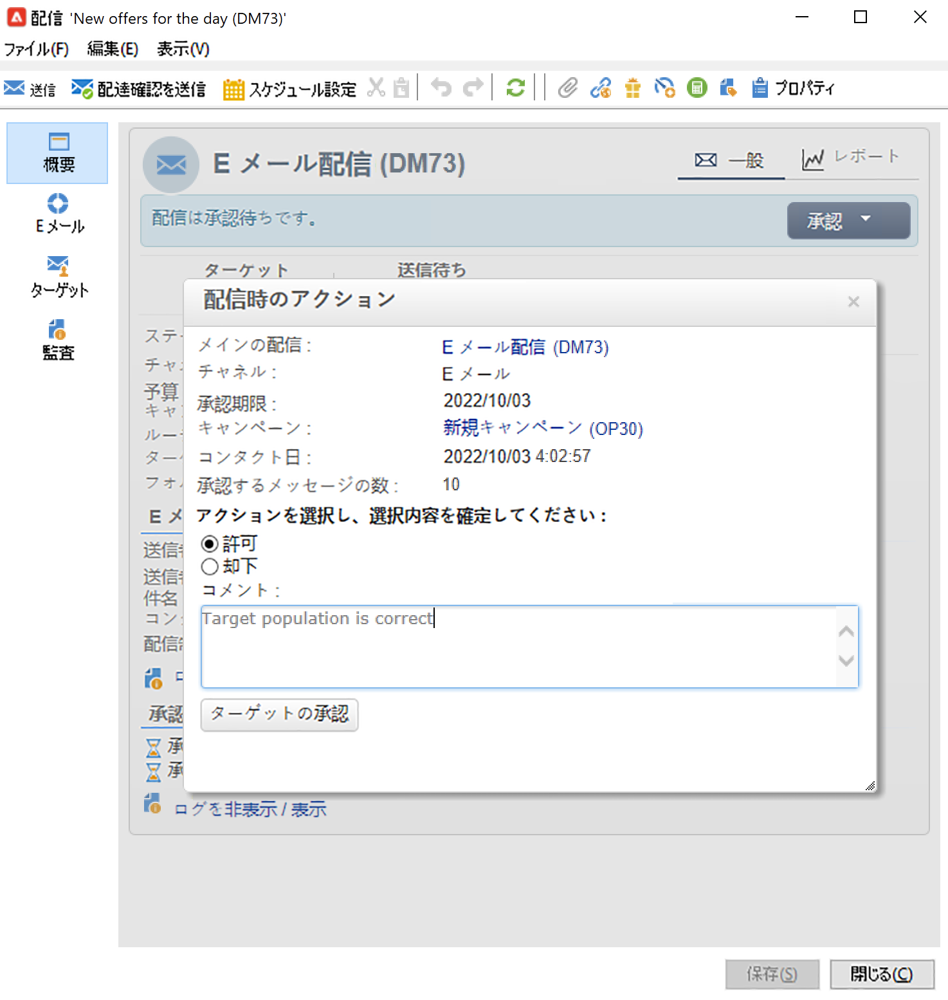

オペレーターが検証すると、キャンペーンや配信のダッシュボード、ログに情報が表示されます。

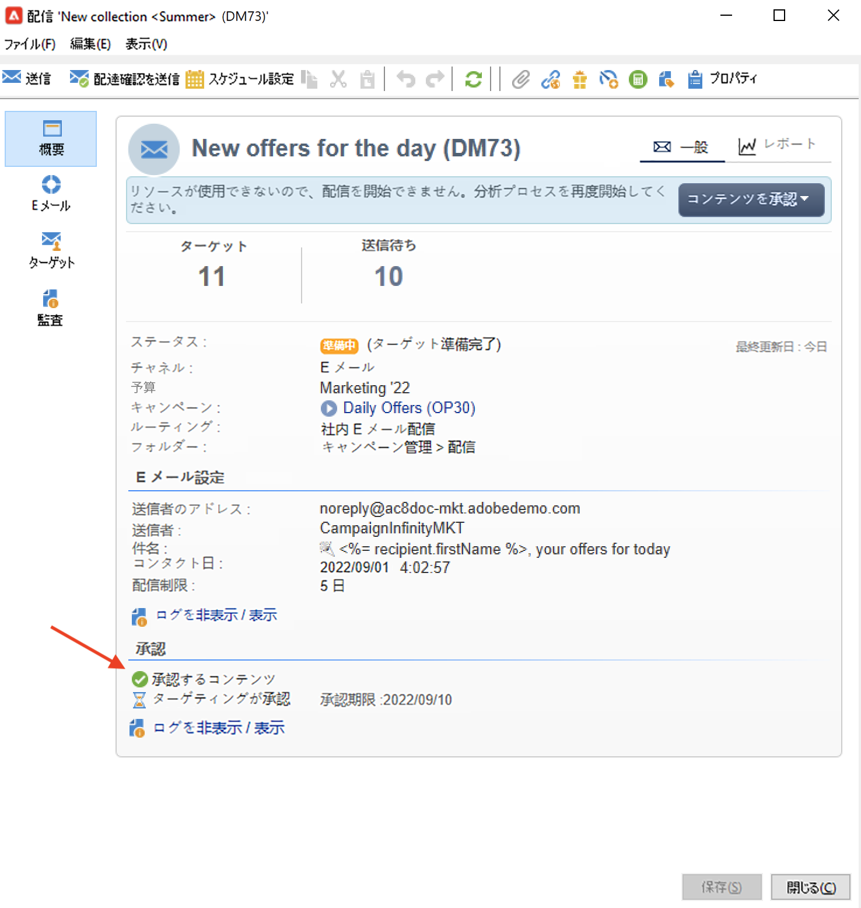

この情報は、配信の承認ログや、キャンペーンの承認ジャーナルにも表示されます。これらのログには、**[!UICONTROL 編集／監査／「承認」]**&#x200B;タブからアクセスできます。

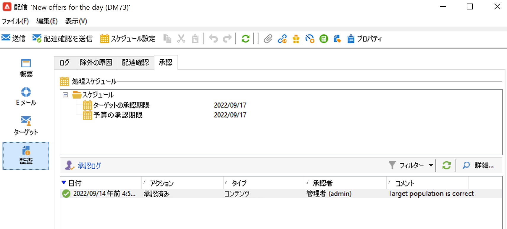

## 承認を有効にする{#enable-approvals}

承認通知は、承認を有効にした各プロセスの影響を受けるオペレーターに送信されます。

承認は、キャンペーンテンプレート、個々の各キャンペーンまたは配信に対して有効にできます。

承認が必要なすべてのジョブは、**[!UICONTROL プロパティ]**／**[!UICONTROL キャンペーンの詳細パラメーター…]**／「**[!UICONTROL 承認]**」から、キャンペーンテンプレートで選択します。このタブからレビュー担当者またはレビュー担当者のグループを選択します。このオプションが無効になっていない限り、これらのメンバーに通知が届きます。[詳細情報](#approving-processes)。

これらの設定は、このテンプレートを使用して作成されたキャンペーンごと、または配信ごとに個別に上書きできます。配信の「**[!UICONTROL プロパティ]**」ボタンをクリックし、「**[!UICONTROL 承認]**」タブをクリックします。

次の例では、配信コンテンツに承認は必要ありません。

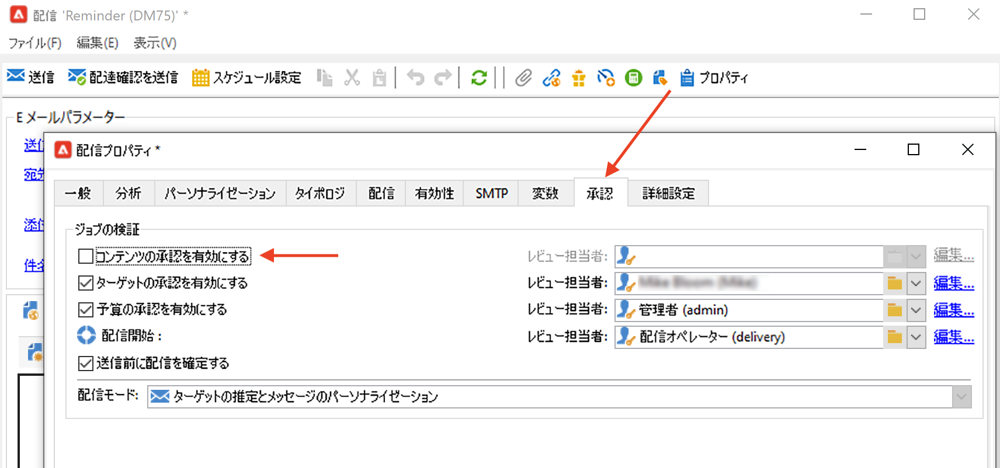

>[!CAUTION]
>
>レビュー担当者が承認の&#x200B;**適切な権限**&#x200B;を持っていること、およびレビュー担当者のセキュリティゾーンが正しく定義されていることを確認します。 [詳細情報](#selecting-reviewers)。

配信の承認プロセスについて詳しくは、[この節](#review-and-approve-deliveries)を参照してください。

## レビュー担当者の選択 {#select-reviewers}

承認のタイプごとに、承認を担当するオペレーターまたはオペレーターグループを配信のドロップダウンリストから選択します。 「**[!UICONTROL 編集...]**」リンクを使用して、オペレーターを追加できます。 このウィンドウでは承認期日を編集することもできます。デフォルトでは、レビュー担当者は送信日から 3 日以内にプロセスを承認します。自動リマインダーを追加するには、「**[!UICONTROL リマインダーを追加]**」リンクを使用します。

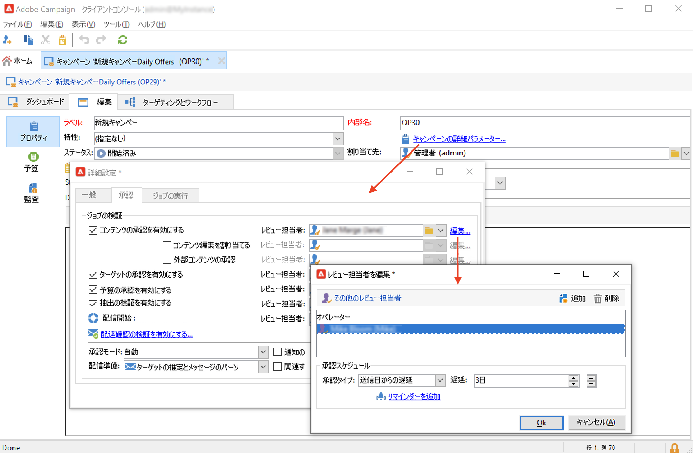

レビュー担当者が指定されていない場合は、キャンペーンの所有者が承認を行い、通知を受け取ります。キャンペーン所有者は、キャンペーンの&#x200B;**[!UICONTROL 編集／「プロパティ」]**&#x200B;タブで指定します。

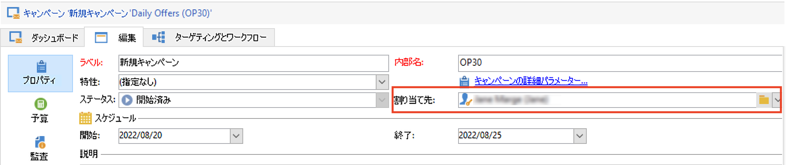

**[!UICONTROL 管理者]**&#x200B;権限を持つその他すべての Adobe Campaign オペレーターもジョブを承認できますが、通知は受け取りません。

>[!NOTE]
>
>デフォルトでは、承認オペレーターが定義されている場合に、キャンペーン所有者が承認を実行したり、配信を開始することはできません。Adobe Campaign の管理者は、「**NmsCampaign_Activate_OwnerConfirmation**」オプションを作成して「**1**」に設定することにより、この動作を変更してキャンペーンの所有者が配信を承認または開始できるようにすることができます。

レビュー担当者のリストを定義した場合、1 人のレビュー担当者がジョブを許可するとジョブが承認されます。承認リンクがキャンペーンおよび配信ダッシュボードで使用できなくなります。通知の送信が有効な場合、別のレビュー担当者が通知メッセージ内の承認リンクをクリックすると、別のオペレーターが既にジョブを承認したことが通知されます。

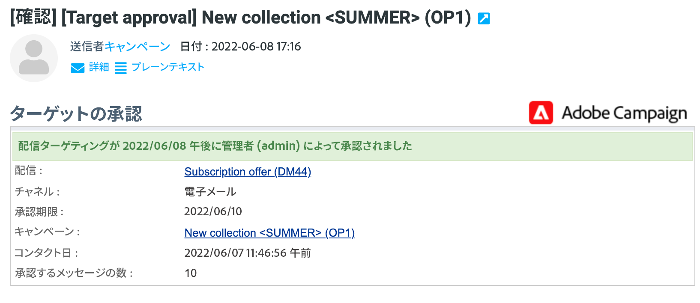

## 配信のレビューと承認 {#review-and-approve-deliveries}

キャンペーンごとに、配信ターゲット、[配信コンテンツ](#approving-content)、費用などを承認できます。Adobe Campaign を操作する承認者は、メールで通知を受け、コンソールまたは web 接続で承認を許可または却下できます。[詳細情報](#approving-processes)。

ダイレクトメール配信の場合、Adobe Campaign のオペレーターは、抽出ファイルを発送担当に送信する前に確認できます。また、必要に応じてフォーマットを変更し、抽出を再開できます。[詳細情報](#approve-an-extraction-file)。

この検証フェーズが完了したら、配信を開始できます。 [詳細情報](marketing-campaign-deliveries.md#starting-a-delivery)。

>[!NOTE]
>
>承認が必要なプロセスは、キャンペーンテンプレートで選択します。[詳細情報](marketing-campaign-templates.md)。

### 配信を承認する手順 {#approving-processes}

承認が必要なステージが、（web インターフェイスのコンソールを介して）キャンペーンダッシュボードに表示されます。配信トラッキングテーブルと配信ダッシュボードにも表示されます。

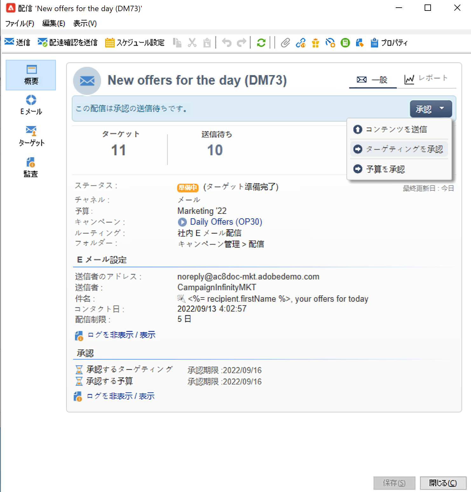

キャンペーン内の配信ごとに、以下のプロセスを承認できます。

* **ターゲティング、コンテンツ、予算**

   承認設定ウィンドウで「**[!UICONTROL ターゲットの承認を有効にする]**」オプション、「**[!UICONTROL コンテンツの承認を有効にする]**」オプションまたは「**[!UICONTROL 予算の承認を有効にする]**」オプションが選択されている場合、キャンペーンダッシュボードと配信ダッシュボードに関連リンクが表示されます。

   

   >[!NOTE]
   >
   >予算の承認は、承認設定ウィンドウでターゲットの承認が有効な場合にのみ表示されます。予算承認のリンクは、ターゲットが分析済みの場合にのみ表示されます。

   承認設定ウィンドウで「**[!UICONTROL コンテンツ編集を割り当てる]**」または「**[!UICONTROL 外部コンテンツの承認]**」オプションが選択されている場合は、ダッシュボードに「**[!UICONTROL 使用可能コンテンツ]**」リンクと「**[!UICONTROL 外部コンテンツの承認]**」リンクが表示されます。

   コンテンツを承認すると、送信済みの配達確認にアクセスできます。

* **抽出の承認（ダイレクトメール配信）**

   承認設定ウィンドウで「**[!UICONTROL 抽出の承認を有効にする]**」が選択されている場合は、抽出ファイルを承認してからでなければ発送担当に通知できません。

   「**[!UICONTROL ファイルを承認]**」オプションは、キャンペーンダッシュボードと配信ダッシュボードで使用できます。

   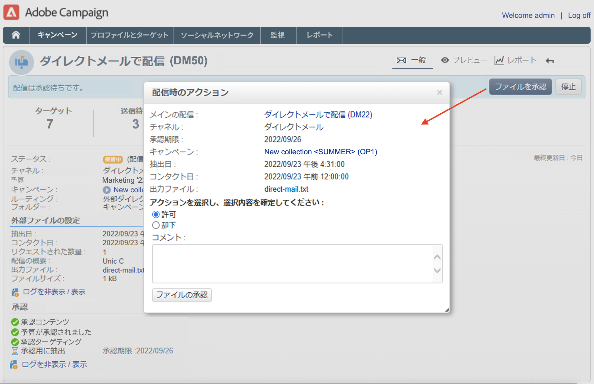

   検証前に出力ファイルをプレビューできます。抽出ファイルのプレビューでは、データサンプルのみを表示します。ファイル全体が読み込まれるわけではありません。

* **関連する配信の承認**

   「**[!UICONTROL 関連する配信ごとに個別の承認を有効にする]**」オプションは、複数のセカンダリ配信に関連付けられている 1 つのプライマリ配信に使用します。デフォルトでは、このオプションは選択されていないので、メインの配信全体を承認できます。このオプションを選択した場合、各配信を個別に承認する必要があります。

   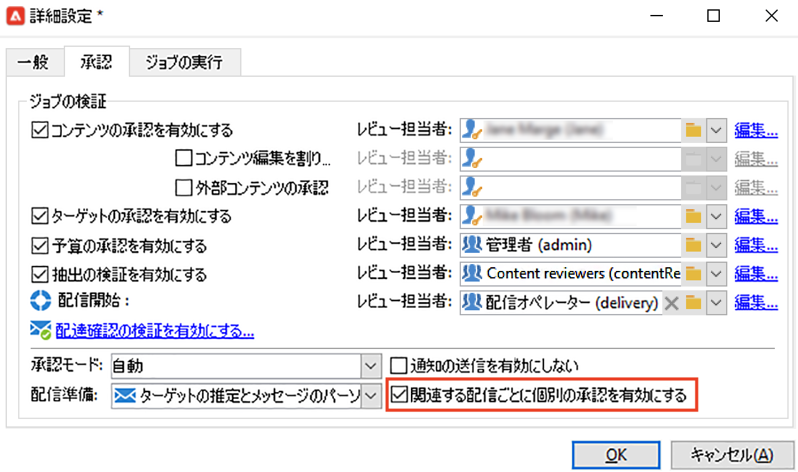

>[!NOTE]
>
>ターゲティングワークフローで、メッセージの準備中に設定の問題に関連するエラーが発生した場合は、ダッシュボードに「**[!UICONTROL メッセージの準備を再開]**」リンクが表示されます。ターゲティングステージを回避しながらメッセージの準備を再開するには、エラーを修正してこのリンクを使用します。

### コンテンツの承認 {#approve-content}

>[!CAUTION]
>
>コンテンツを承認するには、配達確認サイクルが必須です。 配達確認を使用すると、情報やパーソナライゼーションデータの表示を承認し、リンクが機能していることを確認できます。 
>
>以下に詳述するコンテンツ承認機能は、配達確認の配信に関連しています。

コンテンツ承認サイクルを設定できます。設定するには、承認設定ウィンドウで「**[!UICONTROL コンテンツの承認を有効にする]**」オプションを選択します。コンテンツ承認サイクルの主な手順は次のとおりです。

1. 新しい配信を作成した後、キャンペーンマネージャーがキャンペーンダッシュボードの「**[!UICONTROL コンテンツを送信]**」リンクをクリックして、コンテンツ承認サイクルを開始します。

   >[!NOTE]
   >
   >承認設定ウィンドウで「**[!UICONTROL 配達確認の送信を有効にする]**」オプション（E メール配信の場合）または「**[!UICONTROL 配達確認の送信と検証を有効にする]**」オプション（ダイレクトメール配信の場合）を選択した場合、配達確認が自動的に送信されます。

1. 通知 E メールがコンテンツの担当者に送信されます。この担当者は、コンテンツを承認するかどうかを選択できます。

   * 通知メールを介して。通知メールには、送信済みの配達確認へのリンクが含まれています。このインスタンスに対して「**配信品質**」アドオンが有効になっている場合は、各種 web メール用のメッセージのレンダリングへのリンクが含まれることもあります。

   * コンソールまたは web インターフェイス、配信トラッキング、配信ダッシュボードまたはキャンペーンダッシュボードから。このキャンペーンダッシュボードで「**[!UICONTROL 受信ボックスレンダリング...]**」リンクをクリックして、送信済みの配達確認のリストを表示できます。配達確認の内容を表示するには、リストの右側にある「**[!UICONTROL 詳細]**」アイコンをクリックします。

1. コンテンツが承認されたかどうかを知らせる通知メールがキャンペーンの担当者に送信されます。キャンペーンの担当者は、コンテンツ承認サイクルをいつでも再開できます。再開するには、（配信レベルで）キャンペーンダッシュボードの「**[!UICONTROL コンテンツのステータス]**」行のリンクをクリックし、「**[!UICONTROL 再送信のためコンテンツの承認をリセット]**」をクリックします。

#### コンテンツ編集を割り当てる {#assign-content-editing}

このオプションを使用して、Web マスターなどコンテンツ編集の担当者を定義できます。承認設定ウィンドウで「**[!UICONTROL コンテンツ編集を割り当てる]**」オプションを選択した場合、配信の作成からコンテンツ担当者への通知 E メールの配信までの間に以下の承認手順が追加されます。

1. 新しい配信を作成した後、キャンペーン担当者がキャンペーンダッシュボードの「**[!UICONTROL コンテンツ編集を送信]**」リンクをクリックして、コンテンツ編集サイクルを開始します。

1. コンテンツ編集担当者が、コンテンツが使用可能になったことを知らせる E メールを受け取ります。

1. コンテンツ編集担当者はコンソールにログオンし、シンプルなウィザードで配信を開いて編集し、件名、HTML およびテキストコンテンツを変更し、配達確認を送信できます。

   >[!NOTE]
   >
   >承認設定ウィンドウで「**[!UICONTROL 配達確認の送信を有効にする]**」オプション（E メール配信の場合）または「**[!UICONTROL 配達確認の送信と検証を有効にする]**」オプション（ダイレクトメール配信の場合）を選択した場合、配達確認が自動的に送信されます。

1. 配信コンテンツの変更を完了したら、コンテンツ編集担当者はコンテンツを使用可能にすることができます。

   次のどちらかの方法を実行します。

   * Adobe Campaign コンソールの「**[!UICONTROL 使用可能コンテンツ]**」リンク。
   * 通知メッセージ内のリンク。
オペレーターは、コンテンツをキャンペーン担当者に送信する前にコメントを追加できます。
レビュー担当者は、通知メッセージを使用して、コンテンツを承認または却下できます。

#### 外部コンテンツの承認 {#external-content-approval}

このオプションを使用して、ブランドコミュニケーションの一貫性、割合などの配信レンダリングの承認を担当する外部オペレーターを定義できます。承認設定ウィンドウで「**[!UICONTROL 外部コンテンツの承認]**」オプションを選択した場合は、コンテンツの承認からキャンペーン担当者への通知の配信までの間に、以下の承認手順が追加されます。

1. コンテンツが承認されたことを知らせ、外部の承認をリクエストする通知 E メールを外部コンテンツマネージャーが受け取ります。
1. 通知 E メールには、送信された配達確認へのリンクが含まれています。このリンクを使用して、配信レンダリングと、配信コンテンツを承認または却下するためのボタンを表示できます。

このリンクは、1 つ以上の配達確認が送信済みの場合にのみ表示されます。そうでない場合、配信レンダリングはコンソールまたは Web インターフェイスからのみ表示できます。

### 抽出ファイルの承認 {#approve-an-extraction-file}

オフライン配信の場合は、設定に応じて、発送担当に送信する抽出ファイルが生成されます。抽出ファイルのコンテンツは、使用するエクスポートテンプレートによって異なります。

コンテンツ、ターゲティングおよび予算が承認されると、配信ステータスはキャンペーンの抽出ワークフローが開始されるまで「**[!UICONTROL 抽出を保留中]**」に変わります。

抽出リクエスト日に抽出ファイルが作成されると、配信ステータスは「**[!UICONTROL 承認するファイル]**」に変わります。

抽出されたファイルのコンテンツを（ファイル名をクリックして）確認したり、抽出ファイルを承認したり、必要であればダッシュボードのリンクを使用してフォーマットを変更し、抽出を再開できます。

ファイルが承認されたら、通知メールをルーターに送信できます。[詳細情報](marketing-campaign-deliveries.md#start-an-offline-delivery)。

## 承認モード {#approval-modes}

ジョブの承認は、キャンペーンダッシュボード、配信トラッキングタブ、配信ダッシュボード、レビュー担当者に送信される通知などから行うことができます。

### ダッシュボードで承認 {#approval-via-the-dashboard}

コンソールまたは web インターフェイスからジョブを承認するには、キャンペーンダッシュボード上の適切なリンクをクリックします。

例えば、配信分析が実行されると、次を実施します。

1. 「**[!UICONTROL ターゲティングを承認]**」を選択します。

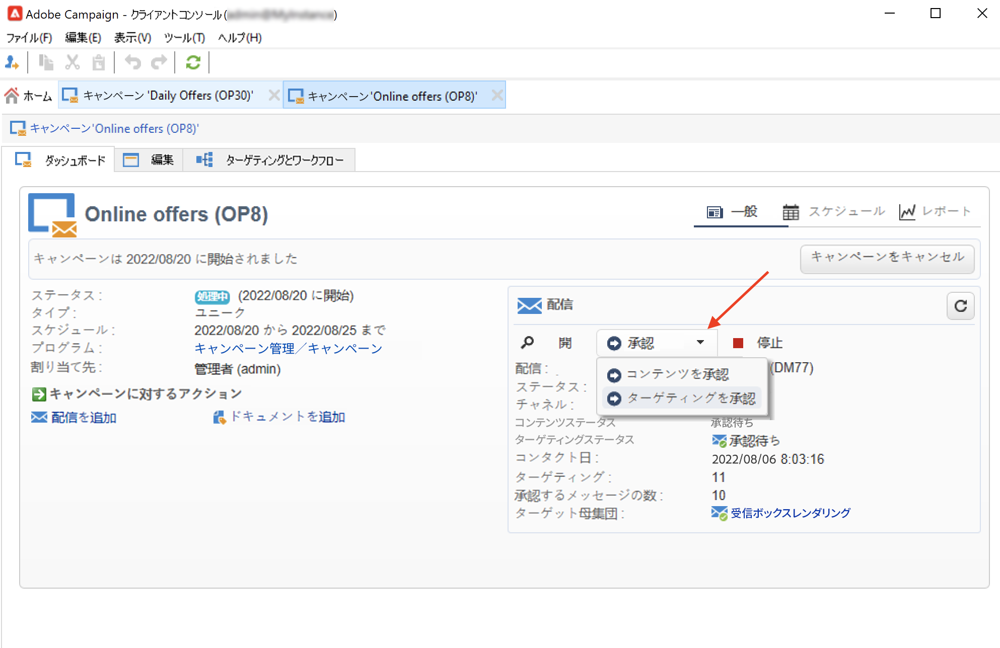

1. ポップアップウィンドウで、承認する情報を確認します。
1. 「**[!UICONTROL 許可]**」または「**[!UICONTROL 却下]**」を選択し、必要に応じてコメントを入力します。このコメントは検証ログに表示されます。
1. 「**[!UICONTROL ターゲットの承認]**」ボタンを使用して承認判断を確定します。

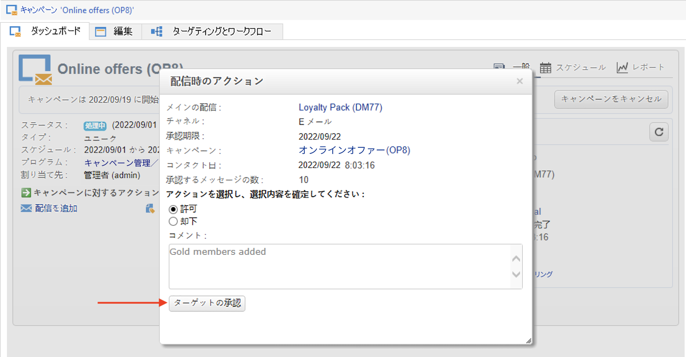

別のオペレーターがプロセスを既に承認している場合、承認リンクは表示されません。

プロセスが却下された場合、その情報が配信ダッシュボードに次のように表示されます。

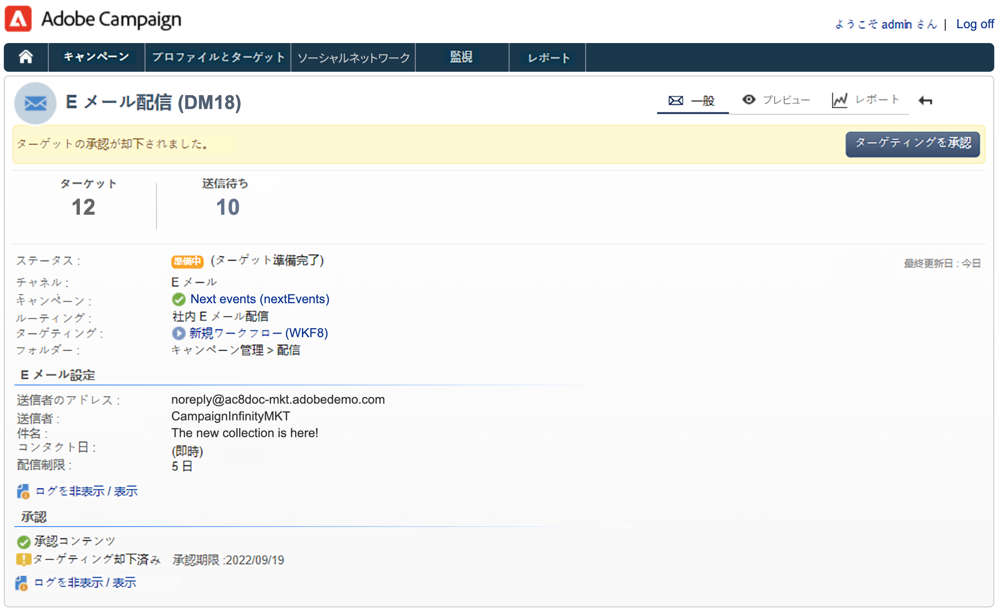

### 通知メッセージから承認 {#approval-via-notification-messages}

[通知メッセージ](#notifications)からジョブを承認するには 、次を実行します。

1. 通知内のリンクをクリックします。
1. Adobe Campaign にログオンします。
1. 承認する情報を確認します。
1. 「**[!UICONTROL 許可]**」または「**[!UICONTROL 却下]**」を選択し、必要に応じてコメントを入力します。
1. 検証。承認判断とコメントが検証ログに表示されます。

>[!NOTE]
>
>処理中に警告が発生した場合は、通知内に警告が表示されます。

### 承認のトラッキング{#approval-tracking}

承認ログは、ユーザーインターフェイスから確認できます。

* キャンペーン承認ログでは、**[!UICONTROL 編集／「監査」]**&#x200B;タブの「**[!UICONTROL 承認]**」サブタブに表示されます。

   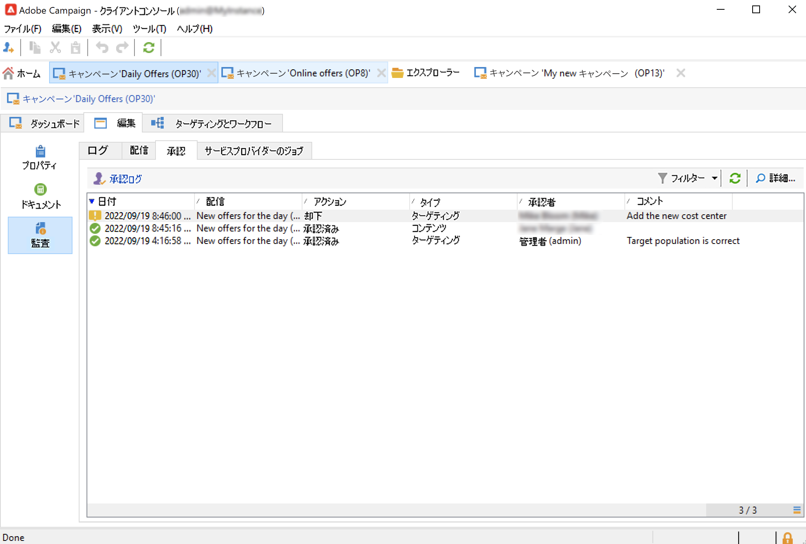

* キャンペーン配信ログでは、**[!UICONTROL 編集／「監査」]**&#x200B;タブの「**[!UICONTROL 配信]**」サブタブに表示されます。

   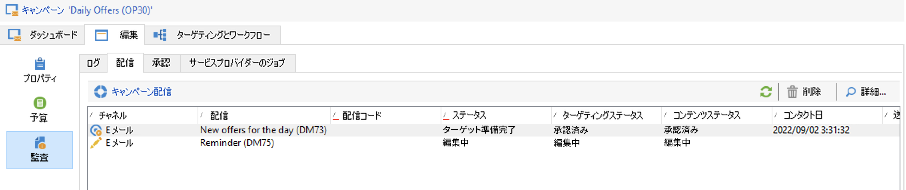

* 各配信の承認ステータスは、「**[!UICONTROL 概要]**」タブの「**[!UICONTROL ログを非表示／表示]**」オプションをクリックすると表示できます。

   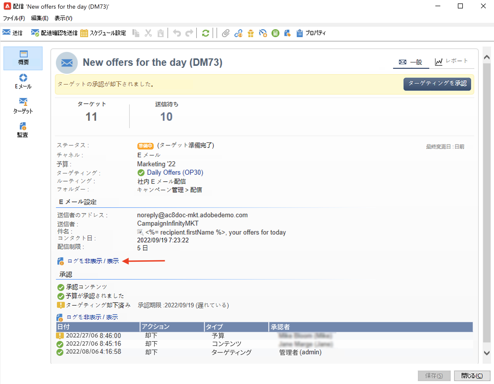

* この情報には、各配信の&#x200B;**[!UICONTROL 監査／「承認」]**&#x200B;タブからもアクセスできます。

   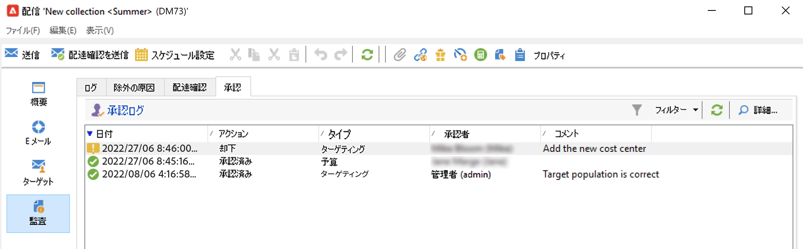

>[!NOTE]
>
>オペレーターがジョブを承認または却下すると、他のレビュー担当者はその選択を変更できなくなります。

### 自動承認と手動承認 {#automatic-and-manual-approval}

ターゲティングワークフローの作成時に承認が自動になっていると（デフォルトモード）、Adobe Campaign は承認リンクを表示するか、承認が必要になるとすぐに通知を送信します。

承認モード（手動または自動）を選択するには、キャンペーンまたはキャンペーンテンプレートの&#x200B;**[!UICONTROL 編集／「プロパティ」]**&#x200B;タブをクリックし、「**[!UICONTROL キャンペーンの詳細パラメーター...]**」をクリックして、「**[!UICONTROL 承認]**」タブをクリックします。

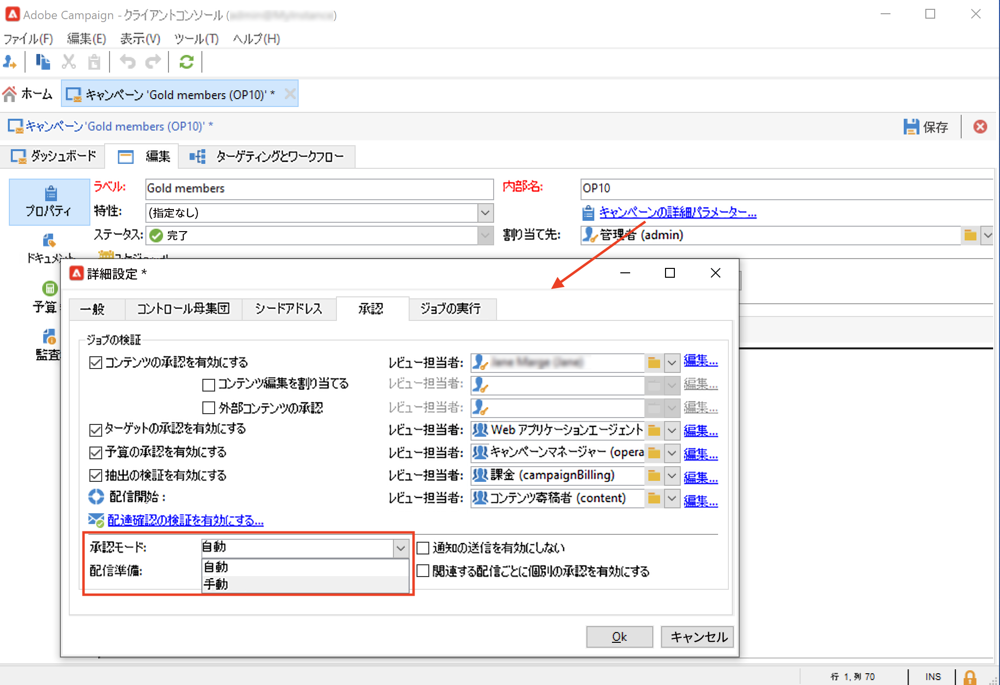

>[!NOTE]
>
>この承認モードは、キャンペーンのすべての配信に適用されます。

ターゲティングワークフローを作成する際に、手動承認を使用して、承認リンクの作成や、通知の自動送信をおこなわないようにすることができます。キャンペーンダッシュボードには、手動で承認プロセスを開始するための「**[!UICONTROL ターゲットを承認用に送信]**」リンクが表示されます。

確認メッセージによって、この配信用に選択されたジョブに対する承認を許可できます。

すると、「承認」ボタンが（この配信の）キャンペーンダッシュボード、配信ダッシュボードおよび配信トラッキングに表示されます。通知が有効な場合、通知も同時に送信されます。

この方法で承認を有効にすれば、レビュー担当者に誤った通知を送信することなく、ターゲティングに取り組むことができます。

## 通知 {#notifications}

通知は、プロセスが承認待ちであることをレビュー担当者に知らせるために送信される、特定の E メールメッセージです。オペレーターがメッセージ内のリンクをクリックすると、認証ページが表示され、ログイン後に情報を確認して、ジョブを承認または却下できます。承認ウィンドウでコメントを入力することもできます。

通知 E メールの内容はパーソナライズできます。[通知コンテンツ](#notification-content)を参照してください。

### 通知の有効化／無効化 {#enabling-disabling-notification}

デフォルトでは、キャンペーンテンプレート、キャンペーンまたは配信で関連ジョブの承認が有効になっている場合に通知メッセージが送信されます。ただし、コンソールからのみ承認を許可するように、通知を無効にすることができます。

そのためには、キャンペーンまたはキャンペーンテンプレートの承認ウィンドウを編集し（**[!UICONTROL 編集／プロパティ]**／**[!UICONTROL キャンペーンの詳細パラメーター...]**／「**[!UICONTROL 承認]**」タブ）、「**[!UICONTROL 通知の送信を有効にしない]**」を選択します。

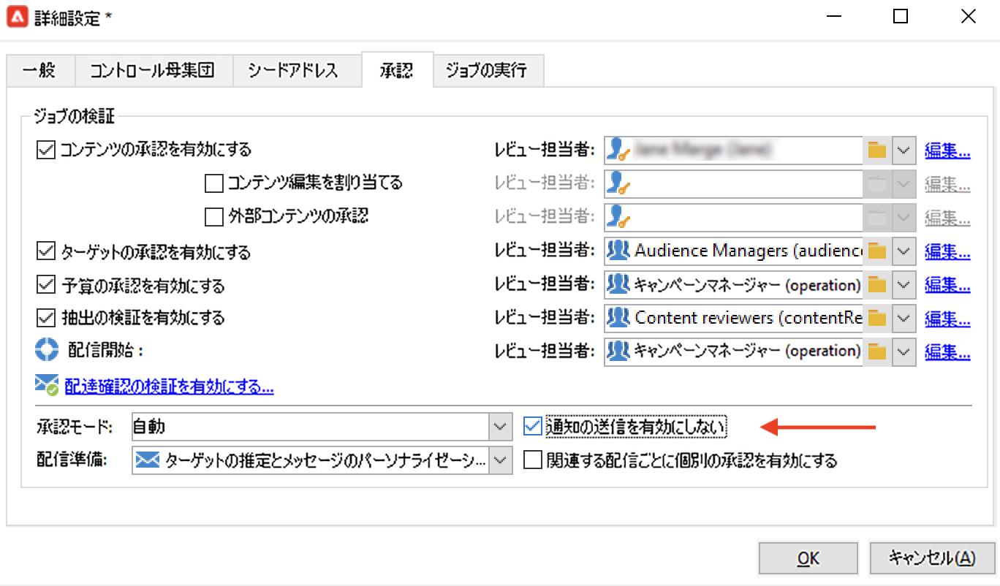

### 通知コンテンツ {#notification-content}

通知コンテンツは、特定のテンプレート「**[!UICONTROL マーケティングキャンペーンの検証の通知]**」で定義されます。このテンプレートは、Adobe Campaign ツリーの&#x200B;**[!UICONTROL 管理／キャンペーン管理／テクニカル配信テンプレート]**&#x200B;フォルダーに保存されています。
