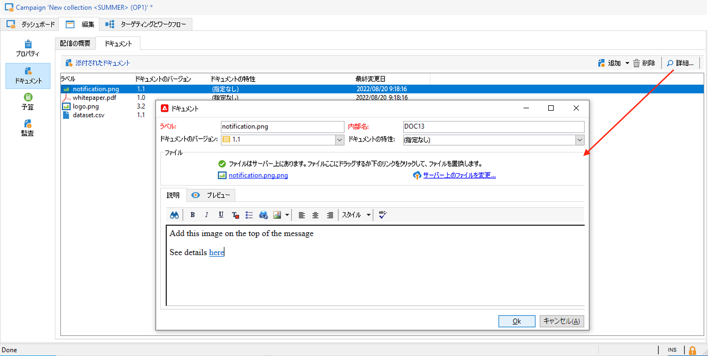

# アセットとドキュメントの管理 {#manage-assets-documents}

レポート、写真、Web ページ、図などの様々なドキュメントをキャンペーンに関連付けることができます。 これらのドキュメントは、どの形式でも指定できます。

キャンペーンでは、プロモーションクーポン、特定のブランドや店舗に関連する特別オファーなど、他のアイテムを参照することもできます。 これらの要素をアウトラインに含める場合は、ダイレクトメール配信に関連付けることができます。 [詳細情報](#associating-and-structuring-resources-linked-via-a-delivery-outline)。

>[!CAUTION]
>
>この機能は、小規模なアセットやドキュメント向けに設計されています。

<!--
>[!NOTE]
>
>If you are using Campaign Marketing Resource Management module, you can also manage a library of marketing resources that are available for several users for collaborative work. [Learn more](../../mrm/using/managing-marketing-resources.md).
-->

## ドキュメントの追加 {#add-documents}

ドキュメントは、キャンペーンレベル（コンテキストドキュメント）でもプログラムレベル（一般ドキュメント）でも関連付けることができます。

キャンペーンの場合、 **[!UICONTROL ドキュメント]** タブには次が含まれます。

* 適切な権限を持つ Adobe Campaign オペレーターがローカルにダウンロードできる、コンテンツに必要なすべてのドキュメント（テンプレート、画像など）のリスト。
* 発送担当向けの情報を含むドキュメント（該当する場合）。

ドキュメントは、**[!UICONTROL 編集／「ドキュメント」]**&#x200B;タブからプログラムまたはキャンペーンにリンクされます。

ダッシュボードの専用リンクから、キャンペーンにドキュメントを追加することもできます。

次をクリック： **[!UICONTROL 詳細…]** アイコン：ファイルの内容を表示し、情報を追加します。

次の例に示すように、キャンペーンに関連付けられたドキュメントは、ダッシュボードの「**[!UICONTROL ドキュメント]**」セクションにまとめられます。

このビューからドキュメントを編集および変更することもできます。

## 配信の概要の使用 {#delivery-outlines}

配信の概要は、 これらは、会社が特定のキャンペーン用に作成したものです。これは、ダイレクトメール配信のコンテキストで使用されます。

これらの要素は配信の概要にグループ化され、各配信概要は配信に関連付けられます。配信に添付するために、**サービスプロバイダー**&#x200B;に送信する抽出ファイルで参照されます。 例えば、ある単位と、その単位が使用するマーケティングカタログを参照する配信の概要を作成できます。

キャンペーンの場合、配信の概要を使用すると、次のような条件に従って、配信に関連付ける外部要素を構造化できます。関連する単位、提供されるプロモーションのオファー、ローカルイベントへの招待など

>[!CAUTION]
>
>配信の概要は、ダイレクトメールキャンペーンに制限されます。

### 配信の概要の作成 {#create-an-outline}

配信の概要を作成するには、 **[!UICONTROL 配信の概要]** サブタブ **[!UICONTROL 編集/ドキュメント]** 」タブに表示されます。

>[!NOTE]
>
>このタブが表示されない場合は、このキャンペーンでこの機能を使用できないか、インスタンスでダイレクトメール配信が有効になっていません。 詳しくは、 [キャンペーンテンプレート設定](marketing-campaign-templates.md#campaign-templates) またはを使用許諾契約に追加する必要があります。

次に、「**[!UICONTROL 配信の概要を追加]**」をクリックし、次の手順でキャンペーンの概要の階層を作成します。

1. ツリーのルートを右クリックし、**[!UICONTROL 新規／配信の概要]**&#x200B;を選択します。
1. 作成した概要を右クリックし、**[!UICONTROL 新規／項目]**&#x200B;または&#x200B;**[!UICONTROL 新規／パーソナライゼーションフィールド]**&#x200B;を選択します。

概要には、項目、パーソナライゼーションフィールドおよびオファーを含めることができます。

* 項目には、ここで参照および記述し、配信に添付する物理的なドキュメントなどを指定できます。
* パーソナライゼーションフィールドを使用して、受信者ではなく配信に関連したパーソナライゼーション要素を作成できます。これにより、特定のターゲット向けの配信（ウェルカムオファーやディスカウントなど）で使用する値を作成できます。こうした値は Adobe Campaign で作成し、「**[!UICONTROL パーソナライゼーションフィールドをインポート...]**」リンクから概要にインポートします。

   

   パーソナライゼーション要素は、リスト領域の右側の&#x200B;**[!UICONTROL 追加]**&#x200B;アイコンをクリックして、概要内で直接作成することもできます。

   

### アウトラインの選択 {#select-an-outline}

次の例に示すように、配信ごとに、抽出の概要専用のセクションから関連付ける概要を選択できます。

選択された概要が、ウィンドウの下部セクションに表示されます。この概要は、フィールドの右側のアイコンを使用して編集したり、ドロップダウンリストを使用して変更したりできます。

配信の「**[!UICONTROL 概要]**」タブにもこの情報が表示されます。

### 抽出結果 {#extraction-result}

抽出され、サービスプロバイダーに送信されたファイル内では、サービスプロバイダーに関連付けられたエクスポートテンプレートの情報に従って、概要名および必要に応じてその特性（コスト、説明など）がコンテンツに追加されます。

次の例では、配信に関連付けられた概要のラベル、推定コスト、説明が抽出ファイルに追加されます。

エクスポートモデルは、該当する配信用に選択されたサービスプロバイダーに関連付ける必要があります。[この節](providers--stocks-and-budgets.md#creating-service-providers-and-their-cost-structures)を参照してください。
