# プログラムとキャンペーンを作成{#create-programs-and-campaigns}

キャンペーンオーケストレーションのコンポーネントは、「**[!UICONTROL キャンペーン]**」タブにあります。ここでは、マーケティングプログラムとキャンペーン、およびそれらに関連する要素の概要を確認できます。

マーケティングプログラムは、複数のキャンペーンで構成され、キャンペーンは複数の配信やリソースなどで構成されます。配信、予算、レビュー担当者、リンクされたドキュメントに関する情報は、すべてキャンペーンにまとめられます。

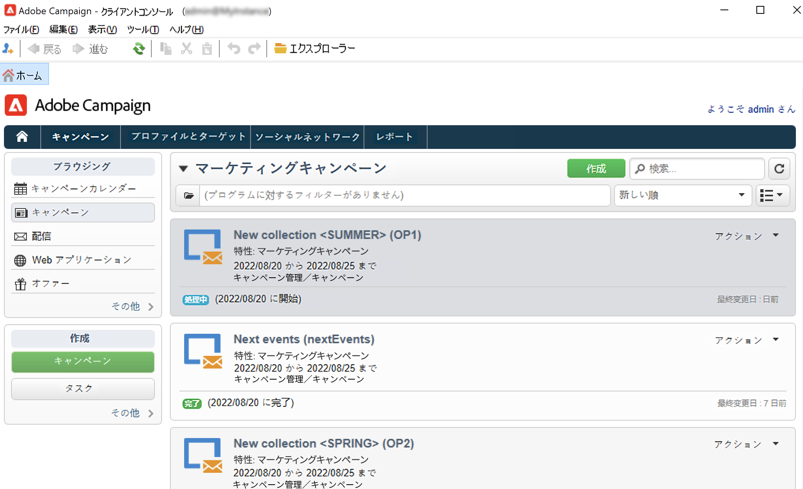

 [ビデオでプログラムとキャンペーンを確認する](#video)

## プログラムとプランの操作{#work-with-plan-and-program}

### プランとプログラムの階層の作成 {#create-plan-and-program}

各キャンペーンは 1 つのプログラムに属し、プログラムはプランに属します。すべてのプラン、プログラム、キャンペーンには、「**キャンペーン**」タブの&#x200B;**[!UICONTROL キャンペーンカレンダー]**&#x200B;メニューからアクセスできます。

キャンペーンと配信の作成を開始する前に、マーケティングプランとプログラムのフォルダー階層を設定します。

1. ホームページ上の「**エクスプローラー**」アイコンをクリックします。
1. プランの作成場所とするフォルダーを右クリックします。
1. **新規フォルダーを追加／キャンペーン管理／プラン**&#x200B;を選択します。

   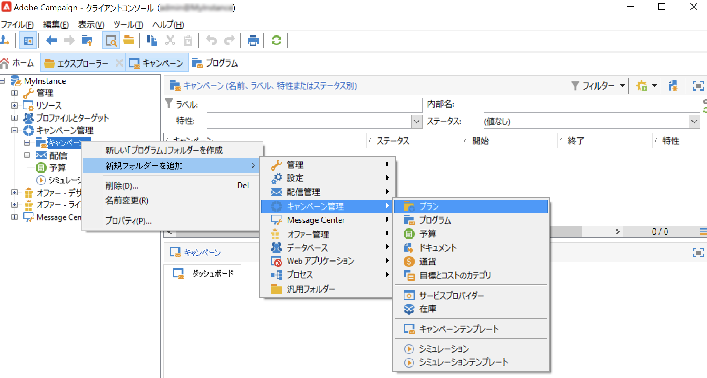

1. プランの名前を変更します。
1. 作成したプランを右クリックし、「**プロパティ**」を選択します。
1. 「**一般**」タブで、パッケージエクスポート時の重複を避けるために「**内部名**」を変更します。

   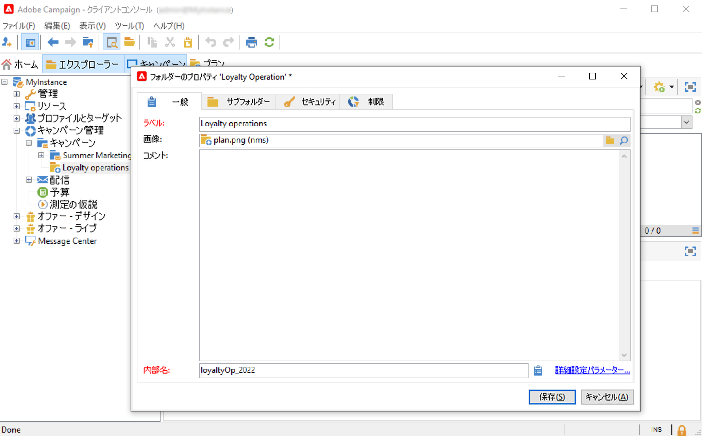

1. 「**保存**」をクリックします。
1. 作成したプランを右クリックし、「**新しい「プログラム」フォルダーを作成**」を選択します。

   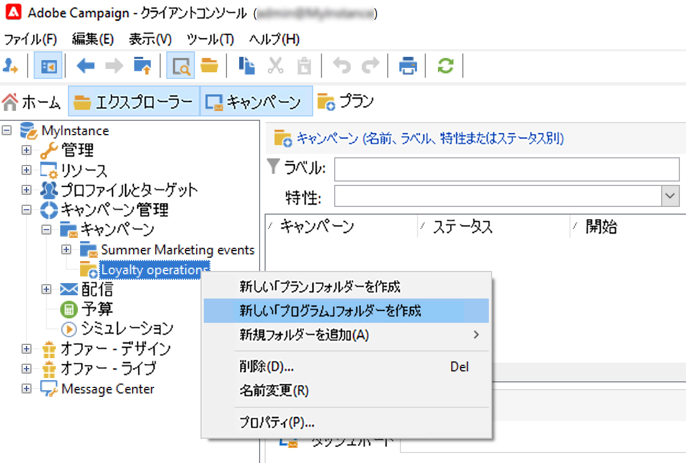

1. 以上の手順を繰り返して、新しいプログラムフォルダーの名前および内部名を変更します。

### プログラムの設定 {#edit-a-program}

プログラムを編集する際は、後述のタブを使用して、プログラムを参照および設定します。

* 「**スケジュール**」タブには、カレンダーのヘッダーでクリックしたタブに応じて、1 か月、1 週間または 1 日のプログラムのカレンダーが表示されます。このページからキャンペーン、プログラムまたはタスクを作成できます。[詳細情報](#campaign-calendar)

* 「**編集**」タブを使用して、名前、開始日と終了日、予算、リンクされたドキュメントなど、プログラムをパーソナライズできます。

   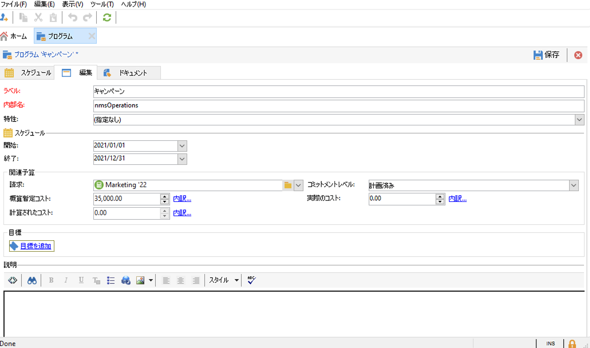

## キャンペーンの操作{#work-with-campaigns}

### キャンペーンの作成 {#create-a-campaign}

キャンペーンのリストからキャンペーンを作成できます。このビューを表示するには、**[!UICONTROL キャンペーン]**&#x200B;ダッシュボードで&#x200B;**[!UICONTROL キャンペーン]**&#x200B;メニューを選択し、**[!UICONTROL 作成]**&#x200B;をクリックします。

「**[!UICONTROL プログラム]**」フィールドを使用して、キャンペーンを関連付けるプログラムを選択できます。この情報は必須です。

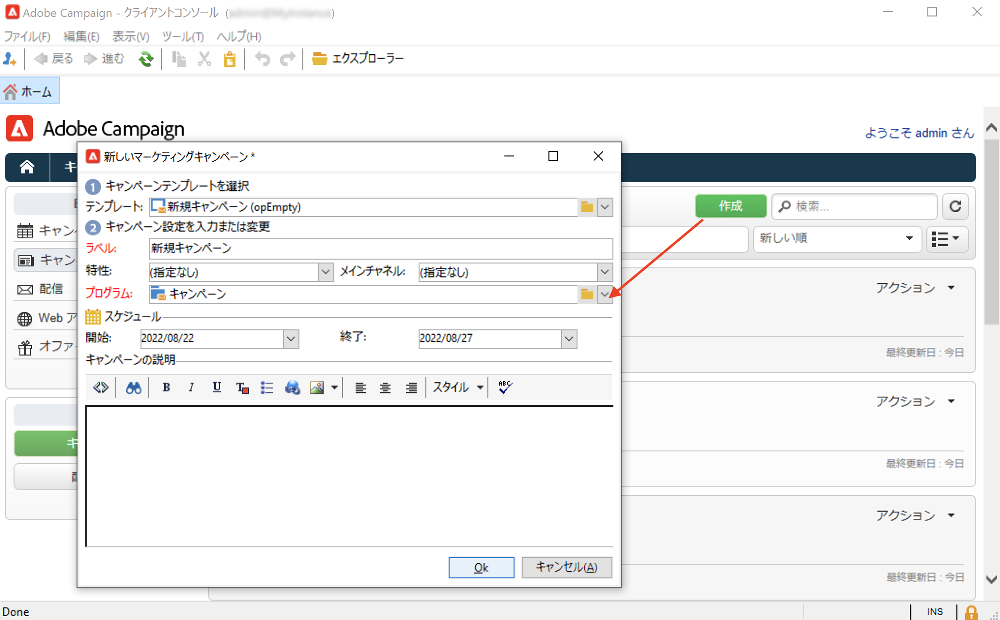

キャンペーンは、キャンペーンカレンダーまたはプログラムカレンダーから作成することもできます。[詳細情報](#campaign-calendar)

キャンペーン作成ウィンドウで、キャンペーンテンプレートを選択し、キャンペーンの名前と説明を追加します。キャンペーンの開始日と終了日も指定できます。

「**[!UICONTROL OK]**」をクリックして、キャンペーンを作成します。プログラムスケジュールとキャンペーンのリストに追加されます。

作成したキャンペーンを編集し、パラメーターを定義できます。このキャンペーンを開いて設定するには、次の操作を行います。

1. キャンペーンカレンダーを開いて表示したいキャンペーンを選択し、「**[!UICONTROL 開く]**」リンクをクリックします。
1. プログラムの「**[!UICONTROL スケジュール]**」タブを開き、キャンペーンを選択して開きます。
1. キャンペーンのリストを参照し、編集するキャンペーンの名前をクリックします。

これらの操作を実行すると、キャンペーンダッシュボードに移動します。

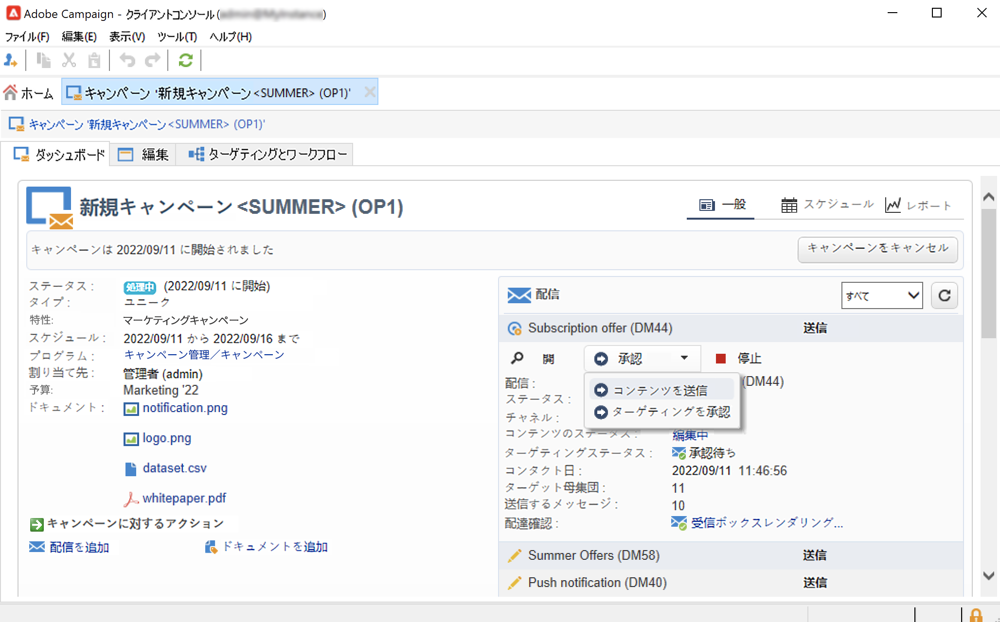

キャンペーンの設定方法については、次の節を参照してください。

* [配信の追加](marketing-campaign-deliveries.md)
* [アセットとドキュメントの管理](marketing-campaign-assets.md)
* [ターゲットオーディエンスの構築](marketing-campaign-target.md)
* [承認プロセスの設定](marketing-campaign-approval.md)
* [在庫と予算の管理](providers--stocks-and-budgets.md)

### キャンペーン設定の編集 {#campaign-settings}

キャンペーンは、キャンペーンテンプレートから作成します。一部のオプションが選択され、その他の設定が既に保存されている、再利用可能なテンプレートを設定できます。

キャンペーンごとに、次の機能を使用できます。

* ドキュメントとリソースの参照：ドキュメント（概要、レポート、画像など）とキャンペーンを関連付けることができます。あらゆるドキュメントフォーマットをサポートしています。[詳細情報](marketing-campaign-deliveries.md#manage-associated-documents)。
* コストの定義：Adobe Campaign では、キャンペーンごとに、コストエントリと、マーケティングキャンペーン作成時に使用できるコスト計算構造を定義できます。例えば、印刷コスト、外部エージェンシーの利用、部屋の賃借などがあります。[詳細情報](providers--stocks-and-budgets.md#defining-cost-categories)。
* 目標の定義：購読者数や取引高など、キャンペーンの定量化可能な目標を定義できます。この情報は、後でキャンペーンレポートで使用します。
* シードアドレスとコントロール母集団を管理します。[詳細情報](marketing-campaign-deliveries.md#defining-a-control-group)。
* 承認の管理：承認を得る処理や、必要に応じてレビュー担当のオペレーターまたはオペレーターのグループを選択できます。[詳細情報](marketing-campaign-approval.md#checking-and-approving-deliveries)。

>[!NOTE]
>
>キャンペーンの設定にアクセスして更新するには、「**[!UICONTROL 編集]**」タブの「**[!UICONTROL キャンペーンの詳細パラメーター…]**」リンク を開きます。

### キャンペーンの監視 {#monitor-a-campaign}

キャンペーンごとに、ジョブ、リソースおよび配信をダッシュボードで一元管理します。このインターフェイスでは、マーケティングアクションを管理および調整できます。

Adobe Campaign では、予算、ターゲット、コンテンツの承認など、キャンペーンの様々なステップを作成して承認する協調プロセスを設定できます。このオーケストレーションについて詳しくは、[この節](marketing-campaign-approval.md)を参照してください。

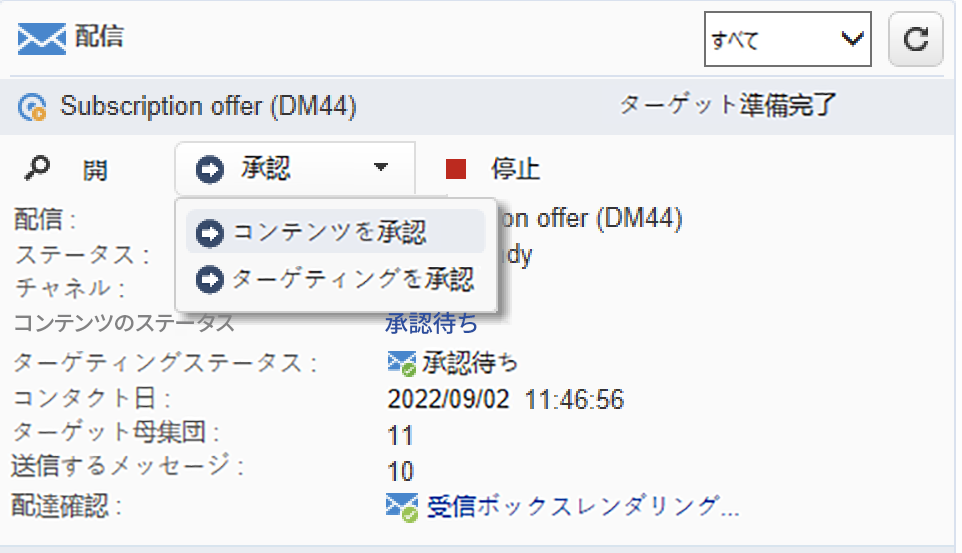

>[!NOTE]
>
>キャンペーンで使用できるコンポーネントは、そのテンプレートに応じて異なります。キャンペーンテンプレートの設定については、[この節](marketing-campaign-templates.md#campaign-templates)を参照してください。

キャンペーンを実施した後は、「**[!UICONTROL レポート]**」リンクをクリックすると、キャンペーンレポートにアクセスできます。

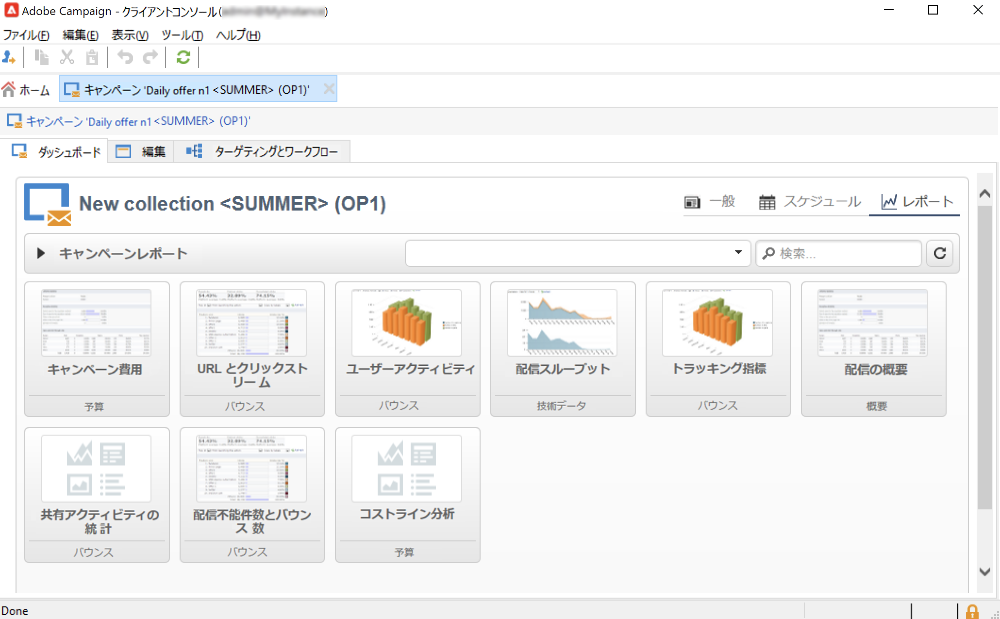

## Campaign カレンダー {#campaign-calendar}

キャンペーンカレンダーには、すべてのプログラム、プラン、キャンペーンおよび配信が表示されます。

プラン、プログラム、キャンペーンまたは配信を編集するには、カレンダー内でその名前をクリックして「**[!UICONTROL 開く]**」をクリックします。すると、次のように新しいタブに表示されます。

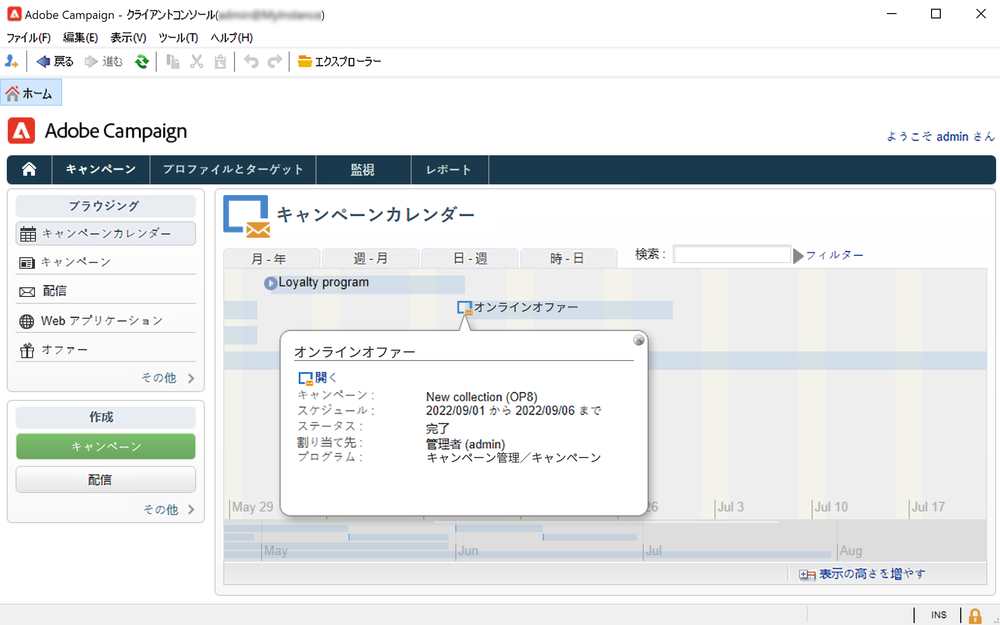

キャンペーンカレンダーに表示する情報をフィルタリングできます。フィルタリングするには、「**[!UICONTROL フィルター]**」リンクをクリックして、フィルタリング条件を選択します。

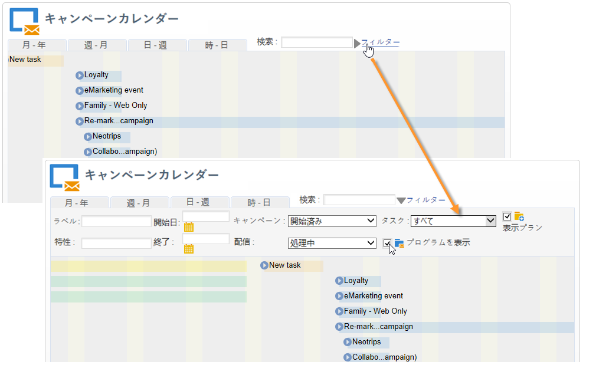

>[!NOTE]
>
>日付に対してフィルターを設定すると、開始日が指定された日付以降または終了日が指定された日付以前のキャンペーンがすべて表示されます。日付は、各フィールドの右側のカレンダーを使用して選択します。

「**[!UICONTROL 検索]**」フィールドを使用して、表示する項目をフィルタリングすることもできます。

各項目にリンクされたアイコンを使用して、「完了」、「処理中」、「編集中」などのステータスを表示できます。

表示するキャンペーンをフィルタリングするには、「**[!UICONTROL フィルター]**」リンクをクリックして、表示するキャンペーンのステータスを選択します。

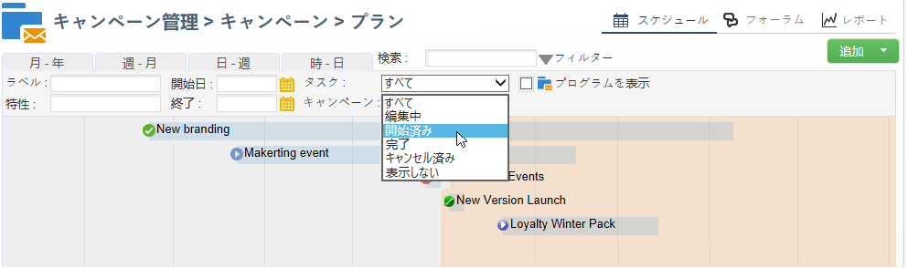

カレンダーを参照する際に、プログラムやキャンペーンを作成することもできます。

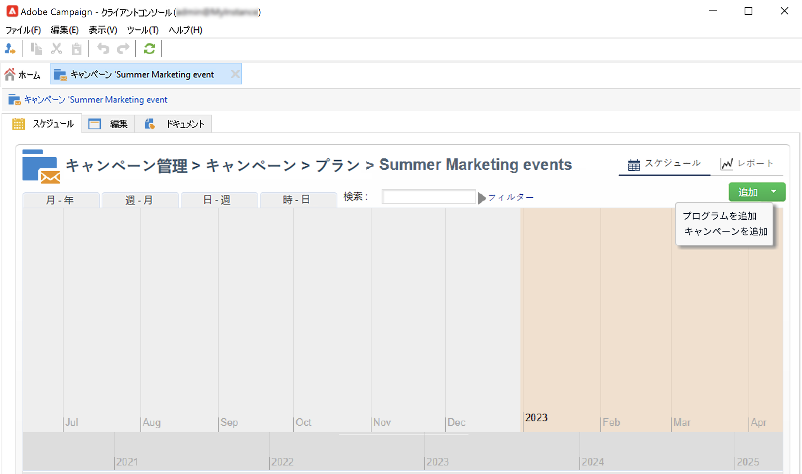

プログラムの「**[!UICONTROL スケジュール]**」タブからキャンペーンを作成すると、関連するプログラムに自動的にリンクされます。この場合、「**[!UICONTROL プログラム]**」フィールドは非表示になります。

## Web インターフェイスの使用 {#use-the-web-interface-}

インターネットブラウザーから Adobe Campaign のコンソール画面にアクセスして、キャンペーンと配信だけでなく、レポートやデータベース内のプロファイルに関する情報も確認できます。このアクセスでは、レコードは作成できません。オペレーターの権限に応じて、データベース内のデータを確認したり、データに基づいて行動したりできます。例えば、キャンペーンのコンテンツとターゲティングを承認したり、配信を再開または停止することが可能です。

1. https://`<your instance>:<port>/view/home` から通常どおりにログオンします。
1. メニューを使用して概要にアクセスします。

   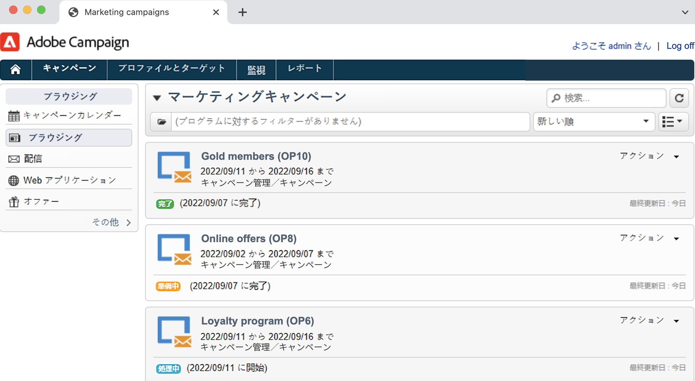

キャンペーン全体を移動して表示する以外に、次のタイプのタスクを実行できます。

* インスタンスのアクティビティの監視
* 検証プロセスへの参加（例：配信コンテンツの承認または却下）
* その他のクイックアクションの実行（例：ワークフローの一時停止）
* すべてのレポート機能にアクセス
* フォーラムのディスカッションに参加

次の表に、ブラウザーからキャンペーンに対して実行できるアクションを示します。

| ページ  | アクション |
| --- | --- |
| キャンペーン、配信、オファーなどのリスト | リスト項目の削除 |
| キャンペーン | キャンペーンのキャンセル |
| 配信 | 配信コンテンツとターゲットの承認 配信コンテンツの送信 配信の確認 配信の一時停止と停止 |
| Web アプリケーション | Web アプリケーションの作成 アプリケーションのコンテンツとプロパティの編集 アプリケーションコンテンツをテンプレートとして保存 アプリケーションを公開 |
| オファー | オファーのコンテンツと実施要件を承認 オンラインオファーを無効化 |
| タスク | タスクの終了 タスクのキャンセル |
| マーケティングリソース | リソースの承認 リソースのロックとロック解除 |
| Campaign パッケージ | 承認用にパッケージを送信 パッケージを承認または却下 パッケージのキャンセル |
| Campaign オーダー | オーダーの作成 オーダーを許可または却下 |
| 在庫 | 在庫品目を削除 |
| オファーのシミュレーション | シミュレーションの開始と停止 |
| ターゲティングワークフロー | ワークフローの開始、一時停止、停止 |
| レポート | 現在のデータをレポート履歴に保存 |
| フォーラム | ディスカッションを追加 ディスカッション内のメッセージに返信 ディスカッションをフォローし、購読を解除 |

### 承認の管理

ターゲットや配信コンテンツの承認は、web アクセスで実行できます。

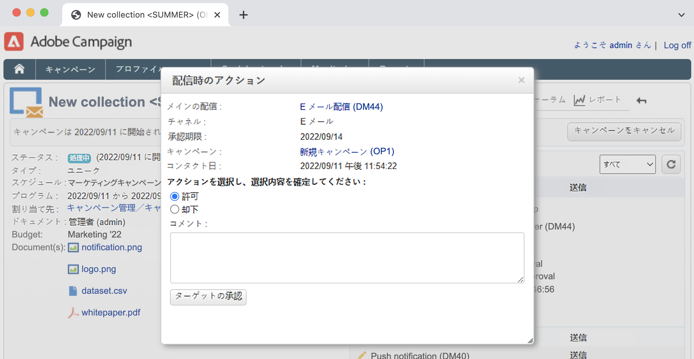

通知メッセージに含まれるリンクを使用することもできます。詳しくは、[この節](marketing-campaign-approval.md#checking-and-approving-deliveries)を参照してください。

## チュートリアルビデオ {#video}

このビデオでは、マーケティングプラン、プログラム、キャンペーンなどの作成方法を紹介します。

>[!VIDEO](https://video.tv.adobe.com/v/333810?quality=12)
