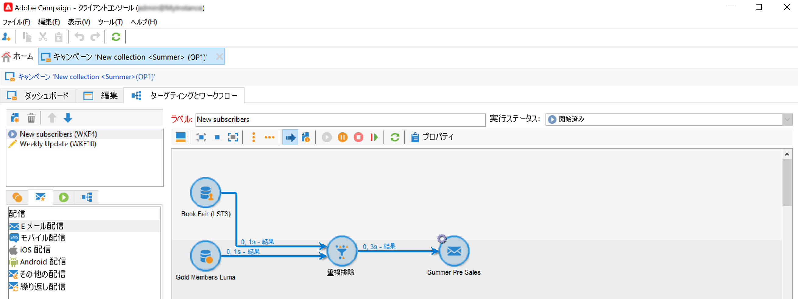
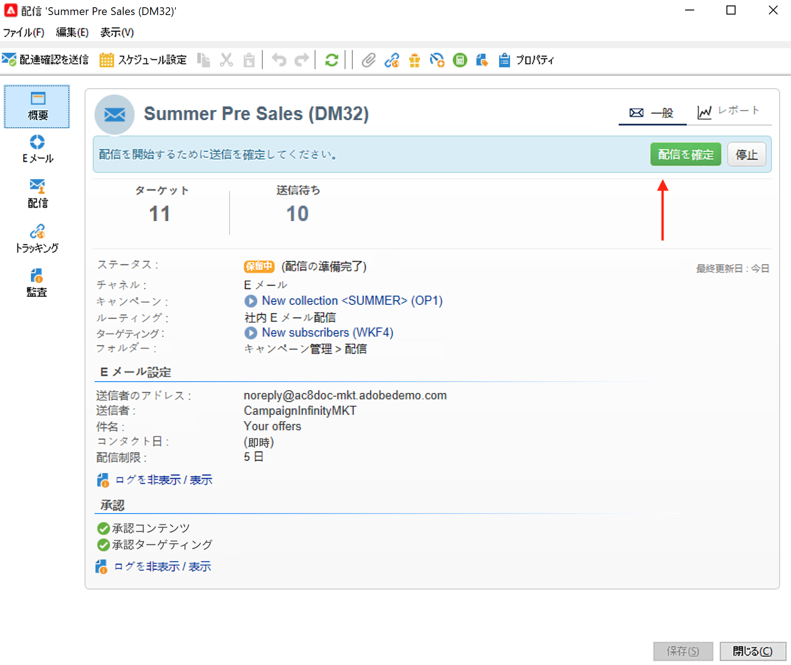
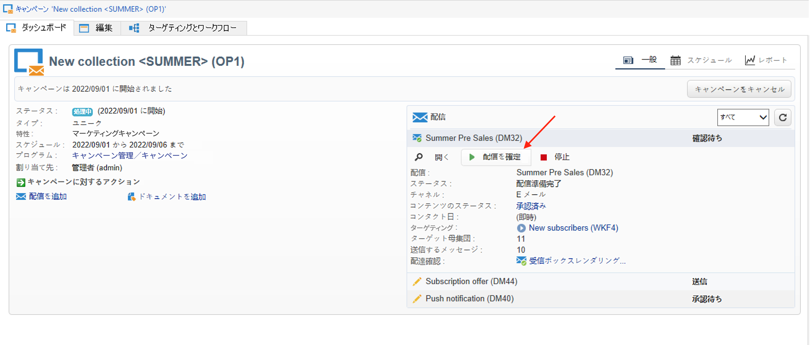
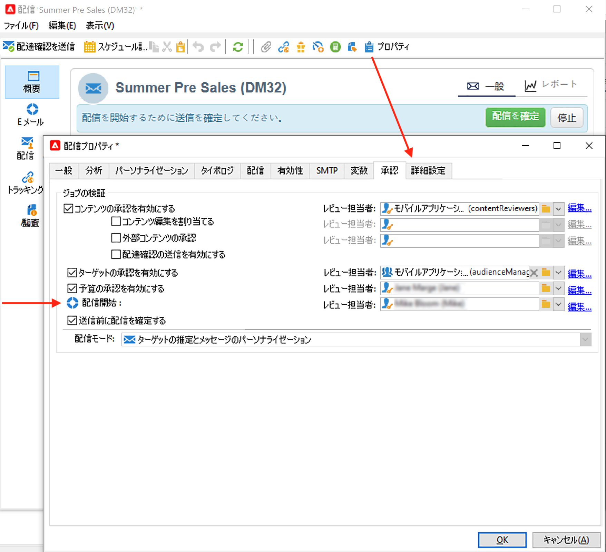
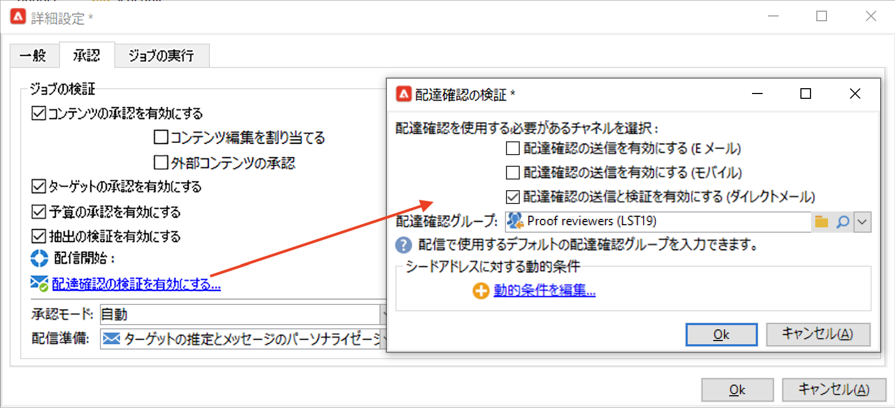
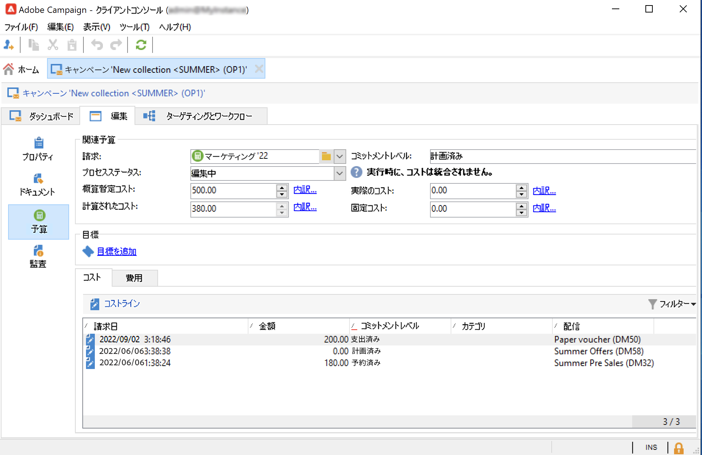
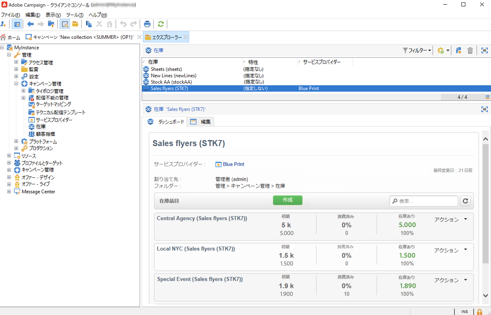
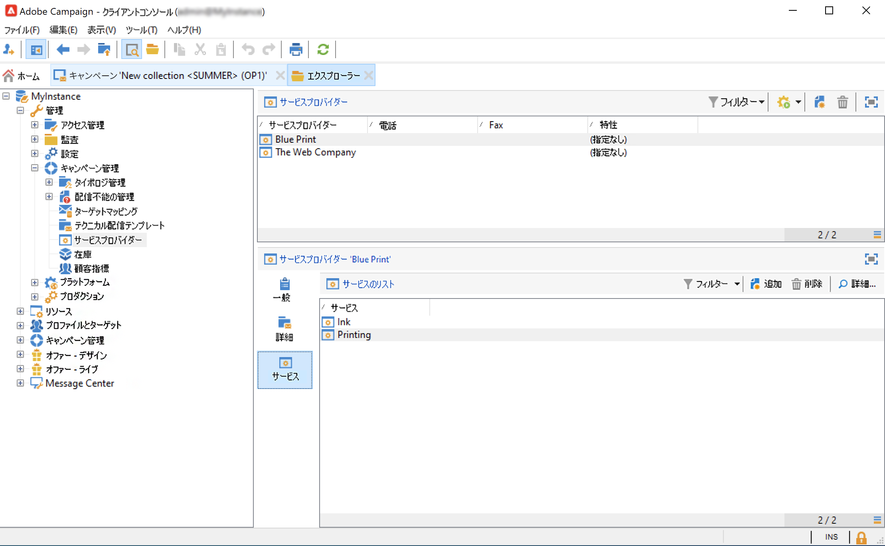

# マーケティングキャンペーン配信 {#marketing-campaign-deliveries}

キャンペーンでクロスチャネル配信のオーケストレーションを行います。パーソナライズされたメール、SMS、プッシュ通知およびアプリ内メッセージを通じて、Adobe Campaign とのコミュニケーションを効率化します。ビデオ、絵文字、GIF などのリッチメディアを使用して、直接統合できます。

配信は、キャンペーンダッシュボードやキャンペーンワークフローから作成できますし、配信の概要から直接作成することもできます。キャンペーンから作成した配信は、このキャンペーンにリンクされ、キャンペーンレベルで統合されます。

## 配信の作成 {#create-deliveries}

マーケティングキャンペーンに配信を追加する方法は次の 2 とおりあります。

* キャンペーンダッシュボードの「**[!UICONTROL 配信を追加]**」リンクから。

保存すると、配信がキャンペーンダッシュボードに追加されます。

* キャンペーンワークフローから。「**[!UICONTROL ターゲティングとワークフロー]**」タブで、配信を追加します。

   

   ワークフローが開始されると、配信がキャンペーンダッシュボードに追加されます。

配信の承認フローの設定および実行方法については、[このページ](marketing-campaign-approval.md)を参照してください。

## 配信の開始 {#start-a-delivery}

すべての承認が得られたら、配信を送信できます。配信の実行プロセスは、チャネルによって異なります。

* メールまたはモバイルチャネル配信については、[この節](#start-an-online-delivery)を参照してください。

* ダイレクトメール配信については、[この節](#start-an-offline-delivery)を参照してください。

### メールまたはモバイル配信の開始 {#start-an-online-delivery}

すべての承認リクエストが許可されたら、配信ステータスが&#x200B;**[!UICONTROL 確認待ち]**&#x200B;に変わり、配信を開始できるようになります。配信を開始できるレビュー担当者には、配信を開始する準備が整ったことが通知されます。

情報はキャンペーンダッシュボードにも表示されます。「**[!UICONTROL 配信を確定]**」リンクを使用して、配信を開始できます。

配信の確認は、管理者と、配信プロパティまたはキャンペーンプロパティで明示的に言及されているオペレーターまたはオペレーターのグループだけが行えます。オペレーターが指定されていない場合は、管理者とキャンペーン所有者が承認できます。

ただし、配信プロパティまたはキャンペーンプロパティで特定のレビュー担当者が定義されている場合でも、キャンペーン所有者に送信の確認を任せることもできます。それには、管理者として「**NmsCampaign_Activate_OwnerConfirmation**」オプションを作成して「**1**」に設定します。これらのオプションは、Campaign エクスプローラーの&#x200B;**[!UICONTROL 管理]**／**[!UICONTROL プラットフォーム]**／**[!UICONTROL オプション]**&#x200B;フォルダーから管理します。

### ダイレクトメール配信の開始 {#start-an-offline-delivery}

すべての承認が許可されたら、配信ステータスが&#x200B;**[!UICONTROL 抽出待ち]**&#x200B;に変わります。抽出ファイルは専用の[テクニカルワークフロー](../workflow/technical-workflows.md)で作成されます。このワークフローは、デフォルト設定では、ダイレクトメール配信が抽出待ちの場合に自動的に開始されます。プロセスが進行中の場合、ダッシュボードに表示され、リンクから編集できます。

抽出ワークフローが正常に実行されたら、抽出ファイルを承認する必要があります（配信設定で抽出ファイルの承認が選択されている場合）。[詳細情報](marketing-campaign-approval.md#approving-an-extraction-file)。

コンテンツを検証しファイルをプロバイダーに送信するには、次の手順に従います。

1. 抽出ファイルが承認されたら、ルーターへの通知メールの配達確認を生成できます。この電子メールメッセージは、配信テンプレートに基づいて作成されます。このメッセージは承認が必要です。

   この手順は、キャンペーンの詳細パラメーターの「**[!UICONTROL 承認]** 」タブで「**[!UICONTROL 配達確認の送信と検証を有効にする (ダイレクトメール)]**」オプションが有効になっている場合にのみ使用できます。

   

1. 「**[!UICONTROL 配達確認を送信]**」ボタンをクリックして、配達確認を作成します。

   事前に配達確認のターゲットを定義しておく必要があります。

   配達確認を必要な数だけ作成できます。この配達確認には、配信の詳細の「**[!UICONTROL ダイレクトメール...]**」リンクからアクセスします。

1. 配信ステータスが「**[!UICONTROL 送信する]**」に変わります。「**[!UICONTROL 配達確認を送信]**」ボタンをクリックして、承認プロセスを開始します。

1. 配信ステータスが「**[!UICONTROL 承認する配達確認]**」に変わります。ボタンを使用して承認を許可または却下できます。

   この承認を許可／却下することも、抽出手順に戻ることもできます。

1. 配達確認が承認されると、抽出ファイルが発送担当者に送信され、配信が完了します。

### 予算とコストの計算 {#compute-costs-and-stocks}

ファイルの抽出で、予算の計算と在庫の計算の 2 つのプロセスが開始されます。予算エントリが更新されます。

* 「**[!UICONTROL 予算]**」タブを使用して、キャンペーンの予算を管理できます。コストエントリの合計が、キャンペーンのメインタブとキャンペーンが属するプログラムの「**[!UICONTROL 計算されたコスト]**」フィールドに表示されます。この金額は、キャンペーン予算にも反映されます。

   

   実際のコストは、発送担当が提供する情報から最終的に計算されます。実際に送信されたメッセージのみが請求対象です。

* 在庫は、ツリーの&#x200B;**[!UICONTROL 管理／キャンペーン管理／在庫]**&#x200B;ノードで設定します。

   

   コスト構造は、**[!UICONTROL 管理／キャンペーン管理／サービスプロバイダー]**&#x200B;ノードで設定します。

   

   在庫品目は「在庫」セクションに表示されます。初期在庫を定義するには、在庫品目を開きます。配信が実行されるたびに在庫は減少します。アラートレベルと通知を定義できます。

   >[!NOTE]
   >
   >予算について詳しくは、[この節](providers--stocks-and-budgets.md)を参照してください。
