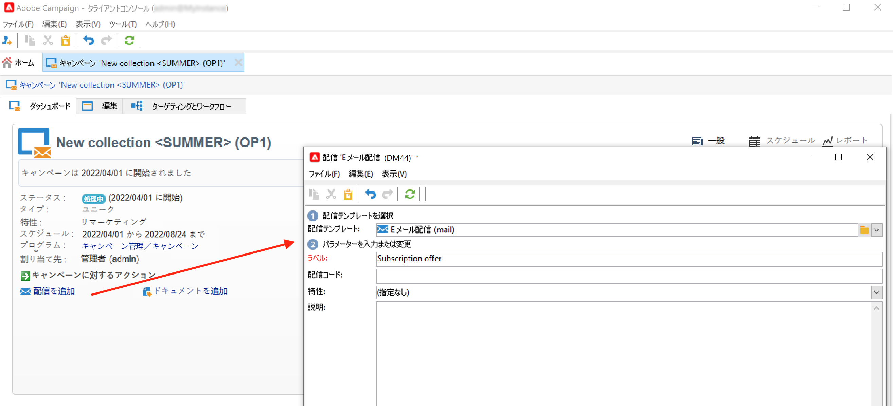

# マーケティングキャンペーン配信 {#marketing-campaign-deliveries}

キャンペーンでクロスチャネル配信を調整します。は、パーソナライズされた E メール、SMS、プッシュ通知、アプリ内メッセージを通じて、Adobe Campaignとの通信を合理化します。 ビデオ、絵文字、GIFなどのリッチメディアを使用して、直接統合できます。

配信は、キャンペーンダッシュボード、キャンペーンワークフローまたは配信の概要から直接作成できます。キャンペーンから作成した配信は、このキャンペーンにリンクされ、キャンペーンレベルで統合されます。

## 配信を作成 {#create-deliveries}

マーケティングキャンペーンに配信を追加する方法は 2 つあります。

* 次の **[!UICONTROL 配信を追加]** リンクをクリックします。

保存すると、配信がキャンペーンダッシュボードに追加されます。

* キャンペーンワークフローから、 **[!UICONTROL ターゲティングとワークフロー]** 」タブで、配信を追加します。

   

   ワークフローが開始されると、配信がキャンペーンダッシュボードに追加されます。

配信承認フローの設定および実行方法について説明します [このページ](marketing-campaign-approval.md).

## 配信を開始 {#start-a-delivery}

すべての承認が許可されたら、配信を送信できます。 配信の実行プロセスは、チャネルによって異なります。

* E メールまたはモバイルチャネルの配信については、 [この節](#start-an-online-delivery)

* ダイレクトメール配信については、 [この節](#start-an-offline-delivery)

### E メールまたはモバイル配信を開始 {#start-an-online-delivery}

すべての承認リクエストが許可されると、配信ステータスは「 **[!UICONTROL 確認待ち]** およびを開始できます。 配信を開始できるレビュー担当者には、配信を開始する準備が整ったことが通知されます。

情報はキャンペーンダッシュボードにも表示されます。「**[!UICONTROL 配信を確定]**」リンクを使用して、配信を開始できます。

配信の確認は、管理者に制限されているほか、配信またはキャンペーンのプロパティで明示的に言及されているオペレーターまたはオペレーターのグループにも制限されています。 オペレーターを設計していない場合は、管理者とキャンペーン所有者が承認できます。

ただし、配信またはキャンペーンのプロパティで特定のレビュー担当者が定義されている場合でも、キャンペーン所有者が送信を確認することを許可することもできます。 これをおこなうには、管理者として、 **NmsCampaign_Activate_OwnerConfirmation** オプションを選択し、 **1**. このオプションは、Adobe Campaign エクスプローラーの&#x200B;**[!UICONTROL 管理]**／**[!UICONTROL プラットフォーム]**／**[!UICONTROL オプション]**&#x200B;ノードから管理します。

### ダイレクトメール配信の開始 {#start-an-offline-delivery}

すべての承認が許可されたら、配信ステータスが「**[!UICONTROL 抽出を保留中]**」に変わります。抽出ファイルは、専用の [テクニカルワークフロー](../workflow/technical-workflows.md) これは、デフォルト設定で、ダイレクトメール配信が抽出保留中の場合に自動的に開始します。 プロセスが進行中の場合、ダッシュボードに表示され、リンクから編集できます。

抽出ワークフローが正常に実行されたら、抽出ファイルを承認する必要があります（配信設定で抽出ファイルの承認が選択されている場合）。[詳細情報](marketing-campaign-approval.md#approving-an-extraction-file)。

次の手順に従って、コンテンツを検証し、ファイルをプロバイダーに送信します。

1. 抽出ファイルが承認されたら、ルーターへの通知メールの配達確認を生成できます。この電子メールメッセージは、配信テンプレートに基づいて作成されます。このメッセージは承認が必要です。

   この手順は、 **[!UICONTROL 配達確認の送信と検証を有効にする（ダイレクトメール）]** オプションが有効になっている場所： **[!UICONTROL 承認]** 」タブに表示されます。

   

1. 「**[!UICONTROL 配達確認を送信]**」ボタンをクリックして、配達確認を作成します。

   事前に配達確認のターゲットを定義しておく必要があります。

   配達確認を必要な数だけ作成できます。この配達確認には、配信の詳細の「**[!UICONTROL ダイレクトメール...]**」リンクからアクセスします。

1. 配信ステータスが「**[!UICONTROL 送信する]**」に変わります。「**[!UICONTROL 配達確認を送信]**」ボタンをクリックして、承認プロセスを開始します。

1. 配信ステータスが「**[!UICONTROL 承認する配達確認]**」に変わります。ボタンを使用して承認を許可または却下できます。

   この承認を許可／却下することも、抽出手順に戻ることもできます。

1. 配達確認が承認されると、抽出ファイルが発送担当に送信され、配信が完了します。

### 予算とコストの計算 {#compute-costs-and-stocks}

ファイルを抽出すると、次の 2 つのプロセスが開始されます。予算の計算と在庫の計算。 予算エントリが更新されます。

* 「**[!UICONTROL 予算]**」タブを使用して、キャンペーンの予算を管理できます。コストエントリの合計が **[!UICONTROL 計算されたコスト]** キャンペーンのメインタブの「 」フィールドと、キャンペーンが属するプログラム。 この金額は、キャンペーン予算にも反映されます。

   

   実際のコストは、発送担当が提供する情報から最終的に計算されます。実際に送信されたメッセージのみが請求対象です。

* 在庫は、 **[!UICONTROL 管理/キャンペーン管理/在庫]** ツリーのノードに設定します。

   

   のコスト構造 **[!UICONTROL 管理/キャンペーン管理/サービスプロバイダー]** ノード。

   

   在庫品目は「在庫」セクションに表示されます。初期在庫を定義するには、在庫品目を開きます。配信が実行されるたびに在庫は減少します。アラートレベルと通知を定義できます。

   >[!NOTE]
   >
   >予算の詳細を表示 [この節](providers--stocks-and-budgets.md).
