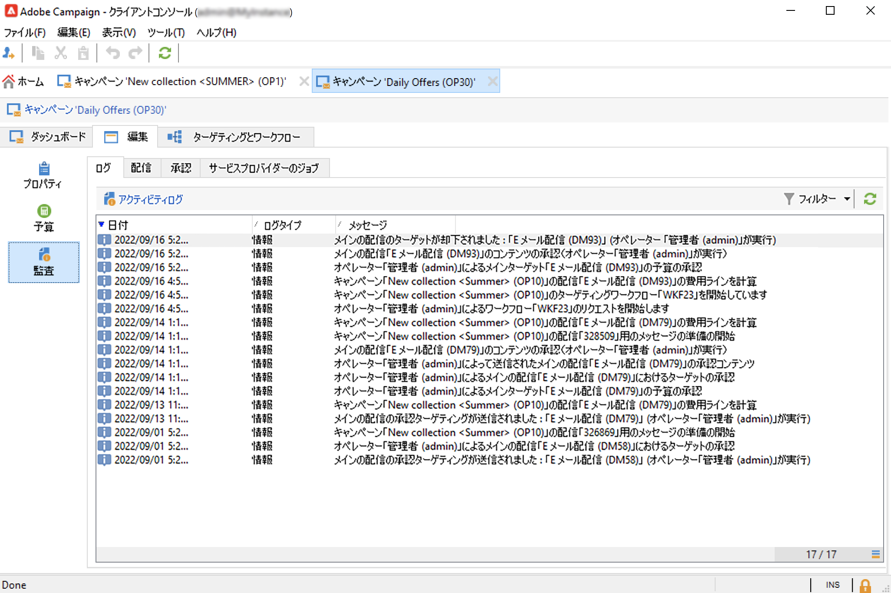
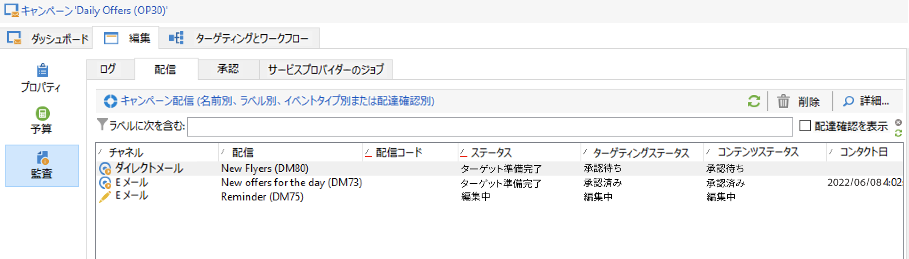
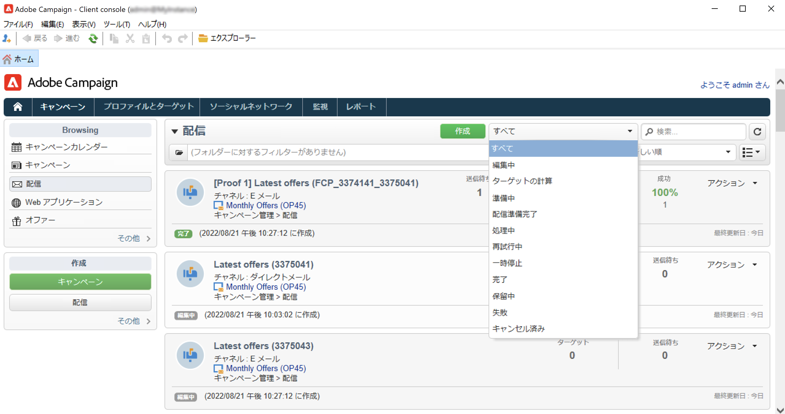

# マーケティングキャンペーンの監視 {#monitor-marketing-campaigns}

## キャンペーンのトラッキング {#tracking-a-campaign}

キャンペーンごとに、「**[!UICONTROL 監査]**」タブを使用して、すべてのジョブとそのステータスを表示できます。

このサブタブから次の情報にアクセスできます。

* 「**[!UICONTROL 監査]**」サブタブには、アクティビティジャーナルが表示されます。ワークフローの作成または開始、承認、抽出、在庫管理など、キャンペーンで実行されるジョブが含まれます。

   

* 「**[!UICONTROL 配信]**」サブタブには、キャンペーンのすべての配信が含まれます。このビューから編集できます。編集するには、配信を選択し、「**[!UICONTROL 詳細]**」アイコンをクリックします。

   

* 「**[!UICONTROL 承認]**」サブタブには、キャンペーンのすべての承認プロセスが含まれます。詳細とコメントを確認できます。

* サービスプロバイダー向けのメッセージを生成するために作成されたワークフローは、「**[!UICONTROL サービスプロバイダーのジョブ]**」サブタブに表示されます。選択したワークフローを表示するには、「**[!UICONTROL 詳細]**」アイコンをクリックします。

## 配信のトラッキング {#delivery-tracking}

配信のリストは、キャンペーンノードの「**[!UICONTROL 配信]**」リンクから表示できます。

配信ごとに、このリストを使用して、ステータス、ターゲットとなる受信者数、リンクされたキャンペーンなどの主要指標にアクセスできます。

配信のステータスを確認するには、配信を編集して、配信ダッシュボードとタブを表示します。

<!--
>[!NOTE]
>
>Information concerning delivery details is available in [this section](../../delivery/using/about-message-tracking.md) section.
-->

## 実行のトラッキング {#execution-tracking}

Adobe Campaign のホームページから「**[!UICONTROL 配信]**」をクリックすると、配信のステータスを確認することができます。

キャンペーンで実行されるプロセスに関連する情報は、キャンペーンの&#x200B;**[!UICONTROL 編集／「監査」]**&#x200B;タブに収集されます。キャンペーンの配信のリストを表示できます。[詳細情報](#tracking-a-campaign)。
