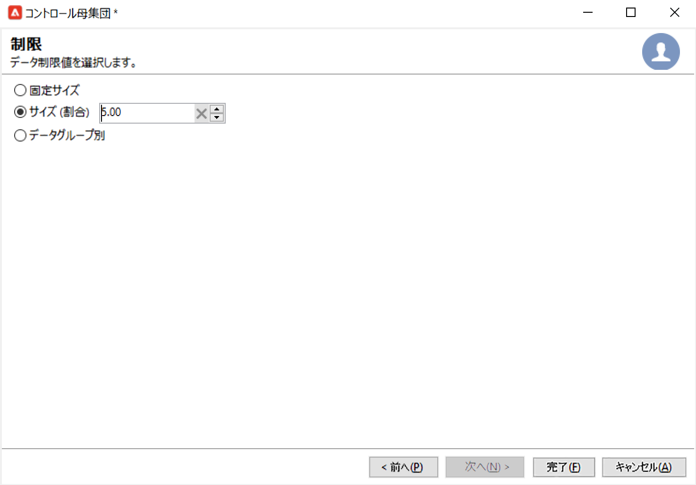

# キャンペーンのオーディエンスの選択 {#marketing-campaign-deliveries}

マーケティングキャンペーンでは、配信ごとに次の項目を定義できます。

* ターゲットオーディエンス。 メッセージを [受信者のリスト](#send-to-a-group) または [ワークフロー内のオーディエンス](#build-the-main-target-in-a-workflow)
* コントロール母集団。 以下が可能です。 [コントロール母集団の追加](#add-a-control-group) メッセージ配信後の受信者の行動を監視する
<!--
* Seed addresses - Learn more in [this section](../../delivery/using/about-seed-addresses.md).-->

この情報の一部は、[キャンペーンテンプレート](marketing-campaign-templates.md#campaign-templates)から継承できます。

<!--
To build the delivery target, you can define filtering criteria for the recipients in the database. This recipient selection mode is presented in [this section](../../delivery/using/steps-defining-the-target-population.md).
-->

## グループへの送信{#send-to-a-group}

母集団をリストにインポートしてから、このリストを配信のターゲットにすることができます。 それには、次の手順に従います。

1. 配信を編集し、 **[!UICONTROL 宛先]** リンクをクリックして、ターゲット母集団を変更します。
1. 「**[!UICONTROL メインターゲット]**」タブで「**[!UICONTROL データベースで定義]**」オプションを選択し、「**[!UICONTROL 追加]**」をクリックして、受信者を選択します。

   

1. 選択 **[!UICONTROL 受信者のリスト]**.

   

1. クリック **[!UICONTROL 次へ]** をクリックしてリストを選択します。

   

   新しいフィルター条件を追加することで、ターゲットを絞り込むことができます。

1. クリック **[!UICONTROL 完了]** すべての条件を定義したら、メインターゲットを保存します。

## キャンペーンワークフローでのオーディエンスの作成 {#build-the-main-target-in-a-workflow}

配信のメインターゲットは、キャンペーンワークフローで定義することもできます。このグラフィカル環境では、クエリ、テスト、演算子（和集合、重複排除、共有など）を使用してターゲットを作成できます。

>[!IMPORTANT]
>
>1 つのキャンペーンに追加できるワークフローは 28 個までです。 この上限を超えると、追加のワークフローはインターフェイスに表示されず、エラーが発生する可能性があります。

### ワークフローの作成 {#create-a-targeting-workflow}

ターゲティングは、ワークフロー内のグラフィカルなシーケンスでフィルタリング条件を組み合わせて作成できます。ターゲットとする母集団およびサブ母集団を要件に合わせて作成できます。ワークフローエディターを表示するには、キャンペーンダッシュボードで「**[!UICONTROL ターゲティングとワークフロー]**」タブをクリックします。

ワークフロー内に 1 つ以上のクエリを配置して、ターゲット母集団を Adobe Campaign データベースから抽出します。でクエリを作成する方法を説明します。 [この節](../workflow/query.md).

クエリを開始し、「和集合」、「積集合」、「共有」、「除外」などのボックスを介して母集団を共有できます。

ワークスペースの左側のリストからオブジェクトを選択し、リンクして、ターゲットを構築します。

このダイアグラムでは、ターゲットの構築に必要なターゲティングクエリとスケジューリングクエリをダイアグラム内でリンクしています。データベースから抽出された母集団を確認するために、構築の進行中にターゲティングを実行できます。

>[!NOTE]
>
>クエリを定義するための例と手順について詳しくは、 [この節](../workflow/query.md).

エディターの左側には、アクティビティを表すグラフィカルなオブジェクトのライブラリがあります。最初のタブにはターゲティングアクティビティが含まれ、2 番目のタブにはフロー制御アクティビティが含まれています。フロー制御アクティビティは、ターゲティングアクティビティの調整に使用する場合があります。

ターゲティングワークフローの実行および書式設定機能には、ダイアグラムエディターのツールバーからアクセスできます。

>[!NOTE]
>
>ダイアグラムの作成に使用できるアクティビティと、すべての表示およびレイアウト機能について詳しくは、 [この節](../workflow/about-workflows.md).

1 つのキャンペーンに対して複数のターゲティングワークフローを作成できます。ワークフローを追加するには、次の手順に従います。

1. ワークフロー作成領域の左上に移動して右クリックし、「**[!UICONTROL 追加]**」を選択します。この領域の上にある&#x200B;**[!UICONTROL 新規]**&#x200B;ボタンも使用できます。

   

1. **[!UICONTROL 新しいワークフロー]**&#x200B;テンプレートを選択し、このワークフローに名前を付けます。
1. 「**[!UICONTROL OK]**」をクリックしてワークフローの作成を確定し、このワークフローのダイアグラムを作成します。

### ワークフローの実行 {#execute-a-workflow}

適切な権限がある場合は、ツールバーの&#x200B;**[!UICONTROL 開始]**&#x200B;ボタンから手動でターゲティングワークフローを開始できます。

スケジュール（スケジューラー）またはイベント（外部信号、ファイルのインポートなど）に従って自動実行するように、ターゲティングをプログラムすることもできます。

ターゲティングワークフローの実行に関連するアクション（開始、停止、一時停止など）は、**非同期**&#x200B;プロセスです。コマンドは保存され、サーバーがそのコマンドを適用できるようになるとすぐに実行されます。

ツールバーのアイコンを使用して、ターゲティングワークフローの実行に関連するアクションを起こすことができます。

* 開始または再開

   * **[!UICONTROL 開始]**&#x200B;アイコンを使用して、ターゲティングワークフローを開始できます。このアイコンをクリックすると、入力トランジションがないすべてのアクティビティが有効化されます（終点へのジャンプを除く）。

      

      サーバーでのリクエスト処理状況はステータスに表示されます。 **[!UICONTROL 開始準備中]**.

   * 適切なツールバーアイコンからターゲティングワークフローを再開できます。このコマンドは、例えばターゲティングワークフローの停止が進行中の場合など、**[!UICONTROL 開始]**&#x200B;アイコンが表示されていない場合に役立つことがあります。その場合は、**[!UICONTROL 再開]**&#x200B;アイコンをクリックして、再開を待ちます。ステータスが示すように、サーバーがリクエストを処理します。 **[!UICONTROL 再度開始がリクエストされました]**.

* 停止または一時停止

   * ツールバーのアイコンを使用して、進行中のターゲティングワークフローを停止または一時停止できます。

      **[!UICONTROL 一時停止]**&#x200B;アイコンをクリックすると、進行中の操作は一時停止&#x200B;**[!UICONTROL されません]**&#x200B;が、次に再開されるまで他のアクティビティは開始されなくなります。

      

      サーバーでのコマンド処理状況はステータスに表示されます。 **[!UICONTROL 一時停止がリクエストされました]**.

      ターゲティングワークフローの実行が特定のアクティビティに到達したときに、自動的に一時停止することもできます。そのように設定するには、ターゲティングワークフローを一時停止するアクティビティを右クリックし、「**[!UICONTROL 有効にするが実行しない]**」を選択します。

      

      この設定には特別なアイコンが表示されます。

      

      >[!NOTE]
      >
      >このオプションは、ターゲティングキャンペーンの詳細なデザインおよびテストフェーズで役に立ちます。

      実行を再開するには、**[!UICONTROL 開始]**&#x200B;アイコンをクリックします。

   * 進行中の実行を停止するには、**[!UICONTROL 停止]**&#x200B;アイコンをクリックします。

      

      サーバーでのコマンド処理状況はステータスに表示されます。 **[!UICONTROL 停止がリクエストされました]**.
   ターゲティングワークフローの実行が特定のアクティビティに到達したときに、自動的に停止することもできます。そのように設定するには、ターゲティングワークフローを停止するアクティビティを右クリックし、「**[!UICONTROL 有効にしない]**」を選択します。

   

   この設定には特別なアイコンが表示されます。

   

   >[!NOTE]
   >
   >このオプションは、ターゲティングキャンペーンの詳細なデザインおよびテストフェーズで役に立ちます。

* 条件なしの停止

   エクスプローラーで、**[!UICONTROL 管理／プロダクション／自動作成されたオブジェクト／キャンペーンワークフロー]**&#x200B;を選択すると、すべてのキャンペーンワークフローにアクセスして操作できます。

   ワークフローを無条件で停止するには、「**[!UICONTROL アクション]**」アイコンをクリックし、「**[!UICONTROL 無条件停止]**」をクリックします。このアクションにより、キャンペーンワークフローが終了します。

   

## コントロール母集団の追加 {#add-a-control-group}

コントロール母集団は、配信を受け取らない母集団です。配信を受け取るターゲット母集団の行動と比較することで、配信後の行動とキャンペーンの影響をトラッキングします。

コントロール母集団は、メインターゲットから抽出できます。特定のグループまたはクエリから取得することもできます。

### キャンペーンのコントロール母集団の有効化 {#activate-the-control-group-for-a-campaign}

コントロール母集団は、キャンペーンレベルで定義できます。この場合、該当するキャンペーンの配信ごとにコントロール母集団が適用されます。

1. 該当するキャンペーンを編集し、「**[!UICONTROL 編集]**」タブをクリックします。
1. クリック **[!UICONTROL キャンペーンの詳細パラメーター…]**.

   

1. 「**[!UICONTROL コントロール母集団の設定を有効にして編集]**」オプションを選択します。
1. 「**[!UICONTROL 編集...]**」をクリックして、コントロール母集団を設定します。

   

詳しい手順については、を参照してください。 [この節](#extract-the-control-group-from-the-main-target). コントロール母集団の詳細については、 [こちらの節](#add-a-population)を参照してください。

### 配信のコントロール母集団の有効化 {#activate-the-control-group-for-a-delivery}

コントロール母集団は、配信レベルで定義できます。この場合、該当するキャンペーンの配信ごとにコントロール母集団が適用されます。

デフォルトでは、キャンペーンレベルで定義されたコントロール母集団の設定が、そのキャンペーンの配信ごとに適用されます。ただし、個々の配信にコントロール母集団を適応させることもできます。

>[!NOTE]
>
>キャンペーンのコントロール母集団を定義済みで、このキャンペーンにリンクされている配信用にもコントロール母集団を設定する場合は、配信用に定義されたコントロール母集団のみが適用されます。

1. 該当する配信を編集し、 **[!UICONTROL 宛先]** リンク。
1. 「**[!UICONTROL コントロール母集団]**」タブをクリックし、「**[!UICONTROL コントロール母集団の設定を有効にして編集]**」を選択します。

   

1. 「**[!UICONTROL 編集...]**」をクリックして、コントロール母集団を設定します。。

詳しい手順については、を参照してください。 [この節](#extract-the-control-group-from-the-main-target).

### コントロール母集団としての新しい母集団の使用 {#add-a-population}

コントロール母集団には、特定の母集団を使用できます。 その場合は、関連するフィールドでコントロール母集団として使用するリストを選択します。

この母集団は、受信者のリストから取得することも、特定のクエリを使用して定義することもできます。

>[!NOTE]
>
>Adobe Campaign クエリエディターについては、[この節](../workflow/query.md)を参照してください。

### メインターゲットからのコントロール母集団の抽出 {#extract-the-control-group-from-the-main-target}

また、配信のメインターゲットから受信者を抽出することもできます。 この場合、受信者は、この設定に影響を受ける配信アクションのターゲットから選ばれます。ランダムに抽出することも、受信者の並べ替え結果を使用することもできます。

コントロール母集団を抽出するには、キャンペーンまたは配信のコントロール母集団を有効にして、「**[!UICONTROL ランダムサンプリングを有効化]**」オプションまたは「**[!UICONTROL 並べ替えの後に最初のレコードのみ保持]**」オプションのどちらかを選択します。

* 以下を使用： **[!UICONTROL ランダムサンプリングを有効化]** 「 」オプションを使用します。 しきい値を 100 に設定した場合、コントロール母集団は、ターゲット母集団からランダムに選択された 100 人の受信者で構成されます。ランダムサンプリングはデータベースエンジンに依存します。
* 以下を使用： **[!UICONTROL 並べ替えの後に最初のレコードのみ保持]** オプションを使用して、1 つ以上の並べ替え順に基づく制限を定義できます。 並べ替えの基準として「**[!UICONTROL 年齢]**」フィールドを選択し、しきい値として 100 を定義した場合、コントロール母集団は最も若い 100 人の受信者で構成されます。例えば、ほとんど購入していない受信者や、頻繁に購入する受信者を含むコントロール母集団を定義して、その行動と、コンタクトされた受信者の行動を比較すると、興味深い結果が得られる可能性があります。

「**[!UICONTROL 次へ]**」をクリックして、並べ替え順を定義し（必要な場合）、受信者の制限モードを選択します。

この設定は、 **[!UICONTROL 分割]** ワークフロー内の「 」アクティビティ。ターゲットをサブセットに分割できます。 コントロール母集団は、このようなサブセットのひとつです。

#### チュートリアルビデオ {#create-email-video}

このビデオでは、Adobe Campaign でキャンペーンと E メールを作成する方法を説明します。

>[!VIDEO](https://video.tv.adobe.com/v/25604?quality=12)

Campaign に関するその他のハウツービデオは[こちら](https://experienceleague.adobe.com/docs/campaign-classic-learn/tutorials/overview.html?lang=ja)で参照できます。
