# キャンペーンテンプレートの作成と設定 {#campaign-templates}

すべてのマーケティングキャンペーンは、主な特性と機能を格納したテンプレートに基づいています。 Campaign には、キャンペーンを作成するためのビルトインテンプレートが用意されています。このテンプレートでは、ドキュメント、シードアドレス、承認、配信の概要などのすべての機能が有効になっています。

使用できる機能は、権限、アドオン、Adobe Campaign プラットフォームの設定によって異なります。

>[!NOTE]
>
>このツリーは、ホームページの「**[!UICONTROL エクスプローラー]**」アイコンをクリックすると表示されます。

特定の設定が定義されていないキャンペーンを作成するために、ビルトインのテンプレートが用意されています。 キャンペーンテンプレートを作成および設定して、そのテンプレートからキャンペーンを作成することができます。

## キャンペーンテンプレートの作成 {#create-a-campaign-template}

キャンペーンテンプレートを作成するには、次の手順に従います。

1. Campaign **Explorer** を開き、**リソース／テンプレート／キャンペーンテンプレート**&#x200B;を参照します。
1. テンプレートのリストの上にあるツールバーの「**新規**」をクリックします。

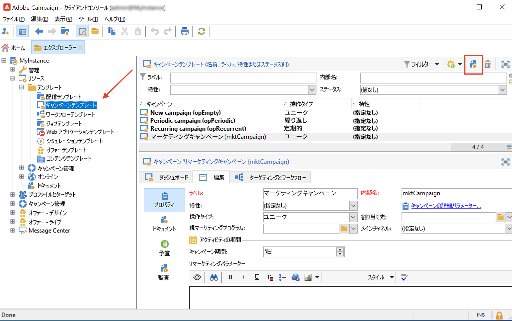

ビルトインテンプレートを&#x200B;**複製**&#x200B;して、その設定を再利用および調整することもできます。これを行うには、テンプレートを右クリックして「**複製**」を選択します。

1. 作成するキャンペーンテンプレートのラベルを入力します。
1. 「**保存**」をクリックし、作成したテンプレートをもう一度開きます。
1. 「**編集**」タブで、テンプレートのプロパティを定義します。
1. 「**キャンペーンの詳細パラメーター...**」を選択し、キャンペーンテンプレートにワークフローを追加します。

   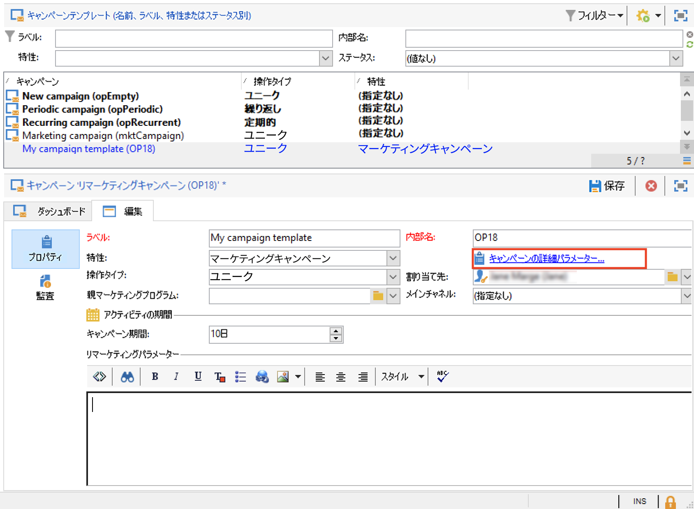

1. 「**ターゲティングとワークフロー**」の値を「**はい**」に変更し、確認します。機能を追加する方法について詳しくは、[この節](#typology-of-enabled-modules)を参照してください。
1. 「**ターゲティングとワークフロー**」タブがテンプレートに追加されます。「**ワークフローを追加…**」をクリックし、**ラベル**&#x200B;を入力して「**OK**」をクリックします。
1. ニーズに応じてワークフローを作成します。

   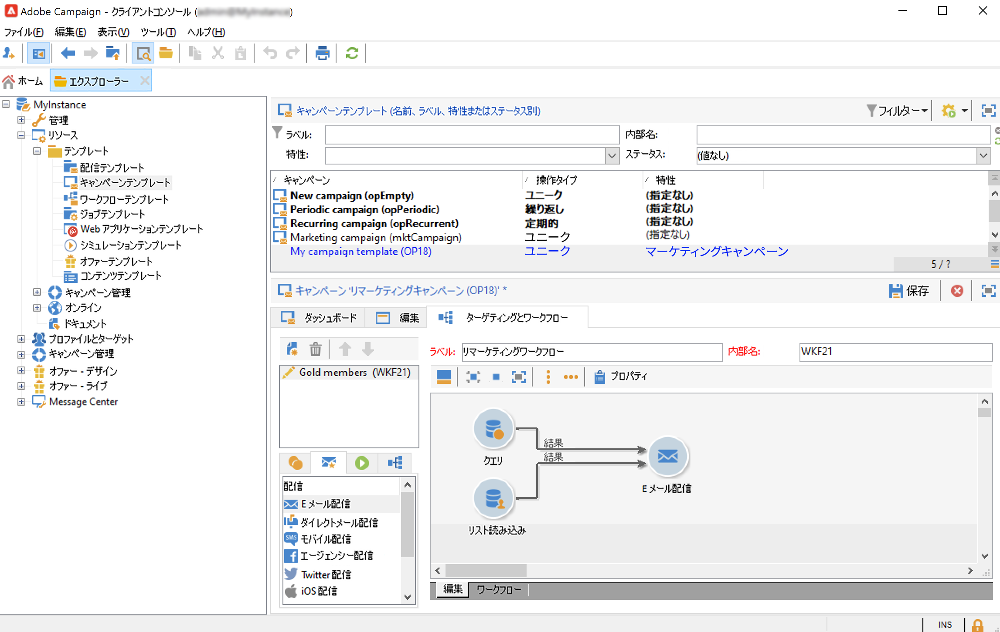

1. 「**保存**」をクリックします。作成したワークフローが、新しいキャンペーンの作成に使用できる状態になります。

キャンペーンテンプレートの様々なタブおよびサブタブを使用すると、[一般設定](#general-configuration)で説明されている設定にアクセスできます。

## モジュールの選択 {#select-modules}

「**[!UICONTROL キャンペーンの詳細パラメーター...]**」リンクを使用すると、このテンプレートをベースとするキャンペーンのジョブを有効化／無効化できます。このテンプレートに基づいて作成されるキャンペーンで有効にする機能を選択します。

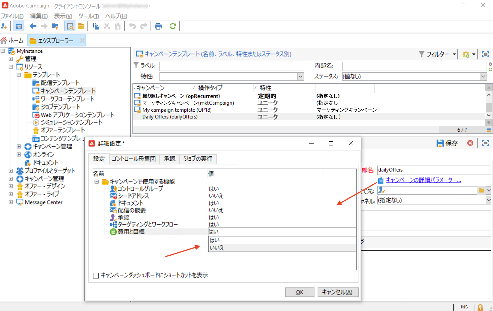

機能を選択しない場合、プロセスに関する要素（メニュー、アイコン、オプション、タブ、サブタブなど）は、テンプレートのインターフェイスまたはこのテンプレートに基づくキャンペーンには表示されません。キャンペーン詳細の左側のタブ、および利用可能なタブは、テンプレートで選択されている機能と一致します。例えば、「**費用と目標**」機能が有効になっていない場合、対応する「**[!UICONTROL 予算]**」タブは、このテンプレートをベースとするキャンペーンには表示されません。

さらに、設定ウィンドウへのショートカットがキャンペーンダッシュボードに追加されます。機能を有効にすると、キャンペーンダッシュボードから直接リンクでその機能にアクセスできます。

### 設定サンプル

* 例えば、次の設定を使用します。

   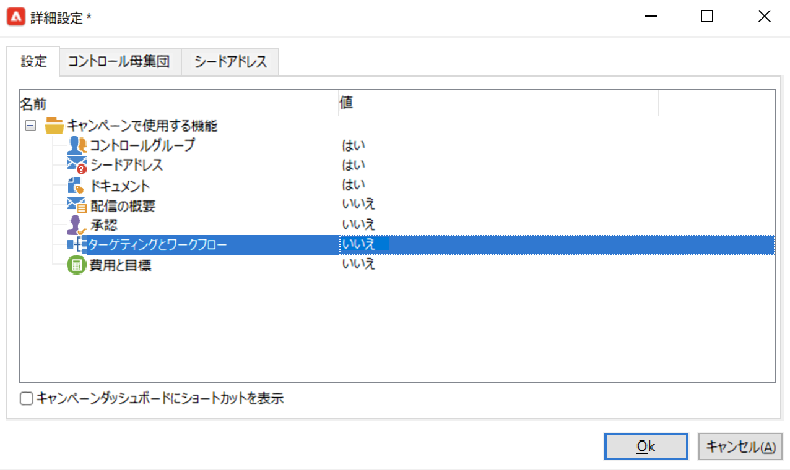

   キャンペーンダッシュボードには、次の情報が表示されます。

   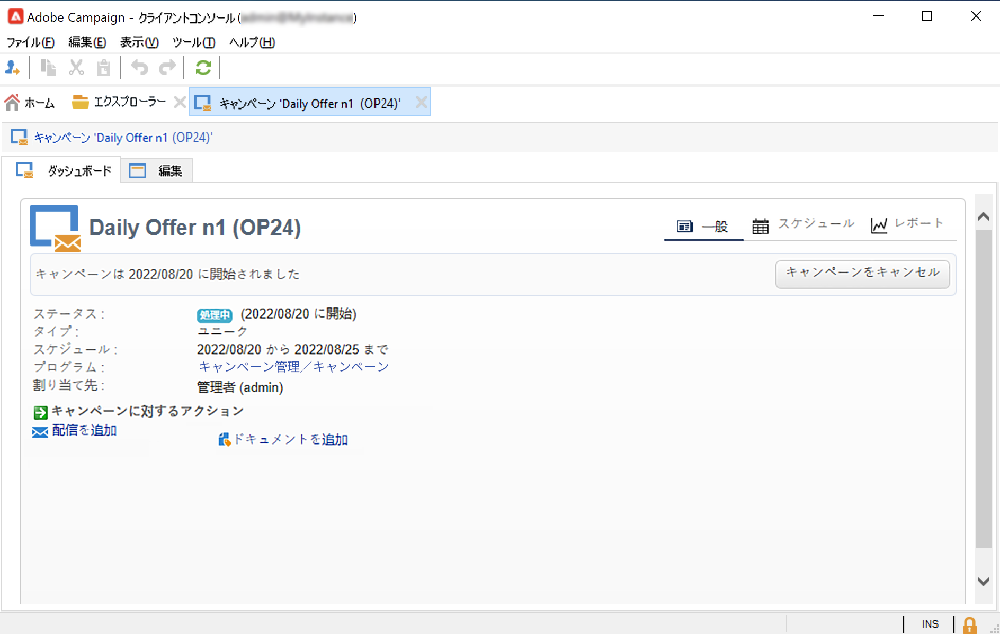

   「**[!UICONTROL ターゲティングとワークフロー]**」タブは表示されません。

   次の機能を使用できます。

   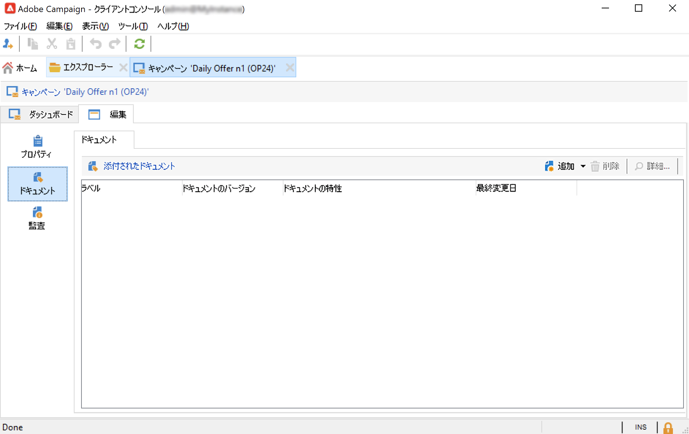

   「**[!UICONTROL 予算]**」タブは表示されません。

   キャンペーンの詳細設定には、この設定も反映されています。

   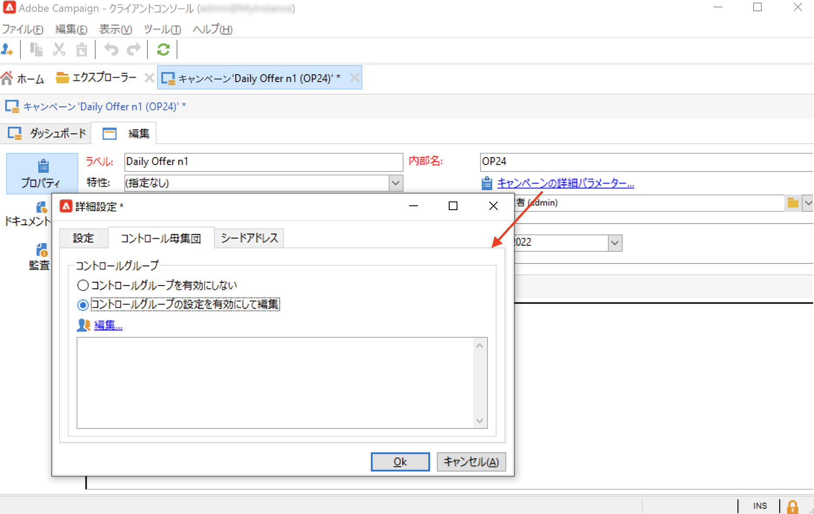

   「**[!UICONTROL 承認]**」タブは使用できません。

* 次の設定を使用します。
   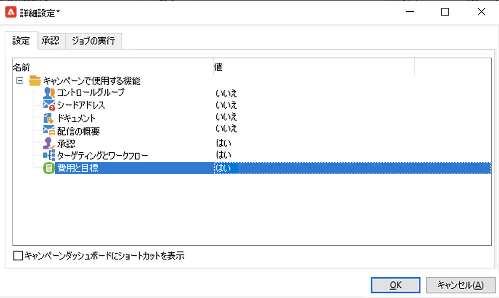

   キャンペーンダッシュボードには、次の情報が表示されます。

   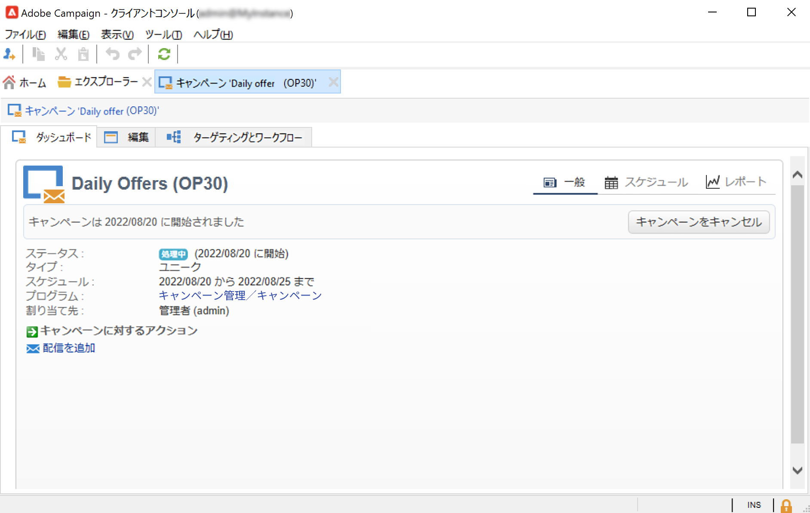

   「**[!UICONTROL ターゲティングとワークフロー]**」タブは使用可能ですが、「**ドキュメントを追加**」するリンクはありません。

   次の機能を使用できます。

   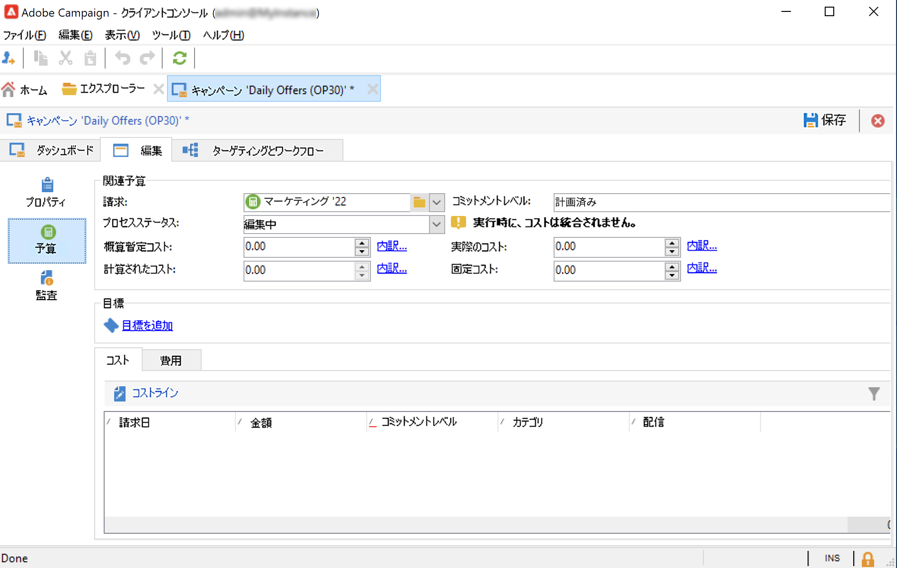

   「**[!UICONTROL 予算]**」タブを使用できます。

   キャンペーンの詳細設定には、この設定も反映されています。

   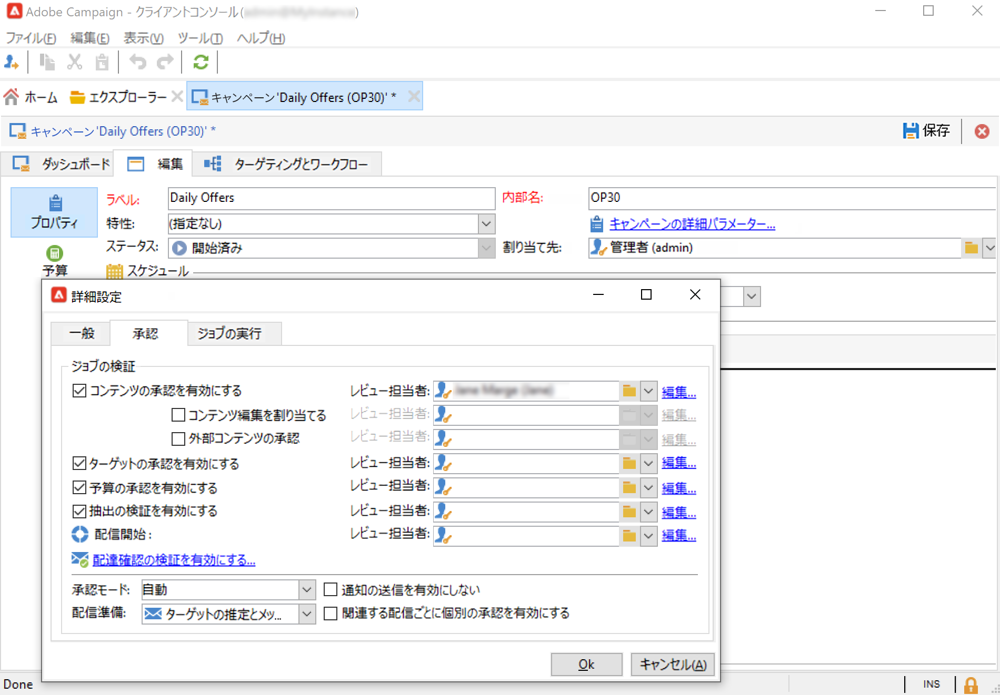

   「**[!UICONTROL 承認]**」タブは使用可能ですが、「**[!UICONTROL コントロール母集団]**」タブと「**[!UICONTROL シードアドレス]**」タブは有効になっていません。

## モジュールのタイポロジ {#typology-of-enabled-modules}

* **コントロール母集団**

   このモジュールを選択すると、テンプレートおよびこのテンプレートをベースとするキャンペーンの詳細設定にタブが追加されます。設定は、テンプレートで、またはキャンペーンごとに個別に定義できます。 コントロール母集団の詳細については、 [こちらの節](marketing-campaign-deliveries.md#defining-a-control-group)を参照してください。

   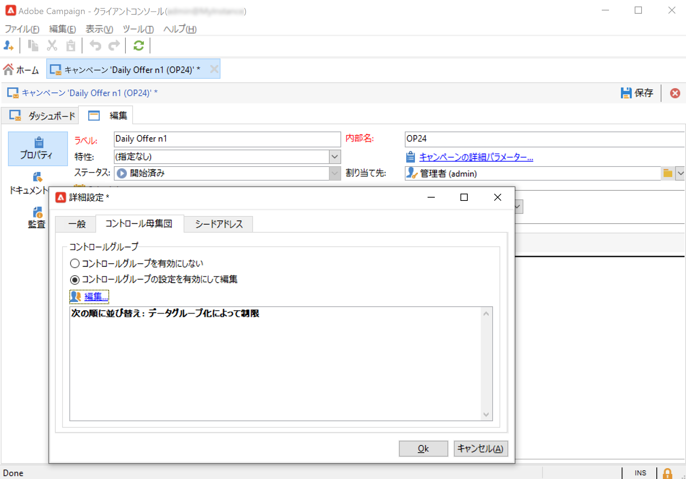

* **シードアドレス**

   このモジュールを選択すると、テンプレートおよびこのテンプレートをベースとするキャンペーンの詳細設定にタブが追加されます。テンプレートで、またはキャンペーンごとに個別に、設定を定義できます。

   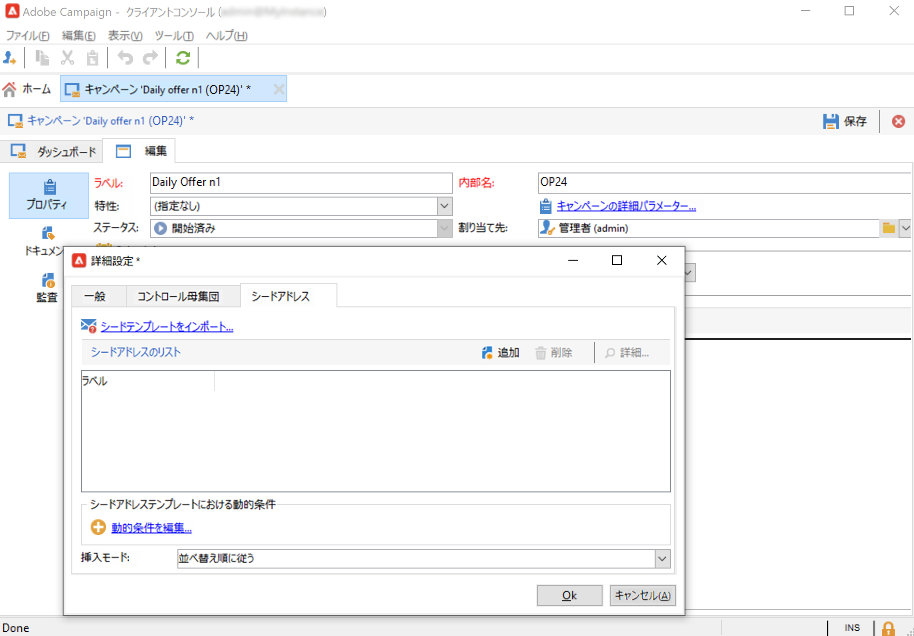

* **ドキュメント**

   このモジュールを選択すると、テンプレートおよびこのテンプレートをベースとするキャンペーンの「**[!UICONTROL 編集]**」タブにタブが追加されます。添付ドキュメントは、テンプレートから追加することも、キャンペーンごとに個別に追加することもできます。 ドキュメントの詳細については、[こちらの節](marketing-campaign-deliveries.md#manage-associated-documents)を参照してください。

   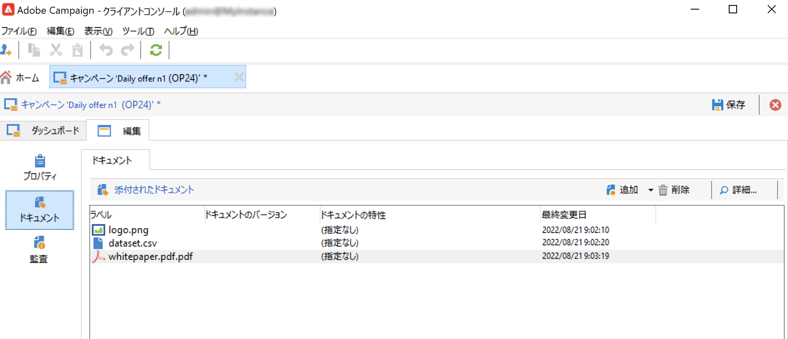

* **配信の概要**

   このモジュールを選択すると、キャンペーンの配信概要を定義するために「**[!UICONTROL 配信の概要]**」サブタブが「**[!UICONTROL ドキュメント]**」タブに追加されます。 配信概要の詳細については、[こちらの節](marketing-campaign-assets.md#delivery-outlines)を参照してください。

   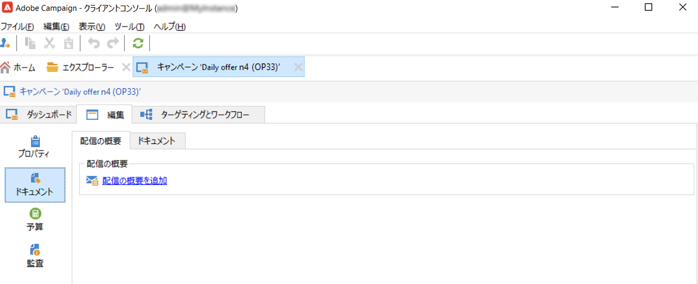

* **ターゲティングとワークフロー**

   **[!UICONTROL ターゲティングとワークフロー]**&#x200B;モジュールを選択すると、タブが追加されて、このテンプレートをベースとするキャンペーン用に 1 つ以上のワークフローを作成できます。ワークフローは、このテンプレートに基づいて、キャンペーンごとに個別に設定することもできます。キャンペーンワークフローの詳細については、[こちらの節](marketing-campaign-deliveries.md#build-the-main-target-in-a-workflow)を参照してください。

   

   このモジュールを有効にすると、プロセス実行シーケンスを定義するための「**[!UICONTROL ジョブ]**」タブがキャンペーンの詳細設定に追加されます。

* **承認**

   「**[!UICONTROL 承認]**」を有効化すると、承認するプロセスおよび承認を担当するオペレーターを選択できます。承認の詳細については、[こちらの節](marketing-campaign-approval.md#select-reviewers)を参照してください。

   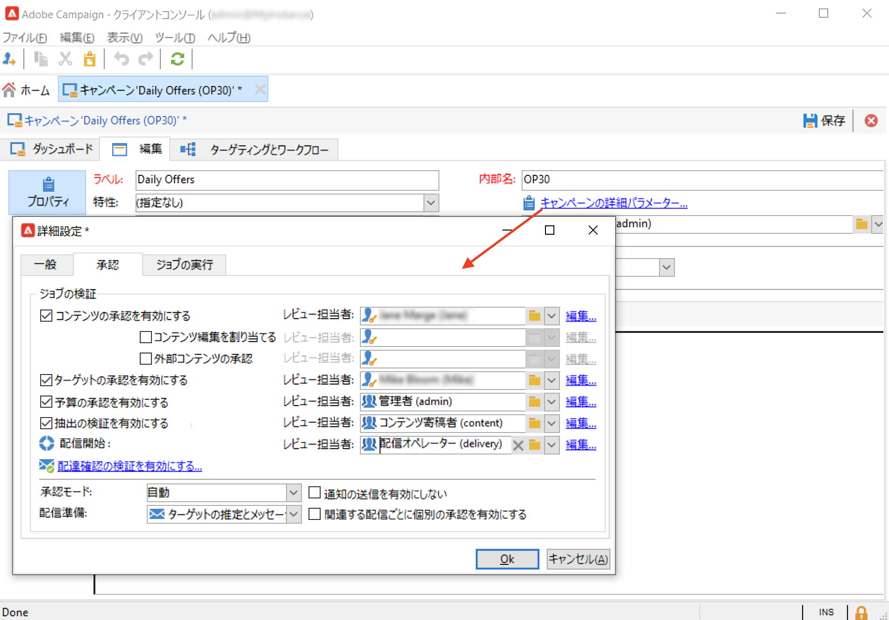

   テンプレートの「詳細設定」セクションの「**[!UICONTROL 承認]**」タブで、プロセスの承認を有効にするかどうかを選択できます。

* **費用と目標**

   このモジュールを選択すると、テンプレートおよびこのテンプレートに基づくキャンペーンの詳細に「**[!UICONTROL 予算]**」タブが追加され、関連する予算を選択できるようになります。

   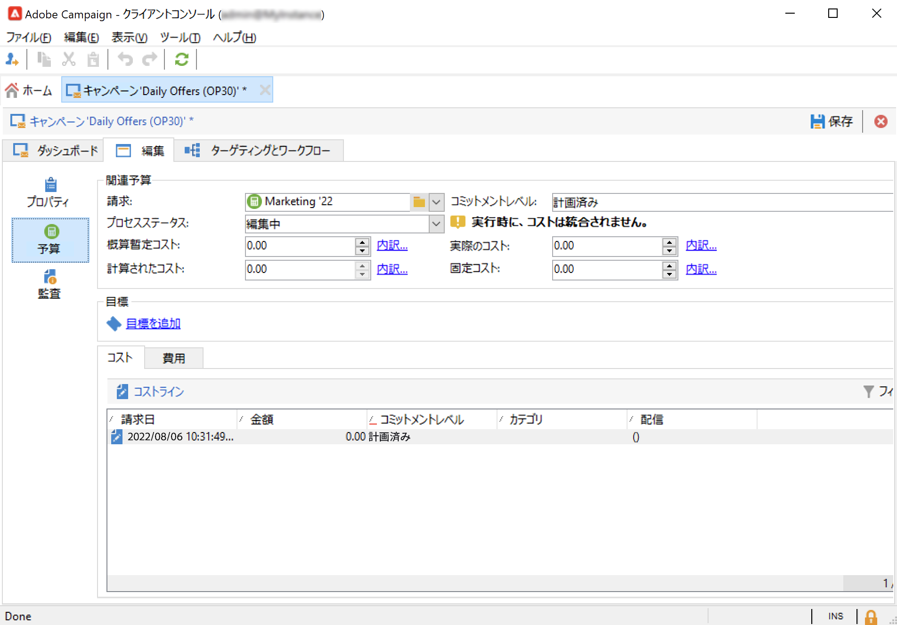

## テンプレートのプロパティ {#template-properties}

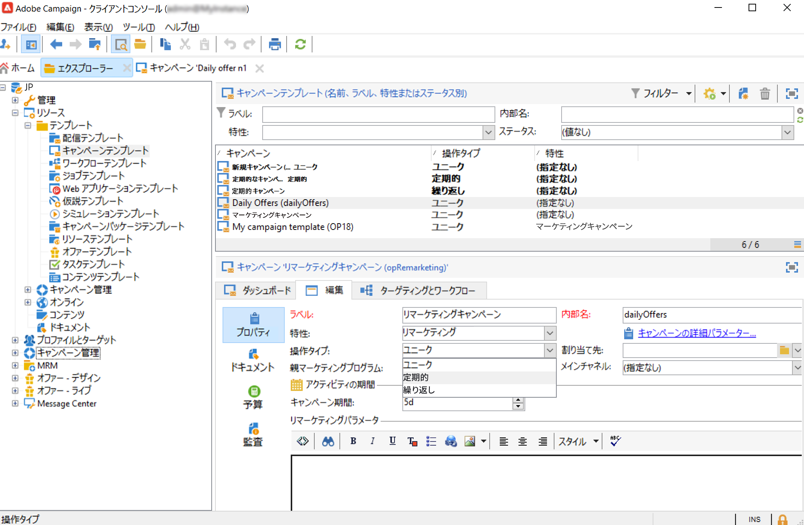

キャンペーンテンプレートを作成するときは、次の情報を入力する必要があります。

* テンプレートの&#x200B;**ラベル**&#x200B;を入力します。このラベルは必須であり、このテンプレートをベースとするすべてのキャンペーンのデフォルトラベルです。
* ドロップダウンリストからキャンペーンの&#x200B;**特性**&#x200B;を選択します。このリストに表示される値は、**[!UICONTROL natureOp]** 列挙に保存されている値です。

列挙にアクセスして設定する方法については、[Campaign Classic v7 ドキュメント](https://experienceleague.adobe.com/docs/campaign-classic/using/getting-started/administration-basics/managing-enumerations.html?lang=ja){target=&quot;_blank&quot;}を参照してください。

* **キャンペーンのタイプ**&#x200B;を選択：単一、繰り返しまたは定期的。デフォルトでは、キャンペーンテンプレートは単一のキャンペーンに適用されます。繰り返しキャンペーンと定期的キャンペーンについて詳しくは、[こちらの節](recurring-periodic-campaigns.md)を参照してください。
* キャンペーン期間、すなわちキャンペーンが実施される日数を指定します。このテンプレートをベースとしてキャンペーンを作成すると、キャンペーンの開始日と終了日が自動的に設定されます。

   繰り返しキャンペーンの場合は、キャンペーンの開始日と終了日をテンプレートで直接指定する必要があります。

* テンプレートの&#x200B;**関連プログラム**&#x200B;を指定します。選択したプログラムに、このテンプレートをベースとするキャンペーンがリンクされます。

<!--
## Track campaign execution{#campaign-reverse-scheduling}

You can create a schedule for a campaign and track accomplishments, for instance to prepare an event schedule for a specific date. Campaign templates now let you calculate the start date of a task based on the end date of a campaign.

In the task configuration box, go to the **[!UICONTROL Implementation schedule]** area and check the **[!UICONTROL The start date is calculated based on the campaign end date]** box. (Here, "start date" is the task start date). Go to the **[!UICONTROL Start]** field and enter an interval: the task will start this long before the campaign end date. If you enter a period which is longer than the campaign is set to last, the task will begin before the campaign.

When you create a campaign using this template, the task start date will be calculated automatically. However, you can always change it later.-->
