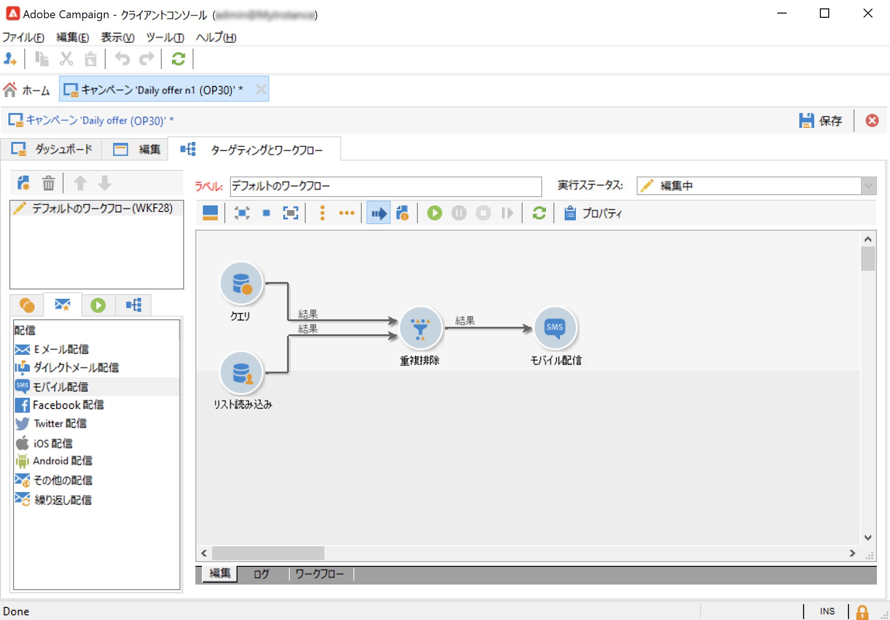

# キャンペーンテンプレートの作成と設定 {#campaign-templates}

すべてのマーケティングキャンペーンは、主な特性と機能を格納したテンプレートに基づいています。 Campaign には、キャンペーンを作成するための組み込みテンプレートが用意されています。 このテンプレートでは、次のすべての機能が有効になっています。ドキュメント、シードアドレス、承認、配信の概要など

使用できる機能は、権限、アドオン、Adobe Campaignプラットフォームの設定によって異なります。

>[!NOTE]
>
>このツリーは、ホームページの「**[!UICONTROL エクスプローラー]**」アイコンをクリックすると表示されます。

特定の設定が定義されていないキャンペーンを作成するために、ビルトインのテンプレートが用意されています。 キャンペーンテンプレートを作成および設定して、そのテンプレートからキャンペーンを作成することができます。

## キャンペーンテンプレートの作成 {#create-a-campaign-template}

キャンペーンテンプレートを作成するには、次の手順に従います。

1. キャンペーンを開く **エクスプローラ**&#x200B;をクリックし、 **リソース/テンプレート/キャンペーンテンプレート**.
1. クリック **新規** （テンプレートのリストの上にあるツールバー）

また、 **重複** 組み込みテンプレートを再利用し、設定を調整する。 それには、テンプレートを右クリックし、「 」を選択します。 **複製**.

1. 作成するキャンペーンテンプレートのラベルを入力します。
1. 「**保存**」をクリックし、作成したテンプレートをもう一度開きます。
1. 内 **編集** 「 」タブで、テンプレートのプロパティを定義します。
1. 選択 **キャンペーンの詳細パラメーター…** リンクをクリックして、キャンペーンテンプレートにワークフローを追加します。

   

1. を **ターゲティングとワークフロー** 値 **はい**.......................................................................................................................................................................................................................................................... 機能を追加する方法については、 [この節](#typology-of-enabled-modules).
1. この **ターゲティングとワークフロー** 」タブがテンプレートに追加されます。 クリック **ワークフローを追加…**、 **ラベル** をクリックし、 **Ok**.
1. 必要に応じて、ワークフローを作成します。

   

1. 「**保存**」をクリックします。これで、新しいキャンペーンを作成するためのテンプレートを使用する準備が整いました。

キャンペーンテンプレートの様々なタブおよびサブタブを使用すると、[一般設定](#general-configuration)で説明されている設定にアクセスできます。

## モジュールの選択 {#select-modules}

この **[!UICONTROL キャンペーンの詳細パラメーター…]** 「 」リンクを使用して、このテンプレートをベースとするキャンペーンのジョブを有効または無効にできます。 このテンプレートに基づいて作成されるキャンペーンで有効にする機能を選択します。

機能を選択しない場合、プロセスに関連する要素（メニュー、アイコン、オプション、タブ、サブタブなど） テンプレートのインターフェイスや、このテンプレートをベースとするキャンペーンには表示されません。 キャンペーンの詳細の左側のタブと使用可能なタブは、テンプレートで選択された機能と一致します。 例えば、 **費用と目標** 機能が有効になっていない場合、対応する **[!UICONTROL 予算]** このテンプレートをベースとするキャンペーンにタブを表示しない

さらに、設定ウィンドウへのショートカットがキャンペーンダッシュボードに追加されます。機能を有効にすると、キャンペーンダッシュボードから直接リンクでその機能にアクセスできます。

### 設定サンプル

* 例えば、次の設定を使用します。

   

   キャンペーンダッシュボードには、次の情報が表示されます。

   

   なお、 **[!UICONTROL ターゲティングとワークフロー]** 」タブが表示されません。

   次の機能を使用できます。

   

   なお、 **[!UICONTROL 予算]** 」タブが表示されません。

   キャンペーンの詳細設定には、この設定も反映されています。

   

   なお、 **[!UICONTROL 承認]** タブは使用できません。

* 次の設定を使用します。
   

   キャンペーンダッシュボードには、次の情報が表示されます。

   

   なお、 **[!UICONTROL ターゲティングとワークフロー]** タブは使用可能ですが、 **ドキュメントを追加** リンクが見つかりません。

   次の機能を使用できます。

   

   なお、 **[!UICONTROL 予算]** 」タブが使用できます。

   キャンペーンの詳細設定には、この設定も反映されています。

   

   なお、 **[!UICONTROL 承認]** タブは使用可能ですが、 **[!UICONTROL コントロール母集団]** および **[!UICONTROL シードアドレス]** タブが有効になっていません。

## モジュールのタイポロジ {#typology-of-enabled-modules}

* **コントロール母集団**

   このモジュールを選択すると、テンプレートおよびこのテンプレートをベースとするキャンペーンの詳細設定にタブが追加されます。設定は、テンプレートで、またはキャンペーンごとに個別に定義できます。 コントロール母集団の詳細については、 [こちらの節](marketing-campaign-deliveries.md#defining-a-control-group)を参照してください。

   

* **シードアドレス**

   このモジュールを選択すると、テンプレートおよびこのテンプレートをベースとするキャンペーンの詳細設定にタブが追加されます。テンプレートで、またはキャンペーンごとに個別に、設定を定義できます。

   

* **ドキュメント**

   このモジュールを選択すると、 **[!UICONTROL 編集]** 」タブに表示されます。 添付ドキュメントは、テンプレートから追加することも、キャンペーンごとに個別に追加することもできます。 ドキュメントの詳細については、[こちらの節](marketing-campaign-deliveries.md#manage-associated-documents)を参照してください。

   

* **配信の概要**

   このモジュールを選択すると、キャンペーンの配信概要を定義するために「**[!UICONTROL 配信の概要]**」サブタブが「**[!UICONTROL ドキュメント]**」タブに追加されます。 配信概要の詳細については、[こちらの節](marketing-campaign-assets.md#delivery-outlines)を参照してください。

   

* **ターゲティングとワークフロー**

   **[!UICONTROL ターゲティングとワークフロー]**&#x200B;モジュールを選択すると、タブが追加されて、このテンプレートをベースとするキャンペーン用に 1 つ以上のワークフローを作成できます。ワークフローは、このテンプレートに基づいて、キャンペーンごとに個別に設定することもできます。キャンペーンワークフローの詳細については、[こちらの節](marketing-campaign-deliveries.md#build-the-main-target-in-a-workflow)を参照してください。

   

   このモジュールが有効な場合、 **[!UICONTROL ジョブ]** プロセス実行シーケンスを定義する「 」タブがキャンペーンの詳細設定に追加されます。

* **承認**

   以下を有効にした場合、 **[!UICONTROL 承認]**&#x200B;に含める場合、承認するプロセスと承認を担当するオペレーターを選択できます。 承認の詳細については、[こちらの節](marketing-campaign-approval.md#select-reviewers)を参照してください。

   

   プロセスの承認を有効にするかどうかを、 **[!UICONTROL 承認]** 」タブに表示されます。

* **費用と目標**

   このモジュールを選択すると、テンプレートおよびこのテンプレートに基づくキャンペーンの詳細に「**[!UICONTROL 予算]**」タブが追加され、関連する予算を選択できるようになります。

   

## テンプレートのプロパティ {#template-properties}

キャンペーンテンプレートを作成するときは、次の情報を入力する必要があります。

* 次を入力します。 **ラベル** テンプレートの「 」ラベルは必須で、このテンプレートをベースとするすべてのキャンペーンのデフォルトラベルです。
* ドロップダウンリストからキャンペーンの&#x200B;**特性**&#x200B;を選択します。このリストに表示される値は、**[!UICONTROL natureOp]** 列挙に保存されている値です。
   <!--
  >[!NOTE]
  >
  >For more information on enumerations, refer to the [Getting Started](../../platform/using/managing-enumerations.md) section.-->

* **キャンペーンのタイプ**&#x200B;を選択：単一、繰り返しまたは定期的。デフォルトでは、キャンペーンテンプレートは単一のキャンペーンに適用されます。繰り返しキャンペーンと定期的キャンペーンについて詳しくは、[こちらの節](recurring-periodic-campaigns.md)を参照してください。
* キャンペーン期間、すなわちキャンペーンが実施される日数を指定します。このテンプレートをベースとしてキャンペーンを作成すると、キャンペーンの開始日と終了日が自動的に設定されます。

   繰り返しキャンペーンの場合は、キャンペーンの開始日と終了日をテンプレートで直接指定する必要があります。

* 次を指定： **関連プログラム** テンプレートのこのテンプレートをベースとするキャンペーンは、選択したプログラムにリンクされます。

<!--
## Track campaign execution{#campaign-reverse-scheduling}

You can create a schedule for a campaign and track accomplishments, for instance to prepare an event schedule for a specific date. Campaign templates now let you calculate the start date of a task based on the end date of a campaign.

In the task configuration box, go to the **[!UICONTROL Implementation schedule]** area and check the **[!UICONTROL The start date is calculated based on the campaign end date]** box. (Here, "start date" is the task start date). Go to the **[!UICONTROL Start]** field and enter an interval: the task will start this long before the campaign end date. If you enter a period which is longer than the campaign is set to last, the task will begin before the campaign.

When you create a campaign using this template, the task start date will be calculated automatically. However, you can always change it later.-->
