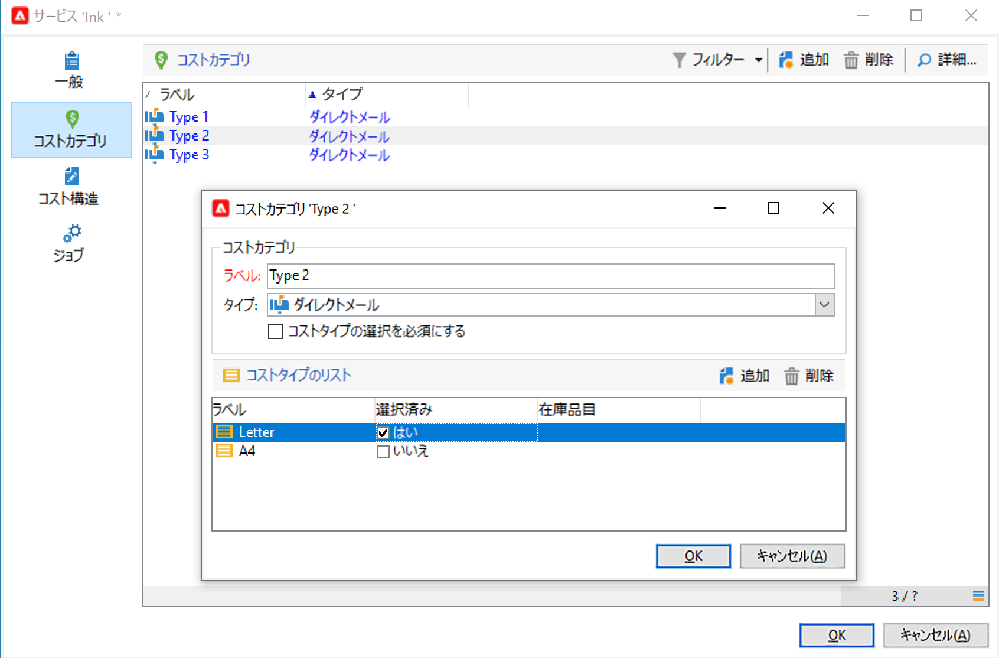

# プロバイダー、在庫、予算{#providers-stocks-and-budgets}

Adobe Campaign では、キャンペーン内で実行されるジョブに関与するサービスプロバイダーを定義できます。サービスプロバイダーに関する情報と、関連付けられたコスト構造は、Adobe Campaign 管理者がメインビューから定義します。サービスプロバイダーを配信から参照し、そのコスト構造を使用して、この配信に関連付けられたコストを計算したり、関連する在庫を管理したりできます。

## サービスプロバイダーとコスト構造の作成 {#create-service-providers-and-their-cost-structures}

各サービスプロバイダーは、連絡先詳細、サービステンプレート、関連ジョブと共にファイルに保存されます。

サービスプロバイダーは、Campaign エクスプローラーの&#x200B;**[!UICONTROL 管理／キャンペーン管理]**&#x200B;フォルダーで設定します。

配信時に実行されるジョブ（特にダイレクトメールとモバイルチャネルに関するジョブ）は、サービスプロバイダーが実行します。例えば、このサービスプロバイダーは、メッセージの印刷または配分を実行できます。このようなジョブには、サービスプロバイダーごとに固有の設定とコストが含まれます。サービスプロバイダーの設定には、以下の 4 つのステージがあります。

1. Adobe Campaign でのサービスプロバイダーの作成。[詳細情報](#add-a-service-provider)

1. 関連付けられたサービステンプレートのコストカテゴリと構造を定義します。[詳細情報](#define-cost-categories)

1. プロセスの設定。[詳細情報](#configure-processes-associated-with-a-service)。

1. キャンペーンレベルでのサービスプロバイダーの参照。[詳細情報](#associate-a-service-with-a-campaign)。

### サービスプロバイダーとコストカテゴリの作成 {#create-a-service-provider-and-its-cost-categories}

#### サービスプロバイダーの追加 {#add-a-service-provider}

配信に必要な数のサービスプロバイダーを作成できます。サービスプロバイダーの追加手順は次のとおりです。

1. サービスプロバイダーのリストの上の「**[!UICONTROL 新規]**」ボタンをクリックします。
1. ウィンドウの下部で、サービスプロバイダーの名前と連絡先詳細を指定します。

   

1. **[!UICONTROL 保存]**&#x200B;ボタンをクリックして、サービスプロバイダーをリストに追加します。

#### コストカテゴリの定義 {#define-cost-categories}

サービステンプレートを各サービスプロバイダーに関連付けることができるようになりました。これらのテンプレートで、まずコストカテゴリを定義し、必要に応じて、関連する在庫を定義する必要があります。その後、コスト構造から、カテゴリごとにコスト計算ルールを作成することができます。[詳細情報](#define-the-cost-structure)。

コストカテゴリは、配信の種類（メール、ダイレクトメール、SMS など）に応じた一連のコストを含むエンティティです。コストカテゴリは、サービスプロバイダーに関連付けられているサービスのテンプレートにまとめられます。各サービスプロバイダーは、1 つ以上のサービステンプレートを参照できます。

サービステンプレートを作成してそのコンテンツを定義するには、以下の手順を実行します。

1. サービスプロバイダーの「**[!UICONTROL サービス]**」タブで「**[!UICONTROL 追加]**」ボタンをクリックし、サービステンプレートの名前を入力します。

   

1. プロセスのタイプ（ダイレクトメール／電子メールなどによる配信またはタスク）ごとにコストカテゴリを作成します。これを行うには、「**[!UICONTROL コストカテゴリ]**」タブをクリックしてから「**[!UICONTROL 追加]**」ボタンをクリックして、各コストカテゴリのパラメーターを入力します。

   

   * このコストカテゴリのラベルを入力して、該当するプロセスのタイプ（**[!UICONTROL ダイレクトメール]**、**[!UICONTROL メール]**、**[!UICONTROL モバイル]**&#x200B;など）を選択します。
   * 「**[!UICONTROL 追加]**」ボタンをクリックして、このカテゴリに関連付けるコストのタイプを定義します。
   * 必要に応じて、在庫品目を各コストタイプと関連付け、使用する数量が既存の在庫に自動的に関連付けられるようにします。

      >[!NOTE]
      >
      >在庫品目は、**[!UICONTROL 在庫]**&#x200B;ノードで定義します。[詳細情報](#stock-and-order-management)。

1. このコストカテゴリの値は事前に選択できます。この値は、サービスプロバイダーのコストカテゴリで、デフォルトの値として（空の値の代わりに）使用されます。そのためには、該当するカテゴリのタイプの「**[!UICONTROL 選択済み]**」列で「**はい**」オプションを有効にします。

   

   配信レベルで、この値がデフォルトで選択されるようになります。

### コスト構造の定義 {#define-the-cost-structure}

コストタイプごとに、適用する計算ルールをコスト構造で指定します。

「**[!UICONTROL コスト構造]**」タブをクリックして、コストカテゴリおよびコストタイプごとにコスト計算を設定します。「**[!UICONTROL 追加]**」をクリックして、コスト構造を入力します。

* コスト構造を作成するには、メッセージのタイプと関連するコストカテゴリ、計算ルールを適用するコストのタイプをドロップダウンリストから選択します。これらのドロップダウンリストのコンテンツは、「**[!UICONTROL コストカテゴリ]**」タブで入力された情報です。

   コスト構造にラベルを割り当てる必要があります。デフォルトでは、配信の概要は&#x200B;**コストカテゴリ - コストのタイプ**&#x200B;になります。

   ただし、名前は変更できます。目的の値を「**[!UICONTROL ラベル]**」フィールドに直接入力してください。

* コスト計算の数式をウィンドウの下部で定義します。

   この数式は、（メッセージ数に関わらず）固定することも、メッセージ数に応じて計算することもできます。

   メッセージ数に依存する場合、コスト計算構造には「**[!UICONTROL 線形]**」、「**[!UICONTROL しきい値別の線形]**」または「**[!UICONTROL しきい値別の定数]**」を指定できます。

#### 線形構造 {#linear-structure}

メッセージの合計数に関わらず、メッセージ（またはメッセージ群）の金額が常に同じ場合は、「**[!UICONTROL 線形]**」を選択して、各メッセージのコストを入力します。

この金額をメッセージ群に適用する場合は、関連するメッセージ数を「**[!UICONTROL メッセージ数]**」フィールドで指定します。

#### しきい値別の線形構造 {#linear-structure-by-threshold}

金額を各メッセージのしきい値別に適用する場合は、**[!UICONTROL しきい値別の線形]**&#x200B;計算構造を定義する必要があります。このタイプのコスト構造では、例えばメッセージの合計数が 1～100 の場合は各メッセージのコストが 0.13 になり、100～1000 メッセージが送信される場合は 0.12 になり、1000 メッセージを超えると 0.11 になります。

設定は次のようになります。

しきい値を追加するには、リストの右側にある&#x200B;**[!UICONTROL 追加]**&#x200B;ボタンをクリックします。

#### しきい値別の定数構造 {#constant-structure-by-threshold}

最後に、メッセージの合計数に応じてコスト計算を設定できます。そのためには、**[!UICONTROL しきい値別の定数]**&#x200B;計算構造を選択します。例えば、1～100 メッセージに対してはコストが 12.00 の固定金額に設定され、101～1000 メッセージの配信には 100.00 に設定され、1000 メッセージを超えるあらゆる配信に対しては、合計数に関わらず、500.00 に設定されます。

### サービスに関連付けられたジョブの設定 {#configure-processes-associated-with-a-service}

「**[!UICONTROL ジョブ]**」タブで、サービスプロバイダーに関わるプロセスについての情報を関連付けることができます。このセクションでは、発送担当に送信する情報を設定できます。

* 「**[!UICONTROL ファイルの抽出]**」の手順では、このサービスを選択した場合に配信に使用されるエクスポートテンプレートを指定します。「**[!UICONTROL 抽出ファイル]**」フィールドに出力ファイルの名前を入力できます。フィールドの右側のボタンを使用して、変数を挿入できます。

* 「**[!UICONTROL 通知メール]**」セクションでは、ファイルの送信後にサービスプロバイダーに通知するためのテンプレートを指定できます。アラートメッセージと受信者のグループの作成に使用するテンプレートを選択します。

   デフォルトでは、通知メッセージ用の配信テンプレートは、**[!UICONTROL 管理／キャンペーン管理／テクニカル配信テンプレート]**&#x200B;フォルダーに保存されています。このフォルダーには、一般ビューからアクセスできます。

* 「**[!UICONTROL 後処理]**」の手順では、配信が承認された後に開始するワークフローを選択できます。ワークフローテンプレートを入力した場合、ワークフローインスタンスが自動的に作成され、承認が有効になるとすぐに実行されます。例えば、このワークフローで、処理のために抽出ファイルを外部サービスプロバイダーに送信できます。

### サービスとキャンペーンの関連付け {#associate-a-service-with-a-campaign}

サービスプロバイダーは、キャンペーン配信に関連付けられます。サービスプロバイダーは配信テンプレートで参照されて、このテンプレートから作成される配信でサービスを提供します。

サービスを選択すると、配信のタイプ（ダイレクトメール、電子メールなど）に対応するコストカテゴリが、定義済みの処理オプションと共に、中央のテーブルに自動的に表示されます。

>[!NOTE]
>
>サービスを選択してもコストカテゴリが表示されない場合は、このタイプの処理に対してコストカテゴリが定義されていなかったことを意味します。例えば、**[!UICONTROL 電子メール]**&#x200B;配信では、電子メールタイプのコストカテゴリが定義されていない場合、カテゴリは表示されず、サービスを選択しても効果はありません。

* ダイレクトメール配信では、設定ウィンドウからサービスを選択できます。

   

* モバイルチャネルでの配信または電話では、同じ選択モードが適用されます。
* E メール配信では、次の例のように、配信プロパティの「**[!UICONTROL 詳細設定]**」タブからサービスを選択します。

   

「**[!UICONTROL 追加料金の額]**」列を使用して、該当する配信またはタスクのコンテキストで、このカテゴリのコストを追加できます。

配信のコストカテゴリを定義するときに、選択を必須とするコストタイプを定義することができます。そのためには、「**[!UICONTROL コストタイプの選択を必須にする]**」を選択します。

## 在庫およびオーダー管理 {#stock-and-order-management}

アラートを処理し、補給品をトラッキングし、オーダーを開始するために、コストタイプを在庫品目に関連付けることができます。

在庫およびオーダー管理を Adobe Campaign で設定し、実行する配信の補給品が不十分な場合にオペレーターに警告する手順は次のとおりです。

1. 在庫の作成と関連サービスプロバイダーを参照します。。[詳細情報](#create-a-stock)。

1. 在庫品目を追加します。[詳細情報](#add-stock-lines)。

1. アラート発生時にオペレーターに通知します。[詳細情報](#alert-operators)。

1. 注文して供給します。[詳細情報](#orders)。

### 在庫管理 {#stock-management}

Adobe Campaign では、在庫がなくなった場合または最小しきい値に達した場合、オペレーターのグループに警告できます。在庫レベルには、ナビゲーション領域の「 **[!UICONTROL その他の選択肢]**」リンクを介して、「**[!UICONTROL キャンペーン]**」タブの「**[!UICONTROL 在庫]**」リンクからアクセスできます。

#### 在庫の作成 {#creating-a-stock}

新しい在庫を作成するには、次の手順に従います。

1. 在庫のリストの上の「**[!UICONTROL 作成]**」ボタンをクリックします。
1. 在庫のラベルを入力し、関連付けるサービスプロバイダーをドロップダウンリストから選択します。[詳細情報](#create-service-providers-and-their-cost-structures)。

#### 在庫品目の追加 {#add-stock-lines}

在庫は、様々な在庫品目で構成されます。在庫品目には、配信によって消費されるリソースの初期数量が含まれます。在庫品目ごとに、消費された数量、在庫数量、オーダーされた数量が表示されます。

在庫を作成する場合は、「**[!UICONTROL 在庫品目]**」タブをクリックして新しい品目を追加します。

在庫を作成したら、そのダッシュボードを使用して在庫品目の作成とモニタリングを行います。

「**[!UICONTROL 作成]**」ボタンをクリックして、新しい在庫品目を追加します。

* 最初の在庫数量を「**[!UICONTROL 初期在庫]**」フィールドに入力します。「**[!UICONTROL 消費済み]**」フィールドと「**[!UICONTROL 在庫あり]**」フィールドは、キャンペーンの進行に従って自動的に計算され、更新されます。

   

* 在庫をオーダーするようオペレーターに警告する必要があるしきい値を「**[!UICONTROL アラートレベル]**」フィールドに入力します。アラートレベルに達した場合、この在庫を使用する配信の承認ウィンドウに警告メッセージが表示されます。

#### 在庫とコストカテゴリの関連付け {#associate-a-stock-with-cost-categories}

サービスプロバイダーが指定された場合、サービスでは、次のように、在庫品目をコストカテゴリの 1 つで参照できます。

### 在庫トラッキング {#stock-tracking}

#### アラートオペレーター {#alert-operators}

配信で参照されている在庫が不十分になると、アラートが表示されます。例えば、抽出ファイルが承認されると、次のアラートが表示されます。

#### オーダー {#orders}

「**[!UICONTROL オーダー]**」サブタブで、現在のオーダーを表示し、新しいオーダーを保存できます。

オーダーを保存するには、ターゲットとする在庫品目を編集し、「**[!UICONTROL 追加]**」ボタンをクリックして、配信日とオーダーされた数量を指定します。

>[!NOTE]
>
>配信日になると、オーダーされた在庫品目が自動的に表示されなくなり、「**[!UICONTROL オーダー数量]**」フィールドに入力された数量が「**[!UICONTROL 監査]**」タブに追加されます。この数量が在庫数量に自動的に追加されます。

「**[!UICONTROL 消費]**」タブには、キャンペーンごとに使用された量が表示されます。このタブの情報は、実行された配信に応じて自動的に入力されます。該当するキャンペーンを開くには、「**[!UICONTROL 編集]**」ボタンをクリックします。

## 予算の計算 {#calculate-budgets}

### 原則 {#principle}

配信およびキャンペーンに関するコストを管理します。進行状況に応じて、このコストが予算に割り当てられます。

キャンペーンの配信コストはキャンペーンレベルで統合され、プログラムを構成するすべてのキャンペーンのコストが、関連付けられているプログラムに渡されます。専用レポートで、プラットフォーム全体またはプランごとおよびプログラムごとの予算をトラッキングできます。

### 実装 {#implementation}

キャンペーンでは、予算を選択する際に、初期金額を入力する必要があります。計算されたコストは、入力された金額（発生した費用、想定される費用、予約済みの費用、割り当てられた費用）のコミットメントレベルに応じて、自動的に更新されます。

<!--
See [Calculating amounts](../../mrm/using/controlling-costs.md#calculating-amounts).

>[!NOTE]
>
>The procedure for creating budgets is presented in [Creating a budget](../../mrm/using/controlling-costs.md#creating-a-budget).
-->
