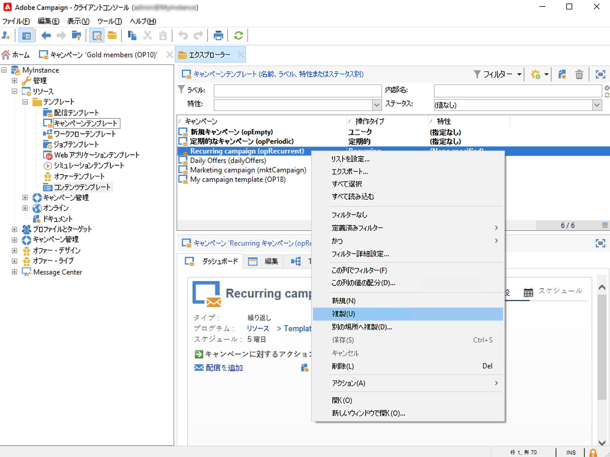
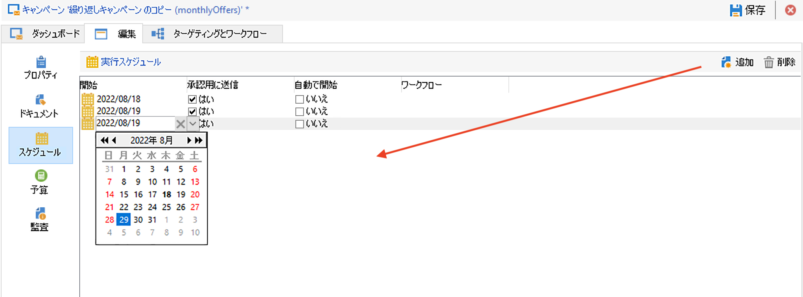
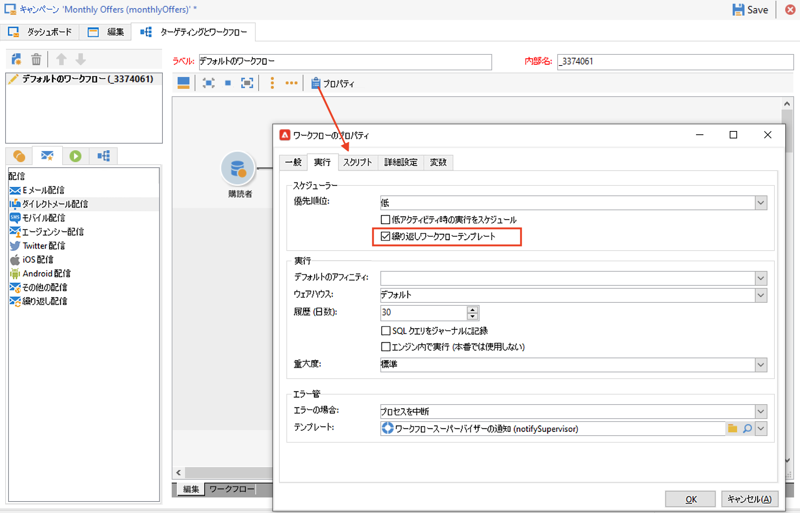
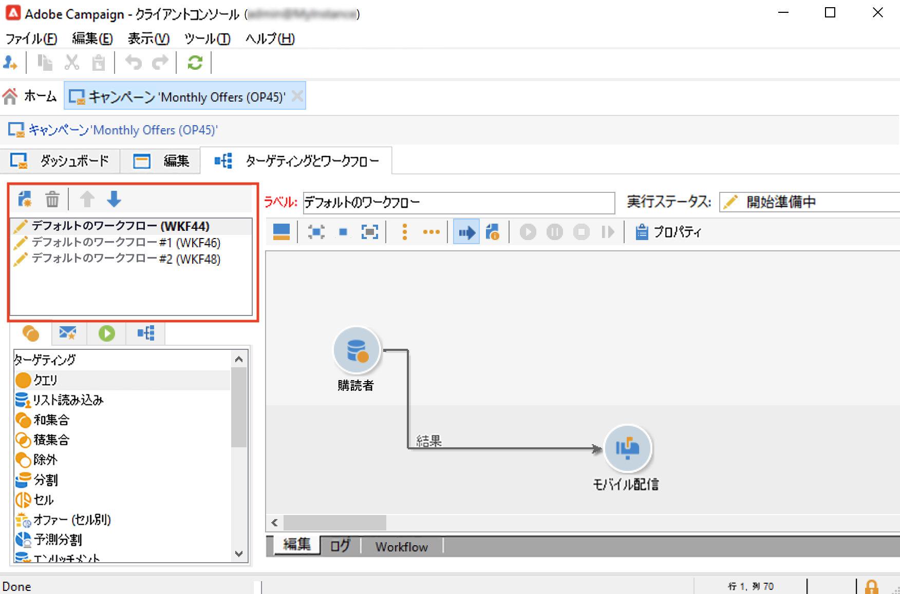
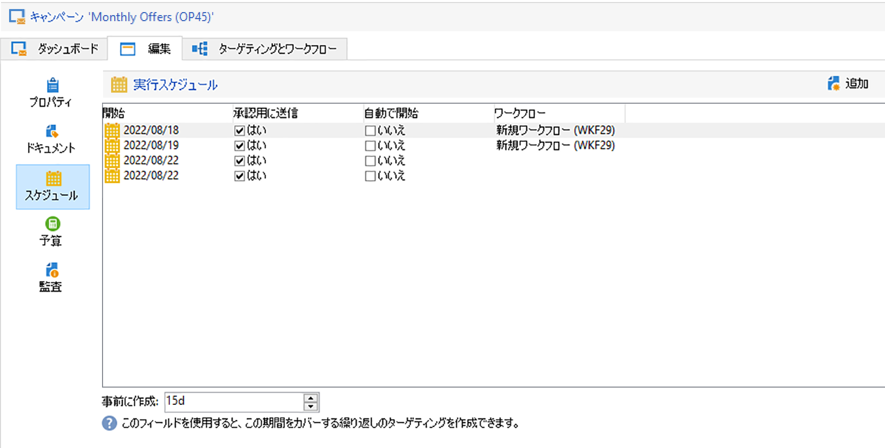

# 繰り返しキャンペーンと定期的なキャンペーン {#recurring-and-periodic-campaigns}

A **繰り返しキャンペーン** は、特定のテンプレートに基づくキャンペーンで、関連付けられたスケジュールに従って実行するようにワークフローが設定されています。 ターゲティングは実行ごとに複製され、各種プロセスとターゲット母集団がトラッキングされます。設定が完了すると、繰り返しキャンペーンは（ワークフローテンプレートを複製して）新しいワークフローを自動的に作成し、実行します。 例えば、オーディエンスセグメントに月別のリマインダーを送信する必要がある場合は、毎年の初めに 1 か月に 1 つの 12 個のワークフローを作成するように繰り返しキャンペーンを設定します。 [詳細情報](#create-a-recurring-campaign)

A **定期的キャンペーン** は、実行スケジュールに基づいてキャンペーンインスタンスを作成できる、特定のテンプレートをベースとするキャンペーンです。 キャンペーンインスタンスは、テンプレートスケジュールで定義された頻度に従って、定期的なキャンペーンテンプレートをベースとして自動的に作成されます。[詳細情報](#create-a-periodic-campaign)

## 繰り返しキャンペーンの作成 {#create-a-recurring-campaign}

繰り返しキャンペーンは、実行するワークフローテンプレートと実行スケジュールを定義した特定のテンプレートから作成します。

### 繰り返しキャンペーン用のテンプレートの作成 {#create-the-campaign-template}

繰り返しキャンペーン用のテンプレートを作成するには、次の手順に従います。

1. Campaign エクスプローラーを開き、次の場所を参照します。 **[!UICONTROL リソース/テンプレート/キャンペーンテンプレート]**.
1. 組み込みの **[!UICONTROL 繰り返しキャンペーン]** テンプレート。
   
1. テンプレートの名前とキャンペーン期間を入力します。
1. このタイプのキャンペーンの場合は、テンプレート実行スケジュールを作成するために、「**[!UICONTROL スケジュール]**」タブが追加されます。このタブを使用して、このテンプレートをベースとするキャンペーンの実行日を定義します。
   

   実行スケジュールの設定モードは、ワークフローの&#x200B;**[!UICONTROL スケジューラー]**&#x200B;オブジェクトと一致しています。[詳細情報](../workflow/scheduler.md)。

   >[!CAUTION]
   >
   >実行スケジュールの設定は慎重に実行する必要があります。 繰り返しキャンペーンは、指定されたスケジュールに従って、キャンペーンテンプレートのワークフローを複製します。この操作は、データベースを過負荷にする可能性があります。

1. 表示されている期間に対応するワークフローを作成するために、「**[!UICONTROL 事前に作成]**」フィールドに値を指定します。
1. 内 **[!UICONTROL ターゲティングとワークフロー]** 「 」タブでは、このテンプレートをベースとするキャンペーンで使用するワークフローテンプレートをデザインします。 このワークフローには、通常、ターゲティングパラメーターと 1 つ以上の配信が含まれます。

   >[!NOTE]
   >
   >このワークフローは、繰り返しワークフローテンプレートとして保存する必要があります。そのためには、ワークフローのプロパティを編集し、「**[!UICONTROL 実行]**」タブで「**[!UICONTROL 定期ワークフローテンプレート]**」オプションを選択します。

   

### 繰り返しキャンペーンの作成 {#create-the-recurring-campaign}

繰り返しキャンペーンを作成し、テンプレートで定義されたスケジュールに従ってワークフローを実行するには、次の操作が必要です。

1. 繰り返しキャンペーンテンプレートをベースとして、新しいキャンペーンを作成します。
1. ワークフロー実行スケジュールを、 **[!UICONTROL スケジュール]** タブをクリックします。 キャンペーンスケジュールを使用して、行ごとに自動ワークフロー作成または実行開始日を入力できます。

   行ごとに、以下のオプションを追加できます。

   * を有効にします。 **[!UICONTROL 承認待ち]** 配信承認リクエストをワークフローで強制的におこなうオプション。
   * を有効にします。 **[!UICONTROL 開始する]** オプションを使用して、開始日になったときにワークフローを開始できます。

   「**[!UICONTROL 事前に作成]**」フィールドを使用して、入力した期間を対象とするワークフローをすべて作成できます。

   **[!UICONTROL キャンペーンジョブ]**&#x200B;ワークフローの実行時に、キャンペーンスケジュールで定義された発生件数に基づいて専用ワークフローが作成されます。このようにして、実行日ごとにワークフローが作成されます。

1. 繰り返しワークフローは、キャンペーンに含まれるワークフローテンプレートから自動的に作成されます。繰り返しワークフローは、キャンペーンの「**[!UICONTROL ターゲティングとワークフロー]**」タブに表示されます。

   

   繰り返しワークフローインスタンスのラベルは、テンプレートラベルとワークフロー番号、その間の # 文字で構成されます。

   スケジュールから作成されたワークフローは、「**[!UICONTROL スケジュール]**」タブの「**[!UICONTROL ワークフロー]**」列で自動的にスケジュールに関連付けられます。

   

   各ワークフローはこのタブから編集できます。

   >[!NOTE]
   >
   >ワークフローと関連付けられたスケジュール行の開始日は、次の構文で、ワークフローの変数から取得できます。\
   >`$date(instance/vars/@startPlanningDate)`

## 定期的なキャンペーンの作成 {#create-a-periodic-campaign}

定期的なキャンペーンは、実行スケジュールに基づいてキャンペーンインスタンスを作成できる、特定のテンプレートをベースとするキャンペーンです。キャンペーンインスタンスは、テンプレートスケジュールで定義された頻度に従って、定期的なキャンペーンテンプレートをベースとして自動的に作成されます。

### キャンペーンテンプレートの作成 {#create-the-campaign-template-1}

1. Campaign エクスプローラーを開き、次の場所を参照します。 **[!UICONTROL リソース/テンプレート/キャンペーンテンプレート]**.
1. 組み込みの **[!UICONTROL 定期的なキャンペーン]** テンプレート。
1. テンプレートのプロパティを入力します。

   >[!NOTE]
   >
   >テンプレートを割り当てるオペレーターには、選択したプログラムでキャンペーンを作成するための適切な権限が必要です。

1. このテンプレートに関連付けるワークフローを作成します。このワークフローは、テンプレートが作成する各定期的キャンペーンで複製されます。

   >[!NOTE]
   >
   >このワークフローはワークフローテンプレートです。キャンペーンテンプレートからは実行できません。

1. 繰り返しキャンペーンテンプレートと同様に、実行スケジュールを入力します。「**[!UICONTROL 追加]**」ボタンをクリックして開始日と終了日を定義するか、リンクから実行スケジュールを入力します。

   >[!CAUTION]
   >
   >定期的なキャンペーンテンプレートは、上記で定義したスケジュールに従って、新しいキャンペーンを作成します。そのため、Adobe Campaign データベースがオーバーロードしないよう、慎重に入力する必要があります。

1. 実行開始日になると、対応するキャンペーンが自動的に作成されます。このキャンペーンには、キャンペーンテンプレートのすべての特性が適用されます。

   各キャンペーンは、テンプレートスケジュールから編集できます。

   それぞれの定期的なキャンペーンに、同じ要素が含まれます。作成された定期的なキャンペーンは、標準のキャンペーンとして管理されます。
