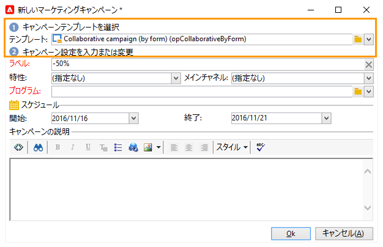
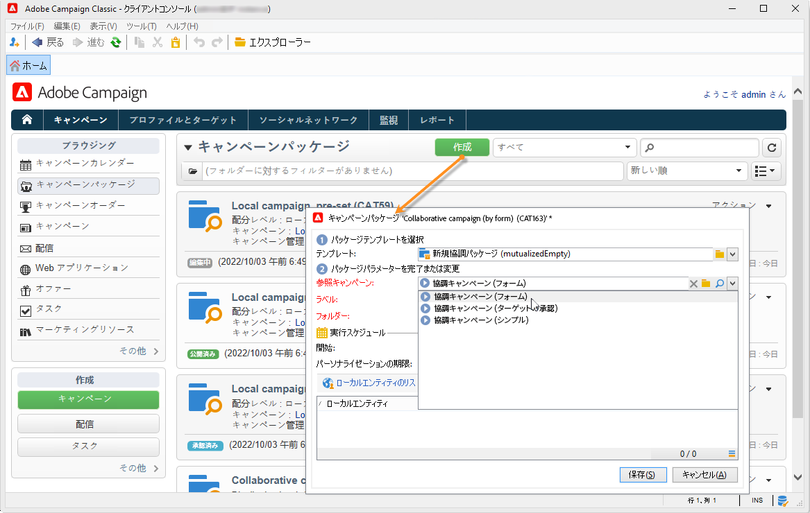
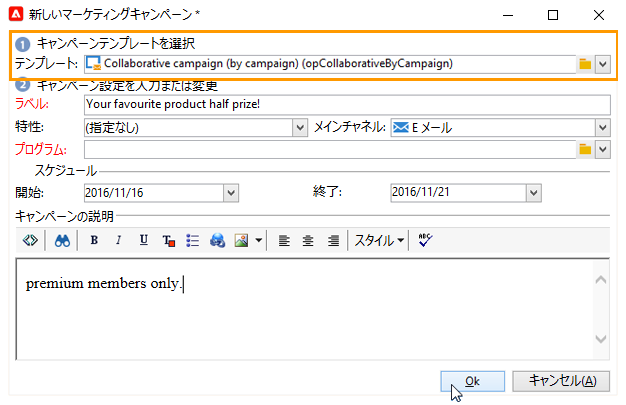
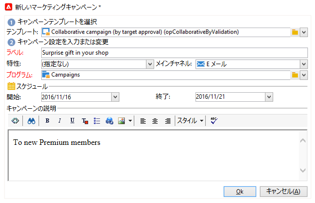
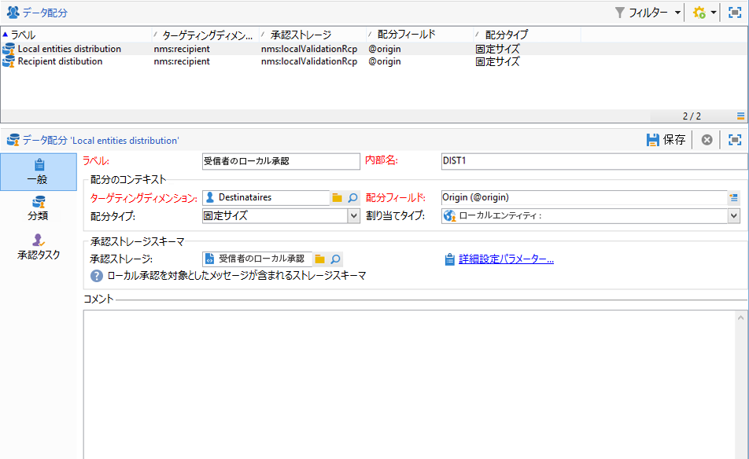
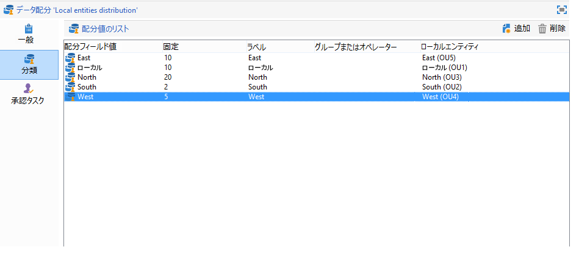
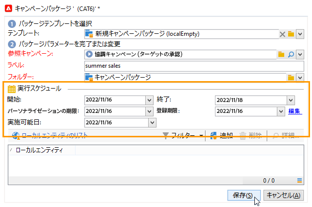
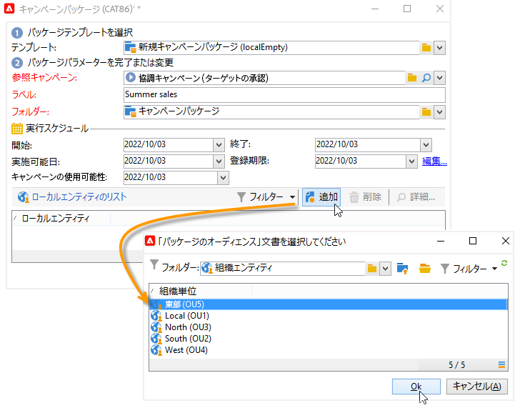
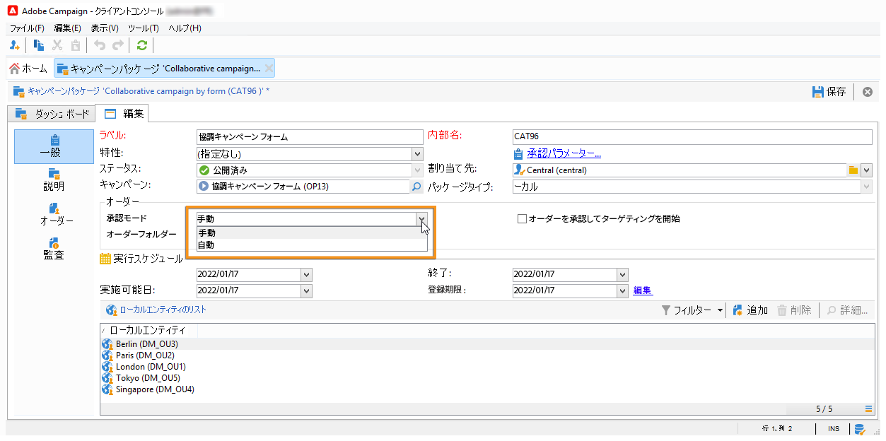
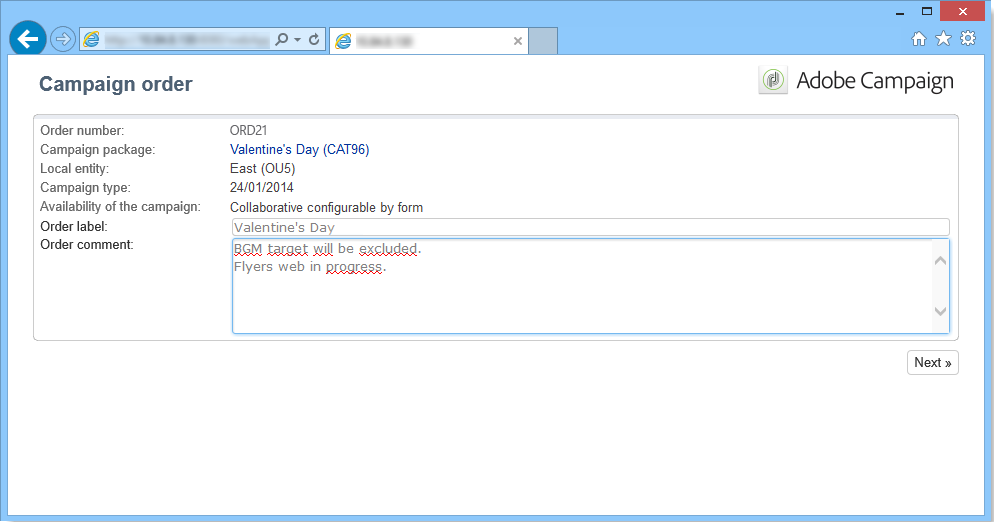

# 共同キャンペーンの作成{#creating-a-collaborative-campaign-intro}

セントラルエンティティは、**分散型マーケティング**&#x200B;のキャンペーンテンプレートから協調キャンペーンを作成します。[このページ](about-distributed-marketing.md#collaborative-campaign)を参照してください。

## 共同キャンペーンの作成 {#creating-a-collaborative-campaign}

協調キャンペーンを設定するには、**[!UICONTROL キャンペーン管理／キャンペーン]**&#x200B;ノードをクリックし、**[!UICONTROL 新規]**&#x200B;アイコンをクリックします。

>[!NOTE]
>
>**[!UICONTROL 協調キャンペーン（キャンペーン）]**&#x200B;以外の協調キャンペーンは、Web インターフェイスから設定および実行できます。

協調キャンペーンの設定プロセスは、ローカルキャンペーンのテンプレートの設定プロセスと類似しています。以下の節では、タイプごとに協調キャンペーンの作成について説明します。

### フォーム別 {#by-form}

協調キャンペーン（フォーム）を作成するには、**[!UICONTROL 協調キャンペーン（フォーム）]**&#x200B;テンプレートを選択します。

内 **[!UICONTROL 編集]** タブで、 **[!UICONTROL キャンペーンの詳細パラメーター…]** アクセスするリンク **分散型マーケティング** タブをクリックします。

**フォーム** Web インターフェイスを選択します。フォームのインターフェイスでは、キャンペーンのオーダー時にローカルエンティティが使用するパーソナライゼーションフィールドを作成できます。[ローカルキャンペーン（フォーム）の作成](examples.md#creating-a-local-campaign--by-form-)を参照してください。

キャンペーンを保存します。「**[!UICONTROL 作成]**」ボタンをクリックして、「**キャンペーン**」タブの **キャンペーンパッケージ**&#x200B;ビューから使用できるようになりました。

**[!UICONTROL キャンペーンパッケージ]**&#x200B;ビューでは、様々な組織エンティティ向けのキャンペーンを作成するために、ローカルキャンペーンテンプレート（標準提供のものまたは複製されたもの）のほか、協調キャンペーン用の参照キャンペーンを使用できます。

### キャンペーン別 {#by-campaign}

協調キャンペーン（キャンペーン）を作成するには、**[!UICONTROL 協調キャンペーン（キャンペーン）（opCollaborativeByCampaign）]**&#x200B;テンプレートを選択します。

ローカルエンティティは、キャンペーンをオーダーする前に、セントラルエンティティによって事前に定義された条件を満たし、キャンペーンを評価することができます。

**協調キャンペーン（キャンペーン）**&#x200B;のオーダーがセントラルエンティティによって承認されると、ローカルエンティティ用に子キャンペーンが作成されます。キャンペーンが使用可能になると、ローカルエンティティは以下の項目を変更することができます。

* キャンペーンワークフロー
* タイポロジルール
* パーソナライゼーションフィールド

ローカルエンティティは、子キャンペーンを実行します。セントラルエンティティは、親キャンペーンを実行します。

セントラルエンティティは、このダッシュボードから&#x200B;**[!UICONTROL リンクされたキャンペーンのリスト]**&#x200B;リンクを使用して、**協調キャンペーン（キャンペーン）**&#x200B;にリンクされている子キャンペーンをすべて表示できます。

### ターゲットの承認別 {#by-target-approval}

協調キャンペーン（ターゲットの承認）を作成するには、**[!UICONTROL 協調キャンペーン（ターゲットの承認）]**&#x200B;テンプレートを選択します。

>[!NOTE]
>
>このモードでは、セントラルエンティティはローカルエンティティを指定する必要はありません。

キャンペーンワークフローに、**ローカルの承認**&#x200B;タイプのアクティビティを組み込む必要があります。次のようなアクティビティパラメーターがあります。

* **[!UICONTROL 実行するアクション]**：ターゲットの承認通知。
* **[!UICONTROL 配分のコンテキスト]**：手動で指定。
* **[!UICONTROL データ配分]**：ローカルエンティティの配分。

**ローカルエンティティ配分**&#x200B;タイプのデータ配分を作成する必要があります。データ配分テンプレートを使用すると、グループ値のリストから抽出されるレコードの数を制限できます。**[!UICONTROL リソース／キャンペーン管理／データ配分]**&#x200B;で、「**[!UICONTROL 新規]**」アイコンをクリックして、新しい&#x200B;**[!UICONTROL データ配分]**&#x200B;を作成します。データ配分の詳細については、

**ターゲティングディメンション**&#x200B;と&#x200B;**[!UICONTROL 配分フィールド]**&#x200B;を選択します。「**[!UICONTROL 割り当てタイプ]**」で、「**ローカルエンティティ**」を選択します。

「**[!UICONTROL 配分]**」タブで、各ローカルエンティティのフィールドを追加し、値を指定します。

**配信**&#x200B;タイプのアクティビティの後に 2 つ目の&#x200B;**ターゲットの承認**&#x200B;を追加して、レポートを設定できます。

ローカルエンティティに送信されるキャンペーン作成の通知メッセージには、セントラルエンティティのパラメーターによって事前に定義された連絡先リストが含まれています。

ローカルエンティティは、キャンペーンのコンテンツに基づいて、一部の連絡先を削除できます。

### シンプル {#simple}

シンプルな協調キャンペーンを作成するには、**[!UICONTROL 協調キャンペーン (シンプル)]** テンプレートを選択します。

## 協調キャンペーンパッケージの作成 {#creating-a-collaborative-campaign-package}

ローカルエンティティにキャンペーンを提供するには、セントラルエンティティがキャンペーンパッケージを作成する必要があります。

次の手順に従います。

1. **キャンペーン**&#x200B;ページの&#x200B;**[!UICONTROL ナビゲーション]**&#x200B;セクションで、「**[!UICONTROL キャンペーンパッケージ]**」リンクをクリックします。
1. 「**[!UICONTROL 作成]**」ボタンをクリックします。
1. ウィンドウ上部のセクションで、**[!UICONTROL 新しい協調パッケージ（mutualizedEmpty）]**&#x200B;テンプレートを選択します。
1. 参照キャンペーンを選択します。
1. キャンペーンパッケージのラベル、フォルダーおよび実行スケジュールを指定します。

### 日付 {#dates}

キャンペーンは、定義された開始日から終了日までの期間、キャンペーンパッケージのリストに表示されます。

**協調キャンペーン**&#x200B;の場合は、セントラルエンティティが登録とパーソナライゼーションの期限を指定します。

>[!NOTE]
>
>「**[!UICONTROL パーソナライゼーションの期限]**」では、キャンペーンの設定に使用するドキュメント（スプレッドシート、画像）の提出期限を指定できます。ローカルエンティティは、この期限までにドキュメントを提出する必要があります。これは必須オプションではありません。この日付を指定しなくても、キャンペーンの実装に影響はありません。

### オーディエンス {#audience}

協調キャンペーンを作成したら、セントラルエンティティはキャンペーンごとに関係するローカルエンティティを指定する必要があります。

>[!CAUTION]
>
>**[!UICONTROL シンプル、フォーム、キャンペーンの協調キャンペーンキット]**&#x200B;は、ローカルエンティティが指定されていない場合、承認できません。

### 承認モード {#approval-modes}

**協調キャンペーン**&#x200B;では、オーダーの承認モードを指定できます。

手動モードの場合、ローカルエンティティは参加したいキャンペーンに登録する必要があります。

自動モードの場合、ローカルエンティティはキャンペーンに既に登録されています。ローカルエンティティは、登録をキャンセルしたり、セントラルエンティティの承認なしにパラメーターを変更したりできます。

### 通知 {#notifications}

通知の設定方法は、ローカルエンティティの通知の設定方法と同じです。[この節](creating-a-local-campaign.md#notifications)を参照してください。

## キャンペーンの注文 {#ordering-a-campaign}

協調キャンペーンがキャンペーンパッケージのリストに追加されると、セントラルエンティティによって定義されたオーディエンスに属するローカルエンティティに、通知が送信されます（オーディエンスを事前に定義しない&#x200B;**協調キャンペーン（ターゲットの承認）**&#x200B;は除きます）。送信メッセージには、以下の図のように、キャンペーンに登録するためのリンクが含まれています。

加えて、このメッセージでは、パッケージの作成者であるセントラルオペレーターによって入力された説明とキャンペーンにリンクされているドキュメントを表示することができます。これらの情報はキャンペーンに直接関係するわけではありませんが、参考情報として参照できます。

ローカルオペレーターは Web インターフェイスからログインし、オーダーする協調キャンペーンにパーソナライゼーションの情報を追加できます。

ローカルエンティティが登録を完了すると、セントラルエンティティにはオーダーの承認を依頼する通知が E メールで送信されます。

詳しくは、[承認プロセス](creating-a-local-campaign.md#approval-process)の節を参照してください。

## 注文を承認 {#approving-an-order}

協調キャンペーンパッケージのオーダー承認プロセスは、ローカルキャンペーンの承認プロセスと同じです。[この節](creating-a-local-campaign.md#approving-an-order)を参照してください。
