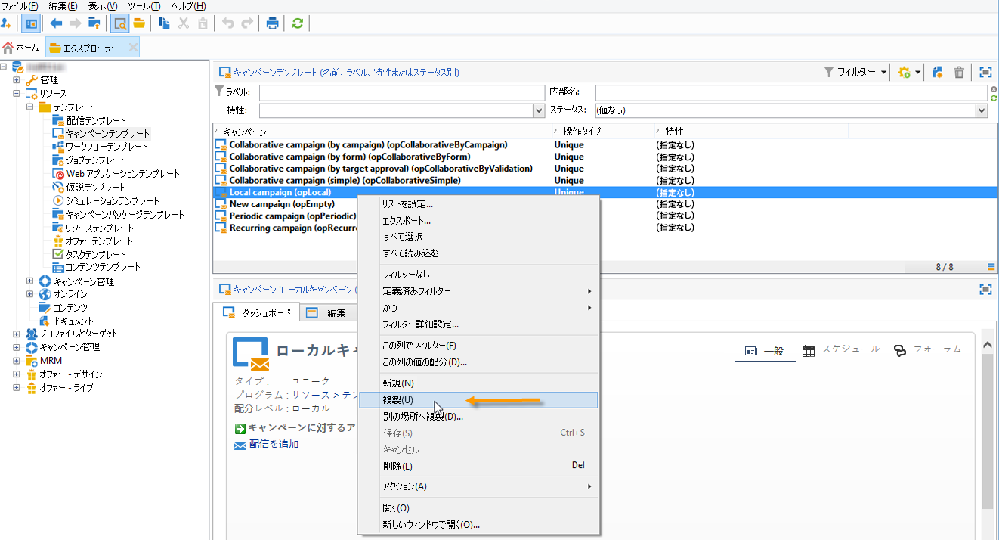

# ローカルキャンペーンの作成{#creating-a-local-campaign}

ローカルキャンペーンとは、**[!UICONTROL キャンペーンパッケージ]**&#x200B;のリストで参照されているテンプレートから作成されたインスタンスであり、**実行スケジュール**&#x200B;を指定できます。ローカルキャンペーンの目的は、セントラルエンティティによって設定されたテンプレートを使用して、ローカルのコミュニケーションのニーズを満たすキャンペーンを展開することです。ローカルキャンペーンの実装手順は、大きく以下の段階に分かれます。

**セントラルエンティティ**

1. ローカルキャンペーンのテンプレートを作成します。
1. テンプレートからキャンペーンパッケージを作成します。
1. キャンペーンパッケージをパブリッシュします。
1. オーダーを承認します。

**ローカルエンティティ**

1. キャンペーンをオーダーします。
1. キャンペーンを実施します。

## ローカルキャンペーンのテンプレートの作成 {#creating-a-local-campaign-template}

キャンペーンパッケージを作成するには、まず&#x200B;**[!UICONTROL リソース／テンプレート]**&#x200B;ノードに移動して、**キャンペーンのテンプレート**&#x200B;を作成する必要があります。

新しいローカルテンプレートを作成するには、デフォルトの&#x200B;**[!UICONTROL ローカルキャンペーン（opLocal）]**&#x200B;テンプレートの複製を作成します。

テンプレートに名前を付け、必要なすべてのフィールドに入力します。

キャンペーンウィンドウで「**[!UICONTROL 編集]**」タブをクリックし、「**[!UICONTROL キャンペーンの詳細パラメーター...]**」リンクをクリックします。

### Web インターフェイス {#web-interface}

「**分散型マーケティング**」タブでは、Web インターフェイスのタイプを選択し、ローカルエンティティがキャンペーンをオーダーする際に入力するデフォルト値とパラメーターを指定することができます。

Web インターフェイスは、キャンペーンのオーダー時にローカルエンティティが入力するフォームに対応します。

このテンプレートをベースとするキャンペーンに適用される、Web インターフェイスのタイプを選択します。

Web インターフェイスには、次の 4 つのタイプがあります。

* **[!UICONTROL 概要]**：ローカルエンティティは、キャンペーンの設定に関する説明を入力します。オーダーが承認されたら、セントラルエンティティがキャンペーン全体を設定および実行します。

   

* **[!UICONTROL フォーム]**：ローカルエンティティは Web フォームにアクセスでき、使用するテンプレートの設定に応じて、コンテンツ、ターゲット、最大サイズを編集できます。また、パーソナライゼーションフィールドを使用して、作成日や抽出日を編集することもできます。ローカルエンティティは、この Web フォームからターゲットを評価したり、コンテンツをプレビューしたりできます。

   

   ローカルエンティティに表示されるフォームは、web アプリケーションで指定します。この web アプリケーションは、テンプレートの「**[!UICONTROL キャンペーンの詳細パラメーター...]**」リンクをクリックしたあと、「**[!UICONTROL Web インターフェイス]**」フィールドのドロップダウンリストで選択する必要があります。[ローカルキャンペーンの作成（フォーム）](examples.md#creating-a-local-campaign--by-form-)を参照してください。

   >[!NOTE]
   >
   >この例で使用されている Web アプリケーションはサンプルです。フォームを使用するには、Web アプリケーションを作成する必要があります。こちらを参照してください。

   

* **[!UICONTROL 外部フォーム]**：ローカルエンティティは、エクストラネットの（Adobe Campaign 以外の）キャンペーンパラメーターにアクセスできます。これらのパラメーターは、**ローカルキャンペーン（フォーム）**&#x200B;のパラメーターと同一です。
* **[!UICONTROL プリセット]**：ローカルエンティティは、デフォルトのフォームを使用し、ローカライズせずにキャンペーンをオーダーします。

   

### デフォルト値 {#default-values}

ローカルエンティティが入力する&#x200B;**[!UICONTROL デフォルト値]**&#x200B;を選択します。次に例を示します。

* コンタクト日と抽出日
* ターゲットの特性（年齢セグメントなど）

「**[!UICONTROL 親マーケティングプログラム]**」と「**[!UICONTROL 請求]**」フィールドに入力します。

### 承認 {#approvals}

「**[!UICONTROL キャンペーンのエントリ用の詳細設定パラメーター]**」リンクから、レビュー担当者の最大数を指定できます。

レビュー担当者は、キャンペーンのオーダー時にローカルエンティティによって入力されます。

キャンペーンのレビュー担当者を指名しない場合は、「0」と入力してください。

### ドキュメント {#documents}

オーダーを作成するローカルエンティティオペレーターに対して、ローカルキャンペーンへのドキュメントのリンク（テキストファイル、スプレッドシート、画像、キャンペーンの説明など）を許可できます。「**[!UICONTROL キャンペーンのエントリ用の詳細設定パラメーター...]**」リンクを使用すると、リンクするドキュメントの数を制限できます。「**[!UICONTROL ドキュメント数]**」フィールドで、許可する最大数を指定してください。

キャンペーンパッケージをオーダーする際、フォームでは、テンプレートの「ドキュメント数」フィールドで指定されている数に応じてドキュメントをリンクできます。

ドキュメントのアップロードフィールドを表示しない場合は、「**[!UICONTROL ドキュメント数]**」フィールドに **[!UICONTROL 0]** を入力してください。

>[!NOTE]
>
>**[!UICONTROL キャンペーンのエントリ用の詳細設定パラメーター]**&#x200B;は、「**[!UICONTROL キャンペーンパラメーターの入力に使用するページを表示しない]**」をオンにすると、無効になります。

### ワークフロー {#workflow}

「**[!UICONTROL ターゲティングとワークフロー]**」タブで、「**[!UICONTROL キャンペーンの詳細パラメーター...]**」で指定された&#x200B;**[!UICONTROL デフォルト値]**&#x200B;を収集して配信を作成するキャンペーンワークフローを作成します。

**[!UICONTROL クエリ]**&#x200B;アクティビティをダブルクリックし、指定されている&#x200B;**[!UICONTROL デフォルト値]**&#x200B;に従ってクエリを設定します。

### 配信 {#delivery}

「**[!UICONTROL 監査]**」タブで、「**[!UICONTROL 詳細...]**」アイコンをクリックして、選択した配信の&#x200B;**[!UICONTROL スケジュール]**&#x200B;を表示します。

「**[!UICONTROL スケジュール設定]**」アイコンをクリックすると、配信のコンタクト日と実行日を設定できます。

必要に応じて、配信の最大サイズを設定します。

配信の HTML を特定します。例えば、**[!UICONTROL 配信／現在のオーダー ID／追加のフィールド]**&#x200B;にある「**[!UICONTROL 年齢セグメント]**」フィールドを使用すると、ターゲットの年齢に応じて配信を特定できます。

キャンペーンのテンプレートを保存します。「**[!UICONTROL 作成]**」ボタンをクリックして、「**[!UICONTROL キャンペーン]**」タブの&#x200B;**[!UICONTROL キャンペーンパッケージ]**&#x200B;ビューから使用できるようになりました。

>[!NOTE]
>
>キャンペーンのテンプレートと一般的な設定について詳しくは、こちらを参照してください。

## キャンペーンパッケージの作成 {#creating-the-campaign-package}

ローカルエンティティがキャンペーンのテンプレートを使用するには、テンプレートがリストに追加されている必要があります。そのためには、セントラルエージェントが新しいパッケージを作成する必要があります。

次の手順に従います。

1. **キャンペーン**&#x200B;ページの&#x200B;**[!UICONTROL ナビゲーション]**&#x200B;セクションで、「**[!UICONTROL キャンペーンパッケージ]**」リンクをクリックします。
1. 「**[!UICONTROL 作成]**」ボタンをクリックします。

   

1. ウィンドウ上に表示されるセクションで、[前述の手順](#creating-a-local-campaign-template)で作成したキャンペーンパッケージのテンプレートを選択します。

   デフォルトでは、ローカルキャンペーンには「**[!UICONTROL 新規キャンペーンパッケージ（localEmpty）]**」テンプレートが使用されます。

1. キャンペーンパッケージのラベル、フォルダーおよび実行スケジュールを指定します。

### 日付 {#dates}

キャンペーンは、定義された開始日から終了日までの期間、キャンペーンパッケージのリストに表示されます。

キャンペーンの使用可能な日付とは、ローカルエンティティがキャンペーンのオーダーを開始できる日付を指します。

>[!CAUTION]
>
>期限までにキャンペーンを予約しなかった場合、ローカルエンティティがそのキャンペーンを使用することはできません。

この情報は、以下の図のように、ローカルエージェントに送信される通知メッセージに記載されます。

### オーディエンス {#audience}

セントラルエンティティは、「**[!UICONTROL パッケージをローカルエンティティセットに制限]**」をオンにすることで、ローカルキャンペーンを使用するローカルエンティティを指定できます。

### その他の設定 {#additional-settings}

セントラルエンティティは、保存したパッケージを「**[!UICONTROL 編集]**」タブから編集することができます。

「**[!UICONTROL 一般]**」タブで、セントラルエンティティは、以下の操作を実行できます。

* 「**[!UICONTROL 承認パラメーター...]**」リンクから、キャンペーンパッケージのレビュー担当者を設定します。
* 実行スケジュールを確認します。
* ローカルエンティティを追加または削除します。

>[!NOTE]
>
>デフォルトでは、各エンティティが&#x200B;**ローカルキャンペーン**&#x200B;をオーダーできるのは 1 回のみです。
>   
>キャンペーンパッケージから複数のローカルキャンペーンを作成できるようにするには、「**[!UICONTROL 複数作成を有効にする]**」オプションをオンにしてください。

### 通知 {#notifications}

キャンペーンが使用可能になる、または登録の期限が切れると、ローカル通知グループのオペレーターにメッセージが送信されます。詳しくは、[組織エンティティ](about-distributed-marketing.md#organizational-entities)を参照してください。

## キャンペーンのオーダー {#ordering-a-campaign}

キャンペーンパッケージが承認され、実装期間に入ると、ローカルエンティティはパッケージにアクセスすることができます。ローカルエンティティには、新しいキャンペーンパッケージが使用可能な日付になりしだい、そのことを知らせる E メールが送信されます。

>[!NOTE]
>
>キャンペーンパッケージの作成時に特定のローカルエンティティが指定されている場合は、そのローカルエンティティにのみ通知が送信されます。ローカルエンティティが指定されていない場合は、すべてのローカルエンティティに通知が送信されます。

セントラルエンティティによって提供されたキャンペーンを使用するには、ローカルエンティティはキャンペーンをオーダーする必要があります。

キャンペーンをオーダーするには：

1. 通知メッセージの「**[!UICONTROL キャンペーンをオーダー]**」をクリックするか、Adobe Campaign の該当するボタンをクリックします。

   ID とパスワードを入力して、キャンペーンをオーダーします。インターフェイスは、Web アプリケーションで定義されている一連のページで構成されます。

   >[!NOTE]
   >
   >Web アプリケーションについて詳しくは、こちらを参照してください。

1. 最初のページで必要な情報（オーダーのラベルとコメント）を入力し、「**[!UICONTROL 次へ]**」をクリックします。

   

1. 必要なパラメーターをすべて指定したら、オーダーの承認を受けます。

1. ローカルエンティティが所属する組織エンティティのマネージャーに、オーダーの承認を依頼する通知が送信されます。

   

1. 承認の情報が、ローカルエンティティとセントラルエンティティに返されます。ローカルエンティティには、そのローカルエンティティのオーダーのみが表示されますが、セントラルエンティティには全ローカルエンティティのオーダーがすべて表示されます（以下の図を参照）。

   

   オペレーターは、オーダーの詳細を表示できます。

   

   「**[!UICONTROL 編集]**」タブには、キャンペーンのオーダー時にローカルエンティティによって入力された情報が表示されます。

   

1. オーダーが最終処理されるには、セントラルエンティティの承認が必要です。

   

   詳しくは、[承認プロセス](#approval-process)の節を参照してください。

1. キャンペーンが使用可能になったことがローカルオペレーターに通知されます。キャンペーンが使用可能かどうかは、「**キャンペーン**」タブ内のキャンペーンパッケージリストで確認できます。 これで、キャンペーンの使用が可能になりました。詳しくは、[キャンペーンへのアクセス](accessing-campaigns.md)を参照してください。

   「**[!UICONTROL オーダーを承認してターゲティングを開始]**」オプションを使用すると、ローカルエンティティはオーダーが承認されしだい、すぐにキャンペーンを実行できます。

   

## オーダーの承認 {#approving-an-order}

キャンペーンのオーダーを確定するには、セントラルエンティティがオーダーを承認する必要があります。

**[!UICONTROL キャンペーンオーダー]**&#x200B;概要（「 **キャンペーン**」タブからアクセス可能）では、キャンペーンオーダーのステータスを確認して承認することができます。

>[!NOTE]
>
>オーダーが承認されるまでは、ローカルエンティティはオーダーに変更を加えることができます。

### 承認プロセス {#approval-process}

#### メール通知 {#email-notification}

ローカルエンティティがキャンペーンをオーダーすると、レビュー担当者に以下のような E メールが送信されます。

>[!NOTE]
>
>レビュー担当者の選択について詳しくは、[レビュー担当者](#reviewers)の節で説明しています。レビュー担当者は、オーダーを許可または却下できます。

#### Adobe Campaign コンソールを使用した承認 {#approving-via-the-adobe-campaign-console}

オーダーの承認は、キャンペーンのオーダーの概要で、コンソールから実行することもできます。オーダーを承認するには、オーダーを選択して、「**[!UICONTROL オーダーを承認]**」をクリックします。

>[!NOTE]
>
>キャンペーンは、キャンペーンを使用可能な日まで編集および再設定が可能です。ローカルエンティティも、「**[!UICONTROL キャンセル]**」ボタンをクリックすれば、キャンペーンを却下できます。

#### キャンペーンの作成 {#creating-a-campaign}

キャンペーンのオーダーが承認されると、ローカルエンティティはキャンペーンを設定および実行できるようになります。

詳しくは、[キャンペーンへのアクセス](accessing-campaigns.md)を参照してください。

### 承認の却下 {#rejecting-an-approval}

承認を担当するオペレーターは、オーダーまたはキャンペーンパッケージを却下できます。

レビュー担当者がオーダーを却下すると、影響を受けるローカルエンティティに自動的に通知が送信されます。通知には、承認を却下したオペレーターのコメントが表示されます。

却下の情報は、キャンペーンパッケージのリストのページやキャンペーンのオーダーのページにも表示されます。Adobe Campaign コンソールにアクセスできるローカルエンティティは、コンソールで却下の情報を確認できます。

キャンペーンパッケージの「**[!UICONTROL 編集]**」タブで、コメントを表示できます。

### レビュー担当者 {#reviewers}

承認が必要になると、レビュー担当者に E メールで通知が送信されます。

ローカルエンティティごとに、キャンペーンのオーダーおよびキャンペーンを承認するレビュー担当者が選ばれます。ローカルエンティティのレビュー担当者の選択について詳しくは、[組織エンティティ](about-distributed-marketing.md#organizational-entities)を参照してください。

>[!NOTE]
>
>レビュー担当者は、オーダーの承認を有効にする前に選択する必要があります。

### オーダーのキャンセル {#canceling-an-order}

セントラルエージェントは、オーダーのダッシュボードにある「**[!UICONTROL 削除]**」ボタンを使用して、オーダーをキャンセルできます。

この操作により、**[!UICONTROL キャンペーンのオーダー]**&#x200B;ビューに表示されているキャンペーンがキャンセルされます。
