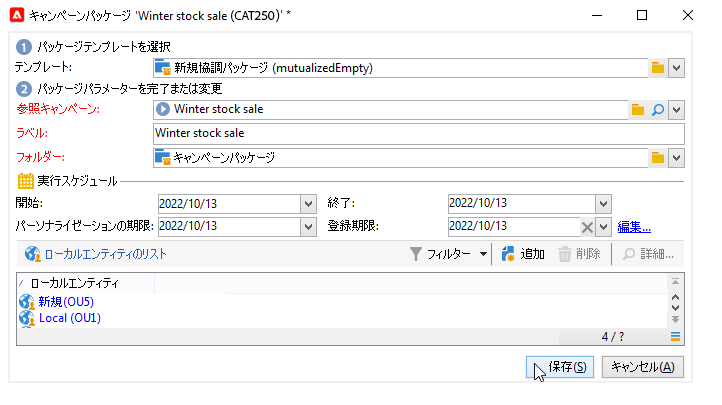

# 分散型マーケティングのサンプル{#distributed-marketing-samples}


## ローカルキャンペーン（フォーム）の作成 {#creating-a-local-campaign--by-form-}

**フォーム**&#x200B;タイプの Web インターフェイスを使用するには、**Web アプリケーション**&#x200B;を使用する必要があります。Web アプリケーションには、設定に応じて、パーソナライズされたあらゆる種類の定義済み要素を含めることができます。例えば、専用の API を使用して、ターゲット、予算、コンテンツなどを評価するリンクを提案できます。

>[!NOTE]
>
>API について詳しくは、専用ドキュメントを参照してください。。
>
>この例で使用する web アプリケーションは、Adobe Campaign に付属している web アプリではありません。キャンペーンでフォームを使用するには、専用の Web アプリケーションを作成する必要があります。

キャンペーンテンプレートの作成時に、「**[!UICONTROL キャンペーンの詳細パラメーター...]**」リンクの「**[!UICONTROL Web インターフェイス]**」オプションにある「**[!UICONTROL ズーム]**」アイコンをクリックして、web アプリケーションの詳細にアクセスします。


>[!NOTE]
>
>Web アプリケーションのパラメーターは、キャンペーンのテンプレートでのみ使用できます。

「**[!UICONTROL 編集]**」タブで、**キャンペーンのオーダー**&#x200B;アクティビティを選択して開き、内容を表示します。


この例では、**キャンペーンのオーダー**&#x200B;アクティビティに以下の内容が含まれています。

* オーダー時にローカルエンティティによって入力されるフィールド

   

* ローカルエンティティがキャンペーン（ターゲット、予算、コンテンツなど）を評価するためのリンク

   

* 評価の結果を計算および表示するスクリプト

   

この例では、次の API が使用されています。

* ターゲットの評価：

   ```
   var res = nms.localOrder.EvaluateTarget(ctx.localOrder);
   ```

* 予算の評価：

   ```
   var res = nms.localOrder.EvaluateDeliveryBudget(ctx.@deliveryId, NL.XTK.parseNumber(ctx.@compt));
   ```

* コンテンツの評価：

   ```
   var res = nms.localOrder.EvaluateContent(ctx.localOrder, ctx.@deliveryId, "html", resSeed.@id);
   ```

## 共同キャンペーンを作成（ターゲットの承認） {#creating-a-collaborative-campaign--by-target-approval-}

### はじめに {#introduction}

あなたは、オンラインストアのほか米国各地にブティックを展開する大手衣料品ブランドのマーケティングマネージャーです。春のスペシャルオファーとして、カタログに記載されているすべての衣料品をお得意様に 50％オフで提供することを計画しています。

このオファーの対象は、国内の店舗の上顧客、つまり今年に入って既に 3 万円以上の買い物をしている顧客です。

このオファーの提供にあたり、分散型マーケティングを活用して、協調キャンペーン（ターゲットの承認）を作成することにします。この協調キャンペーンでは、店舗の上顧客（地域別にグループ化）を選択して、スペシャルオファーを含む E メールを配信します。

この例の前半では、キャンペーンの作成通知を受け取ったローカルエンティティがどのようにキャンペーンを評価し、オーダーできるかについて説明します。

後半では、キャンペーンの作成方法について説明します。

手順は、以下のとおりです。

**ローカルエンティティ**

1. キャンペーンの作成通知を使用して、セントラルエンティティによって選択された連絡先のリストにアクセスします。
1. 連絡先を選択し、参加を承認します。

**セントラルエンティティ**

1. **[!UICONTROL データ配分]**&#x200B;アクティビティを作成します。
1. 協調キャンペーンを作成します。
1. キャンペーンをパブリッシュします。

### ローカルエンティティ側 {#local-entity-side}

1. キャンペーンの参加者として指定されているローカルエンティティにメール通知が届きます。

   

1. 「**[!UICONTROL 連絡先リストにアクセスしてターゲティングを承認]**」リンクをクリックすると、キャンペーン用に選択されている顧客のリストにローカルエンティティが Web ブラウザーでアクセスできるようになります。

   

1. ローカルエンティティは、今年の 1 月以降に類似したオファーを既に提供している連絡先のチェックを外して、リストから除きます。

   

連絡先の確認が終了すると、キャンペーンは自動的に開始されます。

### セントラルエンティティ側 {#central-entity-side}

#### データ配分アクティビティの作成 {#creating-a-data-distribution-activity}

1. 協調キャンペーン（ターゲットの承認）をセットアップするには、まず&#x200B;**[!UICONTROL データ配分アクティビティ]**&#x200B;を作成しなければなりません。**[!UICONTROL リソース／キャンペーン管理／データ配分]**&#x200B;ノードにある&#x200B;**[!UICONTROL 新規]**&#x200B;アイコンをクリックします。

   

1. 「**[!UICONTROL 一般]**」タブで、次の項目を指定します。

   * **[!UICONTROL ターゲティングディメンション]**：**受信者**&#x200B;に対して、**データ配分**&#x200B;が実行されます。
   * **[!UICONTROL 配分タイプ]**：「**固定サイズ**」または「**サイズ（割合）**」を選択できます。
   * **[!UICONTROL 割り当てタイプ]**：「**ローカルエンティティ**」オプションを選択します。
   * **[!UICONTROL 配分タイプ]**：受信者テーブルの&#x200B;**[!UICONTROL 接触チャネル（@origin）]**&#x200B;フィールドを選択して、連絡先とローカルエンティティの関係を指定します。
   * 「**[!UICONTROL 承認ストレージ]**」：「**受信者のローカル承認**」オプションを選択します。

1. 「**[!UICONTROL 分類]**」タブで、次の項目を指定します。

   * **[!UICONTROL 配分フィールド値]**：作成中のキャンペーンに参加するローカルエンティティに対応します。
   * **[!UICONTROL ラベル]**：ローカルエンティティのラベル
   * **[!UICONTROL サイズ]**（固定または割合）：**デフォルト値の 0** を指定すると、ローカルエンティティにリンクされているすべての受信者が選択されます。

   

1. 新しいデータ配分を保存します。

#### 共同キャンペーンの作成 {#creating-a-collaborative-campaign}

1. **[!UICONTROL キャンペーン管理／キャンペーン]**&#x200B;ノードで、新しい&#x200B;**[!UICONTROL 協調キャンペーン（ターゲットの承認）]**&#x200B;を作成します。
1. 「**[!UICONTROL ターゲティングとワークフロー]**」タブで、キャンペーンのワークフローを作成します。ワークフローには、**分割**&#x200B;アクティビティを含める必要があります。分割アクティビティの「**[!UICONTROL レコード数の制限]**」は、**[!UICONTROL データ配分]**&#x200B;アクティビティによって定義します。

   

1. **[!UICONTROL ローカルの承認]**&#x200B;アクションを追加して、次の項目を指定します。

   * 通知としてローカルエンティティに送信するメッセージの内容
   * 承認のリマインダー
   * 想定されるキャンペーンの処理.

   

1. レコードを保存します。

#### キャンペーンの公開 {#publishing-the-campaign}

「**[!UICONTROL キャンペーン]**」タブから&#x200B;**キャンペーンパッケージ**&#x200B;を追加できるようになりました。

1. **[!UICONTROL 参照キャンペーン]**&#x200B;を選択します。パッケージの「**[!UICONTROL 編集]**」タブでは、キャンペーンで使用する&#x200B;**[!UICONTROL 承認モード]**&#x200B;を選択できます。

   * **手動**&#x200B;モード：ローカルエンティティは、セントラルエンティティの招待を受け入れて、キャンペーンに参加します。ローカルエンティティは必要に応じて、あらかじめ選択されている連絡先を削除できます。キャンペーンへの参加を確定するには、マネージャーの承認が必要です。
   * **自動**&#x200B;モード：ローカルエンティティは、自分で登録を解除しない限り、キャンペーンに参加することが求められます。ローカルエンティティは、承認を受けずに連絡先を削除することができます。

   

1. 「**[!UICONTROL 説明]**」タブでは、キャンペーンの説明を入力し、ローカルエンティティに送信するドキュメントを追加できます。

   

1. キャンペーンパッケージを承認します。ワークフローを開始して、パッケージをパブリッシュし、パッケージのリストですべてのローカルエンティティが使用できるようにします。

   

## 共同キャンペーンの作成（フォームを使用）  {#creating-a-collaborative-campaign--by-form-}

### はじめに {#introduction-1}

あなたは、オンラインストアのほか米国各地に店舗を展開する大手化粧品ブランドのマーケティングマネージャーです。冬用の商品在庫を一掃して新しい商品を入荷するために、2 つの顧客グループをターゲットとするスペシャルオファーを計画しています。1 つは 30 代以上のグループで、年齢を意識したスキンケア商品を勧めます。もう 1 つは 30 代以下のグループで、基本的なスキンケア商品を勧めます。

このオファーの提供にあたり、分散型マーケティングを活用して、協調キャンペーン（フォーム）を作成することにします。この協調キャンペーンでは、年齢の範囲に基づいて複数の店舗の顧客を選択します。顧客には、年齢に応じてパーソナライズされたスペシャルオファーを含む E メールが配信されます。

この例の前半では、キャンペーンの作成通知を受け取ったローカルエンティティがどのようにキャンペーンを評価し、オーダーできるかについて説明します。

後半では、キャンペーンの作成方法について説明します。

手順は、以下のとおりです。

**ローカルエンティティ**

1. キャンペーンの作成通知を使用して、オンラインフォームにアクセスします。
1. キャンペーン（ターゲット、コンテンツ、配信のボリューム）をパーソナライズします。
1. これらのフィールドを確認し、必要に応じて変更します。
1. 参加を承認します。
1. ローカルエンティティ（またはセントラルエンティティ）のマネージャーが、設定と参加を承認します。

**セントラルエンティティ**

1. 協調キャンペーンを作成します。
1. ローカルキャンペーンの場合と同様に、「**[!UICONTROL キャンペーンの詳細パラメーター...]**」を設定します。
1. ローカルキャンペーンと同様に、キャンペーンワークフローと配信を設定します。
1. Web フォームを更新します。
1. キャンペーンパッケージを作成し、パブリッシュします。

### ローカルエンティティ側 {#local-entity-side-1}

1. キャンペーンの参加者として選択されているローカルエンティティに、キャンペーンへの参加を通知する E メールが送信されます。

   

1. ローカルエンティティは、パーソナライゼーションのフォームを完成させ、次の操作を実行します。

   * ターゲットと予算を評価します。
   * 配信コンテンツをプレビューします。
   * 参加を承認します。

      

1. オーダーの検証を担当するオペレーターが、参加を承認します。

   

### セントラルエンティティ側 {#central-entity-side-1}

1. 協調キャンペーン（フォームによる）を実装するには、**協調キャンペーン (フォームによる)** テンプレートを使用して、キャンペーンを作成する必要があります。

   

1. キャンペーンの「**[!UICONTROL 編集]**」タブで「**[!UICONTROL キャンペーンの詳細パラメーター...]**」リンクをクリックして、ローカルキャンペーンと同様に設定を行います。[ローカルキャンペーン（フォーム）の作成](#creating-a-local-campaign--by-form-)を参照してください。

   

1. キャンペーンワークフローと Web フォームを設定します。[ローカルキャンペーン（フォーム）の作成](#creating-a-local-campaign--by-form-)を参照してください。
1. 実行スケジュールおよび参加するローカルエンティティを指定して、キャンペーンパッケージを作成します。

   

1. 「**[!UICONTROL 編集]**」タブで承認モードを選択して、パッケージの設定を完了します。

   

1. 「**[!UICONTROL 説明]**」タブでは、キャンペーンパッケージの説明とパッケージのパブリッシュ時にローカルエンティティに送信する通知メッセージを入力したり、参考となるドキュメントをキャンペーンパッケージに添付したりできます。

   

1. パッケージを承認し、パブリッシュします。

   
