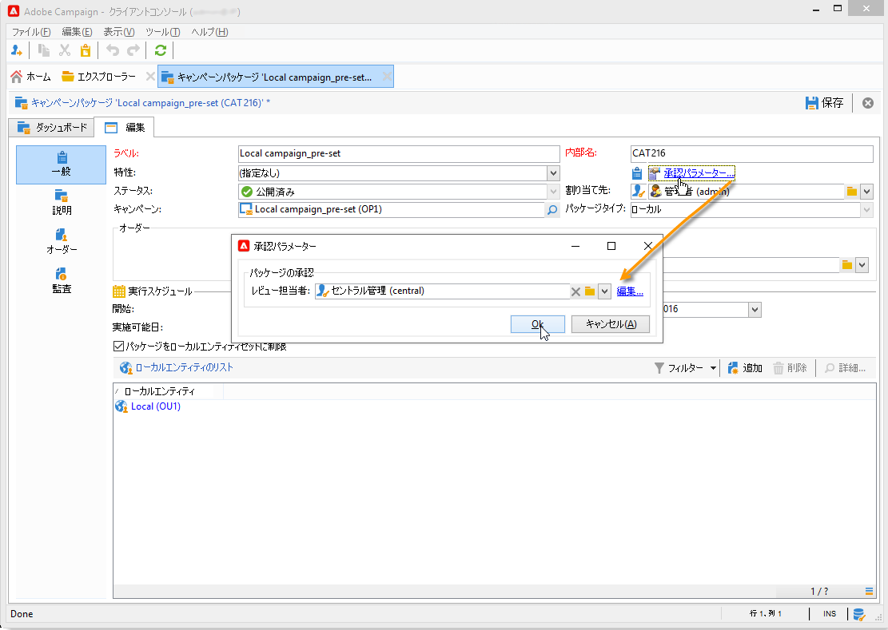
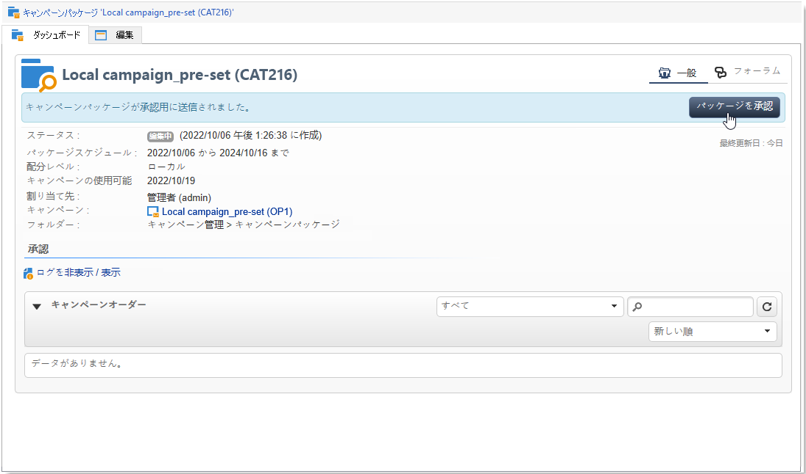
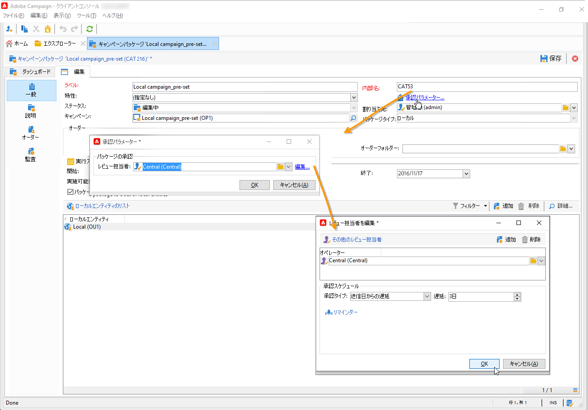
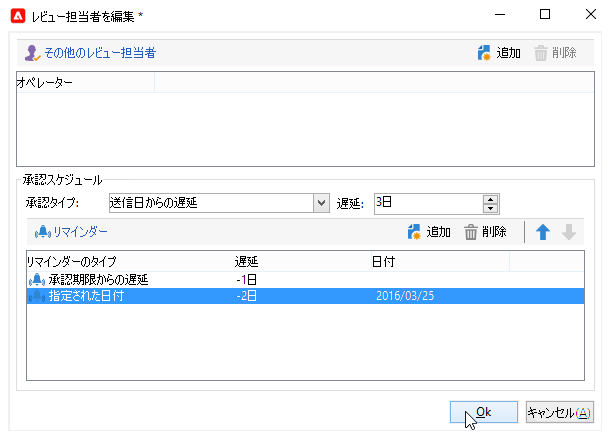
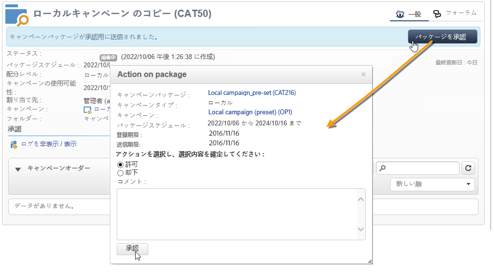

# キャンペーンパッケージの公開{#publishing-the-campaign-package}

セントラルエンティティのオペレーターは、ローカルエンティティに提供するキャンペーンを&#x200B;**[!UICONTROL キャンペーンパッケージのリスト]**&#x200B;にパブリッシュします。

キャンペーンパッケージのリストにパブリッシュできるのは、セントラルエンティティによって承認されたキャンペーンパッケージのみです。まずは、キャンペーンパッケージの「**[!UICONTROL 承認パラメーター]**」リンクからレビュー担当者またはレビュー担当者のグループを指定します。

## レビュー担当者の割り当て {#assigning-a-reviewer}

レビュー担当者を指定するには、キャンペーンパッケージの「**[!UICONTROL 承認パラメーター]**」リンクをクリックし、ドロップダウンリストからレビュー担当者を選択します。

「**[!UICONTROL パッケージを承認]**」をクリックして、承認プロセスを開始します。

メッセージがレビュー担当者に送信され、キャンペーンパッケージが使用可能になったことが通知されます。このメッセージには、Web アクセスを通じて承認を許可または却下するリンクが含まれています。

>[!NOTE]
>
>組織エンティティのレベルで、オーダーを承認するレビュー担当者を指定することもできます。詳しくは、[組織エンティティ](about-distributed-marketing.md#organizational-entities)を参照してください。

## 他のレビュー担当者の追加 {#adding-other-reviewers}

キャンペーンパッケージの「**[!UICONTROL 承認パラメーター...]**」タブにある「**[!UICONTROL 編集...]**」リンクを使用すると、他のレビュー担当者を追加できます。

## 承認期間 {#approval-periods}

デフォルトでは、レビュー担当者には登録日から 3 日間、承認を処理するための期間が与えられます。

レビュー担当者を編集ウィンドウでリマインダーを設定すると、キャンペーンパッケージの承認が実行されていない場合に 1 つ以上のメッセージを送信することができます。リマインダーを設定するには、「**[!UICONTROL リマインダーを追加]**」リンクをクリックして、「**[!UICONTROL 追加]**」ボタンをクリックします。

リマインダーは、指定する日に送信するか、登録日の **x** 日後に送信することができます。リマインダーのタイプは、リマインダーのテーブルの最初の列で設定できます。以下の例では、レビュー担当者には 2014 年 1 月 29 日（**[!UICONTROL 日付]**&#x200B;列で選択されている日付の 2 日前）にリマインダーメッセージが送信されます。さらに、承認期間が終了する 1 日前（登録日の 2 日後）にも 2 回目のリマインダーが送信されます。

承認の期間が定義され、パッケージの承認が申請されると、実行スケジュールが「**[!UICONTROL 監査]**」タブに表示されます。スケジュールには、現在の設定に基づいて算出された処理期限と設定されたすべてのリマインダーの日付が含まれます。

## Adobe Campaign コンソールを使用した承認 {#approving-via-the-adobe-campaign-console}

レビュー担当者が一人も指定されていないか、通知を受けたオペレーターが誰もパッケージを承認していない場合、「**[!UICONTROL パッケージを承認]**」ボタンを使用して、キャンペーンパッケージの&#x200B;**[!UICONTROL ダッシュボード]**&#x200B;またはパッケージの概要から直接、承認の段階に進むことができます。

承認が完了すると、キャンペーンはパブリッシュされ、リストに追加されます。使用可能な日付になると、ローカルエンティティはキャンペーンを使用できます。キャンペーンの作成時にローカルエンティティが指定されている場合は、通知グループのオペレーターにメッセージが送信され、キャンペーンが使用可能であることが通知されます。事前に指定されているエンティティが存在しない場合は、デフォルトで、すべてのローカルエンティティにキャンペーンが提供されます。詳しくは、[組織エンティティ](about-distributed-marketing.md#organizational-entities)を参照してください。
