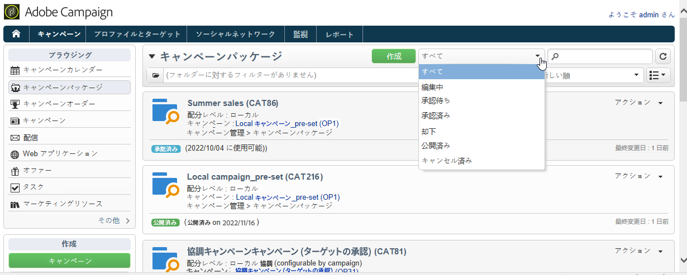
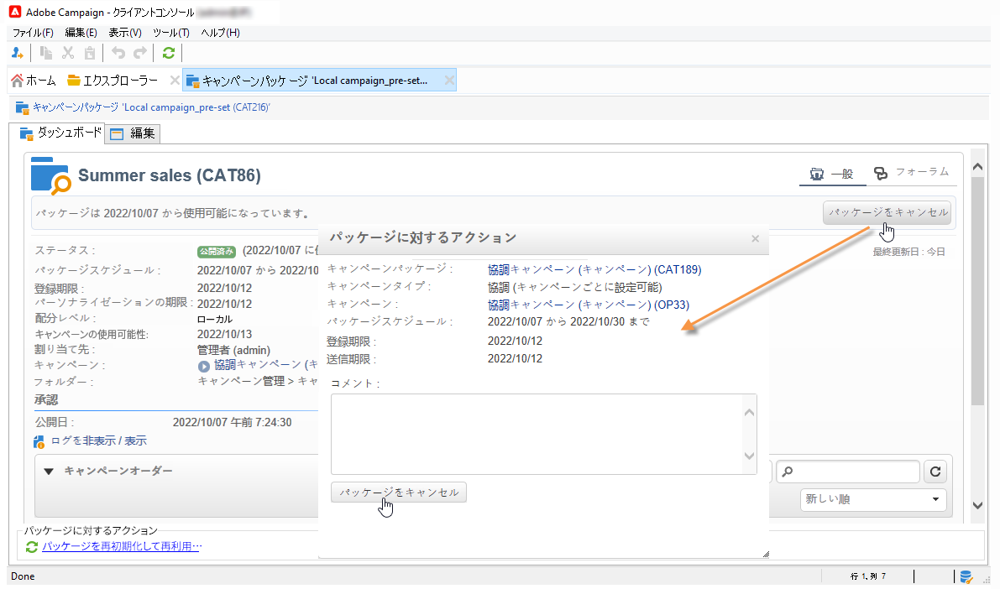
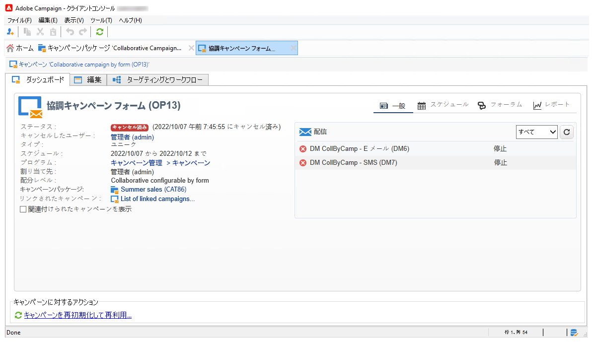
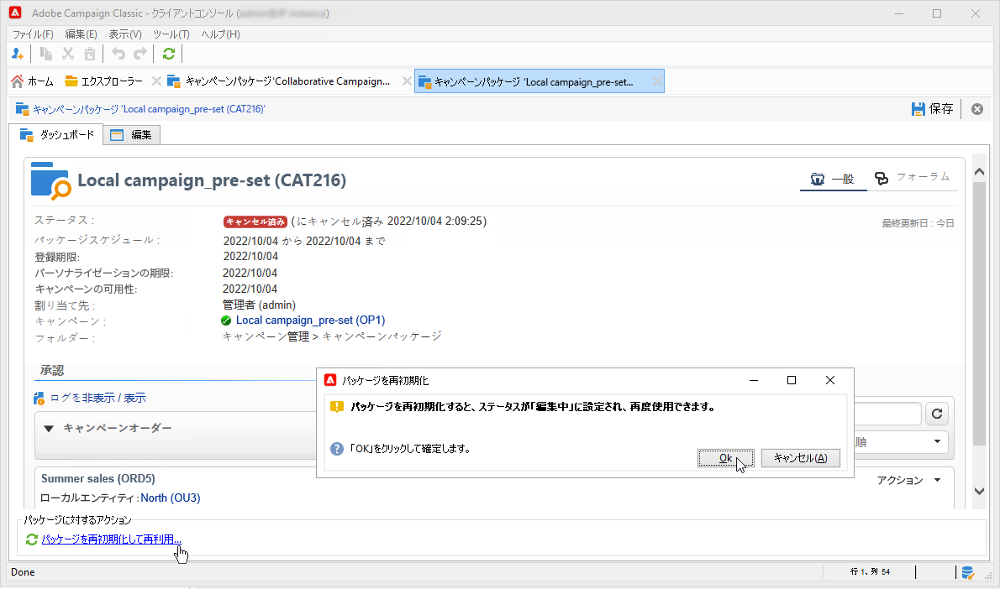
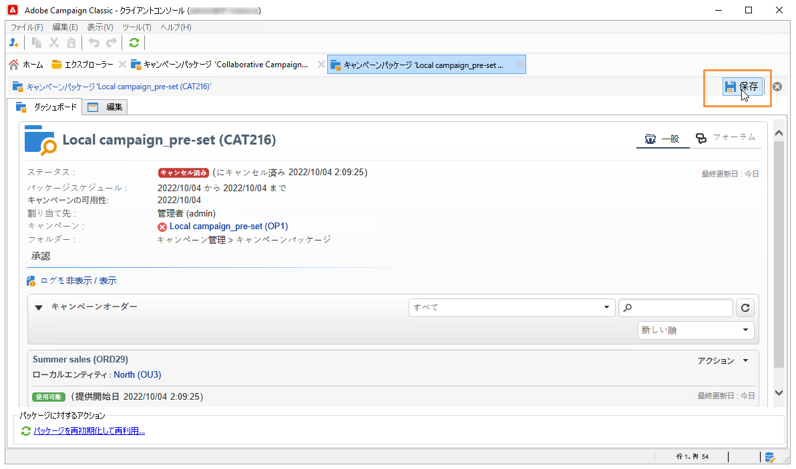

# キャンペーンのトラッキング{#tracking-a-campaign}

セントラルエンティティのオペレーターは、キャンペーンパッケージのリストに含まれているキャンペーンのオーダーをトラッキングできます。

トラッキングにより、以下の操作が可能です。

* [パッケージのフィルタリング](#filter-packages),
* [パッケージの編集](#edit-packages),
* [パッケージのキャンセル](#cancel-a-package),
* [パッケージの再初期化](#reinitializing-a-package)。

## パッケージのフィルタリング {#filter-packages}

「**[!UICONTROL キャンペーン]**」タブから、既存のすべての分散型マーケティングキャンペーンを再グループ化した&#x200B;**[!UICONTROL キャンペーンパッケージ]**&#x200B;リストを表示できます。 このリストをフィルタリングすると、公開済み、遅延、承認待ちなどの状態にあるキャンペーンのみを表示することが可能です。それには、このビューの上部にあるリンクをクリックするか、「**[!UICONTROL リストをフィルター]**」リンクを使用して、表示するキャンペーンパッケージのステータスを選択します。

## パッケージの編集 {#edit-packages}

**[!UICONTROL キャンペーンパッケージ]**&#x200B;ページでは、各パッケージの概要を表示できます。

概要には、ラベル、キャンペーンのタイプのほか、パッケージの作成元であるキャンペーン名、フォルダーの情報が含まれます。

編集するには、パッケージの名前をクリックします。ローカルエンティティ別またはステータス別に、オーダーを表示することもできます。

概要は、すべてのオーダーのリストが表示される&#x200B;**[!UICONTROL キャンペーンオーダー]**&#x200B;ビューでも参照できます。

セントラルオペレーターは、それには、次の 2 つの方法があります。

1. オペレーターはオーダーの名前をクリックして編集を実行します。オーダーの詳細が表示されます。

   

   **[!UICONTROL 編集／「一般」]**&#x200B;タブには、キャンペーンのオーダー時にローカルエンティティによって入力された情報が表示されます。

   

1. キャンペーンパッケージのラベルをクリックして編集を実行します。一部の設定の変更が可能です。

   

## パッケージのキャンセル {#cancel-a-package}

セントラルエンティティは、いつでもキャンペーンパッケージをキャンセルできます。

キャンペーンパッケージの&#x200B;**[!UICONTROL ダッシュボード]**&#x200B;で、「**[!UICONTROL パッケージをキャンセル]**」をクリックします。

「**[!UICONTROL コメント]**」フィールドにキャンセルの理由を入力します。

**ローカルキャンペーン**&#x200B;の場合は、使用可能なマーケティングキャンペーンのリストから、キャンセルされたパッケージが削除されます。

**協調キャンペーン**&#x200B;の場合は、パッケージをキャンセルすると、次の一連のアクションが実行されます。

1. このパッケージに関連付けられているオーダーが、すべてキャンセルされます。

   

1. 参照キャンペーンがキャンセルされ、アクティブなプロセス（ワークフローや配信）がすべて停止されます。

   

1. 関係するすべてのローカルエンティティに通知が送信されます。

   

セントラルエンティティは、必要であればキャンセルされたパッケージにアクセスし、再初期化することができます（次の節を参照）。再初期化されたパッケージは、承認され、使用が開始されれば、再びローカルエンティティに提供できます。パッケージの再初期化の手順については、次の節で説明します。

## パッケージの再初期化 {#reinitializing-a-package}

パブリッシュ済みのキャンペーンパッケージは、再初期化し、修正を加えて、再びローカルエンティティに提供することができます。

1. 再初期化するパッケージを選択します。
1. **[!UICONTROL パッケージを再初期化して再利用]**&#x200B;リンクをクリックし、「**[!UICONTROL OK]**」をクリックします。

   

1. 「**[!UICONTROL 保存]**」ボタンをクリックして、パッケージの再初期化を承認します。

   

1. パッケージのステータスが&#x200B;**[!UICONTROL 編集中]**&#x200B;に変わります。パッケージに修正を加え、承認し、パブリッシュすると、そのパッケージは再びキャンペーンパッケージのリストに表示されます。

>[!NOTE]
>
>キャンセルしたキャンペーンパッケージを再初期化することもできます。
