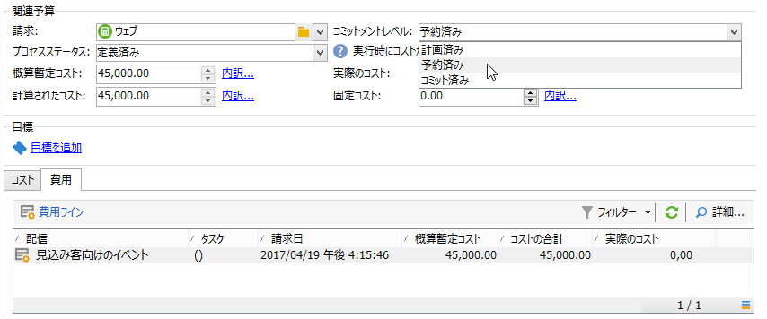

# コスト管理{#controlling-costs}

Adobe Campaign では、マーケティングリソース管理モジュールを使用して、予約済み、コミット済みおよび請求済みのマーケティングコストを管理し、カテゴリ別に分類できます。

キャンペーンの様々なプロセスにコミットされたコストは、マーケティング部門が事前に定義した予算に請求されます。情報をよりわかりやすく表示し、マーケティング投資をより詳細にレポートするために、金額を複数のカテゴリ別に分類することができます。

予算の管理とトラッキングは、Adobe Campaign ツリーの専用のノードで一元管理できます。このため、すべての予算の割り当て済み、予約済み、コミット済みおよび支出済みの金額を 1 つのビューから監視できます。

MRM を使用して予算管理を実装するには、次の手順に従います。

1. 予算を定義します。[詳細情報](#creating-a-budget)。

1. コスト計算方法の定義：サービスプロバイダーのコスト構造を定義します。 [詳細情報](../campaigns/providers--stocks-and-budgets.md)。

1. キャンペーンコスト（配信／タスク）の定義：配信およびタスクにかかるコストは、個別に入力することも、キャンペーンのテンプレートでグローバルに入力することもできます。[詳細情報](../campaigns/marketing-campaign-deliveries.md#compute-costs-and-stocks)。

1. 統合：コストは、タスク、配信およびキャンペーンの進捗状況ステータスに応じて計算され、対応する予算に紐付けられます。キャンペーンの作成が順調に進んでいる場合、キャンペーン予算の進捗状況ステータスを「**[!UICONTROL 定義済み]**」に変更することができます。プログラムの計算されたコストには、キャンペーンの計算されたコストが自動的に入力されます。[詳細情報](#cost-commitment--calculation-and-charging)。

## 予算の作成 {#creating-a-budget}

予算を作成するには、次の手順に従います。

1. Campaign エクスプローラーの&#x200B;**[!UICONTROL キャンペーン管理／予算]**&#x200B;フォルダーを参照します。
1. **[!UICONTROL 新規]**&#x200B;アイコンをクリックし、名前を付けて予算を保存します。
1. 初期金額の入力：該当するフィールドに割り当てる金額を指定します。その他の金額は自動的に入力されます。[詳細情報](#calculating-amounts)。
1. 開始日と終了日を入力して、有効期間を定義します。 この情報は単なる目安です。
1. キャンペーンやタスクなどの予算に割り当てられたコストのリンク先費用カテゴリを作成します。[詳細情報](#expense-categories)。

>[!NOTE]
>
>関連予算を選択できます。詳しくは、[この節](#linking-a-budget-to-another)を参照してください。

### 金額の計算 {#calculating-amounts}

各予算は初期金額で定義します。キャンペーン、配信、タスクの予約または実行後、この初期金額から関連する様々なキャンペーン、配信、タスクのコストが差し引かれます。金額のステータス（計画済み、予約済み、コミット、支出または請求済み）は、キャンペーン、配信またはタスクで定義したコストタイプとコミットメントレベルに依存します。

>[!NOTE]
>
>カテゴリに入力した金額は、「**[!UICONTROL 割り当て済み]**」フィールドで定義した予算金額に一致する必要があります。

キャンペーンの場合、コミットメントレベルに応じて、将来のアクション用にコストを計画、コミットまたは予約できます。

>[!CAUTION]
>
>実行時にコストが考慮されるようにするには、キャンペーンの作成時に「**[!UICONTROL 予算]**」の進捗状況ステータスを「**[!UICONTROL 定義済み]**」に設定する必要があります。ステータスが「**[!UICONTROL 編集中]**」の場合、コストは統合されません。
>   
>「**[!UICONTROL コミットメントレベル]**」オプションでは、予算を請求するまでのコストの今後の状態を指定します。キャンペーン、タスクまたは配信の進捗状況に応じ、コンボボックスを使用して、コミットメントレベル（1.計画済み、2.予約済み、3.コミット済み）を割り当てることができます。

例えば、Web キャンペーンの概算暫定コストが 45,000 ユーロだとします。

このキャンペーンで、予算作成ステータスを「**[!UICONTROL 定義済み]**」に設定すると、キャンペーンの実際のコスト（実際のコストがない場合は計算されたコスト）が予算の合計に使用されます。

キャンペーン予算のコミットメントレベルに応じ、「**[!UICONTROL 計画済み]**」、「**[!UICONTROL 予約済み]**」または「**[!UICONTROL コミット済み]**」フィールドに金額が入力されます。

コミットメントレベルは以下の場所で変更できます。

* **キャンペーン**&#x200B;レベルで変更する場合は、「**[!UICONTROL 編集]**」タブにある&#x200B;**[!UICONTROL 予算]**&#x200B;ウィンドウ。予算、コストおよび費用はここで設定します。
* **タスク**&#x200B;レベルで変更する場合は、**[!UICONTROL 費用と売上高]**&#x200B;ウィンドウ。

予算が「**[!UICONTROL 予約済み]**」の場合、請求された予算が自動的に更新されます。

タスクレベルでも手順は同様です。

支出により請求書が発行され、請求額が支払われると、その金額が「**[!UICONTROL 請求済み]**」フィールドに入力されます。

### 費用カテゴリ {#expense-categories}

データをよりわかりやすく表示し、マーケティング投資を詳細にレポートするために、金額を複数の費用カテゴリに配分することができます。費用カテゴリは、予算作成中にツリーの&#x200B;**[!UICONTROL 予算]**&#x200B;ノードで定義します。

カテゴリを追加するには、ウィンドウ下部にある「**[!UICONTROL 追加]**」ボタンをクリックします。

既存のカテゴリを選択することも、フィールドに直接入力して新しいカテゴリを定義することもできます。入力を確認すると表示される確認メッセージで、既存のカテゴリのリストにカテゴリを追加し、必要に応じて「特性」と関連付けることができます。この情報は予算レポートに使用されます。

### 別の予算への予算のリンク {#linking-a-budget-to-another}

予算をメイン予算にリンクすることができます。リンクするには、セカンダリ予算の「**[!UICONTROL 関連予算]**」フィールドでメイン予算を選択します。

メイン予算にタブが追加され、関連予算のリストが表示されます。

この情報は予算レポートでも使用されます。

## 費用ラインの追加 {#adding-expense-lines}

費用ラインは予算に自動的に追加されます。費用ラインは、配信分析中およびタスクの完了時に作成します。

各キャンペーン、配信またはタスクで、請求先の予算の費用ラインに発生したコストがグループ化されます。これらの費用ラインは、関係するサービスプロバイダーのコストラインに応じて作成され、関連するコスト構造を使用して計算されます。

このため、各費用ラインには、以下の情報が含まれます。

* 関連付けられているキャンペーンと配信またはタスク
* コスト構造から計算された金額または概算暫定コスト
* 関係する配信またはタスクの実際のコスト
* 対応する請求書ライン（MRM のみ）
* コストカテゴリにより計算されたコストのリスト（コスト構造が存在する場合）

上の例では、編集する費用ラインに、「**Loyalty Spring Pack**」キャンペーンの「**New cards**」の配信用に計算されたコストが含まれています。配信の編集時には、「**[!UICONTROL ダイレクトメール]**」タブで費用ラインの計算方法を確認できます。

この配信の場合、関係するサービスプロバイダーに選択したコストカテゴリに基づいてコストが計算されます。

選択したコストカテゴリに応じて、対応するコスト構造が適用され、コストラインが計算されます。この例では、関係するサービスプロバイダーに対し、以下に示すようなコスト構造が適用されます。

>[!NOTE]
>
>コストカテゴリとコスト構造について詳しくは、[このページ](../campaigns/providers--stocks-and-budgets.md#create-a-service-provider-and-its-cost-categories)を参照してください。

## コストのコミット、計算および請求 {#cost-commitment--calculation-and-charging}

コストは、配信およびタスクにコミットできます。コストが関連付けられているプロセスの進捗状況に応じて、コストのステータスが更新されます。

### コスト計算プロセス {#cost-calculation-process}

コストは以下の 3 つのカテゴリに分類されます。

1. 概算暫定コスト

   概算暫定コストは、キャンペーンのプロセスの概算コストです。編集が完了するまで、入力した金額は統合されません。入力した金額が計算に考慮されるようにするには、ステータスを「**[!UICONTROL 定義済み]**」にする必要があります。

   金額は手動で入力します。複数の費用カテゴリに内訳を入力することもできます。コストの内訳を入力するには、「**[!UICONTROL 内訳...]**」リンクをクリックし、「**[!UICONTROL 追加]**」ボタンをクリックして新しい金額を定義します。

   

   各コストをカテゴリに関連付けると、後で費用カテゴリ別のコストの内訳を関連予算および予算レポートで確認できます。

1. 計算されたコスト

   計算されたコストは、関係する要素（キャンペーン、配信、タスクなど）およびそのステータス（編集中、処理中、完了）に依存します。いずれの場合も、実際のコストが指定されている場合は、その金額が計算されたコストになります。

   実際のコストが入力されていない場合、以下のルールが適用されます。

   * キャンペーンが処理中の場合、計算されたコストにはキャンペーンの概算暫定コストが使用されます。概算暫定コストが定義されていない場合は、キャンペーンの配信とタスクのすべての暫定コストの合計が使用されます。キャンペーンが完了している場合、キャンペーンの計算されたコストはすべての計算されたコストの合計になります。
   * 配信が未分析の場合は、計算されたコストに概算暫定コストが使用されます。分析が完了している場合、計算されたコストはサービスプロバイダーのコスト構造とターゲット受信者の数を基に計算されたすべてのコストの合計になります。
   * タスクが処理中の場合は、計算されたコストに概算暫定コストが使用されます。タスクが完了している場合、計算されたコストはサービスプロバイダーのコスト構造と終了した日数を基に計算されたすべてのコストの合計になります。
   * マーケティングプランの場合は、プログラムの場合と同様、計算されたコストはキャンペーンの計算されたコストの合計になります。キャンペーンの計算されたコストが指定されていない場合は、概算暫定コストが使用されます。

   >[!NOTE]
   >
   >「**[!UICONTROL 内訳]**」リンクでは、計算の詳細と最後にコストを計算した日付を確認できます。

1. 実際のコスト

   実際のコストは手動で入力します。必要に応じて、様々な費用カテゴリに内訳を入力できます。

### 計算と請求 {#calculation-and-charging}

コストはコスト構造を使用して計算され、関係するキャンペーン、配信またはタスクで選択した予算に請求されます。

予算の承認を使用してキャンペーンにコミットされた金額のチェックを実行できます。その他の承認を設定する場合は、キャンペーンで追加のチェックポイントスタイルタスクを作成できます。[タスクのタイプ](creating-and-managing-tasks.md#types-of-task)を参照してください。

### 例 {#example}

以下を使用してキャンペーンを作成するとします。

* サービスプロバイダーのコスト構造を使用したダイレクトメール配信
* 固定コストのタスク
* 日次コストのタスク

#### 手順 1 - 予算の作成 {#step-1---creating-the-budget}

1. **[!UICONTROL キャンペーン管理／予算]**&#x200B;ノードで新しい予算を作成します。

1. 「**[!UICONTROL 金額]**」セクションの「**[!UICONTROL 割り当て済み]**」フィールドで 10,000 ユーロの予算を定義します。ウィンドウ下部で費用カテゴリを 2 つ追加します。

#### 手順 2 - サービスプロバイダーの設定とコスト構造の定義 {#step-2---configuring-the-service-provider-and-defining-the-cost-structures}

1. **[!UICONTROL 管理／キャンペーン]**&#x200B;ノードで、サービスプロバイダーとサービステンプレートおよびそのコスト構造を作成します。詳しくは、[この節](../campaigns/providers--stocks-and-budgets.md#create-a-service-provider-and-its-cost-categories)を参照してください。

   ダイレクトメール配信に、コストカテゴリ「**[!UICONTROL 封筒]**」（タイプ 114 x 229 と 162 x 229）、「**[!UICONTROL 送料]**」および「**[!UICONTROL 印刷]**」（タイプ A3 と A4）を作成します。以下のコスト構造を作成します。

   

1. （コストカテゴリで）固定コストを追加します。（対応するコスト構造で）計算は固定を指定し、金額は各配信に個別に指定するので空白のままにします。

   

   タスクに以下の 2 つのコストカテゴリを作成します。

   * 「**[!UICONTROL 部屋の予約]**」（小部屋と大部屋）：**固定**&#x200B;コスト構造の金額に 300 ユーロと 500 ユーロを指定します。

   

   * 「**[!UICONTROL 作成]**」（**コンテンツテンプレート**&#x200B;タイプ）：**日次**&#x200B;コスト構造に 300 ユーロを指定します。

   

#### 手順 3 - キャンペーンでの予算請求 {#step-3---charging-the-budget-in-the-campaign}

1. キャンペーンを作成し、手順 1 で作成した予算を選択します。

   >[!NOTE]
   >
   >デフォルトでは、プログラムに予算を選択すると、プログラム内のすべてのキャンペーンに適用されます。

   

1. 概算暫定コストを指定し、以下のように内訳を指定します。

   

1. 「**[!UICONTROL OK]**」をクリックしてから、「**[!UICONTROL 保存]**」をクリックして情報を確認します。計算されたコストが概算暫定コストで更新されます。

#### 手順 4 - ダイレクトメール配信の作成 {#step-4---creating-the-direct-mail-delivery}

1. キャンペーンのワークフローを作成し、クエリアクティビティの位置付けを指定してターゲットを選択します（受信者の住所を指定する必要があります）。

1. ダイレクトメール配信を作成し、手順 2 で作成したサービスプロバイダーを選択します。コストカテゴリが自動的に表示されます。

1. 封筒のコストを上書きし、固定コストを追加します。これらのコストに関連するカテゴリも選択します。

   

   >[!NOTE]
   >
   >使用されていないコストカテゴリがある場合、費用は生成されません。

1. 作成したワークフローを開始し、分析を開始してコストを計算します。

   

1. キャンペーンで予算の承認が有効になっている場合は、ダッシュボードから予算を承認します。コストカテゴリの承認を確認できます。

   

キャンペーンの「**[!UICONTROL 編集／予算]**」タブに配信の費用ラインが追加されます。編集して計算の詳細を確認します。

配信の計算されたコストがこの情報で更新されます。

計算されたコストを編集すると、コストの内訳、およびコスト計算のステータスと日付を確認できます。

#### 手順 5 - タスクの作成 {#step-5---creating-tasks}

このキャンペーンに、[上記で作成した](#step-2---configuring-the-service-provider-and-defining-the-cost-structures)コスト構造を使用する 2 つのタスクを追加します。

追加するには、キャンペーンダッシュボードで「**[!UICONTROL タスクを追加]**」ボタンをクリックします。タスクに名前を付けて「**[!UICONTROL 保存]**」をクリックします。

1. タスクリストにタスクが追加されます。タスクを設定するには、編集する必要があります。

1. 「**[!UICONTROL プロパティ]**」タブで、サービスおよび対応するコストカテゴリを選択します。

   

1. 次に、タスクの&#x200B;**[!UICONTROL 費用と売上高]**&#x200B;アイコンをクリックし、概算暫定コストを指定します。

   

   タスクを保存すると、計算されたコストは概算暫定コストに入力した値になります。

   タスクを完了すると（「**[!UICONTROL 完了]**」ステータス）、計算されたコストが自動的に更新され、コスト構造に入力したとおり大部屋のコストになります。このコストも、内訳でこのカテゴリに表示されます。

1. 次に、同様の手順で 2 番目のタスクを作成します。スケジュールを 5 日間、コスト構造には上記で作成したコスト構造を指定します。

   

   タスクが完了すると、計算されたコストは関連するコスト構造の値になります。この例では、1,500 ユーロになります（300 ユーロ x 5 日）。

   

#### 手順 6 - キャンペーン予算のステータスの更新 {#step-6---update-the-campaign-budget-status}

キャンペーンを設定すると、キャンペーンのステータスを「**[!UICONTROL 定義済み]**」に設定して更新できます。キャンペーンの計算されたコストに、キャンペーンの配信とタスクの計算されたコストの合計が表示されます。

#### 予算の承認 {#budget-approval}

承認が有効になっている場合、キャンペーンダッシュボードに表示される専用のリンクを使用して予算を承認することができます。このリンクは、ターゲティングワークフローが開始され、ダイレクトメール配信の承認が必要になったときに表示されます。

その次に、リンクをクリックして承認または拒否することができます。また、このキャンペーンで通知が有効になっている場合は、通知メールのリンクを使用することもできます。

予算が承認され、配信が完了すると、専用のテクニカルワークフローによってコストが自動的にアップロードされます。

## オーダーと請求書 {#orders-and-invoices}

MRM のコンテキストでは、サービスプロバイダーの情報を含むオーダーを保存し、請求書を発行できます。これらのオーダーと請求書のライフサイクル全体は、Adobe Campaign のインターフェイスで管理できます。

### オーダーの作成 {#order-creation}

サービスプロバイダーの情報を含む新しいオーダーを保存するには、ツリーの **[!UICONTROL MRM／オーダー]**&#x200B;ノードをクリックし、**[!UICONTROL 新規]**&#x200B;ボタンをクリックします。

オーダー番号、サービスプロバイダーおよびオーダーの合計金額を指定します。

### 請求書の発行と追跡 {#issuing-and-tracking-invoices}

サービスプロバイダーごとに請求書を保存し、請求書のステータスおよび請求予算を定義できます。

請求書は、Adobe Campaign ツリーの **[!UICONTROL MRM／請求書]**&#x200B;ノードで作成、保存します。

請求書には、請求書ラインがあります。請求書ラインの合計では、金額が自動的に計算されます。これらのラインは、「**[!UICONTROL 請求書ライン]**」タブで手動で作成します。ラインをオーダーに関連付けると、情報がオーダーにアップロードされます。

各サービスプロバイダーの請求書は、プロファイルの「**[!UICONTROL 請求書]**」タブに表示されます。

「**[!UICONTROL 詳細]**」タブでは、請求書の内容を表示できます。

新しい請求書を作成するには、「**[!UICONTROL 追加]**」ボタンをクリックします。
