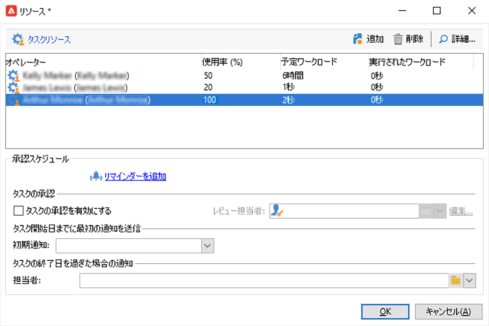

# タスクの作成と管理{#creating-and-managing-tasks}

Adobe Campaign では、タスクを作成し、タスクのライフサイクル全体をアプリケーション内で直接管理できます。プログラムとキャンペーンの実装をタスクに分割し、Adobe Campaign のオペレーターや外部サービスプロバイダーに割り当てることができます。このようにタスクを処理することで、あらゆるプログラム参加者と外部参加者を含むオープンなコラボレーション環境の構築が可能になります。

タスクは、タスクのリストまたはキャンペーンダッシュボードから作成、表示、監視できます。マーケティングプラン、プログラムおよびキャンペーンのスケジュールでタスクを表示、トラッキングすることも可能です。

タスクはキャンペーンに紐付いており、依存関係（関連タスクなど）も設定できます。各タスクにはステータス、優先度、推定ワークロードおよび関連コストがあります。

すべてのタスクは、「**キャンペーン** 」タブからアクセスできるリストにグループ化されています。 詳しくは、[タスクへのアクセス](#accessing-tasks)を参照してください。

所属するプログラムのスケジュールに表示できます。

## タスクへのアクセス {#accessing-tasks}

### タスクの表示 {#displaying-tasks}

タスクは、「**[!UICONTROL キャンペーン]**」タブからアクセスできるタスクリストに表示されます。

現在のオペレーターのすべてのタスクを表示できます。

詳しくは、[タスクの実行ステータス](#execution-status-of-a-task)および[タスクの進捗状況ステータス](#progress-status-of-a-task)を参照してください。

### タスクのフィルタリング {#filtering-tasks}

このビューを表示すると、 **現在のオペレータータスク**. ウィンドウ上部にあるフィールドを使用してタスクをフィルターすることもできます。

### タスクの編集 {#editing-tasks}

タスクを編集するには、タスクをクリックします。

## 新規タスクの作成 {#creating-a-new-task}

タスクを作成するには、次の手順に従います。

1. 次を参照： **[!UICONTROL タスク]** リンク **[!UICONTROL キャンペーン]** タブをクリックし、 **[!UICONTROL 作成]**.

   

1. タスクの名前を入力し、タスクのリンク先キャンペーンを選択します。
1. 開始日と終了日を設定します。
1. 「**[!UICONTROL 保存]**」をクリックして、タスクを作成します。

   

タスクはキャンペーンのダッシュボードでも作成できます。この場合、タスクはダッシュボードのキャンペーンに自動的にリンクされます。

作成したタスクは、キャンペーンスケジュール、キャンペーンダッシュボード、タスクのリストに追加されます。 タスクを編集するには、タスクのリストからタスクの名前をクリックするか、スケジュールまたはキャンペーンダッシュボードからタスクを選択して、「 **[!UICONTROL 開く]**.

作成後は、次の項目を定義してタスクを設定できます。

* 管理者と参加者。 [詳細情報](#manager-and-participants)
* 作成スケジュール。 [詳細情報](#execution-schedule)
* コミットされたコスト。 [詳細情報](#expenses-and-revenues)

また、 [レビュー担当者](#reviewers) および [参照ドキュメント](#documents-referenced).

タスクのライフサイクルについて詳しくは、 [この節](#life-cycle).

### 管理者と参加者 {#manager-and-participants}

デフォルトでは、タスクはタスクを作成したオペレーターに割り当てられます。 このオペレーターは、そのタスクにアクションが必要な場合に通知を受け取ります。

別の演算子を **[!UICONTROL 割り当て先]** 」ドロップダウンリストから選択できます。

>[!NOTE]
>
>オペレーターの管理について詳しくは、 [この節](../../v8/start/gs-permissions.md).
>
>タスクを閉じることができるのは、タスクを担当するオペレーターのみです。

タスクの実行に関わるオペレーターをさらに指定できます。 次のオペレーターはタスクを閉じることはできません。自分に割り当てられたタスクの承認のみを行うことができます。

タスクオペレーターを追加するには、次の手順に従います。

1. 次をクリック： **[!UICONTROL リソース]** アイコンをクリックします。

   

1. 「**[!UICONTROL 追加]**」をクリックしてオペレーターを選択します。
1. 使用率を入力します。タスクの実行期間中にオペレーターに割り当てられたワークロードを表します。 使用率は単なる目安で、パーセント単位で指定します。

   

   例えば、実行スケジュールが 10 日間のタスクの場合、オペレーターの使用率を 50％と指定すると、そのオペレーターは 10 日間、勤務時間の半分をタスクに費やすことになります。

   各オペレーターについて、予約済みワークロードと実際のワークロードを入力できます。この期間も、目安に過ぎません。

1. リマインダーを **[!UICONTROL リマインダーを追加…]** リンク。 タスクの終了日前に、タスクに関係するすべてのオペレーターに電子メール通知が送信されます。

   

1. タスクの開始前に通知を送信することもできます。 これを設定するには、 **[!UICONTROL 最初の通知]** フィールドに入力します。
1. 終了日に達し、タスクが閉じられていない場合、 **[!UICONTROL 担当者]** 」ドロップダウンリストに表示されます。

オペレーターダッシュボードでは、オペレーターのワークロード（処理中のその他のタスク）を確認できます。

### タスクの承認 {#reviewers}

参加者に加えて、タスクを閉じた後にタスクをレビューするオペレーターを定義することもできます。

これをおこなうには、 **[!UICONTROL タスクの承認を有効にする]** オプションを **[!UICONTROL リソース]** ウィンドウ レビュー担当者には、1 人のオペレーター、オペレーターのグループまたはオペレーターのリストを指定できます。

オペレーターのリストを指定するには、最初のレビュー担当者の右にある「**[!UICONTROL 編集...]**」リンクをクリックし、下に示すように、必要に応じて任意の数のオペレーターを追加します。

設定ウィンドウの下部のセクションで、タスクの承認スケジュールを定義できます。 デフォルトでは、レビュー担当者がタスクを承認できるのは送信日から 3 日間です。リマインダーを追加して、承認期限の前に関係するオペレーターに自動的に送信することもできます。

タスクの担当者は、他のオペレーターがレビューを担当している場合でも、自分自身にタスクのレビューを割り当てることができます。レビュー担当者が定義されていない場合は、タスクの担当者に通知が送信されます。**[!UICONTROL 管理者]**&#x200B;権限を持つ Adobe Campaign のその他すべてのオペレーターも、タスクを承認することができます。ただし、通知は受け取りません。

### 参照ドキュメント {#documents-referenced}

次の項目を追加できます。 [ドキュメントとマーケティングリソース](managing-marketing-resources.md) をタスクに追加します。

次の手順を実行します。

1. タスクを開き、 **[!UICONTROL ドキュメント]** アイコンをクリックします。

   

1. 「**[!UICONTROL 追加]**」をクリックし、タスクに追加するドキュメントを選択します。マーケティングリソースも同様に追加します。

参照ドキュメントは、タスクに関係するオペレーターに送信される通知に追加されます。 タスクダッシュボードにも追加されます。

### 実行スケジュール {#execution-schedule}

タスクの有効期間は、「**[!UICONTROL 開始]**」フィールドと「**[!UICONTROL 終了]**」フィールドに表示されます。予約済みの作業量は、その期間に実行されるワークロードを示します。ワークロードは日数と時間数で指定します。

>[!NOTE]
>
>タスクのライフサイクルについて詳しくは、[ライフサイクル](#life-cycle)を参照してください。

「**[!UICONTROL 実行されたワークロード]**」フィールドも、日数と時間数で指定します。予約済みワークロードに関係するタスクの進捗状況を手動で更新することができます。

タスクの&#x200B;**[!UICONTROL 進捗状況ステータス]**&#x200B;は、パーセンテージで表示されます。関係するオペレーターが実行したタスクに応じて自動的に更新されます。手動で入力することも可能です。

この情報はタスクダッシュボードに表示されます。

また、「キャンペーン」タブにも表示されます。

タスクの実行スケジュールの終了日になってもタスクが完了されていない場合、タスクは「**[!UICONTROL 遅延]**」になります。加えて、オペレーターに警告メッセージが表示されます。

詳しくは、[タスクの進捗状況ステータス](#progress-status-of-a-task)を参照してください。

### 費用と収益 {#expenses-and-revenues}

各タスクについて関連費用を定義し、売上高を予測できます。費用と売上高は、計算後、タスクが関連付けられているキャンペーンに統合されます。

この情報を指定するには、タスクツールバーの&#x200B;**[!UICONTROL 費用と売上高]**&#x200B;アイコンをクリックします。

デフォルトでは、請求される予算はタスクが関連付けられているキャンペーンの予算です。この予算はタスクの詳細に表示されます。

>[!NOTE]
>
>費用と予算について詳しくは、 [この節](../campaigns/providers--stocks-and-budgets.md#cost-commitment--calculation-and-charging).

ウィンドウでは達成目標も定義できます。目標にはタスクの予測売上高を入力します。

### サービスプロバイダー {#service-providers}

外部のサービスプロバイダーをタスクの管理に参加させることもできます。

サービスプロバイダーを追加するには、タスクプロパティを編集し、関係するサービスプロバイダーを選択します。ウィンドウの中央部にサービスプロバイダーに関連するコストカテゴリが自動的にリスト表示されます。

タスクの実行に関連するコストカテゴリを選択します。選択するには、コストのタイプを選択し、必要に応じて金額を追加します。

>[!NOTE]
>
>予算とコストの管理方法については、[コストの管理](controlling-costs.md)を参照してください。

サービスプロバイダーを選択すると、タスクダッシュボードに表示されるようになります。

### 遅延タスク {#late-tasks}

終了日になってもステータスが「**[!UICONTROL 完了]**」に変わらない場合、タスクは遅延となります。デフォルトでは、タスクが遅れた場合に警告を受信するオペレーターはいません。タスクに関係していないオペレーターも含め、すべてのオペレーターに通知が届くよう、E メール通知の配信を設定することができます。

「**[!UICONTROL リソース]**」ボックスに移動し、オペレーターを「**[!UICONTROL 担当者]**」フィールドに追加します。複数のオペレーターに通知を送信する場合は、オペレーターのグループを選択します。

### 最初の通知 {#initial-notifications}

開始日に達していないタスクを作成または修正すると、Adobe Campaign からタスクの担当者に開始日を通知する E メールを送信するオプションが表示されます。

もっとも、作成しているタスクの開始日がまだ当分先の場合、通知の送信をスケジュールしてタスクの開始前に通知するほうが良い場合もあります。例えば、タスクの開始日が 1 ヶ月先の場合、開始 1 週間前に担当者に通知することができます。

通知をスケジュールするには、「**[!UICONTROL リソース]**」ボックスの「**[!UICONTROL 初期通知]**」フィールドを使用します。

* キャンペーンのタスクの場合は、特定の日付と時間を選択します。
* キャンペーンテンプレートのタスクの場合は、通知時間はタスク開始までの残り時間を入力します（例えば、「**[!UICONTROL 初期通知]**」フィールドに「2」と入力すると、E メールはタスク開始日の 2 日前に送信されます）。

通知をスケジュールした場合も、タスクを保存すると、すぐに通知を送信するオプションが表示されます。その場で送信しても、設定した通知のスケジュールには影響しません。

### プログラムにリンクされたタスク {#task-linked-to-a-program}

プログラム内で直接タスクを作成すると、特定のキャンペーンではなく組織全体に関係するアクションを管理することができます（プログラム内の次期キャンペーンのテーマを検討する会議など）。タスクはプログラムスケジュールに表示されます。

プログラムに直接リンクされるタスクを作成するには、以下を実行します。

1. プログラムスケジュールを開きます。ホームページで、**[!UICONTROL キャンペーン／ブラウジング／その他／プログラム]**&#x200B;に移動します。ウィンドウの右側に全体的なプログラムスケジュールが開きます。
1. スケジュールで目的のプログラムをクリックすると、プログラムが表示されたウィンドウが開きます。
1. このウィンドウで、「**[!UICONTROL 開く]**」をクリックします。プログラムスケジュールが開きます。
1. スケジュールの右上にある「**[!UICONTROL 追加]**」ボタンをクリックし、「**[!UICONTROL タスクを追加]**」をクリックします。

### オペレーターの稼働状況 {#operator-availability}

タスクダッシュボードでオペレーター名の横にアイコンが表示される場合、そのオペレーターはタスクの期間中に別のタスクかイベントに既に取り組んでいることを示します。オペレーターが担当または関係しているタスクが、「**[!UICONTROL 割り当て先]**」フィールドまたはタスクの「**[!UICONTROL リソース]**」ボックスに表示されます。

### ワークフローのタスク {#task-in-a-workflow}

キャンペーンワークフローの「**[!UICONTROL タスク]**」要素を使用して、タスクが承認されているかどうかに応じて 2 種類のシナリオを定義できます。

キャンペーンワークフローでは、**[!UICONTROL タスク]**&#x200B;アクティビティは「**[!UICONTROL フロー制御]**」タブに表示されます。

## タスクのタイプ {#types-of-task}

キャンペーンでタスクを作成すると、特定のタイプのタスクを作成できます。タスクのタイプは選択したテンプレートに応じて定義されます。

以下のタスクを予約できます。

* [コントロールタスク](#control-tasks)
* [グループ化タスク](#grouping-task)
* [グループ化タスク](#grouping-task)
* [通知タスク](#notification-task)

>[!NOTE]
>
>**[!UICONTROL コントロールタスク]**&#x200B;と&#x200B;**[!UICONTROL グループ化]**&#x200B;タスクは、キャンペーンダッシュボードで&#x200B;**のみ**&#x200B;作成できます。\
>これらのタスクは担当オペレーターのタスクマップに表示されます。[タスクへのアクセス](#accessing-tasks)を参照してください。

### コントロールタスク {#control-tasks}

**[!UICONTROL コントロールタスク]**&#x200B;は、配信承認（ターゲティング、コンテンツ、抽出ファイル、予算または配達確認の承認）にリンクされます。

作成したコントロールタスクはキャンペーンダッシュボードに追加されます。

追加されたタスクは、編集してパラメーターを指定することができます。

### マーケティングリソース作成タスク {#marketing-resource-creation-task}

マーケティングリソース作成タスクは、マーケティングリソースの作成とパブリッシュの管理に使用できます。リソース自体ではなくタスクを使用してリソースを管理している場合は、以下のことができます。

* キャンペーンでのリソース作成プロセスの制御
* スケジュール内でのリソース作成プロセスの表示
* リソース作成プロセスの管理（リマインダー、通知）
* リソース作成に関連するコストの計算と制御
* タスクを使用したリソースの承認とパブリッシュ（関連オプションが有効になっている場合）

#### タスクとタスクにリンクされたリソース間のインタラクション {#interaction-between-the-task-and-its-linked-resource}

以下のように、マーケティングリソースの作成タスクと、タスクにリンクされたリソースとの間にはインタラクションがあります。

* リソース作成スケジュールおよびリンクされたコストは、タスクを使用して管理できます。
* オペレーターは、通常の操作（ダウンロードとアップロード、ロックとロック解除）と同様にリソースで作業できます。これらの操作はタスクに影響しません。
* リソースの承認とパブリッシュは、タスクを使用して実行できます。「**[!UICONTROL マーケティングリソースをパブリッシュ]**」オプションが有効になっている場合、リソースはタスクの完了後自動的に承認、パブリッシュされます。このオプションが有効になっていない場合、タスクとリソース間のインタラクションはありません。どちらか一方を操作しても、もう一方には影響しません。

   リンクされたタスクを使用して承認サイクル全体を定義できます。「**[!UICONTROL マーケティングリソースをパブリッシュ]**」オプションは、最後のタスクにのみ有効にします。これにより、すべてのタスクが完了して初めてリソースがパブリッシュされます。さらに、子マーケティングリソースタスクを作成すると、子タスクでリソースが自動的に選択されます。

   * **リソースを使用する場合**：リソースを承認用に送信したり承認したりしても、タスクに影響はありません。
   * **タスクを使用する場合**：タスクで「**[!UICONTROL マーケティングリソースをパブリッシュ]**」オプションが有効になっている場合、タスクが完了すると、リソースは承認され自動的にパブリッシュされます（上記を参照）。このオプションが有効になっていない場合は、タスクとリソースの間のインタラクションはありません。どちらか一方を操作しても、もう一方には影響しません。

#### マーケティングリソース作成タスクの設定 {#configuring-a-marketing-resource-creation-task}

タスクのレビュー担当者と、リソースで定義されたコンテンツのレビュー担当者は必ずしも同一人物ではありません。とはいえ、「**[!UICONTROL マーケティングリソースをパブリッシュ]**」オプションが有効になっている場合（下記を参照）、リソースはタスクの完了後に自動的に承認されるので、タスクのレビュー担当者（レビュー担当者が定義されていない場合はタスクマネージャー）がリソースコンテンツを承認することができます。

「**[!UICONTROL マーケティングリソース]**」フィールドで、タスクを使用して管理するリソースを定義します。次の操作をおこなうことができます。

* 既存のリソースの選択：ドロップダウンリストに「**[!UICONTROL 編集中]**」ステータスのすべてのリソースが表示されます。
* リソースの作成：**[!UICONTROL リンクを選択]**&#x200B;アイコンをクリックし、**[!UICONTROL 作成]**&#x200B;アイコンをクリックします。

「**[!UICONTROL マーケティングリソースをパブリッシュ]**」オプションを使用すると、自動的にリソースをパブリッシュできます。承認用に送信も承認もされていない場合や、リソースで定義されたコンテンツのレビュー担当者がタスクを完了したレビュー担当者と同一でない場合も、タスクが&#x200B;**[!UICONTROL 完了]**&#x200B;するとリソースのステータスは自動的に&#x200B;**[!UICONTROL パブリッシュ済み]**&#x200B;に変わります。

「**[!UICONTROL リソースを公開する]**」ボタンが使用可能になり、リソース公開のレビュー担当者は公開の準備が整ったことを知らせる通知メールを受け取ります。「**[!UICONTROL 編集／監査]**」タブに、レビュー担当者によるレビューとパブリッシュが表示されます。リソースの後処理ワークフローが定義されている場合は、この時点で実行されます。

### グループタスク {#grouping-task}

**[!UICONTROL グループ化タスク]**&#x200B;タイプのタスクでは、複数のタスクをグループ化し、進捗状況と承認の管理を同期することができます。

グループ化タスクに費用やリソースはリンクされません。

グループ化タスクでグループ化されたすべてのタスクは、グループ化タスクのダッシュボードに表示されます。このダッシュボードでは、確認したいタスクのみを表示するようタスクのリストをフィルターできます。

グループ化タスクには、グループ化したタスクを容易に作成できるリンクが用意されています。

任意のグループ化タスクを基にグループ化したタスクを作成するには、キャンペーンダッシュボードに移動し、グループ化タスクの名前をクリックして説明を表示してから、「**[!UICONTROL タスクを追加]**」をクリックします。

ただし、既に作成済みのタスクをグループ化タスクにリンクしたい場合は、「**[!UICONTROL プロパティ]**」ボックスの「**[!UICONTROL リンク先]**」フィールドも使用できます。

### 通知タスク {#notification-task}

通知タスクでは、（オペレーター、オペレーターのグループ、サービスプロバイダーなどへの）E メール配信をスケジュールできます。リマインダーをスケジュールして、例えば、キャンペーンがもうすぐ終了することをオペレーターに通知したり、オペレーターが準備できるようキャンペーンの開始前にドキュメントを送信したりできます。これにより、キャンペーンやプログラムのコミュニケーションを追跡し、実行されるアクションを詳細に把握できます。

#### ライフサイクル {#life-cycle}

通知タスクに承認は必要ありません。このため、通知タスクのライフサイクルは標準タスクよりも単純です。

通知タスクには以下のステータスがあります。

* **[!UICONTROL 予約済み]**：E メールの送信前
* **[!UICONTROL 処理中]**：E メールの送信後、終了日の前まで
* **[!UICONTROL 完了]**：終了日以後

#### 設定 {#configuration}

作成中、タスクに以下の要素を入力する必要があります。

* **[!UICONTROL 割り当て先]**：E メールを受信するオペレーターまたはオペレーターのグループです。E メールの送信後にタスクの担当者を変更した場合、新しいオペレーターに E メールは送信されません（新しいオペレーターに送信するには、タスクを再初期化して開始日を変更する必要があります）。
* **タスク開始日**：通知 E メールの送信日です。この日付は、タスクのレコードの時点で将来の日付である必要があります。
* **タスク終了日**：タスクステータスが&#x200B;**[!UICONTROL 完了]**&#x200B;になる日付です。デフォルトでは、終了日は開始日と同じ日付ですが、必要に応じてタスクに期間を割り当て、オペレーターの予定作業期間を指定することもできます。
* **[!UICONTROL 説明]**：通知 E メールの本文に表示するテキストを入力します。

   

タスクや通知 E メールに添付ファイルを追加することもできます。添付するには、右上隅のツールバーにある&#x200B;**[!UICONTROL ドキュメント]**&#x200B;アイコンをクリックします。

## ライフサイクル {#life-cycle-1}

### タスク間のリンク {#links-between-tasks}

各タスクの&#x200B;**[!UICONTROL プロパティ]**&#x200B;ボタンを使用すると、キャンペーンの複数のタスク間でリンクを定義できます。グループ化タスクを使用してタスクを複数のサブタスクに分割したり（[リンクされたタスク](#linked-tasks)を参照）、タスク間の依存関係を定義したりできます（[グループ化タスク](#grouping-tasks)を参照）。

#### リンクされたタスク {#linked-tasks}

タスクをグループ化タスクと関連付けるには、「**[!UICONTROL リンクされたタスク]**」フィールドを使用します。[タスクのタイプ](#types-of-task)を参照してください。

以下の例では、ターゲティングの承認が 4 つのサブタスクに分割されます。

各サブタスクは、メインタスクにリンクされた標準タスクです。

#### タスクのグループ化 {#grouping-tasks}

タスクの実行が他のタスクの実行に依存するようにするには、「**[!UICONTROL リンク先]**」フィールドを使用します。

タスク間の依存関係は、キャンペーンダッシュボード内の矢印で表されます。

グループ化タスクの場合、Adobe Campaign は親タスクの終了日を、子タスクの開始日として自動的に割り当てます。例えば、「**招待状の作成**」というタスクが 10 月 15 日午後 3 時半に終了する場合、「**招待 E メールの送信**」という子タスクは 10 月 15 日午後 3 時半に開始します。

また、親タスクの終了を延期すると、ステータスが「**[!UICONTROL スケジュール済み]**」で、開始日が親タスクの新しい終了日よりも早い子タスクに影響します。タスクの期間は変更されません。子タスクの開始日が親タスクの新しい終了日よりも遅い場合は、子タスクに影響はありません。

**例**

10 月 9 日午後 5 時に終了するようスケジュールされた親タスクに、task A と task B の 2 つの子タスクがあるとします。Task A は 10 月 10 日午後 2 時に、task B は 10 月 12 日午前 8 時に開始するようスケジュールされています。

ここで親タスクを延期して、終了日を 10 月 11 日午後 1 時に設定します。すると、task A のみが延期され、開始日が 10 月 11 日午後 1 時になります。

### タスクの実行ステータス {#execution-status-of-a-task}

タスクのステータスはタスクマップに表示されます。タスクの実行ステータスは、オペレーターのアクションに応じて自動的に更新されます。

タスクには、**[!UICONTROL スケジュール済み]**、**[!UICONTROL 処理中]**、**[!UICONTROL 完了]**、**[!UICONTROL キャンセル済み]**、**[!UICONTROL 承認待ち]**&#x200B;または&#x200B;**[!UICONTROL 却下]**&#x200B;のステータスがあります。

* タスクを作成すると、開始日が将来の場合は「**[!UICONTROL スケジュール済み]**」になります。開始日になるまでステータスは変わりません。
* タスクが開始すると、「**[!UICONTROL 処理中]**」になります。タスクの担当者がタスクを閉じると、「**[!UICONTROL 完了]**」になります。
* レビュー担当者が定義されている場合、タスクの担当者がタスクを閉じてからレビュー担当者が承認するまで、タスクは「**[!UICONTROL 承認待ち]**」になります。レビュー担当者が却下すると、タスクは「**[!UICONTROL 却下]**」になります。
* タスクの担当者がダッシュボードまたは&#x200B;**[!UICONTROL タスクマップ]**&#x200B;で「**[!UICONTROL キャンセル]**」ボタンをクリックすると、タスクはキャンセルされます。
* タスクをスケジュールするには、将来の開始日を入力します。入力後、タスクの実行に関係する Adobe Campaign のオペレーターに最初の通知を送信できます。[タスクのライフサイクル全体](#complete-task-life-cycle)を参照してください。

>[!NOTE]
>
>* タスクのステータスは自動的に更新されます。
>* 有効期間が終了した場合も、タスクは閉じられるまで処理中のタスクのリストに表示されます。この場合、オペレーターにタスクが遅れていることを知らせる警告が届きます。
>

### タスクの進捗状況ステータス {#progress-status-of-a-task}

タスクは、実行ステータスに加えて、進捗状況ステータスに関連付けることができます。進捗状況ステータスには、**[!UICONTROL 遅延]**、**[!UICONTROL 承認待ち]**、**[!UICONTROL 今日のタスク]**、**[!UICONTROL 今週のタスク]**&#x200B;があります。この情報は、タスクのスケジュールに応じて自動的に入力されます。

タスクのリストは処理ステータスまたは進捗状況ステータス別にフィルターできます。

詳しくは、[タスクへのアクセス](#accessing-tasks)を参照してください。

### 完全なタスクライフサイクル {#complete-task-life-cycle}

以下は、担当者が参加者とレビュー担当者を定義したタスクのライフサイクルの各ステージです。

1. 担当者がタスクを作成し、複数のフィールドを入力します。詳しくは、[新規タスクの作成](#creating-a-new-task)を参照してください。

   タスクを作成、編集して&#x200B;**将来の日付に予約**（タスクの開始日よりも前に予約）する場合、新しいタスクが予約されたことを知らせる通知を参加者およびマネージャーに送信できます。

   

   この最初の通知を送信する場合は、「**[!UICONTROL はい]**」をクリックします。この通知には、コンテンツについての詳細や期限までの残り日数など、次のタスクについての情報が記載されます。

   タスクを作成して将来の日付に予約した時点でのタスクのステータスは「**[!UICONTROL スケジュール済み]**」です。

1. タスクの開始日になると、担当者と参加者にタスクが開始したことを知らせる通知が送信されます。ステータスは「**[!UICONTROL 処理中]**」に変わります。
1. 割り当てのセクションを完了すると、参加者は以下のいずれかの方法でタスクを承認できます。

   * 通知 E メールを使用する。
   * タスクダッシュボードのコンソールまたは Web インターフェイスを使用する。

      

1. 参加者がジョブを承認するたびに、タスクの進捗状況ステータスが更新されます。

   

1. レビュー担当者に、オペレーターが割り当てのセクションを完了したことを知らせる通知メールが届きます。

   レビュー担当者はタスクダッシュボードで進捗状況を確認できます。

   

1. タスクの担当者がタスクの完了を判断すると、レビュー担当者はタスクの開始時に送信された通知 E メールに記載されたリンク、コンソールまたはインターフェイスを使用してタスクを閉じることができます。

   

   >[!NOTE]
   >
   >タスクの担当者は、承認済みでなくてもいつでもタスクを閉じることができます。進捗状況ステータスは自動的に「100％」になります。

1. タスクのステータスは「**[!UICONTROL 承認する]**」になり、レビュー担当者に通知が送信されます。

   レビュー担当者は、通知 E メール、コンソールまたは Web インターフェイスを使用してタスクを承認します。

   キャンペーンダッシュボードから承認できます。

   

   タスクの承認ボタンを使用することもできます。

   

   >[!NOTE]
   >
   >タスクのステータスは、タスクの「**[!UICONTROL リソース]**」ウィンドウにある「**[!UICONTROL タスクの承認を有効にする]**」オプションを有効にしてある場合にのみ、「**[!UICONTROL 承認する]**」に変わります。\
   >レビュー担当者がタスクを却下した場合は、ステータスが「**[!UICONTROL 却下]**」に変わり、タスクのライフサイクルが自動的に再開します。

1. タスクのステータスは「**[!UICONTROL 完了]**」に変わります。関係者全員に通知が送信されます。

   >[!NOTE]
   >
   >タスクの完了後、タスクの担当者がライフサイクルを再開できるようになります。タスクのライフサイクルを再開するには、タスクを開き、ダッシュボード下部にある「**[!UICONTROL タスクを再初期化して再実行...]**」リンクをクリックします。
