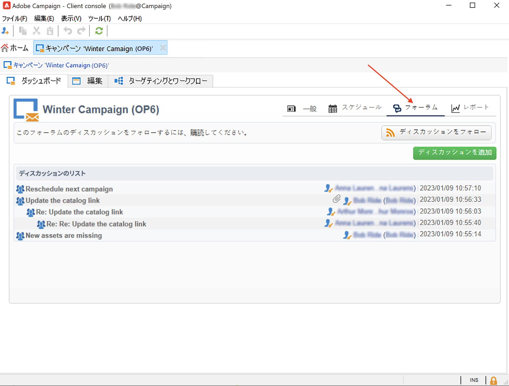
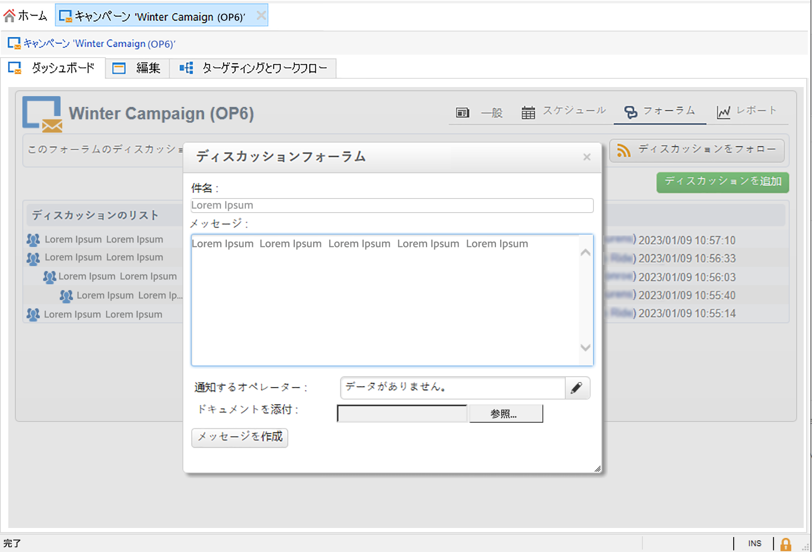
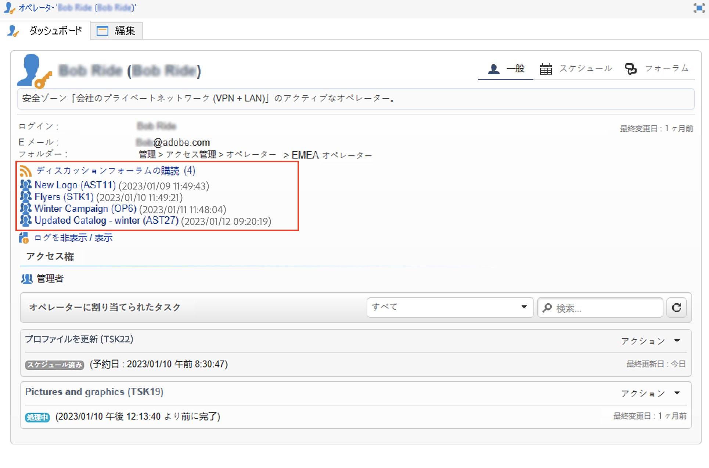

# ディスカッションフォーラム{#discussion-forums}

Adobe Campaign のオペレーターは、ディスカッションフォーラムを使用して情報を共有できます。次の要素には、それぞれ独自のフォーラムがあります。プラン、プログラム、キャンペーン、マーケティングリソース、シミュレーション、在庫。 各オペレーターにも個人用のフォーラムがあります。個人用フォーラムも含め、すべてのディスカッションは公開されています。

フォーラムに購読登録すると、メッセージが投稿されるたびに通知 E メールを受信できます。

## フォーラムへのアクセス {#accessing-a-forum}

フォーラムにアクセスするには、ダッシュボードを参照し、 **[!UICONTROL フォーラム]** リンクを右上隅に表示します。

メッセージとその応答は、新しい順に表示されます。

新しいスレッドを開始するには、 **[!UICONTROL ディスカッションを追加]** 」ボタンを使用します。 「**[!UICONTROL ディスカッションフォーラム]**」ボックスが表示されます（下の図を参照）。

「**[!UICONTROL メッセージ]**」フィールドにテキストを、「**[!UICONTROL 件名]**」フィールドにディスカッションのタイトルを入力します。

このフォーラムで既にメッセージを投稿しているオペレーターには、デフォルトで通知が届きます。 通知する別のオペレーターを選択できます。 複数のオペレーターに通知を送信する場合は、オペレーターのグループを選択します。

メッセージに添付ファイルを追加するには、  **[!UICONTROL 参照…]** 」ボタンをクリックします。 添付ファイルは通知 E メールにも添付されます。添付ファイルは個別にのみ送信できます。複数のファイルを送信するには、それらを.zip ファイルに圧縮する必要があります。

>[!CAUTION]
>
>一度フォーラムに投稿すると、メッセージの変更や削除はできません。

## オペレーターの個人用フォーラムへの投稿 {#posting-to-the-personal-forum-of-an-operator}

オペレーターのフォーラムにメッセージを投稿できます。 個人用フォーラムは公開されており、すべてのオペレーターがメッセージを表示できます。 個人用フォーラムに投稿があるたびに、そのオペレーターに電子メール通知が届きます。

オペレーターのフォーラムにアクセスするには、次の操作を行います。

* 次を参照： **[!UICONTROL 管理/アクセス管理/オペレーター]** Campaign エクスプローラーのフォルダーで、オペレーターを選択してダッシュボードを開き、 **[!UICONTROL フォーラム]** リンクを使用して設定できます。
* Adobe Campaign UI でオペレーターの名前を探し（このオペレーターがフォーラムに投稿し、そのオペレーターに割り当てられているタスクを使用して）、クリックしてオペレーターダッシュボードにアクセスします。

## フォーラムの購読 {#subscribing-to-a-forum}

フォーラムを購読すると、すべてのディスカッションをフォローできます。 購読すると、フォーラムにメッセージが投稿されるたびに電子メール通知が届きます。

メッセージに回答するには、E メールの本文をクリックし、Adobe Campaign の Web インターフェイスにログインします。

* フォーラムを購読するには、メッセージリストの上のセクション内の右上にある「**[!UICONTROL ディスカッションをフォロー]**」ボタンをクリックします。

   フォーラムに購読登録すると、セクションが青になります。

* フォーラムを購読解除するには、「**[!UICONTROL 購読解除]**」ボタンをクリックします。

* 個人用ダッシュボードに、購読済みのフォーラムのリストが表示されます。「**[!UICONTROL ディスカッションフォーラムの購読]**」リンクをクリックしてリストを表示し、関心がある項目をクリックしてフォーラムにアクセスします。

   

## 通知配信のトラブルシューティング {#checking-notification-delivery}

フォーラムを購読しているオペレーターに、期待どおりの通知が届かない場合は、次の手順を実行します。

* オペレーターのプロファイルに E メールアドレスが入力されていることを確認します。
* 次を参照： **[!UICONTROL 管理/プロダクション/テクニカルワークフロー/キャンペーンプロセス]** Campaign エクスプローラーのフォルダーに移動し、 **[!UICONTROL ディスカッションフォーラムのジョブ]** ワークフローは、エラーなしで開始されます。
* 配信ログを確認します。

   * Adobe Campaignホームページで、を参照します。 **[!UICONTROL キャンペーン/ナビゲーション/配信]**&#x200B;をクリックし、 **[!UICONTROL ディスカッションフォーラムの通知]** 配信。
   * Campaign エクスプローラーで、を参照します。 **[!UICONTROL 管理/プロダクション/自動作成されたオブジェクト/テクニカル配信/ワークフロー通知]**&#x200B;を選択し、「 **[!UICONTROL ディスカッションフォーラムの通知]**.
   「**[!UICONTROL ディスカッションフォーラムの通知]**」ボックスの「**[!UICONTROL 編集／配信]**」タブで配信ログを確認します。「**[!UICONTROL トラッキング／ログ]**」および「**[!UICONTROL 除外の原因]**」タブを確認することもできます。
