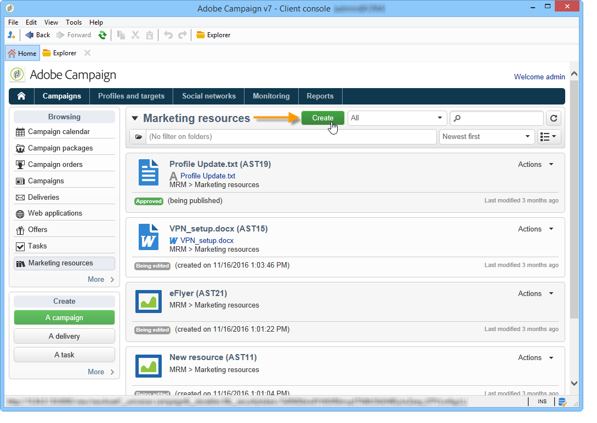
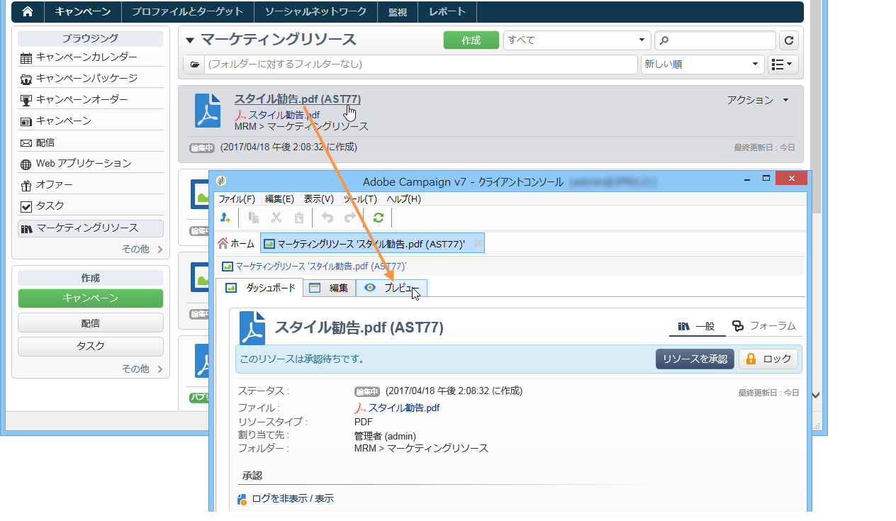
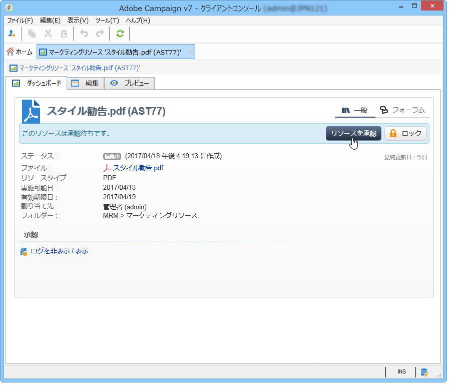
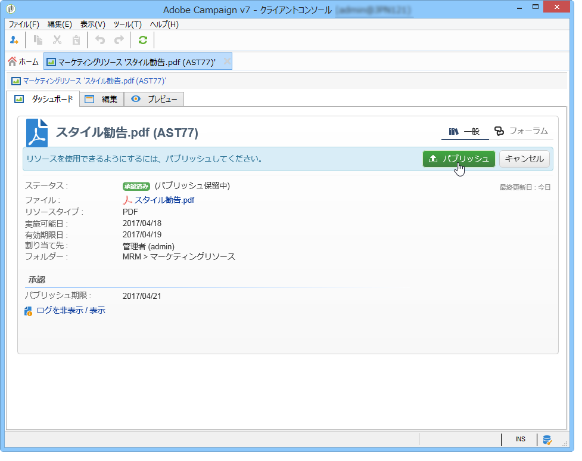
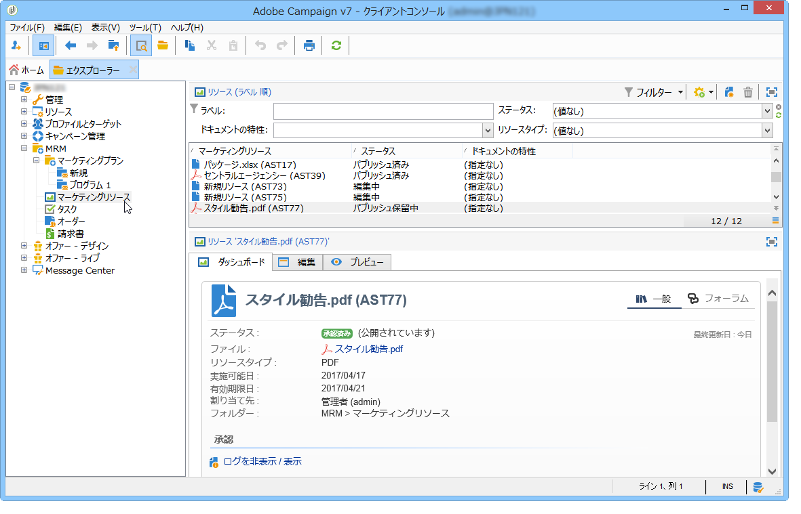

# マーケティングリソースの管理{#managing-marketing-resources}

Adobe Campaign では、キャンペーンライフサイクルに関連するマーケティングリソースを管理およびトラッキングできます。マーケティングリソースとは、パンフレットや視覚資料、または複数のオペレーターが関係するその他の通信媒体です。

Adobe Campaign では、管理するマーケティングリソースそれぞれのステータスと履歴をいつでもトラッキングし、最新のバージョンを確認できます。

## マーケティングリソースの追加 {#adding-a-marketing-resource}

マーケティングリソースには「**[!UICONTROL キャンペーン]**」タブからアクセスします。

リソースを追加するには、「**[!UICONTROL 作成]**」ボタンをクリックします。

リソースを Adobe Campaign サーバーで利用するには、そのリソースをエディターの中央部にドラッグ&amp;ドロップして追加する必要があります。「**[!UICONTROL サーバーにファイルをアップロード...]**」リンクをクリックすることもできます。

確認メッセージが表示され、アップロードを開始できます。

アップロードが完了すると、使用可能なリソースのリストにリソースが追加され、Adobe Campaign オペレーターがアクセスできるようになります。オペレーターはリソースを表示できるだけでなく（「**[!UICONTROL プレビュー]**」タブを使用）、コピーして修正することや、サーバー上のファイルを更新することもできます（「**[!UICONTROL 編集]**」タブを使用）。

リソースの監視、トラッキングおよび承認を担当するオペレーターまたはオペレーターのグループを選択するには、「**[!UICONTROL 一般]**」タブをクリックします。レビュー担当者を選択するには、「**[!UICONTROL 詳細設定パラメーター]**」リンクを使用します。

* リソースを割り当てられたオペレーターは、そのリソースのトラッキングを担当します。
* 承認オペレーターはマーケティングリソースの承認を担当します。リソースの検証プロセスが開始すると、これらのオペレーターに通知が送信されます。

   レビュー担当者が選択されていない場合は、リソースを承認&#x200B;**[!UICONTROL できません]**。

* 必要に応じて、校正者を指定することもできます。

リソースに使用可能な日付（目安）を指定できます。この日付を超えると、リソースは「**[!UICONTROL 遅延]**」ステータスになります。

## リソースの共同作業 {#collaborative-work-on-resources}

マーケティングリソースを修正、更新し、必要に応じてこれらの変更を他の Adobe Campaign オペレーターに通知できます。次の操作をおこなうことができます。

* リソースをローカルにダウンロードして修正する
* サーバー上でファイルを更新し、他のオペレーターがアクセスできるようにする
* リソースをロックし、他のオペレーターが修正できないようにする

>[!NOTE]
>
>「**[!UICONTROL 履歴]**」タブでは、リソースのダウンロードと更新のログを確認できます。「**[!UICONTROL 詳細]**」ボタンでは、選択したバージョンを表示できます。

### リソースのロックとロック解除 {#locking-unlocking-a-resource}

作成したリソースは、マーケティングリソースダッシュボードに表示され、オペレーターが編集、修正できるようになります。

リソースで作業する場合は、他のオペレーターが同時に同じリソースを修正しないよう、作業を開始する前にリソースをロックすることが推奨されます。ロックすると、リソースは予約済みになり、その他のオペレーターはアクセスできてもサーバー上でパブリッシュや更新ができなくなります。

アクセスすると以下のようなメッセージが表示されます。

「**[!UICONTROL 監査]**」タブに、リソースをロックしたオペレーターの名前と予定更新日が表示されます。

リソースをロックするには、リソースをクリックし、リソースのダッシュボードで「**[!UICONTROL ロック]**」ボタンをクリックします。

リソースの「**[!UICONTROL 監査]**」タブで、予定の返却日を指定できます。

ここで指定する情報が、リソースのロック解除日としてその他の Adobe Campaign オペレーターに表示されます。

リソースを更新すると、リソースは自動的にロックが解除され、再びすべてのオペレーターが使用できるようになります。

必要に応じてダッシュボードから手動でロックを解除することもできます。

>[!NOTE]
>
>リソースをロック解除できるのは、リソースをロックしたオペレーターと、管理者権限を持つオペレーターのみです。

### ディスカッションフォーラム {#discussion-forums}

各リソースにある「**[!UICONTROL フォーラム]**」タブでは、参加者が情報を交換することができます。

[ディスカッションフォーラム](discussion-forums.md)で、Adobe Campaign のディスカッションフォーラムの機能について説明しています。

## マーケティングリソースのライフサイクル {#life-cycle-of-a-marketing-resource}

リソースを作成すると、Adobe Campaign のオペレーターに、リソースのデザイン、校正、承認およびパブリッシュが割り当てられます。キャンペーンには期間を指定することができます。

「**[!UICONTROL 監査]**」タブでは、承認、承認の却下、関連するコメント、パブリッシュなど、リソースに実行されたあらゆるアクションを監視できます。

「**[!UICONTROL 履歴]**」タブには、このリソースに対して実行されたファイル転送の履歴が表示されます。

### 承認プロセス {#approval-process}

「**[!UICONTROL 監査]**」タブで指定してある場合は、使用可能な日付がリソースの詳細に表示されます。この日付に達すると、リソースダッシュボードにある「**[!UICONTROL 承認用に送信]**」ボタンを使用して、承認プロセスを実行できるようになります。リソースのステータスは「**[!UICONTROL 承認中]**」になります。

リソースを承認するには、リソースダッシュボードの「**[!UICONTROL リソースを承認]**」ボタンを使用します。

権限のあるオペレーターは、承認または却下できます。承認または却下するには、送信された E メールメッセージを使用（通知メッセージ内のリンクをクリック）するか、コンソールを使用（「**[!UICONTROL 承認]**」ボタンをクリック）します。

承認ウィンドウが表示され、コメントを入力できます。

すべてのオペレーターは、「**[!UICONTROL 監査]**」タブで承認プロセスの様々なステージをトラッキングできます。

>[!NOTE]
>
>各マーケティングリソースのレビュー担当者に加え、管理者権限を持つオペレーターとリソースマネージャーも、マーケティングリソースを承認できます。

### リソースの公開 {#publishing-a-resource}

マーケティングリソースを承認したら、パブリッシュする必要があります。パブリッシュプロセスは、企業の要件に応じて実装ごとに異なります。例えば、リソースをエクストラネット上またはその他のサーバー上にパブリッシュできる場合もあれば、特定の情報を外部のサービスプロバイダーに送信できる場合もあります。

リソースをパブリッシュするには、マーケティングリソースダッシュボードの編集ゾーンにある「**[!UICONTROL パブリッシュ]**」ボタンをクリックします。

ワークフローを使用して自動的にパブリッシュすることもできます。

リソースのパブリッシュとは、リソースを（その他のタスクなどで）使用可能にすることです。パブリッシュ自体は、リソースの特性により異なります。例えば、チラシの場合、パブリッシュとはファイルを印刷業者に送信することを意味します。Web 媒体の場合は Web サイトに公開することを意味します。

Adobe Campaign でパブリッシュするには、適切なワークフローを作成してリソースにリンクする必要があります。ワークフローを作成するには、リソースの「**[!UICONTROL 詳細設定]**」ボックスを開き、「**[!UICONTROL 後処理]**」フィールドで適切なワークフローを選択します。

ワークフローは以下の場合に実行されます。

* レビュー担当者（レビュー担当者が定義されていない場合はリソースの担当者）が「**[!UICONTROL リソースのパブリッシュ]**」リンクをクリックしたとき。
* マーケティングリソース作成タスクでリソースを管理している場合は、タスクが「**[!UICONTROL 完了]**」になったとき。ただし、タスクで「**[!UICONTROL マーケティングリソースをパブリッシュ]**」ボックスがオンになっている必要があります（[マーケティングリソース作成タスク](creating-and-managing-tasks.md#marketing-resource-creation-task)を参照）。

ワークフローをすぐに開始しない場合（ワークフローを停止した場合など）、リソースのステータスは「**[!UICONTROL パブリッシュ保留中]**」になります。ワークフローを開始すると、リソースのステータスは「**[!UICONTROL パブリッシュ済み]**」になります。このステータスには、パブリッシュプロセス中のエラーは反映されません。パブリッシュが適切に実行されたかどうかを確認するには、ワークフローのステータスを確認します。

## キャンペーンへのリソースのリンク {#linking-a-resource-to-a-campaign}

### マーケティングリソースの参照 {#referencing-a-marketing-resource}

キャンペーンテンプレートでリソースの関連付け機能を選択した場合、マーケティングリソースをキャンペーンに関連付けることができます。

>[!NOTE]
>
>キャンペーンテンプレートの作成と設定方法について詳しくは、 [キャンペーンテンプレート](../campaigns/marketing-campaign-templates.md)

キャンペーンダッシュボードで「**[!UICONTROL ドキュメント／リソース]**」タブをクリックし、「**[!UICONTROL 追加]**」をクリックしてリソースを選択します。

リソースはステータス別、特性別またはタイプ別にフィルターできます。パーソナライズしたフィルターを適用することもできます。

「**[!UICONTROL OK]**」をクリックし、このキャンペーンで参照されているマーケティングリソースのリストにリソースを追加します。

「**[!UICONTROL 詳細]**」ボタンをクリックすると、リソースを編集および表示できます。

追加したリソースはダッシュボードに表示されます。リソースはダッシュボードでも編集できます。

### 配信の概要へのマーケティングリソースの追加 {#adding-a-marketing-resource-to-a-delivery-outline}

マーケティングリソースは、配信の概要を使用して配信と関連付けることができます。

>[!NOTE]
>
>配信の概要について詳しくは、[配信の概要からのリンク済みリソースの関連付けと構造化](../campaigns/marketing-campaign-deliveries.md)を参照してください。

## 在庫管理 {#stock-management}

マーケティングリソースを 1 つまたは複数の在庫と関連付けることで、供給を管理し、在庫が不十分な場合にダッシュボードに警告を表示することができます。

>[!NOTE]
>
>Adobe Campaign での在庫管理について詳しくは、[在庫管理](../campaigns/providers--stocks-and-budgets.md#stock-management)を参照してください。

マーケティングリソースを在庫と関連付けるには、在庫マップを編集し、在庫を編集または作成します。在庫品目を追加し、対応するマーケティングリソースを選択します。

必要に応じ、リソースを選択した後、リソースの右側にある&#x200B;**[!UICONTROL リンクを編集]**&#x200B;アイコン（拡大鏡）をクリックして選択したリソースを編集できます。

初期在庫とアラートレベルを指定し、保存します。

在庫はリソースの詳細に表示されます。

在庫が不十分になると、関係するオペレーターに警告が送信されます。

## 高度な機能 {#advanced-functions}

マーケティングリソースダッシュボードでは、追加、編集、ロックとロック解除、承認およびパブリッシュなど、通常の操作を実行します。その他のタイプのマーケティングリソースを作成して、Adobe Campaign ツリーから高度な機能にアクセスすることもできます。作成するには、Adobe Campaign ホームページで「**[!UICONTROL エクスプローラー]**」をクリックします。

デフォルトでは、ツリーの **[!UICONTROL MRM／マーケティングリソース]**&#x200B;ノードにマーケティングリソースが格納されます。

このビューから以下のリソースを追加できます。

* ファイル
* HTML
* テキスト
* URL
