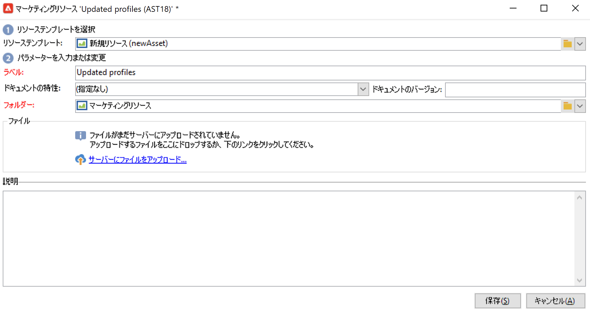

# マーケティングリソースの管理{#managing-marketing-resources}

Adobe Campaign を使用すると、キャンペーンライフサイクルに関連するマーケティングリソースを管理およびトラッキングできます。これらのマーケティングリソースは、ホワイトペーパー、データファイル、ロゴまたはキャンペーンに関連するその他のアセットです。

Adobe Campaign では、管理するマーケティングリソースそれぞれのステータスと履歴をいつでもトラッキングし、最新のバージョンを確認できます。

デフォルトでは、Campaign エクスプローラーの **[!UICONTROL MRM／マーケティングリソース]**&#x200B;フォルダーにマーケティングリソースが格納されます。

## マーケティングリソースの追加 {#adding-a-marketing-resource}

マーケティングリソースを追加するには、次の手順に従います。

1. 「**[!UICONTROL キャンペーン]**」タブを参照し、「**[!UICONTROL マーケティングリソース]**」を選択します。

1. 「**[!UICONTROL 作成]**」ボタンをクリックします。
   
1. ファイルをマーケティングリソースウィンドウにドラッグ＆ドロップして、Campaign サーバーにアップロードします。「**[!UICONTROL サーバーにファイルをアップロード...]**」リンクを使用することもできます。
   

アップロードが完了すると、使用可能なリソースのリストにリソースが追加され、

## マーケティングリソースの管理 {#manage-marketing-resources}

アップロードが完了すると、すべての Adobe Campaign オペレーターがマーケティングリソースを使用できるようになります。ファイルを表示したり、コピーを作成して変更したり、サーバー上のファイルを更新したりできます。

「**[!UICONTROL 編集]**」タブの&#x200B;**[!UICONTROL 割り当て先]**&#x200B;ドロップダウンリストを使用して、リソースを担当するオペレーターを選択します。

リソースの検証とリソースのパブリケーションを担当するオペレーターまたはオペレーターのグループを選択することもできます。これらのオプションにアクセスするには、「**[!UICONTROL 詳細設定パラメーター]**」リンクをクリックします。

リソースの検証プロセスが開始すると、これらのオペレーターにメールで通知されます。

レビュー担当者が選択されていない場合は、リソースを承認&#x200B;**[!UICONTROL できません]**。

「**[!UICONTROL 監査]**」タブを使用して配達確認リーダーを追加し、リソースの使用可能な日付を定義します。この日付を超えると、リソースは「**[!UICONTROL 遅延]**」ステータスになります。

>[!NOTE]
>
>「**[!UICONTROL 履歴]**」タブでは、リソースのダウンロードと更新のログを確認できます。「**[!UICONTROL 詳細]**」ボタンでは、選択したバージョンを表示できます。
>
>「**[!UICONTROL 監査]**」タブでは、承認、承認の却下、関連するコメント、パブリケーションなど、リソースに実行されたあらゆるアクションを監視できます。

### リソースのロックとロック解除 {#locking-unlocking-a-resource}

作成したリソースは、マーケティングリソースダッシュボードに表示され、オペレーターが編集、修正できるようになります。

オペレーターがリソースの作業を開始する場合は、他のオペレーターが同時にリソースを修正できないよう、リソースをロックすることをお勧めします。ロックすると、リソースは予約済みになり、その他のオペレーターは引き続きアクセスできますが、サーバー上で公開や更新ができなくなります。

マーケティングリソースは、承認されていない場合にのみロックできます。

リソースをロックするには、リソースのダッシュボードで「**[!UICONTROL ロック]**」ボタンをクリックする必要があります。

リソースが更新されたら、リソースダッシュボードの「**[!UICONTROL ロック]**」ボタンをクリックして、すべてのオペレーターが再び使用できるようにします。

アクセスすると以下のようなメッセージが表示されます。

「**[!UICONTROL トラッキング]**」タブには、リソースをロックしたオペレーターの名前が表示されます。

>[!NOTE]
>
>リソースをロック解除できるのは、リソースをロックしたオペレーターと、管理者権限を持つオペレーターのみです。

### ディスカッションフォーラム {#discussion-forums}

各リソースにある「**[!UICONTROL フォーラム]**」タブでは、参加者が情報を共有することができます。

詳しくは、[ディスカッションフォーラム](discussion-forums.md)の節を参照してください。

### 承認プロセス {#approval-process}

「**[!UICONTROL 監査]**」タブで指定してある場合は、使用可能な日付がリソースの詳細に表示されます。この日付に達すると、リソースダッシュボードにある「**[!UICONTROL 承認用に送信]**」ボタンを使用して、承認プロセスを実行できるようになります。リソースのステータスは「**[!UICONTROL 承認中]**」になります。

リソースを承認するには、ダッシュボードの「**[!UICONTROL リソースを承認]**」ボタンをクリックします。

権限のあるオペレーターは、承認または却下できます。承認または却下するには、送信された E メールメッセージを使用（通知メッセージ内のリンクをクリック）するか、コンソールを使用（「**[!UICONTROL 承認]**」ボタンをクリック）します。

承認ウィンドウが表示され、コメントを入力できます。

「**[!UICONTROL トラッキング]**」タブを参照して、承認を確認します。

>[!NOTE]
>
>各マーケティングリソースのレビュー担当者に加え、管理者権限を持つオペレーターとリソースマネージャーも、マーケティングリソースを承認できます。

### リソースの公開 {#publishing-a-resource}

マーケティングリソースを承認したら、パブリッシュする必要があります。パブリッシュプロセスは、企業の要件に応じて実装ごとに異なります。例えば、リソースをエクストラネット上またはその他のサーバー上にパブリッシュできる場合もあれば、特定の情報を外部のサービスプロバイダーに送信できる場合もあります。

リソースをパブリッシュするには、マーケティングリソースダッシュボードの編集ゾーンにある「**[!UICONTROL パブリッシュ]**」ボタンをクリックします。

ワークフローを使用して自動的にパブリッシュすることもできます。

リソースのパブリッシュとは、リソースを（その他のタスクなどで）使用可能にすることです。パブリッシュ自体は、リソースの特性により異なります。例えば、チラシの場合、パブリッシュとはファイルを印刷業者に送信することを意味します。Web 媒体の場合は Web サイトに公開することを意味します。

Adobe Campaign でパブリッシュするには、適切なワークフローを作成してリソースにリンクする必要があります。ワークフローを作成するには、リソースの「**[!UICONTROL 詳細設定...]**」ボックスを開き、「**[!UICONTROL 後処理]**」フィールドで適切なワークフローを選択します。

ワークフローを実行します。

* レビュー担当者（レビュー担当者が定義されていない場合はリソースの担当者）が「**[!UICONTROL リソースの公開]**」リンクをクリックしたとき。
* マーケティングリソース作成タスクでリソースを管理している場合は、タスクが「**[!UICONTROL 完了]**」になったとき。ただし、タスクで「**[!UICONTROL マーケティングリソースを公開]**」ボックスがオンになっている必要があります。[詳細情報](creating-and-managing-tasks.md#marketing-resource-creation-task)）

ワークフローをすぐに開始しない場合（ワークフローを停止した場合など）、リソースのステータスは「**[!UICONTROL 公開保留中]**」になります。ワークフローを開始すると、リソースのステータスは「**[!UICONTROL パブリッシュ済み]**」になります。このステータスには、パブリッシュプロセス中のエラーは反映されません。パブリッシュが適切に実行されたかどうかを確認するには、ワークフローのステータスを確認します。

## キャンペーンへのリソースのリンク {#linking-a-resource-to-a-campaign}

### マーケティングリソースの参照 {#referencing-a-marketing-resource}

[キャンペーンテンプレート](../campaigns/marketing-campaign-templates.md)でリソースの関連付け機能を選択した場合、マーケティングリソースをキャンペーンに関連付けることができます。

キャンペーンダッシュボードで&#x200B;**[!UICONTROL 編集／ドキュメント／リソース]**&#x200B;タブを参照し、「**[!UICONTROL 追加]**」をクリックしてリソースを選択します。

リソースはステータス別、特性別またはタイプ別にフィルターできます。パーソナライズしたフィルターを適用することもできます。

「**[!UICONTROL 詳細]**」ボタンを使用して、リソースを編集およびプレビューします。

### 配信の概要へのマーケティングリソースの追加 {#adding-a-marketing-resource-to-a-delivery-outline}

マーケティングリソースは、配信の概要を使用して配信と関連付けることができます。

配信概要の詳細については、[こちらの節](../campaigns/marketing-campaign-deliveries.md)を参照してください。

これを行うには、配信の概要を右クリックし、**新規／リソース**&#x200B;を選択します。

アセットの名前を入力し、**マーケティングリソース**&#x200B;ドロップダウンリストから選択します。

## 在庫管理 {#stock-management}

マーケティングリソースを 1 つまたは複数の在庫と関連付けることで、補給品を管理し、在庫が不十分な場合にダッシュボードに警告を表示することができます。

マーケティングリソースを在庫と関連付けるには、次の手順に従います。

1. 在庫を編集するか、新しい在庫を作成します。在庫について詳しくは、[この節](../campaigns/providers--stocks-and-budgets.md#stock-management)を参照してください。

1. 在庫品目を追加し、対応するマーケティングリソースを選択します。

   

   リソースを選択した後、リソースの右側にある「**[!UICONTROL リンクを編集]**」アイコンをクリックして選択したリソースを編集できます。

1. 初期在庫とアラートレベルを指定し、保存します。

在庫は、マーケティングリソースの「**在庫**」タブに表示されます。
