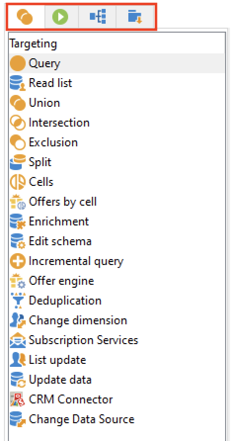
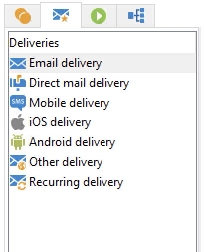
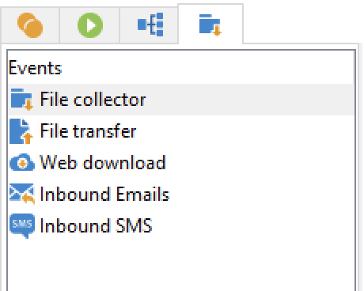

# ワークフローアクティビティ{#wf-activities}

ワークフローアクティビティは、4 つの異なるタブで、カテゴリ別にグループ化されます。

権限、実装、ワークフローが設計されたコンテキストに応じて、使用可能なアクティビティは異なる場合があります。

例えば、キャンペーンで作成されたワークフローには、特定の **配信** タブに、すべてのチャネルを表示します。 このタブは、 [テクニカルワークフロー](technical-workflows.md).

テクニカルワークフローには特定の **イベント** タブ ( [キャンペーンワークフロー](campaign-workflows.md).

すべてのアクティビティについて、以下の節で詳しく説明します。

* [ターゲティングアクティビティ](targeting-activities.md)
* [フロー制御アクティビティ](flow-control-activities.md)
* [アクションアクティビティ](action-activities.md)
* [イベントアクティビティ](event-activities.md)
* [キャンペーンワークフロー固有のアクティビティ](../campaigns/marketing-campaign-deliveries.md)
