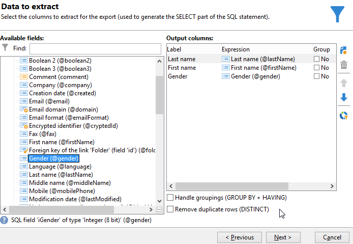
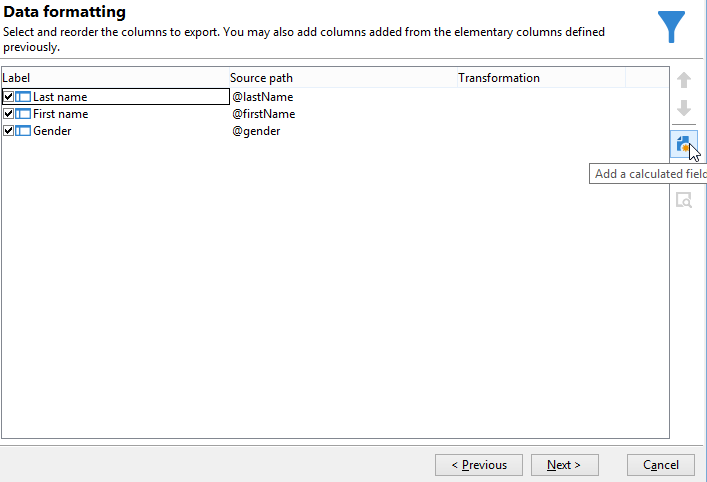
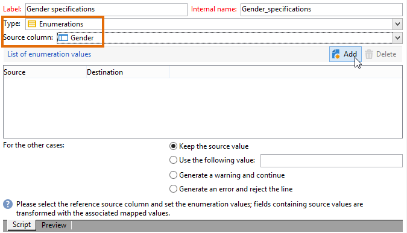
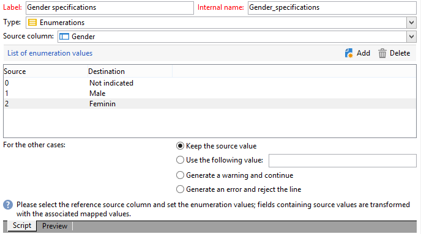
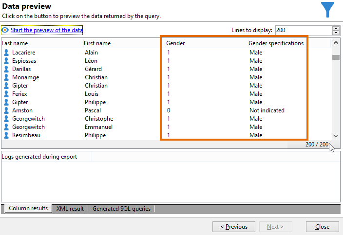
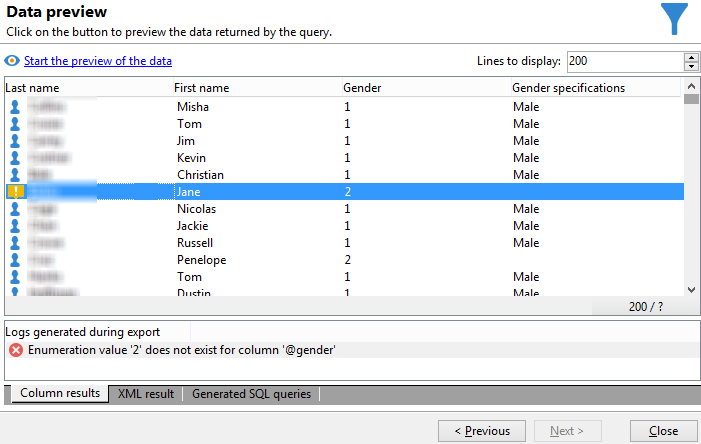
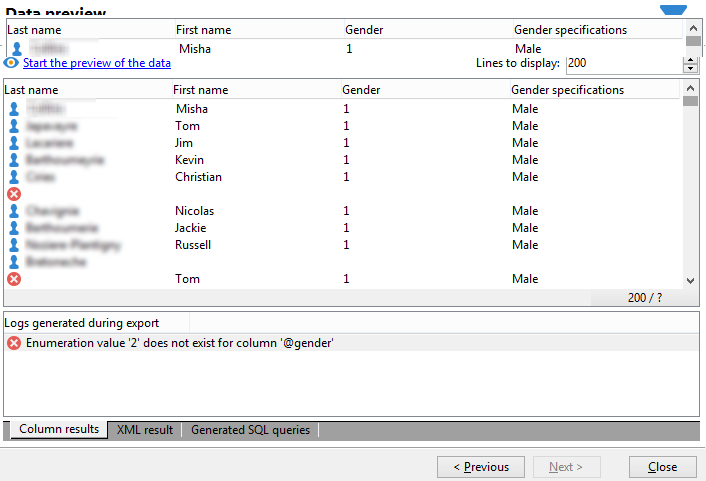

# 列挙タイプ計算フィールドの追加 {#adding-an-enumeration-type-calculated-field}

ここでは、「**[!UICONTROL 列挙]**」タイプの計算フィールドを使用してクエリを作成します。このフィールドでは、データのプレビューウィンドウに追加の列が生成されます。この列では、各受信者について結果として返される数値（0、1 および 2）を指定します。新しい列の各値に性別を割り当てます。「1」は「男性」、「2」は「女性」、値が「0」の場合は「不明」です。

* どのテーブルを選択する必要がありますか。

   受信者テーブル（nms:recipient）

* 出力列に選択するフィールドは何ですか。

   「姓」、「名」、「性別」

* どのような条件に基づいて情報をフィルターしますか。

   受信者の言語

次の手順に従います。

1. 汎用クエリエディターを開き、受信者テーブル（**[!UICONTROL nms:recipient]**）を選択します。
1. **[!UICONTROL 抽出するデータ]**&#x200B;ウィンドウで、「**[!UICONTROL 姓]**」、「**[!UICONTROL 名]**」および「**[!UICONTROL 性別]**」を選択します。

   

1. **[!UICONTROL 並べ替え]**&#x200B;ウィンドウで、「**[!UICONTROL 次へ]**」をクリックします。この例では並べ替えは必要ありません。
1. **[!UICONTROL データのフィルター]**&#x200B;で、「**[!UICONTROL フィルター条件]**」を選択します。
1. **[!UICONTROL ターゲット要素]**&#x200B;ウィンドウで、英語を話す受信者を収集するフィルター条件を設定します。

   

1. **[!UICONTROL データフォーマット]**&#x200B;ウィンドウで、**[!UICONTROL 計算フィールドを追加]**&#x200B;をクリックします。

   

1. **[!UICONTROL 計算済みフィールドの定義をエクスポート]**&#x200B;ウィンドウの「**[!UICONTROL タイプ]**」フィールドに移動し、「**[!UICONTROL 列挙]**」を選択します。

   新しい計算フィールドで参照する列を定義します。そのためには、「**[!UICONTROL ソース列]**」フィールドのドロップダウンメニューで「**[!UICONTROL 性別]**」列を選択します。宛先の値は「**[!UICONTROL 性別]**」列と一致します。

   

   「**ソース**」および「**宛先**」の値を定義します。宛先の値によってクエリ結果が読みやすくなります。このクエリは受信者の性別を返し、結果は 0、1 または 2 のいずれかになります。

   入力する「ソース - 宛先」のラインごとに、「**[!UICONTROL 列挙値のリスト]**」で「**[!UICONTROL 追加]**」をクリックします。

   * 「**[!UICONTROL ソース]**」列で、新しいラインに各性別のソースの値（0、1、2）を入力します。
   * 「**[!UICONTROL 宛先]**」列で、値を入力します。ライン「0」に &quot;不明&quot;、ライン「1」に &quot;男性&quot;、ライン「2」に &quot;女性&quot; と入力します。

   「**[!UICONTROL ソースの値を保持]**」機能を選択します。

   「**[!UICONTROL OK]**」をクリックして計算フィールドを承認します。

   

1. **[!UICONTROL データフォーマット]**&#x200B;ウィンドウで、「**[!UICONTROL 次へ]**」をクリックします。
1. プレビューウィンドウで、「**[!UICONTROL データのプレビューを開始]**」をクリックします。

   追加の列で 0、1 および 2 の性別が定義されます。

   * 0 は「不明」
   * 1 は「男性」
   * 2 は「女性」

   

   例えば、「**[!UICONTROL 列挙値のリスト]**」で性別「2」を入力せず、「**[!UICONTROL 他のケースの場合]**」フィールドで「**[!UICONTROL 警告を生成して続行]**」機能を選択した場合、警告ログが生成されます。このログは、性別「2」（女性）が入力されていないことを示します。ログは、データのプレビューウィンドウの「**[!UICONTROL エクスポート中に生成されたログ]**」フィールドに表示されます。

   

   もう 1 つの例では、列挙値「2」が入力されていないとします。「**[!UICONTROL エラーを生成してラインを却下]**」機能を選択します。すべての性別「2」の受信者で例外が発生し、ライン内の他の情報（名と姓など）はエクスポートされません。エラーログは、データのプレビューウィンドウの「**[!UICONTROL エクスポート中に生成されたログ]**」フィールドに表示されます。このログは、列挙値「2」が入力されていないことを示します。

   
