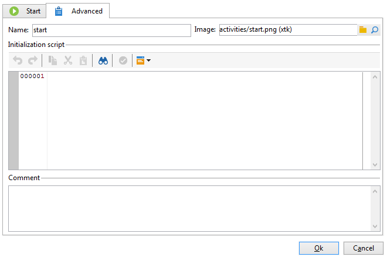

# 詳細設定パラメーター{#advanced-parameters}

アクティビティのプロパティ画面にある「**[!UICONTROL 詳細]**」タブでは、エラーが発生した場合の動作や、アクティビティの実行期間を定義できるほか、初期化スクリプトを入力することも可能です。このタブには、次の 2 つのバージョンがあります。

* 簡素化されたバージョン（「**[!UICONTROL 開始]**」アクティビティや「**[!UICONTROL 終了]**」アクティビティなどが対象）

   

* より詳細なバージョン（「**[!UICONTROL クエリ]**」アクティビティなどが対象）

   

「**[!UICONTROL 詳細]**」タブで入力するフィールドについては、次のセクションで詳しく説明しています。

## 名前 {#name}

このフィールドにはアクティビティの内部名を入力します。

## 画像 {#image}

このフィールドでは、アクティビティにリンクする画像を変更できます。詳しくは、[アクティビティ画像の変更](change-activity-images.md)を参照してください。

## 実行 {#execution}

このフィールドでは、タスクがトリガーされたときに実行されるアクションを定義できます。次の 3 つのオプションが使用可能です。

これらのオプションは通常、アクティビティを右クリックしてカート内で選択します。

* **[!UICONTROL 標準]**：通常どおりアクティビティを実行します。
* **[!UICONTROL 有効化しない]**：対象のタスクとそれに続くタスク（同一分岐内）はどれも実行されません。
* **[!UICONTROL 有効化するが実行しない]**：対象のタスクとそれに続くタスク（同一分岐内）はどれも自動的に停止されます。これは、タスクが起動された場合にその状態のままでタスクを保留中にしたいときに役立ちます。タスクを手動で実行するには、アクティビティを右クリックし、「**[!UICONTROL 通常の実行]**」を選択します。

## アフィニティ {#affinity}

ワークフローやワークフローアクティビティを固有のマシン上で強制的に実行することができます。これをおこなうには、ワークフローや関係するアクティビティのレベルで 1 つ以上のプロパティを定義する必要があります。

## 最大実行期間 {#max--execution-period}

このフィールドでは、長時間にわたりタスクが完了しない場合の警告を設定できます。ワークフローの動作に影響を与えることはありません。「**[!UICONTROL 最大実行期間]**」で指定した時間を経過してもタスクが完了しない場合、このワークフローについての警告が「**[!UICONTROL インスタンスの監視]**」ページに表示されます。このページには、ホームページの「**[!UICONTROL 監視]**」タブからアクセスします。

## 動作 {#behavior}

このフィールドでは、非同期タスクを使用する際に適用する動作を定義できます。次の 2 つのオプションが使用可能です。

* **[!UICONTROL 複数のタスクを許可]**：1 番最初のタスクが完了していなくても、複数のタスクを同時に実行できます。
* **[!UICONTROL 現在のタスクが優先されます]**：現在進行中のタスクが優先されます。なんらかのタスクが進行中である限り、ほかのタスクは実行されません。

## タイムゾーン {#time-zone}

このフィールドでは、アクティビティのタイムゾーンを選択できます。詳しくは、[タイムゾーンの管理](managing-time-zones.md)を参照してください。

## エラーの場合 {#in-case-of-errors}

このフィールドでは、アクティビティでエラーが発生した場合に実行するアクションを定義できます。次の 2 つのオプションが使用可能です。

* **[!UICONTROL プロセスを中断]**：ワークフローは自動的に停止します。ワークフローのステータスは「**[!UICONTROL 失敗]**」に変わります。問題が解決したら、ワークフローを再起動します。
* **[!UICONTROL 無視]**：対象のタスクとそれに続くタスク（同一分岐内）はどれも実行されません。このオプションは、繰り返しタスクに役立ちます。上流で分岐にスケジューラーが設定されている場合、タスクは次の実行日に通常どおり起動します。
* **[!UICONTROL エラー時に中止]**：ワークフローは自動的に停止し、再開できません。 ワークフローのステータスは&#x200B;**[!UICONTROL 失敗]**&#x200B;に変わります。

## 初期化スクリプト {#initialization-script}

このフィールドでは、変数を初期化したり、アクティビティのプロパティを変更したりできます。詳しくは、[JavaScript のスクリプトとテンプレート](javascript-scripts-and-templates.md)を参照してください。

## コメント {#comment}

「**[!UICONTROL コメント]**」フィールドは自由に使えるフィールドであり、説明を追加できます。
