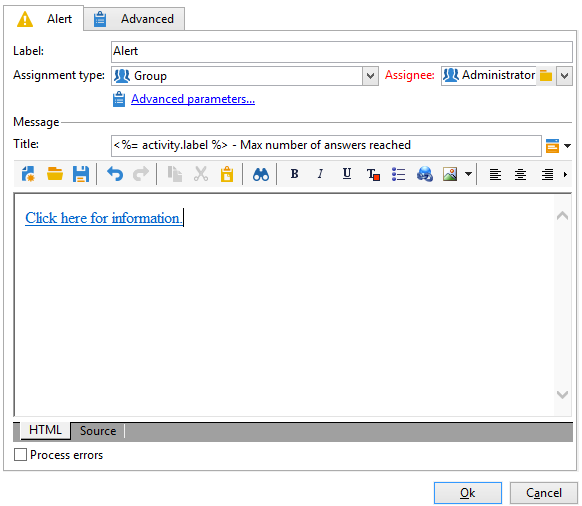

# アラート{#alert}

「**アラート**」アクティビティで、メッセージをオペレーターグループに送信します。承認アクティビティと同じように動作しますが、この場合、回答はありません。

アラートは持続しないので、コンソールからは見えません。割り当てたグループのオペレーターが通知を受け取るには、完全な E メールアドレスが必要です。このアクティビティの設定は「**承認**」の設定と似ています。オペレーターへのアラートに使用されるデフォルトの配信テンプレートは &#39;alertAssignee&#39;.です。
