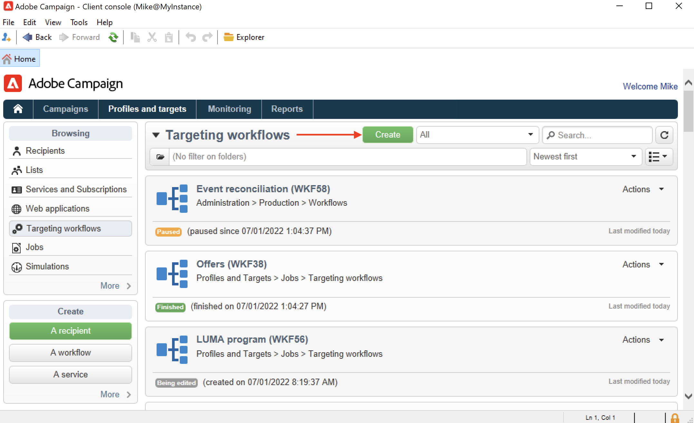
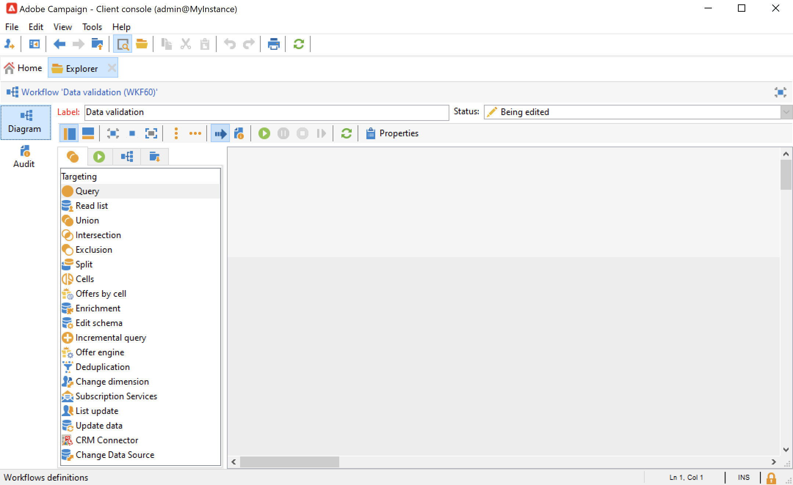
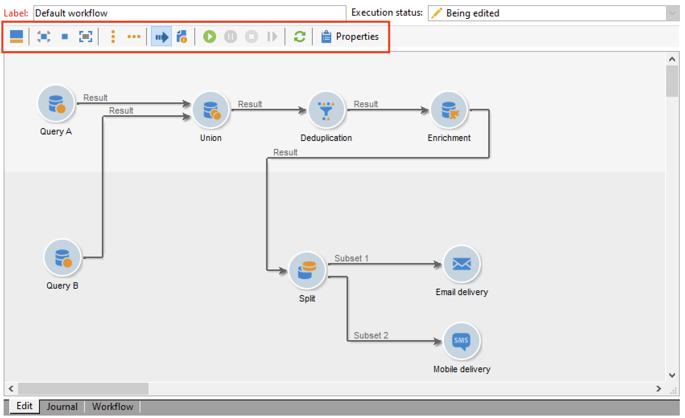
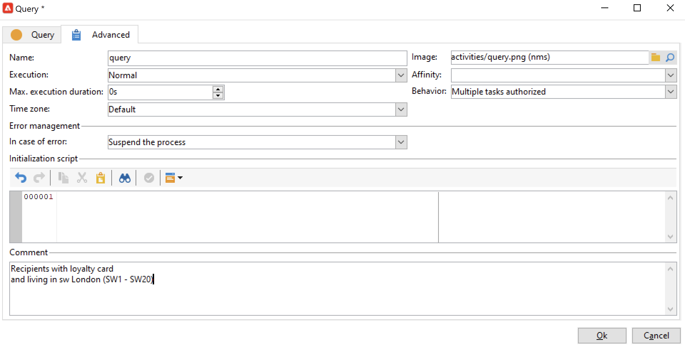
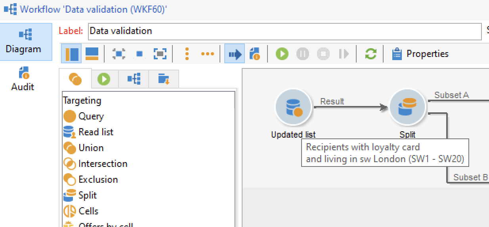
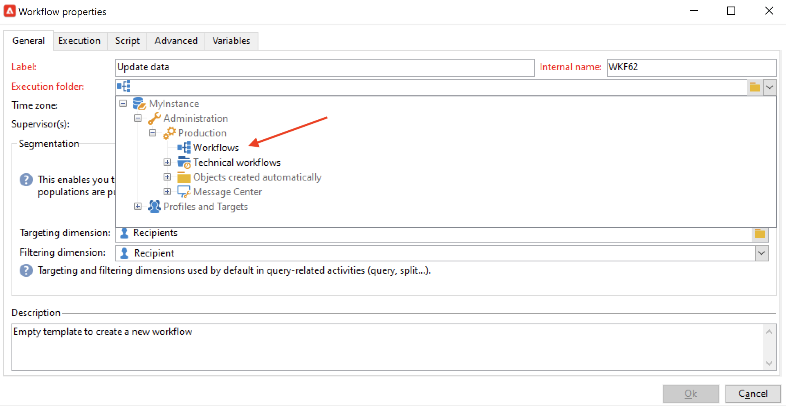
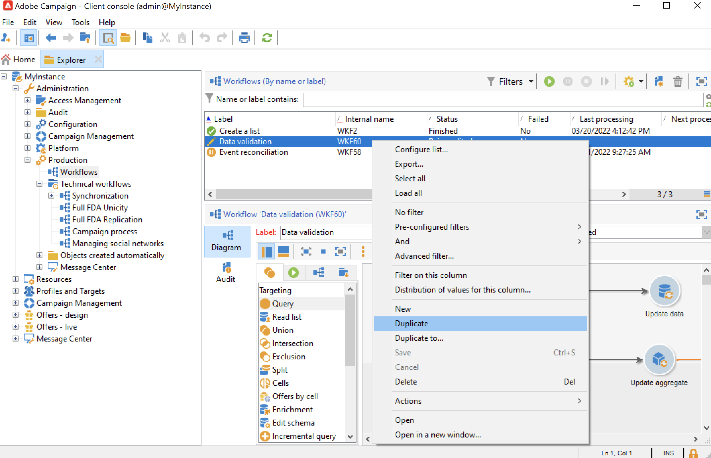
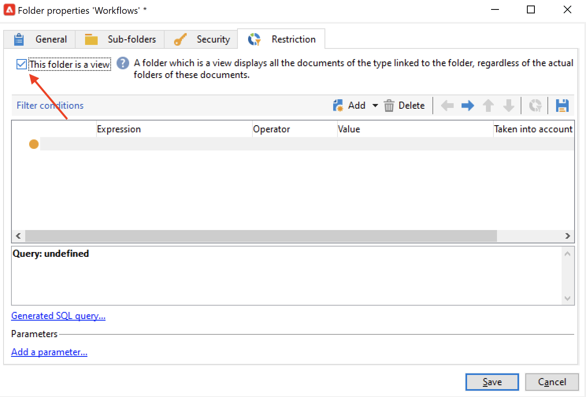

# ワークフローの作成 {#build-a-workflow}

## 新しいワークフローの作成 {#create-a-new-workflow}

ワークフローを作成する手順は、ワークフローのタイプに応じて異なります。次を行うことができます。

* エクスプローラーの&#x200B;**[!UICONTROL プロファイルとターゲット]**／**[!UICONTROL ジョブ]**／**[!UICONTROL ターゲティングワークフロー]**&#x200B;ノード、またはホームページの「**[!UICONTROL プロファイルとターゲット]**」タブの「**[!UICONTROL ターゲティングワークフロー]**」サブタブで、[ターゲティングワークフロー](#targeting-workflows)を作成します。

   

* キャンペーンの「**[!UICONTROL ターゲティングとワークフロー]**」タブで[キャンペーンワークフロー](#campaign-workflows)を作成します。

* エクスプローラーの **[!UICONTROL 管理]**／**[!UICONTROL 実稼動]**／**[!UICONTROL テクニカルワークフロー]**&#x200B;ノードで、[テクニカルワークフロー](#technical-workflows)を作成します。テクニカルワークフローを保存する特定のワークフローフォルダーを作成することをお勧めします。

ワークフローのリストの上にある「**[!UICONTROL 新規]**」ボタンをクリックします。

ラベルを入力して「**[!UICONTROL 保存]**」をクリックします。

## アクティビティの追加およびリンク {#add-and-link-activities}

ここでは、各種アクティビティを定義し、ダイアグラム内で互いにリンクする必要があります。設定のこの段階では、ダイアグラムラベルとワークフローステータスを確認できます（編集中）。ウィンドウの下部セクションは、ダイアグラムの編集のみに使用されます。この領域には、ツールバー、アクティビティのパレット（左側）、ダイアグラム自体（右側）があります。

>[!NOTE]
>
>パレットが表示されない場合、ワークフローのツールバーの 1 番目のボタンをクリックして、パレットを表示します。

アクティビティは、パレットの異なるタブで、カテゴリ別にグループ分けされます。利用できるタブおよびアクティビティは、ワークフロータイプに応じて異なります（テクニカルワークフロー、ターゲティングワークフロー、キャンペーンワークフロー）。

* 1 番目のタブには、ターゲティングアクティビティとデータ操作アクティビティが含まれています。これらのアクティビティについて詳しくは、[ターゲティングアクティビティ](targeting-activities.md)で説明しています。
* 2 番目のタブには、主に、その他のアクティビティの調整に使用されるスケジューリングアクティビティが含まれます。これらのアクティビティについては詳しくは、[フロー制御アクティビティ](flow-control-activities.md)で説明しています。
* 3 番目のタブには、ワークフロー内で使用できるツールとアクションが含まれています。これらのアクティビティについて詳しくは、[アクションアクティビティ](action-activities.md)で説明しています。
* 4 番目のタブには、メールの受信や、サーバーへのファイルの到着など、所定のイベントに基づくアクティビティが含まれています。これらのアクティビティについて詳しくは、[イベントアクティビティ](event-activities.md)で説明しています。

ダイアグラムを作成するには

1. パレット内でアクティビティを選択し、ドラッグ＆ドロップ操作を使用してダイアグラムに移動することで、アクティビティを追加します。

   ダイアグラムに「**開始**」アクティビティを追加し、次に「**配信**」アクティビティを追加します。

   

1. 「**開始**」アクティビティトランジションをドラッグして「**配信**」アクティビティにドロップし、2 つのアクティビティをリンクさせます。

   

   トランジションの最後に新しいアクティビティを配置することで、直前のアクティビティと自動的にリンクできます。

1. 必要なアクティビティを追加し、次の図に示すように、互いにリンクさせます。

   

>[!CAUTION]
>
>同じワークフロー内でアクティビティをコピーして貼り付けることができます。ただし、異なるワークフロー間でアクティビティをコピーして貼り付けることはお勧めしません。アクティビティに関連付けられた配信やスケジューラーなどの設定が、貼り付け先ワークフローの実行中に競合やエラーの原因となる可能性があります。代わりに、ワークフローを&#x200B;**複製**&#x200B;することをお勧めします。詳しくは、[ワークフローを複製](#duplicate-workflows)を参照してください。

以下の要素を使用して、グラフの表示とレイアウトを変更できます。

* **ツールバーの使用**

   ダイアグラムの編集ツールバーを使用して、レイアウトにアクセスし、ワークフローの関数を実行します。

   

   これにより、パレットと概要の表示や、ダイアグラムのオブジェクトの配置やサイズなど、編集ツールのレイアウトを適用できます。

   

   進行状況とログの表示に関連するアイコンについて詳しくは、以下の節を参照してください。

   * [進行状況を表示](monitor-workflow-execution.md#displaying-progress)
   * [ログの表示](monitor-workflow-execution.md#displaying-logs)

* **オブジェクトの整列**

   アイコンを整列させるには、アイコンを選択して&#x200B;**[!UICONTROL 縦に整列]**&#x200B;アイコンまたは&#x200B;**[!UICONTROL 横に整列]**&#x200B;アイコンをクリックします。

   連続していないアクティビティを選択したり、1 つまたは複数アクティビティの選択を解除するには、**Ctrl** キーを同時に押します。すべての選択を解除するには、ダイアグラムの背景をクリックします。

* **画像の管理**

   ダイアグラムの背景画像や、各種アクティビティを表す画像をカスタマイズできます。[アクティビティ画像の変更](change-activity-images.md)を参照してください。

## アクティビティの設定 {#configure-activities}

アクティビティを設定するには、ダブルクリックして開くか、右クリックして「**[!UICONTROL 開く]**」を選択します。

>[!NOTE]
>
>キャンペーンワークフローアクティビティについて詳しくは、[こちら](activities.md)を参照してください。

1 番目のタブには、基本設定が含まれます。「**[!UICONTROL 詳細設定]**」タブには、エラー発生時の動作の定義や、アクティビティの実行時間の指定、初期化スクリプトの入力に使用される追加のパラメータが含まれています。

アクティビティをより深く理解し、ワークフローの読みやすさを改善するには、アクティビティにコメントを入力します。

これらのコメントは、オペレーターがアクティビティ上をスクロールすると、自動的に表示されます。

## ワークフローテンプレート {#workflow-templates}

ワークフローテンプレートには、プロパティ全体の設定が含まれます。ダイアグラム内に連結されているアクティビティの範囲が含まれることもあります。この設定は、設定済み要素を一定数含む新規ワークフローを作成する場合に再利用できます。

既存のテンプレートに基づいて新規ワークフローテンプレートを作成したり、ワークフローをテンプレートに直接変換することができます。

ワークフローテンプレートは、エクスプローラーの&#x200B;**[!UICONTROL リソース／テンプレート／ワークフローテンプレート]**&#x200B;ノードに保存されています。

通常のワークフローのプロパティに加えて、テンプレートのプロパティには、このテンプレートに基づいて作成されたワークフローの実行ファイルを指定できます。

## ワークフローの複製 {#duplicate-workflows}

様々なタイプのワークフローを複製できます。複製後は、ワークフローの変更は複製されたワークフローには引き継がれません。

>[!CAUTION]
>
>コピー＆ペーストはワークフローで使用できますが、「**複製**」を使用することを推奨します。アクティビティがコピーされると、その設定全体が保持されます。配信アクティビティ（E メール、SMS、プッシュ通知など）の場合は、アクティビティに添付された配信オブジェクトもコピーされ、クラッシュの原因となる可能性があります。

1. ワークフローを右クリックします。
1. 「**複製**」をクリックします。

   

1. ワークフローウィンドウで、ワークフローのラベルを変更します。
1. 「**保存**」をクリックします。

複製の機能は、キャンペーンのビューでは直接利用できません。

ただし、インスタンス上のすべてのワークフローを表示するビューの作成は可能です。このビューでは、**別の場所へ複製**&#x200B;を使用してワークフローを複製できます。

**ビューの作成**

1. **エクスプローラー**&#x200B;で、ビューを作成するフォルダーに移動します。
1. 右クリックし、**新しいフォルダーを追加**／**プロセス**&#x200B;に移動し、**ワークフロー**&#x200B;を選択します。

   

新規フォルダー「**ワークフロー**」が作成されます。

1. 右クリックして、**プロパティ**&#x200B;を選択します。
1. 「**制限**」タブで「**フォルダーのビュー化**」オプションを有効化し、「**保存**」をクリックします。

   

これで、フォルダーにインスタンスのすべてのワークフローが追加されました。

**キャンペーンワークフローの複製**

1. ワークフロービューでキャンペーンワークフローを選択します。
1. 右クリックして&#x200B;**別の場所へ複製**&#x200B;を選択します。
1. ラベルを変更します。
1. 「**保存**」をクリックします。

複製したワークフローは、ワークフロービューで確認できます。
