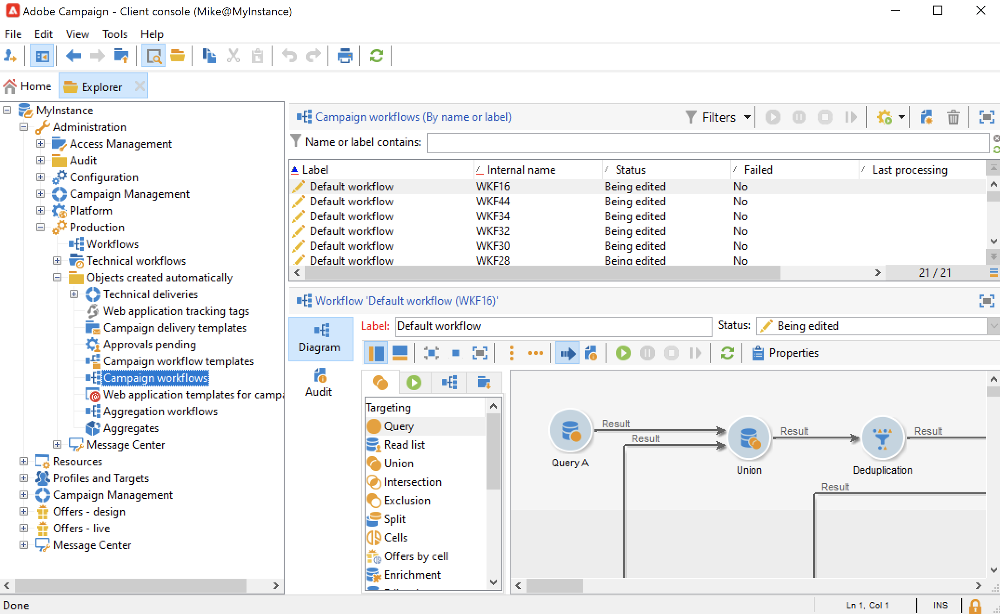

# キャンペーンワークフロー {#campaign-workflows}

キャンペーンごとに、「**[!UICONTROL ターゲティングとワークフロー]**」タブから実行されるワークフローを作成できます。これらのワークフローは、各キャンペーンに固有です。

このタブには、すべてのワークフロー用のものと同じアクティビティが含まれます。[詳細情報](#implementation-steps-)

ターゲティングキャンペーンに加えて、キャンペーンワークフローにより、すべての使用可能なチャネル用の配信全体を作成して設定できます。ワークフローで作成されたこれらの配信は、キャンペーンのダッシュボードから使用できます。

すべてのキャンペーンワークフローは、**[!UICONTROL 管理／プロダクション／自動作成されたオブジェクト／キャンペーンワークフロー]**&#x200B;ノードの下に集中管理されます。

キャンペーンワークフローと実装例について詳しくは、 [この節](../campaigns/marketing-campaign-target.md).
