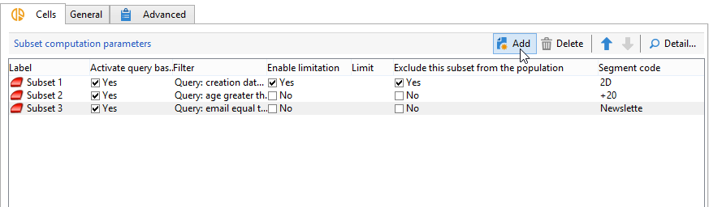
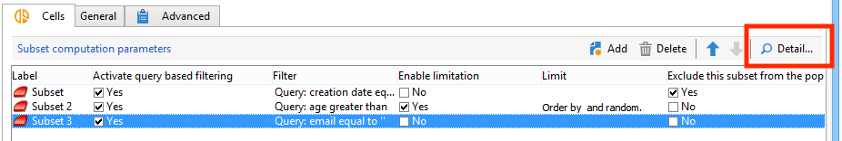
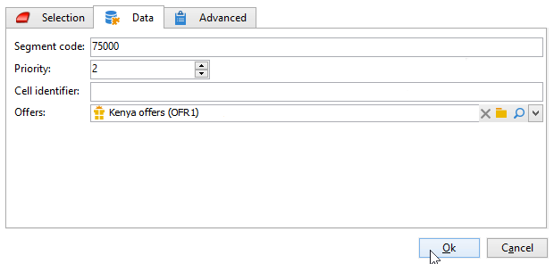

# セル{#cells}

**[!UICONTROL セル]**&#x200B;アクティビティでは、各種のサブセットをデータ列として表示します。このアクティビティは、サブセットの操作を容易にし、パーソナライゼーション機能を活用できるように設計されています。



ユーザーのニーズに基づく特定のパラメーターを入力して、このアクティビティを設定できます。各サブセットの詳細は、デフォルトでは、「**[!UICONTROL セル]**」タブと「**[!UICONTROL 詳細設定]**」タブを通じて専用ウィンドウに表示されます。



以下の例では、入力フォームは変更されています。各サブセットのオファーと優先度レベルの関連付けを有効にする「**[!UICONTROL データ]**」タブが追加されています。



この設定では、Adobe Campaign エクスプローラーの&#x200B;**[!UICONTROL 管理／設定／入力フォーム]**&#x200B;ノードで、次の情報がワークフローのフォームに追加されています。

```
<container img="nms:miniatures/mini-enrich.png" label="Data">
                <input xpath="@code"/>
                <container xpath="select/node[@alias='@numTest']">
                  <input alwaysActive="true" expr="'long'" type="expr" xpath="@type"/>
                  <input alwaysActive="true" expr="'Priority'" type="expr" xpath="@label"/>
                  <input label="Priority" maxValue="12" minValue="0" type="number"
                         xpath="@value" xpathEditFromType="@type"/>
                </container>
                <container xpath="select/node[@alias='@test']">
                  <input alwaysActive="true" expr="'string'" type="expr" xpath="@type"/>
                  <input alwaysActive="true" expr="'Identifier'" type="expr" xpath="@label"/>
                  <input label="Cell identifier" xpath="@value"/>
                </container>
                <container xpath="select/node[@alias='linkTest']">
                  <input alwaysActive="true" expr="'link'" type="expr" xpath="@type"/>
                  <input alwaysActive="true" expr="'nms:offer'" type="expr" xpath="@dataType"/>
                  <input alwaysActive="true" expr="'Offre'" type="expr" xpath="@label"/>
                  <input computeStringAlias="@valueLabel" label="Offers" notifyPathList="@_cs|@valueLabel"
                         schema="nms:offer" type="linkEdit" xpath="@value"/>
                </container>
```

Adobe Campaign の入力フォームのパーソナライゼーションを実行できるのは、エキスパートユーザーに限られます。