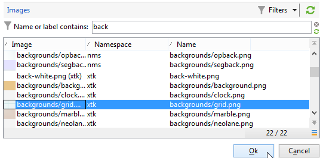
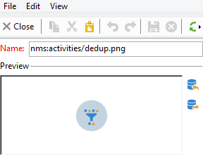

# アクティビティ画像の変更{#change-activity-images}

さまざまなワークフローのダイアグラムに画像が使用されますが、これらの画像が変更することができます。 ただし、それには一定の制限があります。 以下に示すのは実装のステージです。

* 背景画像を変更するには、目的のターゲティングワークフローを選択してから「**[!UICONTROL プロパティ]**」タブをクリックします。

  

  使用する画像を選択するには、「**[!UICONTROL 背景画像]**」フィールドの右にある「**[!UICONTROL リンクを選択]**」アイコンをクリックします。

  >[!NOTE]
  >
  >背景画像のピクセルの幅は 4 の倍数にする必要があります。

  

  「**[!UICONTROL リンクを編集]**」アイコンでは、選択した画像を表示することができます。

* アクティビティに関連付けられた画像を変更するには、オブジェクトをダブルクリックしてから、「**[!UICONTROL 詳細設定]**」タブをクリックします。

  使用する画像を選択するには、「**[!UICONTROL 画像]**」フィールドの右にある「**[!UICONTROL リンクを選択]**」アイコンをクリックします。

  

  「**[!UICONTROL リンクを編集]**」アイコンでは、選択した画像を表示することができます。

  

>[!NOTE]
>
>ツリーの&#x200B;**[!UICONTROL 管理／設定／画像]**&#x200B;ノードに保存されている画像を選択することができます。
>  
>画像は、PNG 形式、48 x 48 ピクセル、1,600 万色、透明の背景にする必要があります。
