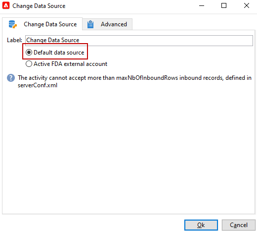

# データソースを変更 {#change-data-source}

**[!UICONTROL データソースを変更]**&#x200B;アクティビティを使用すると、[ワークフローのワークテーブル](use-workflow-data.md#workflow-temporary-work-table)のデータソースを変更できます。このアクティビティでは、Federated Data Access（FDA）、Campaign Cloud データベース（FFDA）、Campaign ローカルデータベースなどの様々なデータソースを対象に、より柔軟にデータを管理できます。

ワークフローの&#x200B;**[!UICONTROL ワークテーブル]**&#x200B;を使用すると、データを処理し、ワークフローアクティビティと共有することができます。

デフォルトでは、**[!UICONTROL ワークテーブル]**&#x200B;は、クエリ対象のデータのソースと同じデータベースに作成されます。例えば、クラウドデータベースに格納された&#x200B;**[!UICONTROL 受信者]**&#x200B;テーブルに対してクエリを実行する場合、同じクラウドデータベースにワークフローの&#x200B;**[!UICONTROL ワークテーブル]**&#x200B;が作成されます。

**[!UICONTROL データソースを変更]**&#x200B;アクティビティを使用すると、**[!UICONTROL ワークテーブル]**&#x200B;に別のデータソースを使用できます。

なお、**[!UICONTROL データソースを変更]**&#x200B;アクティビティを使用する場合、ワークフローの実行を続行するには、クラウドデータベースに切り替える必要があります。

**[!UICONTROL データソースを変更]**&#x200B;アクティビティを使用するには、次の手順に従います。

1. ワークフローを作成します。

1. 「**[!UICONTROL クエリ]**」アクティビティでターゲット受信者にクエリを実行します。

   「**[!UICONTROL クエリ]**」アクティビティについて詳しくは、[このページ](query.md#create-a-query)を参照してください。

1. **[!UICONTROL データソースを変更]**&#x200B;アクティビティを追加します。

   

1. **[!UICONTROL データソースを変更]**&#x200B;アクティビティを編集して、「**[!UICONTROL デフォルトのデータソース]**」を選択します。

   クエリの結果を含んだワークテーブルが、デフォルトの Campaign ローカルデータベースに移動されます。

   

1. **[!UICONTROL JavaScript コード]**&#x200B;アクティビティを追加して、ワークテーブルに対して単一操作を実行します。

   **[!UICONTROL JavaScript コード]**&#x200B;アクティビティについて詳しくは、[このページ](sql-code-and-javascript-code.md#javascript-code)を参照してください。

1. 別の&#x200B;**[!UICONTROL データソースを変更]**&#x200B;アクティビティを追加して、クラウドデータベースに戻ります。

1. このアクティビティを編集し、「**[!UICONTROL アクティブ FDA 外部アカウント]**」および対応する&#x200B;**[!UICONTROL 外部データベース]**&#x200B;外部アカウントを選択します。

   

1. これで、ワークフローを開始できます。
