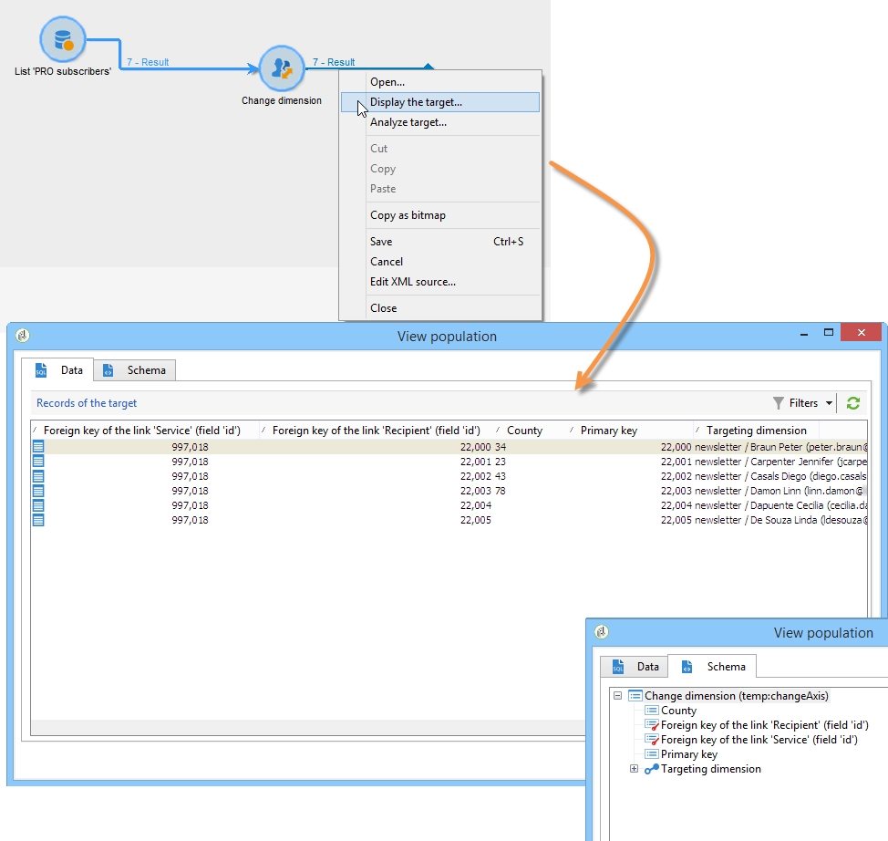

# ディメンションを変更{#change-dimension}

「**[!UICONTROL ディメンションを変更]**」アクティビティを使用すると、オーディエンスの作成時にターゲティングディメンションを変更できます。このアクティビティでは、データテンプレートと入力ディメンションに応じて軸を移動します。例えば、「契約」ディメンションから「クライアント」ディメンションに切り替えることができます。

さらに、このアクティビティを使用して、新しいターゲットの列を追加して定義したり、データの重複排除条件を定義したりできます。

「**[!UICONTROL ディメンションを変更]**」アクティビティを設定するには、次の手順に従います。

1. 新しいターゲティングディメンションを「**[!UICONTROL ディメンションを変更]**」フィールド経由で選択します。

   

1. ディメンションの変更時に、すべての要素を保持することも、出力に含める要素を選択することもできます。次の例では、重複の最大件数が 2 に設定されています。

   

   レコードを 1 つだけ保持する場合は、1 つのコレクションが作業スキーマに表示されます。このコレクションは、最終結果でターゲットにならないすべてのレコードを表します（1 つのレコードのみが保持されるため）。ほかのすべてのコレクションと同様に、このコレクションを使用して、集計を自動生成したり、列内の情報を取得したりできます。

   例えば、「**[!UICONTROL 顧客]**」ディメンションを「**[!UICONTROL 受信者]**」ディメンションに変更すると、購入数を追加するだけでなく、特定の店舗の顧客のターゲティングが可能になります。

1. この情報の一部のみを保持するように選択する場合、重複管理モードで設定できます。

   

   青い矢印を使用して、重複処理の優先度を定義できます。

   上の例では、受信者はまず E メールアドレスに基づいて重複排除され、次に必要に応じてアカウント番号に基づいて重複排除されます。

1. 「**[!UICONTROL 結果]**」タブで、追加情報を追加できます。

   例えば、**Substring**&#x200B;タイプ関数を使用して、郵便番号に基づいて国を収集できます。手順は次のとおりです。

   * 「**[!UICONTROL データを追加...]**」リンクをクリックし、「**[!UICONTROL フィルタリングディメンションにリンクされたデータ]**」を選択します。

      

      >[!NOTE]
      >
      >追加する列の作成と管理について詳しくは、[データの追加](query.md#add-data)を参照してください。

   * 以前のターゲティングディメンション（軸変更の前）を選択し、受信者の「**[!UICONTROL 場所]**」サブツリーで「**[!UICONTROL 郵便番号]**」を選択して「**[!UICONTROL 式を編集]**」をクリックします。

      

   * 「**[!UICONTROL 詳細選択]**」をクリックし、「**[!UICONTROL 式を使用して数式を編集]**」を選択します。

      

   * リストで提供される関数を使用して、実行される計算を指定します。

      

   * 最後に、作成した列のラベルを入力します。

      

1. ワークフローを実行して、この設定の結果を確認します。次の図に示すように、ディメンションアクティビティの変更前と変更後のテーブル内のデータを比較し、さらにワークフローテーブルの構造も比較します。

   

   
