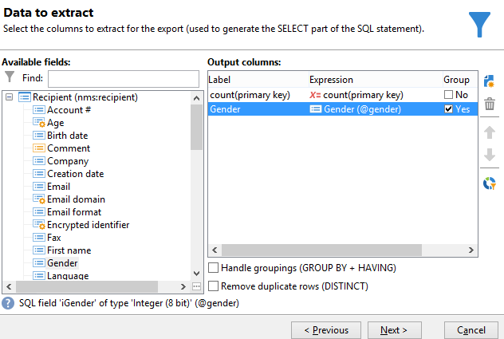
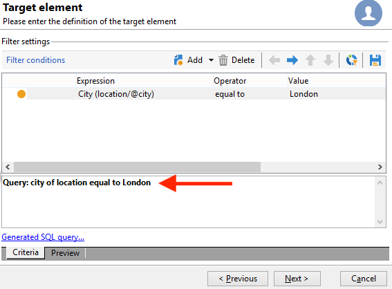
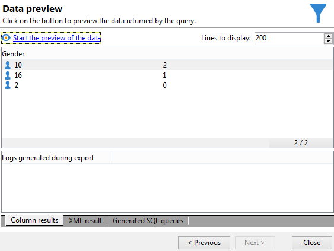

# 集計計算の実行 {#performing-aggregate-computing}

この例では、横浜市に住む受信者の数を性別に基づいてカウントします。

* どのテーブルを選択する必要がありますか。

   受信者テーブル（**nms:recipient**）

* 出力列でどのフィールドを選択する必要がありますか。

   「プライマリキー」（カウントあり）と「性別」

* どのような条件に基づいて情報をフィルターしますか。

   横浜市に住む受信者を基準にします

この例を作成するには、次の手順に従います。

1. **[!UICONTROL 抽出するデータ]**&#x200B;で、（前の例で示したように）プライマリキーのカウントを定義します。出力列に「**[!UICONTROL 性別]**」フィールドを追加します。「**[!UICONTROL 「性別]**」列で、「グループ」オプションをオンにします。****&#x200B;これにより、受信者は性別でグループ化されます。

   

1. **[!UICONTROL 並べ替え]**&#x200B;ウィンドウで、「**[!UICONTROL 次へ]**」をクリックします。ここでは並べ替えは必要ありません。
1. データのフィルターを設定します。ここでは、横浜市に住んでいる連絡先に選択を制限します。

   

   >[!NOTE]
   >
   >値では大文字と小文字が区別されます。条件に、大文字を使用せずに値 &quot;london&quot; を入力し、受信者のリストに大文字を使用した「London」という単語が含まれている場合、クエリは失敗します。

1. **[!UICONTROL データフォーマット]**&#x200B;ウィンドウで、「**[!UICONTROL 次へ]**」をクリックします。この例では書式設定は必要ありません。
1. プレビューウィンドウで、「**[!UICONTROL データのプレビューを開始]**」をクリックします。

   性別での並べ替えには、次の 3 つの異なる値があります。**2** は女性、**1** は男性 、**0** は性別が不明の場合です。この例では、リストに女性が 10 人、男性が 16 人、性別不明が 2 人含まれています。

   
