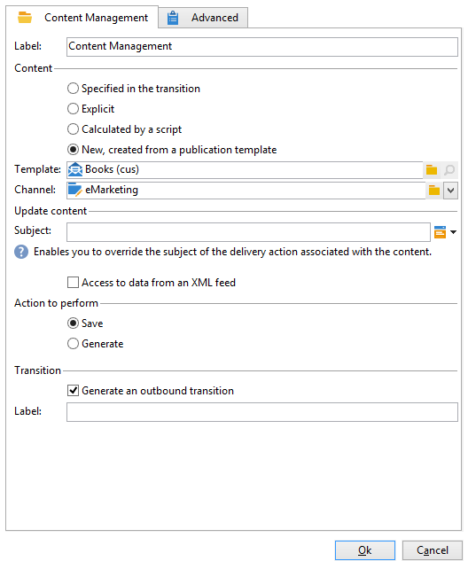

# コンテンツ管理{#content-management}

「**コンテンツ管理**」アクティビティでは、コンテンツの作成と操作、およびこのコンテンツに基づくファイルの生成をおこなうことができます。その後、このコンテンツを「配信」アクティビティ経由で配信できます。

>[!CAUTION]
>
>コンテンツ管理は、オプションの Adobe Campaign モジュールです。使用許諾契約書を確認してください。

アクティビティのプロパティは、3 つの手順に分かれています。

* **コンテンツの選択**：以前に作成されたコンテンツから選ぶか、アクティビティ経由でコンテンツを作成します。
* **コンテンツの更新**：コンテンツの件名を変更するか、すべての XML コンテンツをインポートします。
* **アクション**：生成されるコンテンツを保存または生成できます。

   

   Adobe Campaign でのコンテンツ管理の設定と使用について詳しくは、こちらを参照してください。

1. **コンテンツ**

   * **[!UICONTROL トランジションで指定]**

      このオプションでは、トランジションで指定されたコンテンツを使用できます。つまり、コンテンツ管理を有効化するイベントは、変数 **[!UICONTROL contentId]** を含む必要があります。この変数は、先行するコンテンツカスタマーサービスまたは任意のスクリプトによって設定できます。

   * **[!UICONTROL 明示]**

      「**[!UICONTROL コンテンツ]**」フィールドで、作成済みのコンテンツを選択できます。このフィールドは「**[!UICONTROL 明示]**」オプションを選択した場合にのみ表示されます。

      

   * **[!UICONTROL スクリプトで計算]**

      コンテンツ ID がスクリプトによって自動生成されます。「**[!UICONTROL 分割]**」フィールドに、コンテンツの ID（プライマリキー）を評価する JavaScript テンプレートを定義できます。このフィールドは「**[!UICONTROL スクリプトで計算]**」オプションを選択した場合にのみ表示されます。

      

   * **[!UICONTROL 新規（パブリッシュテンプレートから作成）]**

      パブリッシュテンプレートを使用して、新しいコンテンツを作成します。「**[!UICONTROL 文字列]**」フィールドで指定されたファイルに新しいコンテンツが格納されます。「**[!UICONTROL テンプレート]**」フィールドで、コンテンツの作成に使用されるパブリッシュテンプレートを指定します。

      

1. **コンテンツを更新**

   * **[!UICONTROL 件名]**

      コンテンツの件名を変更できます。

   * **[!UICONTROL XML フィードからのデータにアクセス]**

      XSL スタイルシート経由でダウンロードした XML ドキュメントからコンテンツを構築できます。このオプションが選択されている場合、「**[!UICONTROL URL]**」フィールドは XML コンテンツのダウンロード URL を指定します。「**[!UICONTROL XSL スタイルシート]**」では、ダウンロードした XML ドキュメントの変換に使用されるスタイルシートを指定できます。このプロパティはオプションです。

      

1. **実行するアクション**

   * **[!UICONTROL 保存]**

      作成または変更したコンテンツを保存します。

      アウトバウンドトランジションは 1 回のみ有効化され、コンテンツはパラメーターとして変数 **[!UICONTROL contentId]** に保存されます。

   * **[!UICONTROL 生成]**

      「ファイル」タイプのパブリッシュによって、コンテンツを保存し、変換テンプレートごとに出力ファイルを生成します。

      

      生成されたファイルごとにアウトバウンドトランジションが有効化され、コンテンツ ID がパラメーターとして変数 **[!UICONTROL contentId]** に、ファイル名は変数 **[!UICONTROL filename]** に保存されます。

## 入力パラメーター {#input-parameters}

* contentId

「**[!UICONTROL トランジションで指定]**」オプションが有効化されている場合に使用されるコンテンツ ID。

## 出力パラメーター {#output-parameters}

* contentId

   コンテンツ識別子

* filename

   選択したアクションが「**[!UICONTROL 生成]**」の場合、生成されたファイルの完全なファイル名。

## 例 {#examples}

こちらの例を参照してください。
