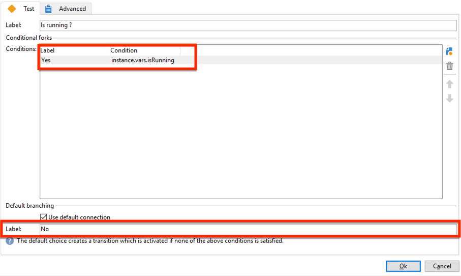
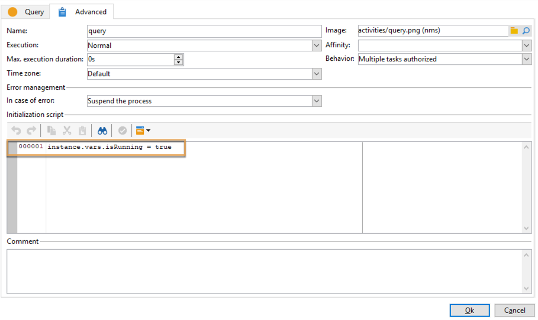
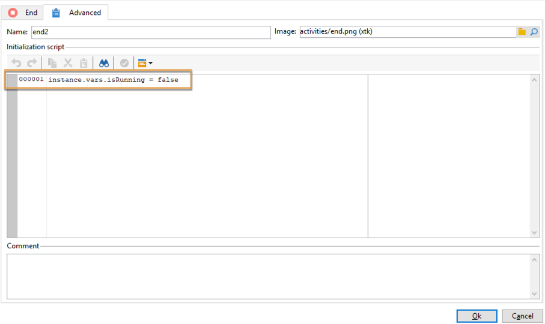

# データ更新の調整{#coordinating-data-updates}

このユースケースは、1 つのワークフローを複数実行する場合に同時更新を管理できるワークフローの作成の詳細を示します。

この目的は、別の更新操作を実行する前に、更新プロセスが終了していることを確認することです。そのためには、インスタンス変数を設定し、インスタンスが実行中かどうかワークフローに確認させて、ワークフローの実行を継続し、更新をおこなうべきか決定します。

このワークフローは次の要素から構成されます。

* 特定の頻度でワークフローを実行する&#x200B;**スケジューラー**&#x200B;アクティビティ。
* 既にワークフローが実行しているかどうかを確認する&#x200B;**テスト**&#x200B;アクティビティ。
* ワークフローがまだ実行していない場合の&#x200B;**クエリ**&#x200B;アクティビティおよび&#x200B;**データを更新**&#x200B;アクティビティ。その後に実行され、ワークフローインスタンス変数を false に再初期化する&#x200B;**終了**&#x200B;アクティビティ。
* ワークフローが既に実行している場合の&#x200B;**終了**&#x200B;アクティビティ。

ワークフローを構築するには、以下の手順に従います。

1. **スケジューラー**&#x200B;アクティビティを追加し、必要に応じて頻度を設定します。
1. ワークフローが既に実行しているかどうかを確認する&#x200B;**テスト**&#x200B;アクティビティを追加し、次のように設定します。

   >[!NOTE]
   >
   >「isRunning」は、この例のために選択したインスタンス変数名です。これは、ビルトイン変数ではありません。

   

1. 「**いいえ**」の分岐に&#x200B;**終了**&#x200B;アクティビティを追加します。これにより、既にワークフローが実行している場合は、何も実行されません。
1. 「**はい**」の分岐に、必要なアクティビティを追加します。この例では、**クエリ**&#x200B;アクティビティおよび&#x200B;**データを更新**&#x200B;アクティビティです。
1. 最初のアクティビティを開き、「**[!UICONTROL 詳細設定]**」タブで **instance.vars.isRunning = true** コマンドを追加します。これにより、インスタンス変数が実行中に設定されます。

   

1. **終了**&#x200B;アクティビティを「**[!UICONTROL はい]**」の分岐の最後に追加し、「**[!UICONTROL 詳細設定]**」タブで **instance.vars.isRunning = false** コマンドを追加します。

   これにより、ワークフローが実行している間は、何も実行されません。

   

**関連トピック：**

* [複数の同時実行の防止](monitor-workflow-execution.md#preventing-simultaneous-multiple-executions)
* [ 「データを更新」アクティビティ](update-data.md)
