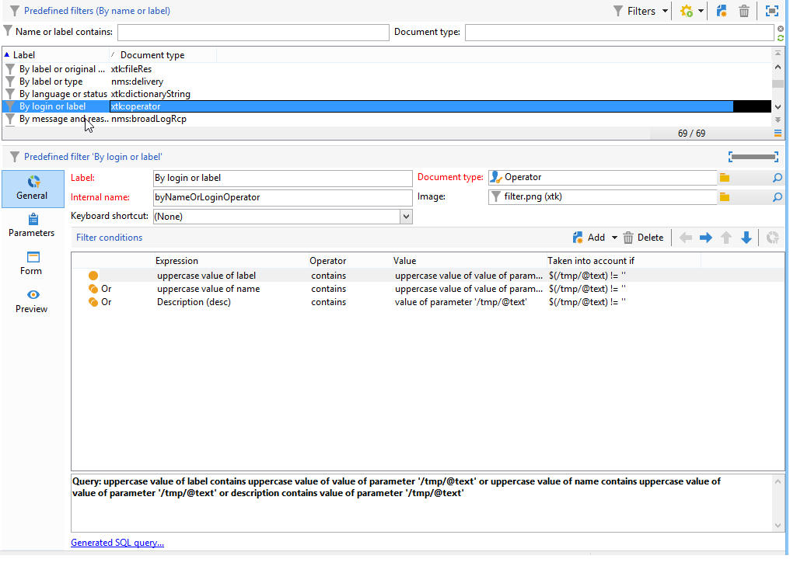

# フィルターの作成 {#creating-a-filter}

Adobe Campaignで使用可能なフィルターは、[ クエリエディター](../../v8/start/query-editor.md)でクエリを作成する場合と同じ操作モードを使用して作成されるフィルター条件を使用して定義されます。

**[!UICONTROL 管理/設定/定義済みフィルター]** ノードには、すべてのデフォルトフィルターが含まれています。 そのうちのいくつかはリストや概要で使用されます。 [組み込みの定義済みフィルター](../../v8/audiences/create-filters.md)について詳しく説明します。

例えば、オペレーターのリストを「**[!UICONTROL アクティブなアカウント]**」でフィルターできます。

対応するフィルターには、「**[!UICONTROL オペレーター]**」スキーマの「**[!UICONTROL 無効なアカウント]**」の値に対するクエリが含まれています。

同じリストで、「**[!UICONTROL ログインまたはラベル別]**」フィルターを使用して、フィルターフィールドに入力した値に基づいてリストのデータをフィルターできます。

このフィルターは次のように設計されています。

フィルター条件に一致するには、オペレーターアカウントは次のいずれかの条件を満たしている必要があります。

* ラベルに、入力フィールドに入力された文字が含まれている
* オペレーター名に、入力フィールドに入力された文字が含まれている
* 説明領域の内容に、入力フィールドに入力された文字が含まれている

>[!NOTE]
>
>**[!UICONTROL Upper]** 関数を使用すると、大文字と小文字を区別する機能を無効にすることができます。

「**[!UICONTROL 次の場合に考慮]**」列では、これらのフィルター条件の適用基準を定義できます。 ここでは、文字 **$(/tmp/@text)** は、フィルターにリンクされた入力フィールドの内容を表します。

ここでは、**$(/tmp/@text)=&#39;代理店&#39;** となっています。

**$（/tmp/@text）!=&quot;**&#x200B;式は、入力フィールドが空でない場合に各条件を適用します。
