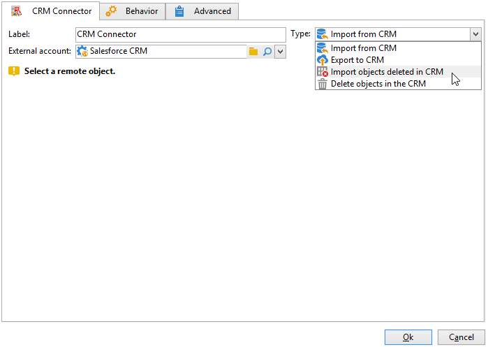
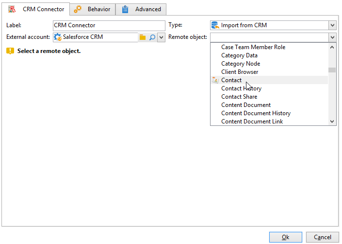

# CRM コネクタ{#crm-connector}

**CRM コネクタ**&#x200B;アクティビティを使用すると、Adobe Campaign と CRM システムの間のデータ同期を設定できます。

このアクティビティを使用すると、次のことができます。

* CRM からのインポート
* CRM へのエクスポート
* CRM で削除されたオブジェクトのインポート
* CRM 内のオブジェクトの削除

同期対象とする CRM に対応する外部アカウントを選択し、同期するオブジェクト（アカウント、オポチュニティ、連絡先など）を選択します。

Adobe Campaign の CRM コネクタについて詳しくは、[この節](https://experienceleague.adobe.com/docs/campaign/campaign-v8/connect/ac-crm/crm.html?lang=ja){target="_blank"}を参照してください。
