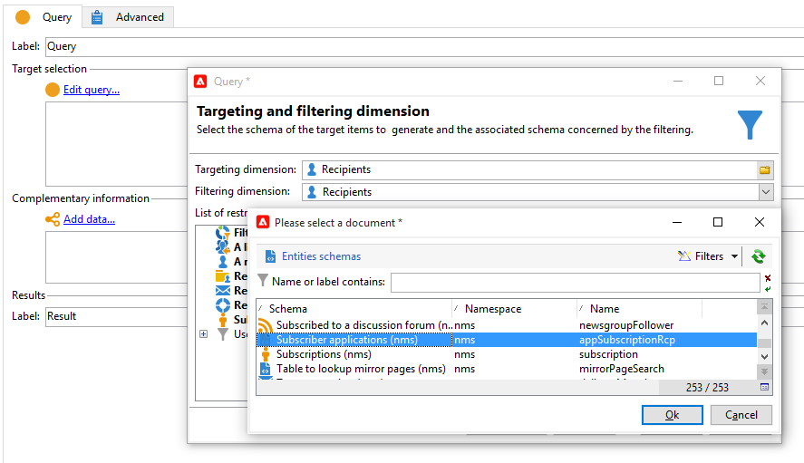
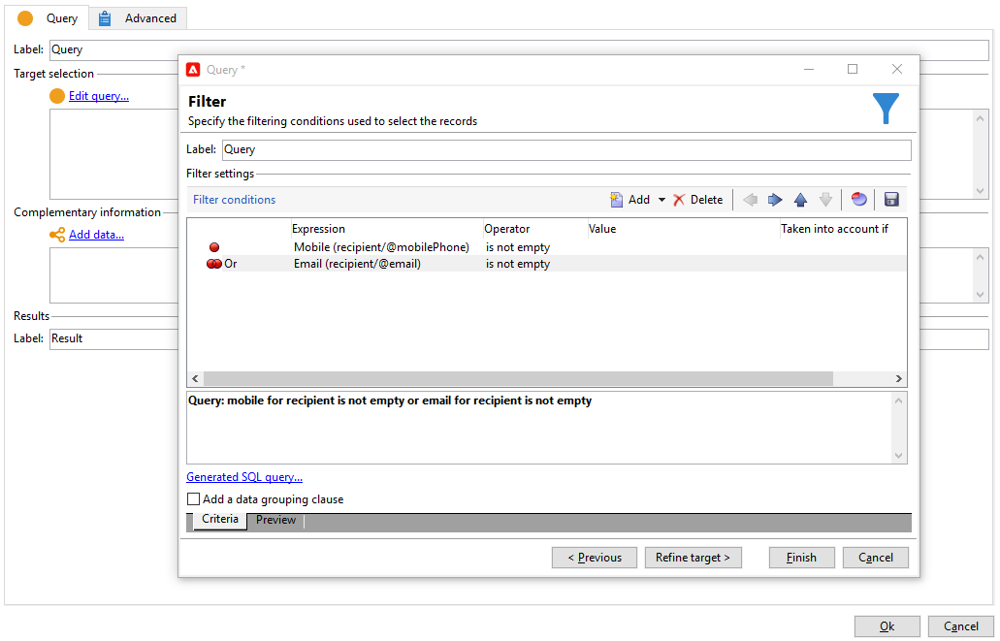
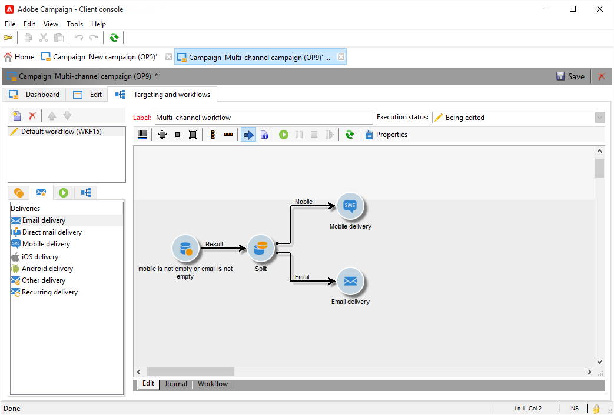
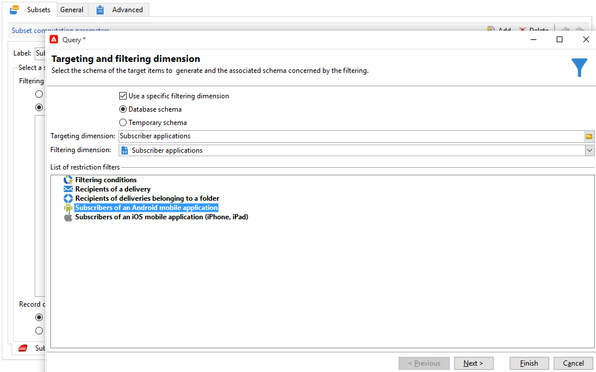
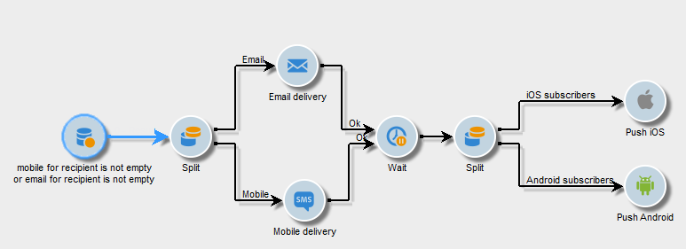

# クロスチャネル配信{#cross-channel-deliveries}

クロスチャネル配信は、キャンペーンワークフローアクティビティの「**[!UICONTROL 配信]**」タブから使用可能です。

配信のベースとするテンプレートを選択し、そのコンテンツを定義します。

各種ターゲティングアクティビティを使用して、ワークフローの配信アップストリームのターゲットを指定できます。

以下の例では、プッシュ通知購読者にメールまたは SMS を送信してから 1 週間後にプッシュ通知を通知するワークフローを作成する方法を説明します。手順は次のとおりです。

1. キャンペーンを作成します。
1. キャンペーンの「**[!UICONTROL ターゲティングとワークフロー]**」タブで、**[!UICONTROL クエリ]**&#x200B;アクティビティを追加します。
1. クエリを設定します。ターゲットディメンションとしてプッシュ通知を購読している受信者を選択します。

   >[!NOTE]
   >
   >プッシュ通知の場合は、**購読者のアプリケーション**&#x200B;のターゲットディメンションを使用します。

   

1. クエリにフィルター条件を追加します。この場合、モバイル番号または E メールアドレスを持つ受信者を選択します。

   

1. ワークフローに&#x200B;**[!UICONTROL 分割]**&#x200B;アクティビティを追加して、モバイル番号を持つ受信者と E メールアドレスを持つ受信者を分割します。
1. 「**[!UICONTROL 配信]**」タブで、各ターゲットに対する配信を選択します。

   ワークフローの配信アクティビティをダブルクリックして、従来の配信ウィザードと同じ方法で配信を作成します。詳しくは、こちらを参照してください。

   

1. 受信者が一度に多くの配信を受信しないように、**[!UICONTROL 待機]**&#x200B;アクティビティを追加および設定します。
1. **[!UICONTROL 分割]**&#x200B;アクティビティを追加して、iOS または Android モバイルアプリケーションの購読者を分割します。

   各オペレーティングシステム用のサービスを選択します。サービスの作成について詳しくは、こちらを参照してください。

   

1. 各オペレーティングシステム用のモバイルアプリケーション配信を選択および設定します。

   
