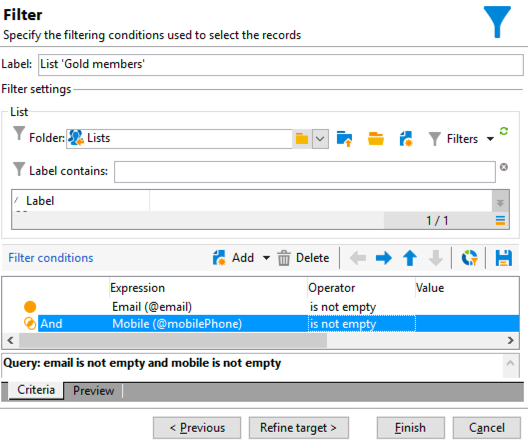
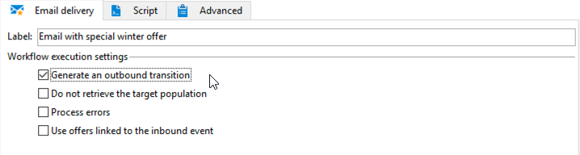
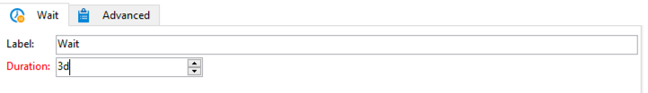
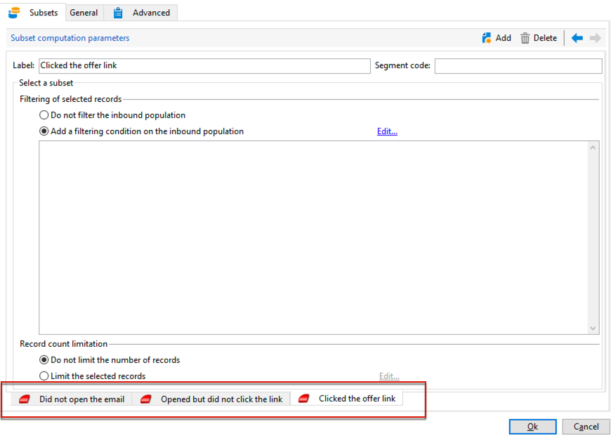
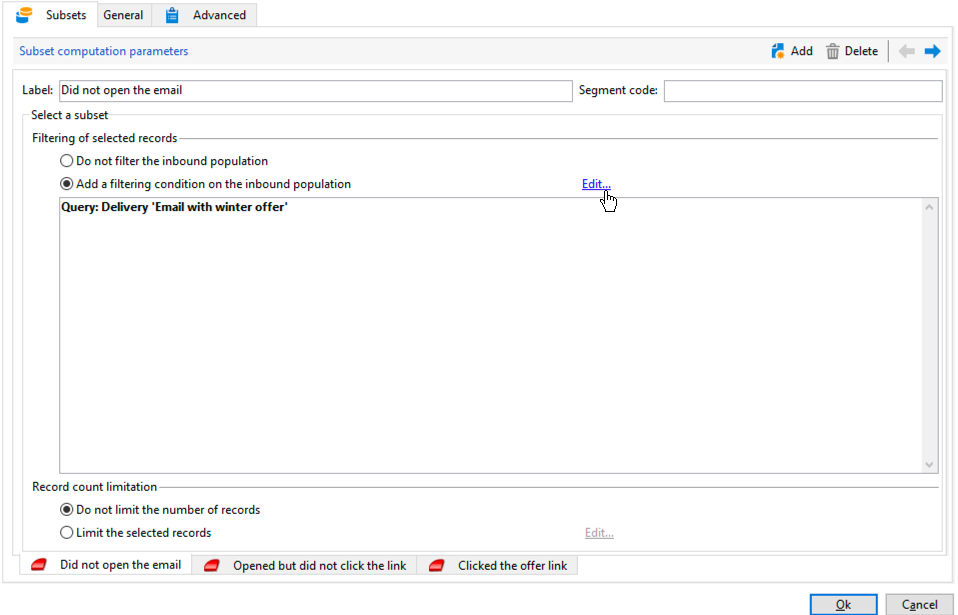
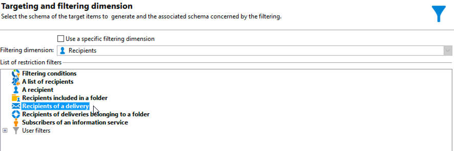
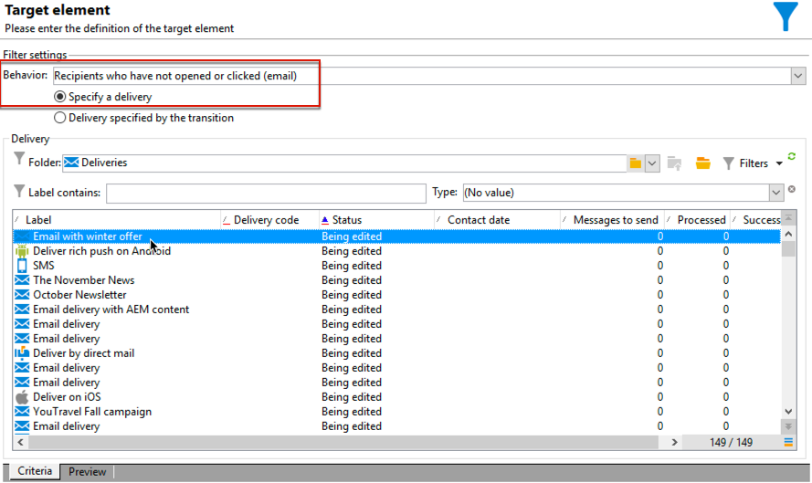
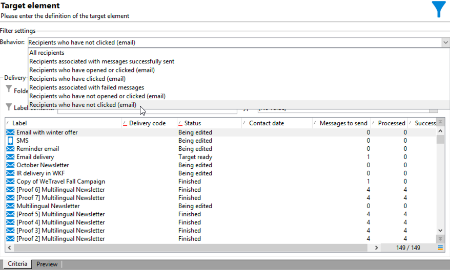
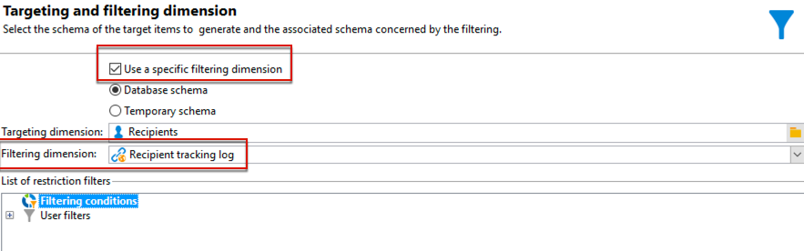
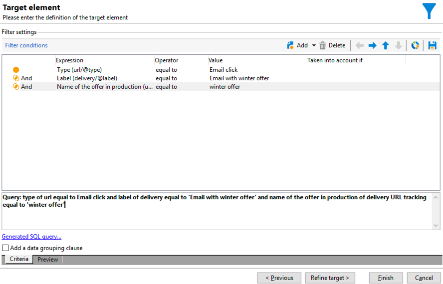

# クロスチャネル配信ワークフロー{#cross-channel-delivery-workflow}

この使用例では、クロスチャネル配信ワークフローに関する例を示します。クロスチャネル配信の一般的な概念については、[この節](cross-channel-deliveries.md)で説明しています。

ここでは、1 つのグループに E メールを送信し、もう 1 つのグループに SMS メッセージを送信することを目的に、データベースの受信者からオーディエンスを別々のグループにセグメント化します。

この使用例の主な実装手順は次のとおりです。

1. オーディエンスをターゲットとする&#x200B;**[!UICONTROL クエリ]**&#x200B;アクティビティを作成する。
1. オファーへのリンクを含む **[!UICONTROL E メール配信]**&#x200B;アクティビティを作成する。
1. **[!UICONTROL 分割]**&#x200B;アクティビティを使用して、以下を実行する。

   * 最初の E メールを開封しなかった受信者に別の E メールを送信する。
   * E メールを開封したが、オファーへのリンクをクリックしなかった受信者に SMS を送信する。
   * E メールを開封し、オファーへのリンクをクリックした受信者をデータベースに追加する。

## 手順 1:オーディエンスの構築 {#step-1--build-the-audience}

ターゲットを定義するために、受信者を特定するクエリを作成します。

1. キャンペーンを作成します。詳しくは、こちらを参照してください。
1. キャンペーンの「**[!UICONTROL ターゲティングとワークフロー]**」タブで、ワークフローに&#x200B;**クエリ**&#x200B;アクティビティを追加します。このアクティビティの使用について詳しくは、[この節](query.md)を参照してください。
1. 配信を受信する受信者を定義します。例えば、ターゲットディメンションとして「ゴールド」メンバーを選択します。
1. クエリにフィルター条件を追加します。この例では、E メールアドレスと携帯電話番号を持つ受信者を選択します。

   

1. 変更を保存します。

## 手順 2:オファーを含む E メールの作成 {#step-2--create-an-email-including-an-offer}

1. E メール配信を作成します。
1. メッセージをデザインし、オファーを含むリンクをコンテンツに挿入します。

   

   メッセージ本文へのオファーの組み込みについて詳しくは、こちらを参照してください。

1. 変更を保存します。
1. **[!UICONTROL E メール配信]**&#x200B;アクティビティを右クリックして開きます。
1. 母集団とトラッキングログを取得するために、「**[!UICONTROL アウトバウンドトランジションを生成]**」オプションを選択します。

   

   この情報を使用して、最初の E メールを受信したときの受信者の行動に基づいて別の配信を送信することができます。

1. 受信者が E メールを開封するのを数日待つための&#x200B;**[!UICONTROL 待機]**&#x200B;アクティビティを追加します。

   

## 手順 3:結果のオーディエンスをセグメント化 {#step-3--segment-the-resulting-audience}

ターゲットを特定し、最初の配信を作成した後は、フィルター条件を使用してターゲットを別々の母集団にセグメント化する必要があります。

1. **分割**&#x200B;アクティビティをワークフローに追加し、開きます。このアクティビティの使用について詳しくは、[この節](split.md)を参照してください。
1. クエリでアップストリームを計算した母集団から 3 つのセグメントを作成します。

   

1. 1 番目のサブセットでは、「**[!UICONTROL インバウンド母集団に対するフィルター条件を追加]**」オプションを選択し、「**[!UICONTROL 編集]**」をクリックします。

   

1. 制限フィルターとして「**[!UICONTROL 配信の受信者]**」を選択し、「**[!UICONTROL 次へ]**」をクリックします。

   

1. フィルター設定で、「**[!UICONTROL 行動]**」ドロップダウンリストから「**[!UICONTROL (E メールを) 開封またはクリックしなかった受信者]**」を選択し、送信するオファーを含んだ E メールを配信リストから選択します。「**[!UICONTROL 終了]**」をクリックします。

   

1. 2 番目のサブセットでも同様に、「**[!UICONTROL 行動]**」ドロップダウンリストから「**[!UICONTROL （E メールを）クリックしていない受信者]**」を選択します。

   

1. 3 番目のサブセットでは、「**[!UICONTROL インバウンド母集団に対するフィルター条件を追加]**」を選択し、「**[!UICONTROL 編集]**」をクリックして、「**[!UICONTROL 特定のフィルタリングディメンションを使用]**」オプションを選択します。
1. 「**[!UICONTROL フィルタリングディメンション]**」ドロップダウンリストから「**[!UICONTROL 受信者トラッキングログ]**」を選択し、「**[!UICONTROL 制限フィルターのリスト]**」から「**[!UICONTROL フィルター条件]**」をハイライトして、「**[!UICONTROL 次へ]**」をクリックします。

   

1. 次のようにフィルター条件を選択します。

   

1. 「**[!UICONTROL 完了]**」をクリックして変更を保存します。

## 手順 4:ワークフローを最終化 {#step-4--finalize-the-workflow}

1. **[!UICONTROL 分割]**&#x200B;アクティビティから 3 つのサブセットを生成した後、次のように関連アクティビティをワークフローに追加します。

   * 1 番目のサブセットにリマインダーの E メールを送信する **[!UICONTROL E メール配信]**&#x200B;アクティビティを追加します。
   * 2 番目のサブセットに SMS メッセージを送信する&#x200B;**[!UICONTROL モバイル配信]**&#x200B;アクティビティを追加します。
   * 対応する受信者をデータベースに追加する&#x200B;**[!UICONTROL リスト更新]**&#x200B;アクティビティを追加します。

1. ワークフローの配信アクティビティをダブルクリックして編集します。メールと SMS の作成について詳しくは、こちらを参照してください。
1. **[!UICONTROL リスト更新]**&#x200B;アクティビティをダブルクリックし、「**[!UICONTROL アウトバウンドトランジションを生成]**」オプションを選択します。

   これで、得られた受信者を Adobe Campaign から Adobe Experience Cloud にエクスポートすることができます。例えば、次を追加して、Adobe Target でオーディエンスを使用できます。

1. アクションバーの「**開始**」ボタンをクリックして、ワークフローを実行します。

**クエリ**&#x200B;アクティビティでターゲティングされた母集団はセグメント化され、受信者の行動に基づいて、E メール配信か SMS 配信を受信します。残りの母集団は、**[!UICONTROL リスト更新]**&#x200B;アクティビティを使用して、データベースに追加されます。
