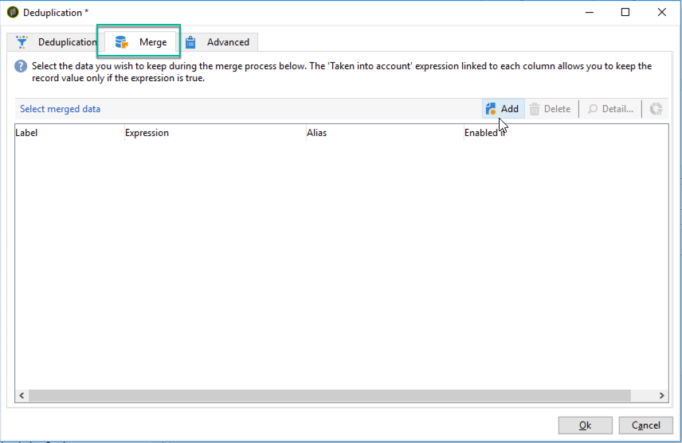

# 重複排除アクティビティの結合機能の使用 {#deduplication-merge}

## このユースケースについて {#about-this-use-case}

このユースケースでは、「**[!UICONTROL 重複排除]**」アクティビティで&#x200B;**[!UICONTROL 結合]**&#x200B;機能を使用する方法を説明します。

この機能について詳しくは、[この節](deduplication.md#merging-fields-into-single-record)を参照してください。

**[!UICONTROL 重複排除 - 重複]**&#x200B;アクティビティは、データセットから重複行を削除するために使用します。 この使用例では、次のデータが E メールフィールドに基づいて複製されます。

| 最終変更日 | 名 | 姓 | 電子メール | 携帯電話 | 電話 |
|-----|------------|-----------|-------|--------------|------|
| 2020/5/19 | Robert | Tisner | bob@mycompany.com | 444-444-444 | 777-777-7777 |
| 2020/7/22 | Bobby | Tisner | bob@mycompany.com |  | 777-777-7777 |
| 2020/10/03 | Bob |  | bob@mycompany.com |  | 888-888-8888 |

重複排除 - 重複アクティビティの&#x200B;**[!UICONTROL 結合]**&#x200B;機能を使用して、重複排除 - 重複の一連のルールを設定し、単一の結果データレコードに結合するフィールドのグループを定義できます。 例えば、一連の重複レコードでは、最も古い電話番号または最新の名前を保持するように選択できます。

## 結合機能の有効化 {#activating-merge}

結合機能を有効にするには、まず&#x200B;**[!UICONTROL 重複排除 - 重複]**&#x200B;アクティビティを設定する必要があります。 それをおこなうには、次の手順に従います。

1. アクティビティを開き、「**[設定を編集]**」リンクをクリックします。

1. 重複排除 - 重複に使用する紐付けフィールドを選択し、「**[!UICONTROL 次へ]**」をクリックします。 この例では、E メールフィールドに基づいて重複除外をおこないます。

   

1. 「**[!UICONTROL 詳細設定パラメーター]**」リンクをクリックし、「**[!UICONTROL レコードを結合]**」および「**[!UICONTROL 複数レコードの結合条件を使用]**」オプションを有効にします。

   

1. 「**[!UICONTROL 結合]**」タブが&#x200B;**[!UICONTROL 重複排除 - 重複]**&#x200B;設定画面に追加されます。 このタブを使用して、重複排除 - 重複の実行時に結合するデータを指定します。

## 結合するフィールドの設定 {#configuring-rules}

データを単一のレコードに結合する際に使用するルールを次に示します。

* 最新の名前（名と姓の各フィールド）を保持し、
* 最新の携帯電話を保持し、
* 最も古い電話番号を保持します。
* 最終レコードに適格なグループ内のすべてのフィールドは、null 以外である必要があります。

これらのルールを設定するには、次の手順に従います。

1. 「**[!UICONTROL 結合]**」タブを開き、「**[!UICONTROL 追加]**」ボタンをクリックします。

   

1. 結合するフィールドのグループの識別子とラベルを指定します。

   

1. 考慮するレコードを選択する条件を指定します。

   

1. 最新の名前を選択するために、最終変更日に並べ替えます。

   

1. 結合するフィールドを選択します。この例では、姓と名のフィールドを保持します。

   

1. 結合するデータのセットにフィールドが追加され、新しい要素がワークフロースキーマに追加されます。

   以下の手順を繰り返して、携帯電話および電話のフィールドを設定します。

   

   

## 結果 {#results}

これらのルールを設定した後、**[!UICONTROL 重複排除 - 重複]**&#x200B;アクティビティの最後に次のデータを受け取ります。

| 変更日 | 名 | 姓 | 電子メール | 携帯電話 | 電話 |
|-----|------------|-----------|-------|--------------|------|
| 2020/5/19 | Robert | Tisner | bob@mycompany.com | 444-444-444 | 777-777-7777 |
| 2020/7/22 | Bobby | Tisner | bob@mycompany.com |  | 777-777-7777 |
| 2020/10/03 | Bob |  | bob@mycompany.com |  | 888-888-8888 |

前述のルールに従って、3 つのレコードから結果が結合されます。 比較後、最新の名前と携帯電話が、元の電話番号と共に使用されていると結論付けられます。

| 名 | 姓 | 電子メール | 携帯電話 | 電話 |
|------------|-----------|-------|--------------|------|
| Bobby | Tisner | bob@mycompany.com | 444-444-4444 | 888-888-8888 |

>[!NOTE]
>
> 結合された名は「Bobby」です。これは、名と姓の両方のフィールドで構成される「名前」ルールを設定したからです。
>
>その結果、「Bob」（最新の名前）は、関連付けられた姓のフィールドが空であるため、考慮に入れられませんでした。 姓と名の最新の組み合わせが最終レコードに結合されました。
