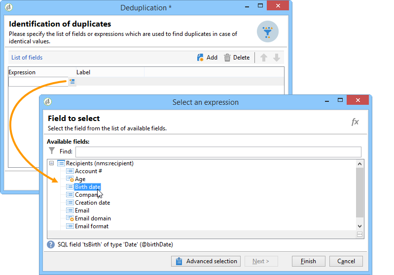
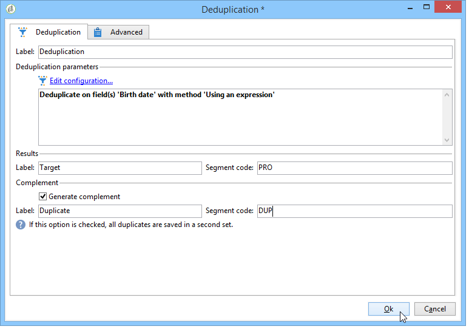

# 重複排除{#deduplication}

重複排除は、インバウンドアクティビティの結果から重複を削除します。重複排除は、メールアドレス、電話番号やその他のフィールドに対して実行されます。

**[!UICONTROL 重複排除 - 重複]**&#x200B;アクティビティは、データセットから重複行を削除するために使用します。 例えば、以下のレコードは、同じメールアドレスと同じ携帯電話、または自宅の電話を持つ重複と見なすことができます。

| 最終変更日 | 名 | 姓 | 電子メール | 携帯電話 | 電話 |
-----|------------|-----------|-------|--------------|------
| 2020/02/03 | Bob | Tisner | bob@mycompany.com | 444-444-4444 | 888-888-8888 |
| 2020/05/19 | Robert | Tisner | bob@mycompany.com | 444-444-4444 | 777-777-7777 |
| 2020/07/22 | Bobby | Tisner | bob@mycompany.com | 444-444-4444 | 777-777-7777 |

**[!UICONTROL 重複排除 - 重複]**&#x200B;アクティビティには、重複を識別した後、行全体を一意のレコードとして保持する機能があります。 例えば、上記の使用例で、アクティビティが最も古い&#x200B;**[!UICONTROL 日付]**&#x200B;のレコードのみを保持するように設定されている場合、結果は次のようになります。

| 日付 | 名 | 姓 | 電子メール | 携帯電話 | 電話 |
-----|----------|------------|-------|--------------|------
| 2020/02/03 | Bob | Tisner | bob@mycompany.com | 444-444-4444 | 888-888-8888 |

選択したメインレコードは、フィールドデータと重複行の他の関連データを結合せずに、データを繰り越します。

補集合：

| 日付 | 名 | 姓 | 電子メール | 携帯電話 | 電話 |
-----|------------|-----------|-------|--------------|------
| 2020/05/19 | Robert | Tisner | bob@mycompany.com | 444-444-4444 | 777-777-7777 |
| 2020/07/22 | Bobby | Tisner | bob@mycompany.com | 444-444-4444 | 777-777-7777 |

## ベストプラクティス {#best-practices}

重複排除の実行中、インバウンドフローは個別に処理されます。例えば、受信者 A がクエリ 1 とクエリ 2 の結果に見つかった場合、それらは重複排除されません。

この問題は、次のように対処されます。

* 各インバウンドフローを統合する「**和集合**」アクティビティを作成します。
* 「**和集合**」アクティビティの後に、「**重複排除**」アクティビティを作成します。

## 設定 {#configuration}

重複排除を設定するには、ラベル、メソッド、重複排除条件、および結果に関するオプションを入力します。

1. 「**[!UICONTROL 設定を編集...]**」リンクをクリックし、データの重複排除モードを定義します。

   

1. このアクティビティのターゲットのタイプ（デフォルトでは重複排除 - 重複は受信者にリンクされます）と使用する条件（つまり、同じ値を使用して重複を識別できるフィールド）を選択します。

   >[!NOTE]
   >
   >外部ファイルなどの外部データを入力として使用する場合は、必ず「**[!UICONTROL 一時スキーマ]**」オプションを選択してください。
   >
   >次の手順で、「**[!UICONTROL その他]**」オプションで使用される基準または条件を選択できます。

   

1. 値が同じ場合は、次の手順で「**[!UICONTROL その他]**」オプションで使用される基準または条件を選択できます。

   

1. ドロップダウンリストから、使用する重複排除メソッドを選択し、保持する重複の数を入力します。

   

   次のメソッドを使用できます。

   * **[!UICONTROL 自動選択]**：保持するレコードが重複からランダムに選択されます。
   * **[!UICONTROL 値のリストの使用]**：1 つまたは複数のフィールドの優先度の値を定義します。優先度の値を定義するには、フィールドを選択するか式を作成し、適切なフィールドに値を追加します。新しいフィールドを定義するには、値のリストの上の「**[!UICONTROL 新規]**」ボタンをクリックします。

      

   * **[!UICONTROL 空でない値]**：選択した式の値が空でないレコードを優先して保持できます。

      

   * **[!UICONTROL 式の使用]**：所定の式の値が、最小（または最大）であるレコードを保持します。

      
   >[!NOTE]
   >
   >**[!UICONTROL 結合]**&#x200B;機能は、**[!UICONTROL 詳細設定パラメーター]**&#x200B;リンクからアクセスでき、フィールドまたはフィールドのグループを 1 つの結果データレコードに結合するための一連のルールを設定できます。 この点について詳しくは、[フィールドを単一のレコードに結合する](#merging-fields-into-single-record)を参照してください。

1. 「**[!UICONTROL 完了]**」をクリックして、選択した重複排除メソッドを承認します。

   ウィンドウの中央部に定義した設定の概要が表示されます。

   アクティビティエディターの下側で、グラフィカルオブジェクトのアウトバウンドトラジションのラベルを変更し、アクティビティの結果に関連するセグメントコードを入力できます。このコードは後の手順で、ターゲット条件として使用できます。

   

1. 残りの母集団を利用するには、「**[!UICONTROL 補集合を生成]**」オプションをチェックします。補集合はすべての重複から構成されます。その後、次の図のように、追加のトランジションがアクティビティに追加されます。

   

## 例：配信前の重複の特定 {#example--identify-the-duplicates-before-a-delivery}

次の例では、重複排除は 3 つのクエリの重複排除を処理します。

ワークフローの目的は、同じ受信者に何度も配信が送信されないように、重複を除外した配信ターゲットを定義することです。

さらに、特定された重複は、必要に応じて再利用できるように、専用の重複リストにまとめられます。

1. 上の図に示すように、ワークフローの操作に必要な各種アクティビティを追加してリンクします。

   ここで使用される和集合アクティビティは、3 つのクエリを 1 つのトランジションに統合します。このため、重複排除は各クエリに個別に作用するのではなく、クエリ全体に対して作用します。詳しくは、[ベストプラクティス](#best-practices)を参照してください。

1. 重複排除アクティビティを開き、「**[!UICONTROL 設定を編集...]**」リンクをクリックして、重複排除モードを定義します。
1. 新規ウィンドウで、「**[!UICONTROL データベーススキーマ]**」を選択します。
1. 「**受信者**」をターゲティングとフィルタリングディメンションを選択します。
1. 各 E メールアドレスに対して配信が 1 回だけ送信されるように、**[!UICONTROL E メール]**&#x200B;の重複用の ID フィールドを選択し、「**[!UICONTROL 次へ]**」をクリックします。

   特定のフィールドの重複 ID をベースにしたい場合、「**[!UICONTROL その他]**」を選択して使用可能なフィールドのリストを表示します。

1. 複数の受信者に対して同じメールアドレスが検出された場合、1 つのエントリのみを保持するように選択します。
1. 重複の検出時に保存されるレコードがランダムに選択されるように「**[!UICONTROL 自動選択]**」重複排除モードを選択して「**[!UICONTROL 終了]**」をクリックします。

ワークフローを実行した場合、重複が検出されたすべての受信者は結果から除外され（結果的に配信からも除外される）、重複リストに追加されます。このリストを再利用することで、重複を再度検出しなくてもすみます。

## フィールドの結合による単一データレコードの作成 {#merging-fields-into-single-record}

**[!UICONTROL 結合]**&#x200B;機能を使用すると、重複排除 - 重複の一連のルールを設定して、単一の結果データレコードに結合するフィールドまたはフィールドのグループを定義できます。

例えば、一連の重複レコードでは、最も古い電話番号または最新の名前を保持するように選択できます。

この機能を利用する使用例については、[この節](deduplication-merge.md)を参照してください。

それをおこなうには、次の手順に従います。

1. **[!UICONTROL 重複排除 - 重複方法]**&#x200B;の選択手順で、**[!UICONTROL 詳細設定パラメーター]**&#x200B;リンクをクリックします。

   

1. 「**[!UICONTROL レコードを結合]**」オプションを選択して、機能を有効にします。

   各結合条件で複数のデータフィールドをグループ化する場合は、「**[!UICONTROL 複数のレコード結合条件を使用]**」オプションを有効にします。

   

1. 機能を有効化した後、「**[!UICONTROL 結合]**」タブが&#x200B;**[!UICONTROL 重複排除 - 重複]**&#x200B;アクティビティに追加されます。 結合するフィールドのグループと、それらに関連付けられたルールを定義できます。

   詳しくは、[この節](deduplication-merge.md)で詳しく説明している使用事例を参照してください。

## 入力パラメーター {#input-parameters}

* tableName
* schema

各インバウンドイベントは、これらのパラメーターによって定義されるターゲットを指定する必要があります。

## 出力パラメーター {#output-parameters}

* tableName
* schema
* recCount

この 3 つの値セットは、重複排除によって生成されたターゲットを識別します。**[!UICONTROL tableName]** はターゲットの識別子を保存するテーブル名、**[!UICONTROL schema]** は母集団のスキーマ（通常は nms:recipient）、**[!UICONTROL recCount]** はテーブル内の要素の数です。

補集合に関連付けられたトランジションは、同じパラメーターを持ちます。
