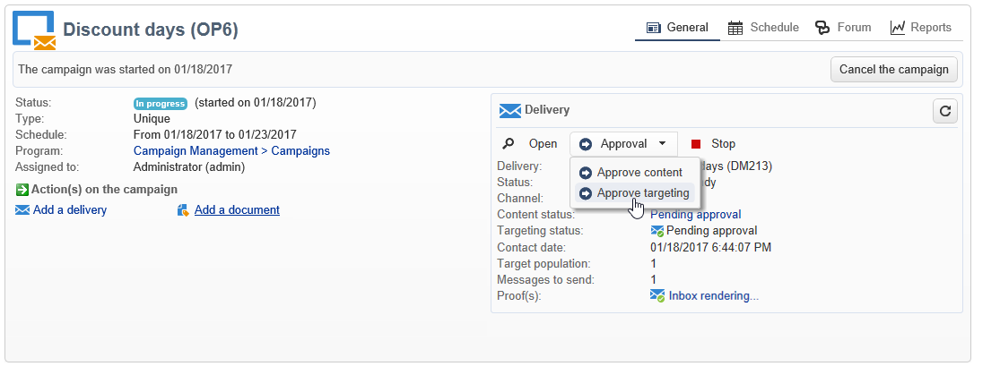

# 承認の定義 {#defining-approvals}


承認により、オペレーターはワークフロー管理に関する意思決定をおこなったり、実行の継続を確定したりできます。

オペレーターのグループにメッセージが送信され、ワークフローは応答を待って再開します。ワークフローは停止せず、その他の操作が実行されます。例えば、複数の保留中の承認が同時に存在する場合があります。

承認には、オペレーターが選択できるオプションが複数含まれていることがあります。ただし、オペレーターに実行してもらうタスク（ターゲティングの実施など）を送信するために、選択肢の数を 1 つに制限することもできます。オペレーターは、そのタスクが実行された後で、応答できるようになります（その後、プロセスが再開します）。次の例に、これらの承認タイプを示します。


操作では、承認が必要なすべてのステージは、同じ原則に基づきます。



承認の例については、こちらを参照してください。

オペレーターは、2 つの方法（メールメッセージ内にリンクされた Web ページを使用するか、コンソール経由）のいずれかで、応答できます。

>[!NOTE]
>
>いったん保存した応答は、変更できません。

## メールによる承認 {#sending-emails}

Web ページへのリンクが記載された承認メッセージを受け取り、ページ上で応答することができます。ターゲット済みのオペレーターが、承認 E メールを受け取るようにするには、オペレーターの E メールアドレスが入力されている必要があります。入力していない場合、オペレータは応答にコンソールを使用する必要があります。

オペレーターの管理について詳しくは、こちらを参照してください。

承認の E メールは、継続的に送信されます。デフォルトの配信テンプレートは **[!UICONTROL notifyAssignee]** です。**[!UICONTROL 管理／キャンペーン管理／テクニカル配信テンプレート]**&#x200B;フォルダーに保存されています。このシナリオは、カスタマイズ可能です。テンプレートのコピーを作成して、アクティビティごとに編集することをお勧めします。

このテンプレートを使用して作成された配信は、**[!UICONTROL 管理／プロダクション／自動作成オブジェクト／テクニカル配信／ワークフロー通知]**&#x200B;フォルダーに保存されます。

## コンソールからの承認 {#approval-via-the-console}

操作では、承認される要素はキャンペーンダッシュボードに表示されます。

テクニカルワークフローについては、ユーザーが承認できるタスクは、**[!UICONTROL 管理／プロダクション／自動作成オブジェクト／承認待ち]**&#x200B;フォルダーのツリー構造からアクセスできます。


## グループ {#groups}

承認は、フィルター条件を使用して選択されたオペレーターのグループ、1 人のオペレーター、またはオペレーターセットに割り当てられます。

1. 最もシンプルな承認形態は、オペレーターの応答と同時にタスクが完了することです。その他のオペレーターが応答を試みた場合、既に別のオペレータによって応答済みであると通知されます。
1. 複数の承認について詳しくは、[複数の承認](#multiple-approval)を参照してください。

承認をおこなうオペレーターグループには、個人ではなく、役割または機能を指名します。例えば、「ハリーのグループ」ではなく、「キャンペーンの予算」グループの方が適切です。グループには、タスクを承認するオペレーターを最低でも 2 人以上含めることをお勧めします。オペレーターが 2 人いれば、1 人が不在の場合にもう 1 人が応答できます。

## 有効期限 {#expirations}

有効期限による特定の遷移は、さまざまなタイプのアクティビティ、特に承認で使用されます。有効期限を使用すると、応答が一定の時間なかった場合にアクションをトリガーできます。 また、ワークフローを追跡し別のグループに承認を割り当てる場合などにも使用できます。

アクティビティの承認プロパティの 2 番目のタブで、1 つ以上の有効期限を定義できます。さらに、複数の有効期限タイプを定義できます。


新しい有効期限を追加するには、「**[!UICONTROL 追加]**」をクリックします。作成される有効期限ごとに、トランジションが追加されます。次の操作をおこなうことができます。

* リスト内でセルをクリックする（または F2 キーを押す）ことで、代表的なパラメーターを変更できます。
* または、「**[!UICONTROL 詳細...]**」ボタンをクリックすることで、式を編集できます。

>[!NOTE]
>
>有効期限は時系列で処理されるので、順序を指定する必要はありません。

「**[!UICONTROL タスクを終了しない]**」オプションを選択した場合、遅延の発生時に承認がアクティブのままになります。このモードでは、承認をアクティブにしたまま、リマインダーを管理をできます。オペレーターは引き続き応答できます。このオプションはデフォルトでは無効になっています。有効期限に達したタスクは完了したと見なされ、期限後にオペレーターが応答することはありません。

次の 4 つのタイプの有効期限を作成できます。

* **タスク開始後の遅延**：指定された長さの時間を、承認が有効化された日付に追加することで、有効期限が計算されます。
* **指定した日付の後の遅延**：指定された長さの時間を、指定した日付に追加することで、有効期限が計算されます。
* **指定した日付の前の遅延**：指定された長さの時間を、指定した日付から引くことで、有効期限が計算されます。
* **スクリプトによって有効期限を計算**：有効期限は、JavaScript を使用して計算されます。

   次の例では、（**vars.deliveryId** によって識別される）配信開始日付の 24 時間前に有効期限を計算します。

   ```
   var delivery = nms.delivery.get(vars.deliveryId)
   var expiration = delivery.scheduling.contactDate
   var oneDay = 1000*60*60*24
   expiration.setTime(expiration.getTime() - oneDay)
   return expiration
   ```

## 複数の承認 {#multiple-approval}

複数の承認は、すべての承認オペレーターが応答できるようにするメカニズムです。トランジションは応答ごとに有効化されます。

複数の承認は、投票または調査のメカニズムに有用です。期日を追加することで、所定の期間が経過した後に回答数を数え、結果を処理することができます。

## 必要な権限 {#required-rights}

承認リクエストに応答できるように、グループ内のオペレーターには少なくとも次の権限が必要です。

* ワークフローへの書き込み権限
* 承認するタスクが含まれているフォルダーへの読み取り/書き込み権限

「ワークフローの実行」グループにはこれらの 3 つの権限が付与されています。このグループに追加されたオペレーターは、承認リクエストに応答する権限を持ちます。
