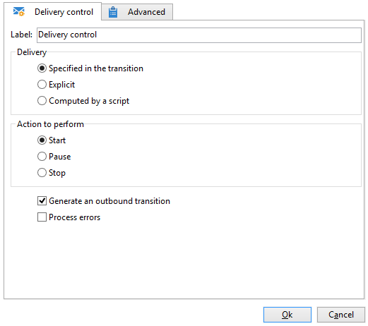

# 配信コントロール{#delivery-control}

「**配信コントロール**」タイプアクションでは、配信を開始、一時停止、または中止できます。

これは、トランジション内で指定された配信、明示的に選択された配信、またはスクリプトで自動生成された配信です。詳しくは、[配信](delivery.md)を参照してください。

「**[!UICONTROL 開始]**」を選択した場合、アクティビティは配信の開始に必要なすべての手順を実行します（ターゲットの計算、コンテンツの準備、配信）。これらの手順の一部が、先行のワークフローアクティビティによって実行されている場合、再度実行されることはありません。例えば、ターゲットの推定が「**[!UICONTROL 配信]**」タイプアクティビティによって既に実行されている場合（[配信](delivery.md)を参照）、「**[!UICONTROL 配信に基づくアクション]**」アクティビティが残りの手順を開始します（コンテンツの準備と配信）。

次のオプションを使用できます。

* **[!UICONTROL アウトバウンドトランジションを生成]**

   実行の終了時に有効化される出力トランジションを生成します。アウトバウンド配信のターゲットを取得するかどうかを選択できます。

* **[!UICONTROL エラーを処理]**

   [エラーを処理](monitor-workflow-execution.md#processing-errors)を参照してください。

## 入力パラメーター {#input-parameters}

* deliveryId

「**[!UICONTROL トランジション内で指定]**」アクションが選択されている場合の配信 ID。
