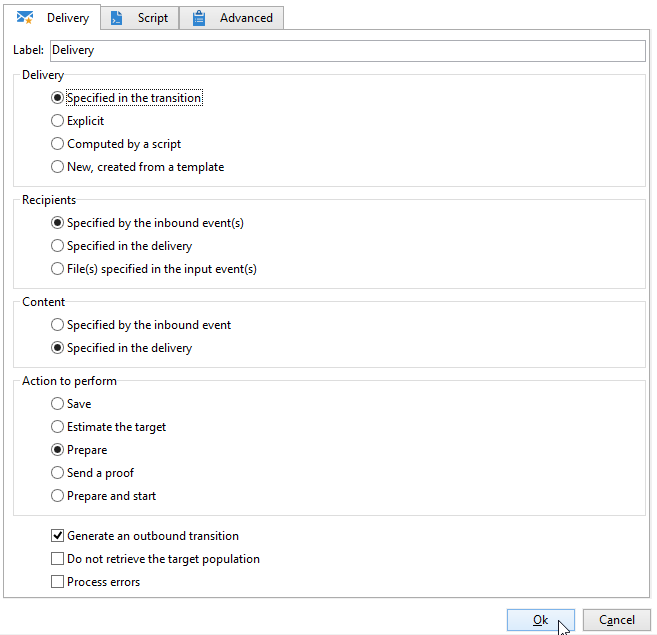
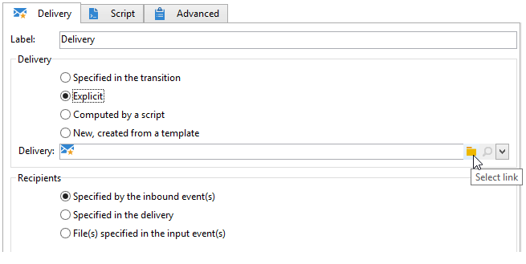
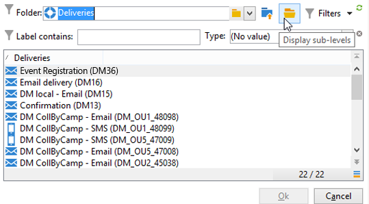
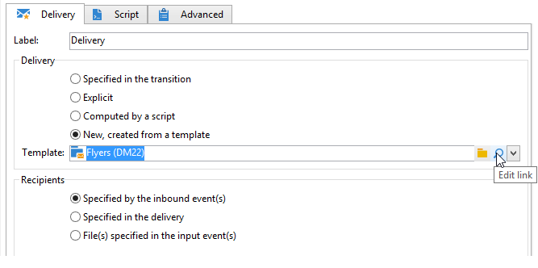
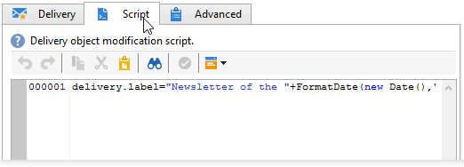

# 配信{#delivery}


「**配信**」タイプのアクティビティで配信アクションを作成できます。入力要素を使用して構築できます。

設定するには、アクティビティを編集して、配信オプションを入力します。



1. **配信**

   次の操作をおこなうことができます。

   * インバウンドトランジションで指定された配信に対して実行します。それには、ウィンドウの「**[!UICONTROL 配信]**」セクションにある 1 番目のオプションを選択します。

      このオプションは、先行するワークフローアクティビティが既に配信を作成または指定済みの場合に使用できます。これは、以下に示すように、アウトバウンドトランジションを生成していた同じタイプのアクティビティによって、完了している場合があります。

      次の例では、初回の配信が作成されます。母集団とコンテンツは、後から定義されます。次に、これらの 3 つの要素の情報は、インバウンドトランジションを使用する新しい配信アクティビティに再入力され、送信できるようになります。

      

   * 対象の配信を直接選択します。それには、「**[!UICONTROL 明示]**」オプションを選択して、「**[!UICONTROL 配信]**」フィールドのドロップダウンリストから配信を選択します。

      このリストには、デフォルトで、「**配信**」フォルダー内にある終了していない配信が表示されます。その他のキャンペーンにアクセスするには、「**[!UICONTROL リンクを選択]**」アイコンをクリックします。

      

      「**[!UICONTROL フォルダー]**」フィールドのドロップダウンリストからキャンペーンを選択するか、「**[!UICONTROL サブレベルを表示]**」をクリックしてサブフォルダー内に含まれているすべての配信を表示します。

      

      配信アクションを選択した後で、「**[!UICONTROL リンクを編集]**」アイコンをクリックして、コンテンツを表示できます。

   * 配信を自動生成するスクリプトを作成します。それには、「**[!UICONTROL スクリプトで処理]**」オプションを選択し、スクリプトを入力します。「**[!UICONTROL 編集...]**」オプションをクリックして、入力ウィンドウを開きます。次の例では、配信の ID を収集します。

      

   * 新しい配信を作成します。それには、「**[!UICONTROL 新規（テンプレートから作成）]**」オプションを選択し、配信のベースとなる配信テンプレートを選択します。

      

      選択したテンプレートのコンテンツを確認するには、「**[!UICONTROL リンクを選択]**」アイコンをクリックしてフォルダーを参照し、「**[!UICONTROL リンクを編集]**」アイコンをクリックします。

1. **受信者**

   受信者は、ファイルインポート後のイベントや、配信アクションで指定されたイベントなど、インバウンドイベントによって指定できます。また、受信者は、1 つまたは複数のファイルに保存できます。

   

1. **コンテンツ**

   メッセージのコンテンツは、配信内またはインバウンドイベント内に定義できます。

   

1. **実行するアクション**

   配信を作成して、準備して開始し、ターゲットを推定したり、配達確認を送信することができます。

   

   実行するアクションのタイプを選択します。

   * **[!UICONTROL 保存]**：配信を作成して保存できます。配信の分析や配信はおこないません。
   * **[!UICONTROL ターゲットを推定]**：配信ターゲットを自動生成し、可能性を評価します（最初の分析フェーズ）。このアクションは、配信を「**[!UICONTROL 配信]**」経由でメインターゲットに送信する場合に「**[!UICONTROL ターゲットとする母集団を推定]**」オプションを選択し、「**分析**」をクリックするのと同等です。
   * **[!UICONTROL 準備]**：完全な分析プロセスを実行できます（ターゲットの計算とコンテンツの準備）。配信は送信されません。このアクションは、配信を「**[!UICONTROL 配信]**」を使用してメインターゲットに送信する場合に、「**[!UICONTROL 可能な限り早く配信]**」オプションを選択し、「**分析**」をクリックするのと同等です。
   * **[!UICONTROL 配達確認を送信]**：配信の配達確認を送信できます。このアクションは、「**[!UICONTROL 配信]**」で配信のツールバーから「**配達確認を送信**」ボタンをクリックするのと同等です。
   * **[!UICONTROL 準備と開始]**：完全な分析プロセス（ターゲットの計算とコンテンツの準備）を起動し、配信を送信します。このアクションは、「**[!UICONTROL 配信]**」を使用して配信をメインターゲットに送信する場合に、「**[!UICONTROL 可能な限り早く配信]**」、「**[!UICONTROL 分析]**」、「**配信を確定**」オプションの順にクリックするのと同等です。

   ワークフローで後から使用される「**[!UICONTROL 配信に基づくアクション]**」アクティビティを使用して、配信の開始に必要な残りの手順を開始できます（ターゲットの計算、コンテンツの準備、配信）。詳しくは、[配信コントロール](delivery-control.md)を参照してください。

   さらに、次のオプションを使用できます。

   * **[!UICONTROL アウトバウンドトランジションを生成]**

      実行の終了時に有効化される出力トランジションを生成します。アウトバウンド配信のターゲットを取得するかどうかを選択できます。

   * **[!UICONTROL ターゲット母集団を取得しない]**

      外部への配信アクションのターゲットを取得しません。

   * **[!UICONTROL エラーを処理]**

      [配信コントロール](delivery-control.md)を参照してください。
   「**スクリプト**」タブで、配信パラメーターを編集できます。

   

## 例：配信ワークフロー {#example--delivery-workflow}

新しいワークフローを作成し、次の図に示すようにアクティビティを追加します。


「**配信**」アクティビティを開き、次の手順でプロパティを定義します。

* 「**[!UICONTROL 配信]**」セクションで、「**[!UICONTROL 新規（テンプレートから作成）]**」を選択し、配信テンプレートを選択します。
* 「**[!UICONTROL 受信者]**」セクションで、「**[!UICONTROL 配信テンプレートで指定]**」を選択します。
* 「**[!UICONTROL 実行するアクション]**」セクションで、「**[!UICONTROL 準備]**」オプションを選択したままにします。


「**[!UICONTROL OK]**」をクリックしてプロパティウィンドウを閉じます。以上で、新しい配信の作成と準備から成るアクティビティが設定されました。新しい配信は、配信ターゲットが指定される配信テンプレートに基づきます。

「**承認**」アクティビティを開き、次の手順でプロパティを定義します。

1. 「**[!UICONTROL 割り当てタイプ]**」フィールドで、登録していたグループを選択します。admin アカウントを使用して接続している場合、管理者グループを選択します。
1. 次に、タイトルを入力して、メッセージの本文に次のテキストを挿入します。

   ```
   Do you wish to approve delivery (<%= vars.recCount %> recipient(s))?
   ```

   これは JavaScript で記述された式を含むメッセージです。**[!UICONTROL vars.recCount]** は、前のタスクの配信のターゲットとなった受信者数を表します。JavaScript 式について詳しくは、[JavaScript のスクリプトとテンプレート](javascript-scripts-and-templates.md)を参照してください。

   

   承認タスクについて詳しくは、[承認](approval.md)を参照してください。

## 入力パラメーター {#input-parameters}

「**[!UICONTROL 配信]**」セクションで「**[!UICONTROL トランジション内で指定]**」オプションが選択されている場合の配信 ID。

* deliveryId
* tableName
* schema

各インバウンドイベントは、これらのパラメーターによって定義されるターゲットを指定する必要があります。

>[!NOTE]
>
>このパラメーターは、「**[!UICONTROL 受信者]**」セクションで、「**[!UICONTROL インバウンドイベントで指定]**」オプションが選択されている場合に表示されます。

* filename

   「**[!UICONTROL 受信者]**」セクションで、「**[!UICONTROL インバウンドイベントで指定]**」オプションが選択されている場合に、完全なファイル名が生成されます。

* contentId

   「**[!UICONTROL コンテンツ]**」セクションで「**[!UICONTROL インバウンドイベントで指定]**」オプションが選択されている場合のコンテンツ ID。

## 出力パラメーター {#output-parameters}

* tableName
* スキーマ
* recCount

この 3 つの値セットは、配信によって生成されたターゲットを識別します。**[!UICONTROL tableName]** はターゲットの識別子を記憶するテーブル名、**[!UICONTROL schema]** は母集団のスキーマ（通常は nms:recipient）、**[!UICONTROL recCount]** はテーブル内の要素の数です。

補集合に関連付けられたトランジションは、同じパラメーターを持ちます。

>[!NOTE]
>
>「**[!UICONTROL ターゲット母集団を取得しない]**」オプションが選択されている場合、出力パラメーターはありません。
