# カスタム日付フィールドを使用したメールエンリッチメント{#email-enrichment-with-custom-date-fields}


この例では、今月の誕生日を祝う受信者にカスタム日付フィールドを含む E メールを送信します。E メールには、誕生日の前後 1 週間有効なクーポンが含まれます。

**[!UICONTROL 分割]**&#x200B;アクティビティで、今月の誕生日を祝う受信者をリストから選んでターゲットにする必要があります。次に、**[!UICONTROL エンリッチメント]**&#x200B;アクティビティを使用すると、カスタム日付フィールドが E メール内で顧客向け特別オファーの有効期限日として機能します。


この例を作成するには、次の手順に従います。

1. キャンペーンの「**[!UICONTROL ターゲティングとワークフロー]**」タブで、**[!UICONTROL リスト読み込み]**&#x200B;アクティビティをドラッグ＆ドロップして、受信者のリストをターゲットにします。
1. 処理されるリストは、選択したオプションおよびここで定義したパラメーターに応じて、明示的に指定されるか、スクリプトで処理されるか、動的にローカライズされます。

   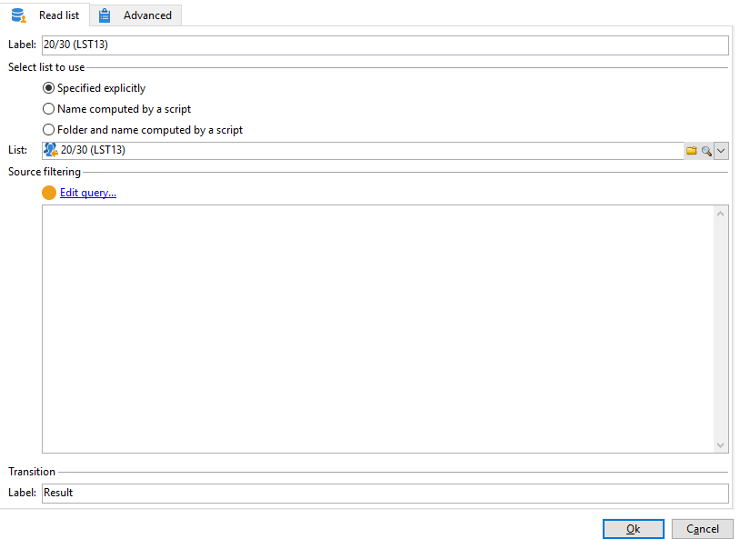

1. **[!UICONTROL 分割]**&#x200B;アクティビティを追加して、今月の誕生日を祝う受信者を他の受信者と区別します。
1. リストを分割するには、「**[!UICONTROL 選択したレコードのフィルター]**」カテゴリで、「**[!UICONTROL インバウンド母集団に対するフィルター条件を追加]**」を選択します。次に、「**[!UICONTROL 編集]**」をクリックします。

   

1. **[!UICONTROL フィルター条件]**&#x200B;を選択してから、「**[!UICONTROL 式を編集]**」ボタンをクリックして、受信者の誕生日の月をフィルターします。

   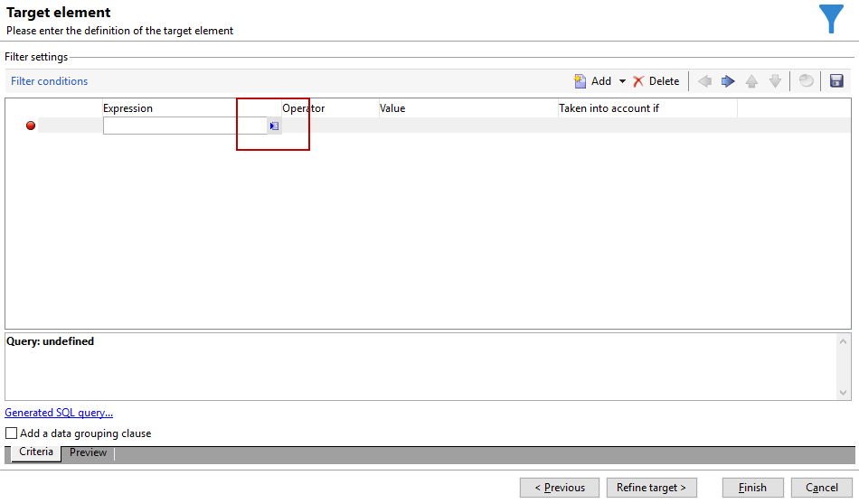

1. 「**[!UICONTROL 高度な選択]**」をクリックしてから「**[!UICONTROL 式を使用して数式を編集]**」をクリックし、式 Month(@birthDate) を追加します。
1. **[!UICONTROL オペレーター]**&#x200B;列で、「**[!UICONTROL 次と等しい]**」を選択します。
1. 「**[!UICONTROL 値]**」に現在の日付の月 Month(GetDate()) を追加することで、さらに条件をフィルターします。

   これは、誕生日の月が今月に対応する受信者をクエリします。

   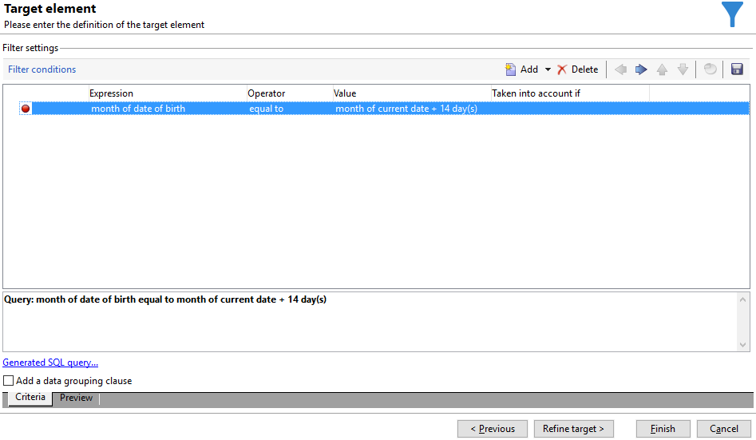

1. 「**[!UICONTROL 終了]**」をクリックします。次に、**[!UICONTROL 分割]**&#x200B;アクティビティの「**[!UICONTROL 一般]**」タブで、「**[!UICONTROL 結果]**」カテゴリの「**[!UICONTROL 補集合を生成]**」をクリックします。

   **[!UICONTROL 補集合]**&#x200B;の結果がある場合、配信アクティビティを追加するか、リストを更新できます。ここで、**[!UICONTROL 終了]**&#x200B;アクティビティを追加しました。

   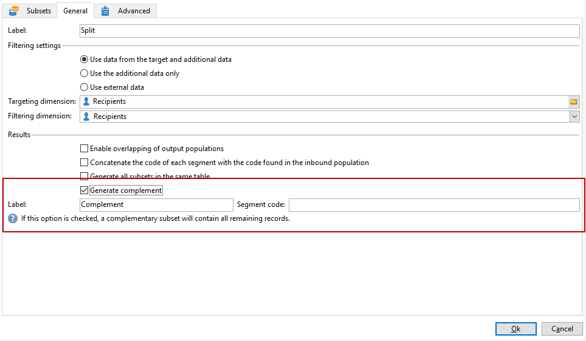

次に&#x200B;**[!UICONTROL エンリッチメント]**&#x200B;アクティビティを設定する必要があります。

1. サブセットの後に&#x200B;**[!UICONTROL エンリッチメント]**&#x200B;アクティビティを追加して、カスタム日付フィールドを追加します。

   

1. **[!UICONTROL エンリッチメント]**&#x200B;アクティビティを開きます。「**[!UICONTROL 補足情報]**」カテゴリで、「**[!UICONTROL データを追加]**」をクリックします。

   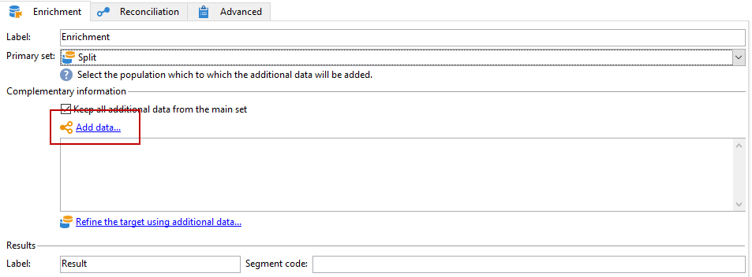

1. 「**[!UICONTROL フィルタリングディメンションにリンクされたデータ]**」を選択してから、「**[!UICONTROL フィルタリングディメンションのデータ]**」を選択します。
1. 「**[!UICONTROL 追加]**」ボタンをクリックします。

   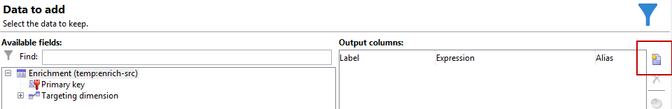

1. **[!UICONTROL ラベル]**&#x200B;を追加します。**[!UICONTROL 式]**&#x200B;列で、「**[!UICONTROL 式を編集]**」をクリックします。

   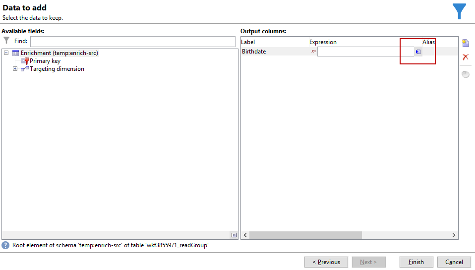

1. 最初に、誕生日の前の週を「**有効期間の開始日**」としてターゲットにし、続く「**[!UICONTROL 式]**」に `SubDays([target/@birthDate], 7)` を指定する必要があります。

   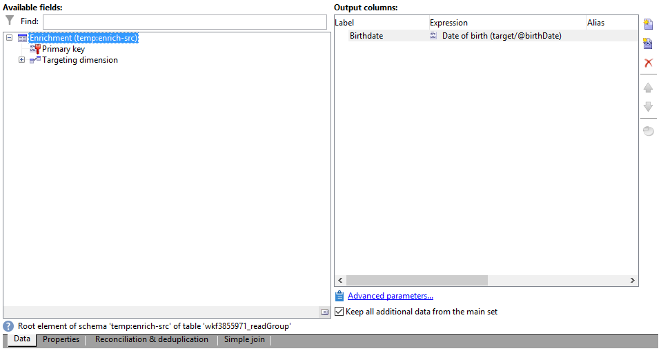

1. 次に、誕生日の後の週をターゲットにするカスタム日付フィールド「**有効期間の終了日**」を作成するために、「**[!UICONTROL 式]**」に `AddDays([target/@birthDate], 7)` を追加する必要があります。

   式にラベルを追加できます。

   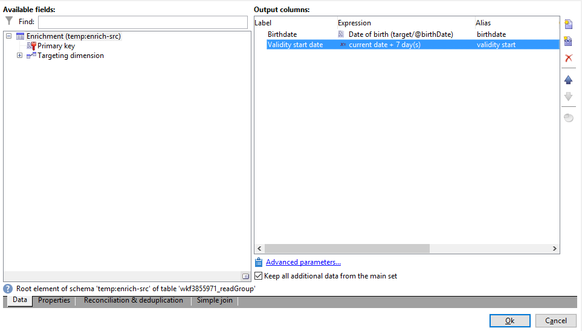

1. 「**[!UICONTROL OK]**」をクリックします。エンリッチメントの準備ができました。

**[!UICONTROL エンリッチメント]**&#x200B;アクティビティの後に、配信を追加できます。ここでは、今月の誕生日を祝う顧客への有効期限付きの特別オファーを受信者に送信する E メール配信を追加しました。

1. **[!UICONTROL エンリッチメント]**&#x200B;アクティビティの後に、**[!UICONTROL E メール配信]**&#x200B;アクティビティをドラッグ＆ドロップします。

   

1. **[!UICONTROL E メール配信]**&#x200B;アクティビティをダブルクリックして、配信のパーソナライズを開始します。
1. 配信に&#x200B;**[!UICONTROL ラベル]**&#x200B;を追加し、「**[!UICONTROL 続行]**」をクリックします。
1. 「**[!UICONTROL 保存]**」をクリックして E メール配信を作成します。
1. E メール配信&#x200B;**[!UICONTROL プロパティ]**&#x200B;の「**[!UICONTROL 承認]**」タブで、「**[!UICONTROL 送信前に配信を確定する]**」オプションがオンになっていることを確認します。

   次に、ワークフローを開始して、アウトバウンドトランジションをターゲット情報でエンリッチメントします。

   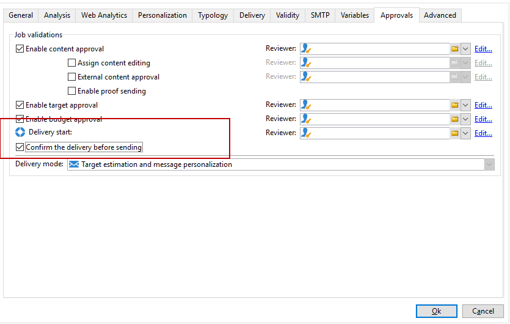

これで、**[!UICONTROL エンリッチメント]**&#x200B;アクティビティで作成したカスタム日付フィールドを含む E メール配信のデザインを開始できます。

1. **[!UICONTROL E メール配信]**&#x200B;アクティビティをダブルクリックします。
1. ターゲット式を E メールに追加します。有効期限日のフォーマットを設定するために、次の式の内部にある必要があります。

   ```
   <%=
           formatDate(targetData.alias of your expression,"%2D.%2M")  %>
   ```

1. クリック  .**[!UICONTROL ターゲット式]**&#x200B;を選択してから、**[!UICONTROL エンリッチメント]**&#x200B;アクティビティで前に作成したカスタム有効期限日を選択して、ターゲット式を formatDate 式に追加します。

   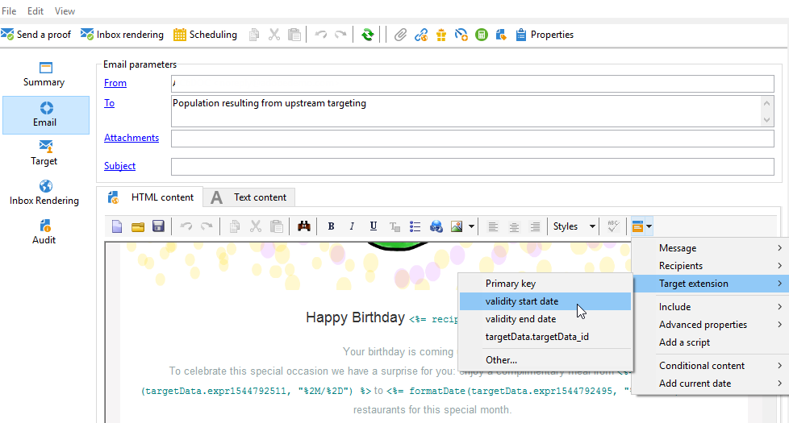

1. 必要に応じて、E メールコンテンツを設定します。

   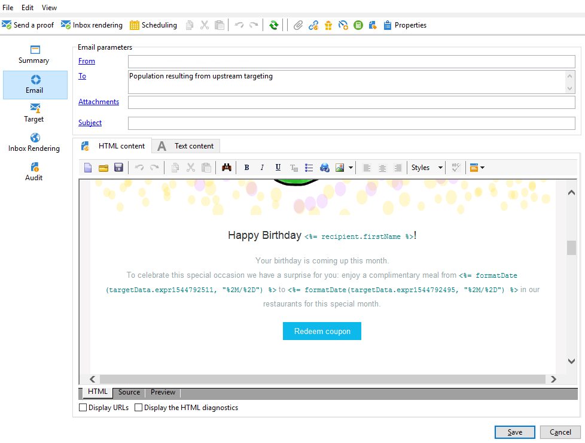

1. E メールをプレビューして、カスタム日付フィールドが正しく設定されているかどうかを確認します。

   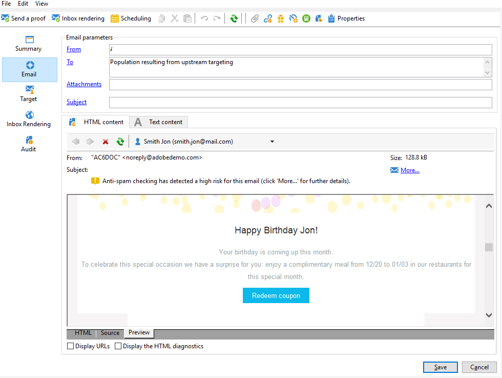

E メールの準備ができました。配達確認の送信を開始し配信を確定して、誕生日 E メールを送信できます。
