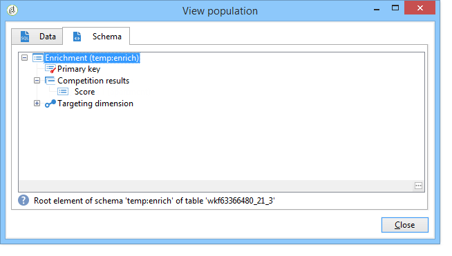
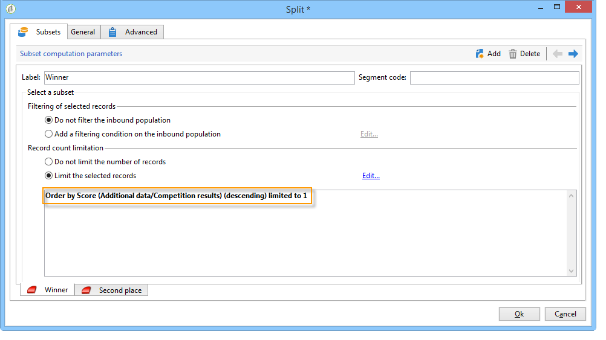

# データのエンリッチメント{#enriching-data}

## データのエンリッチメントについて {#about-enriching-data}

この使用例では、ターゲティングワークフローの「**[!UICONTROL エンリッチメント]**」アクティビティの使用方法を詳しく説明します。「**[!UICONTROL エンリッチメント]**」アクティビティの使用について詳しくは、[エンリッチメント](enrichment.md)を参照してください。

E メール配信にカスタム日付を含めてエンリッチメントする方法の使用例については、[この節](email-enrichment-with-custom-date-fields.md)でも説明します。

Web アプリケーション経由での競争への参加を案内する内容が、マーケティングデータベースの連絡先に送られます。競合の結果は、「**[!UICONTROL 競合の結果]**」テーブルに復元されます。このテーブルは、連絡先テーブル（**[!UICONTROL 受信者]**）にリンクされています。「**[!UICONTROL 競合の結果]**」テーブルには、以下のフィールドがあります。

* 競合名（@game）
* トライアル番号（@trial）
* スコア（@score）

「**[!UICONTROL 受信者]**」テーブル内の連絡先は「**[!UICONTROL 競合の結果]**」テーブルの複数の行とリンクしています。これら 2 つのテーブルの関係は 1 対 n になります。以下に受信者についての結果ログの例を示します。

この使用例の目的は、最新の競争に参加した参加者に対し、各自の最高スコアに応じて、パーソナライズされた配信をおこなうことにあります。全体で最高のスコアを獲得した受信者には 1 位の賞が、2 番目にスコアの高かった受信者には次点の賞が送られ、その他の受信者は、次回に幸運があるようにとのメッセージを受け取ります。

この使用例を設定するうえで、以下のターゲティングワークフローを作成しました。

ワークフローを作成するには、次の手順に従います。

1. 2 つの「**[!UICONTROL クエリ]**」アクティビティと 1 つの「**[!UICONTROL 積集合]**」アクティビティが、最新の競争に参加した新規のターゲット購読者に追加されます。
1. 「**[!UICONTROL エンリッチメント]**」アクティビティを使用すると、「**[!UICONTROL 競合の結果]**」テーブルに保存されているデータを追加できます。配信のパーソナライゼーションを行う「**[!UICONTROL スコア]**」フィールドは、ワークフローの作業用テーブルに追加されます。
1. 「**[!UICONTROL 分割]**」タイプのアクティビティを使用すると、スコアに基づいて受信者のサブセットを作成できます。
1. 各サブセットについて、「**[!UICONTROL 配信]**」アクティビティが 1 つ追加されます。

## 手順 1：ターゲティング {#step-1--targeting}

1 番目のクエリを使用して、過去 6 か月以内にデータベースに追加された受信者をターゲティングします。

2 番目のクエリを使用して、最新の競争に参加した受信者をターゲティングします。

次に、「**[!UICONTROL 積集合]**」タイプアクティビティを追加して、過去 6 か月以内にデータベースに追加され、かつ最新の競争に参加した受信者をターゲティングします。

## 手順 2：エンリッチメント {#step-2--enrichment}

この例では、「**[!UICONTROL 競合の結果]**」テーブルに保存されている「**[!UICONTROL スコア]**」フィールドに従って配信をパーソナライズする方法を説明します。このテーブルは、受信者テーブルと 1 対 n の関係にあります。「**[!UICONTROL エンリッチメント]**」アクティビティを使用すると、フィルタリングディメンションにリンクしたテーブルのデータを、ワークフローの作業用テーブルに追加できます。

1. 「エンリッチメント」アクティビティの編集画面で、「**[!UICONTROL データを追加]**」、「**[!UICONTROL フィルタリングディメンションにリンクされたデータ]**」を選択し、「**[!UICONTROL 次へ]**」をクリックします。

   

1. 次に、「**[!UICONTROL フィルタリングディメンションにリンクされたデータ]**」オプションを選択して「**[!UICONTROL 競合の結果]**」テーブルを選択し、「**[!UICONTROL 次へ]**」をクリックします。

   

1. ID とラベルを入力し、「**[!UICONTROL 収集されたデータ]**」フィールドで「**[!UICONTROL ライン数を制限]**」オプションを選択します。「**[!UICONTROL 取得するライン]**」フィールドで、値に「1」を選択します。各受信者について、「エンリッチメント」アクティビティにより、「**[!UICONTROL 競合の結果]**」テーブルからワークフローの作業用テーブルへと単一の行が追加されます。「**[!UICONTROL 次へ]**」をクリックします。

   

1. この例では、最新の競合に関してのみ、受信者の最高スコアを復元します。これをおこなうには、「**[!UICONTROL 競合名]**」フィールドにフィルターを追加して、以前の競合に関係するすべての行を除外します。「**[!UICONTROL 次へ]**」をクリックします。

   

1. 「**[!UICONTROL 並べ替え]**」画面に移動して「**[!UICONTROL 追加]**」ボタンをクリックし、「**[!UICONTROL スコア]**」フィールドを選択して「**[!UICONTROL 降順]**」列のチェックボックスをオンにします。これで、「**[!UICONTROL スコア]**」フィールドの項目が降順に並べ替えられます。各受信者について、エンリッチメントアクティビティが最新のゲームの最高スコアに一致する行を追加します。「**[!UICONTROL 次へ]**」をクリックします。

   

1. **[!UICONTROL 追加するデータ]**&#x200B;ウィンドウで、「**[!UICONTROL スコア]**」フィールドをダブルクリックします。各受信者について「エンリッチメント」アクティビティは「**[!UICONTROL スコア]**」フィールドのみを追加します。「**[!UICONTROL 終了]**」をクリックします。

   

「エンリッチメント」アクティビティのインバウンドトランジションを右クリックし、「**[!UICONTROL ターゲットを表示]**」を選択します。ワークテーブルには、以下のような情報があります。

リンクされたスキーマは次のようになります。

「エンリッチメント」アクティビティのアウトバウンドトランジションで、このオプションを更新します。スコアが追加された受信者にデータがリンクしていることがわかります。各受信者の最高スコアが復元されています。

一致するスキーマもエンリッチメントされています。

## 手順 3：分割と配信 {#step-3--split-and-delivery}

スコアに応じて受信者を並べ替えるには、エンリッチメントの完了後に「**[!UICONTROL 分割]**」アクティビティを追加します。

1. 1 番目（**勝者**）のサブセットは、最高のスコアを獲得した受信者が入るように定義します。これをおこなうには、レコード数の制限を定義し、スコアを降順で並べ替え、レコード数を 1 に制限します。

   

1. 2 番目（**次点**）のサブセットには、2 番目に高いスコアを獲得した受信者が入ります。設定は、1 番目のサブセットのものと同じです。

   

1. 3 番目の（**敗者**）サブセットには、残りのすべての受信者が入ります。「**[!UICONTROL 一般]**」タブに移動し、「**[!UICONTROL 補集合を生成]**」チェックボックスをオンにして、上位 2 つのスコアを獲得していない受信者すべてをターゲティングします。

   

1. 各サブセットについて、個々に別々の配信テンプレートを使用して、「**[!UICONTROL 配信]**」タイプアクティビティを追加します。

   
