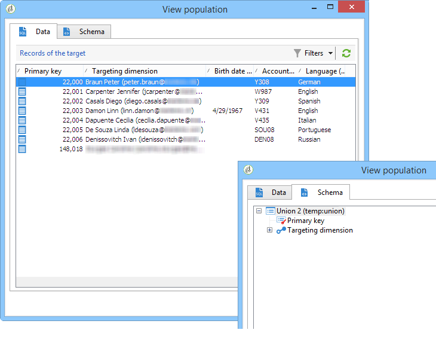
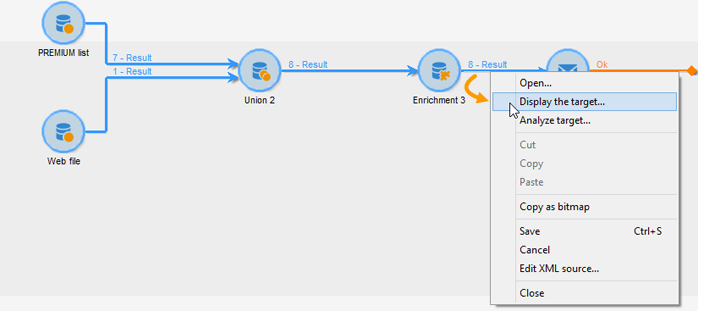

# エンリッチメント{#enrichment}


「**[!UICONTROL エンリッチメント]**」アクティビティでは、プロファイルリストに情報を追加し、リンクを既存のテーブルに追加できます（新しい結合を作成）。データベース内のプロファイルと紐付ける条件も定義できます。


## 定義 {#definitions}

エンリッチメントアクティビティを使用するには、データを追加する際に選択できる様々なオプションについて熟知している必要があります。


「**[!UICONTROL フィルタリングディメンションにリンクされたデータ]**」オプションで、次の設定が可能になります。

* フィルタリングディメンションのデータ：ワークテーブルのデータへのアクセス

* フィルタリングディメンションに関係付けられたデータ：ワークテーブルに関係付けられたデータへのアクセス


「**[!UICONTROL リンク]**」オプションにより、データベースのどのテーブルにも結合を作成できます。


次の 4 つのタイプのリンクがあります。

* **[!UICONTROL コレクションを定義]**：テーブル間で 1-N カーディナリティを持つリンクを定義できます。
* **[!UICONTROL ターゲットが常に使用可能であるリンクを定義]**：テーブル間で 1-1 カーディナリティを持つリンクを定義できます。結合条件は、ターゲットテーブル内の 1 つのレコードで定義される必要があります。
* **[!UICONTROL データベース内にターゲットが存在しない可能性があるリンクを定義]**：テーブル間で 0-1 カーディナリティを持つリンクを定義できます。結合条件は、ターゲットテーブル内のゼロまたは 1 つ（最大）のレコードで定義される必要があります。

   このオプションの設定は、**[!UICONTROL エンリッチメント]**&#x200B;アクティビティの&#x200B;**[!UICONTROL 追加データを編集]**&#x200B;リンクからアクセスできる「**[!UICONTROL 単純結合]**」タブでおこないます。

* **[!UICONTROL 複数のオプションで参照を検索してリンクを定義]**：このタイプのリンクは、一意のレコードに対する紐付けを定義します。Adobe Campaign は、一意のレコードへの参照を格納するターゲットテーブルに外部キーを追加する方法で、ターゲットテーブルへのリンクを作成します。

   このオプションの設定は、**[!UICONTROL エンリッチメント]**&#x200B;アクティビティの&#x200B;**[!UICONTROL 追加データを編集]**&#x200B;リンクからアクセスできる「**[!UICONTROL 紐付けと重複排除]**」タブでおこないます。

エンリッチメントアクティビティのコンテキストでの操作に関する使用例については、次の節でも説明します。

* [カスタム日付フィールドを使用した E メールエンリッチメント](email-enrichment-with-custom-date-fields.md).
* [データのエンリッチメント](enrich-data.md)
* [サマリーリストの作成](create-a-summary-list.md)

## 情報の追加 {#adding-information}

「**[!UICONTROL エンリッチメント]**」アクティビティを使用して作業用テーブルに列を追加します。このアクティビティは、クエリアクティビティの補完として使用できます。

追加の列の設定について詳しくは、[データの追加](query.md#adding-data)を参照してください。

「**[!UICONTROL プライマリセット]**」フィールドでは、インバウンドトラジションを選択できます。アクティビティの作業用テーブルのデータはエンリッチメントされます。

「**[!UICONTROL データを追加]**」リンクをクリックして、追加するデータのタイプを選択します。オファーされるデータタイプのリストの内容は、プラットフォームにインストールしたモジュールとオプションによって異なります最小構成の場合、いつでもフィルタリングディメンションとリンクへ関係付けられたデータを追加できます。


以下の例では、アウトバウンドトラジションは、ターゲットプロファイルの年齢に関する情報でエンリッチメントされています。


エンリッチメントのステージに移行する前に、エンリッチメントアクティビティのインバウンドトラジションを右クリックしてデータを確認します。


ワークテーブルには、次のデータと関連付けられたスキーマが含まれています。




エンリッチメントステージの出力でこの操作を繰り返します。



年齢プロファイルに関係付けられたデータが追加されているのを確認できます。


一致するスキーマもエンリッチメントされています。

## 追加データの管理 {#managing-additional-data}

以前に定義した追加データを保持する必要がない場合は、「**[!UICONTROL メインセットからのすべての追加データを維持]**」オプションの選択を解除します。この場合、エンリッチメントアクティビティで選択した追加の列のみが、送信用ワークテーブルに追加されます。
アクティビティのアップストリームに追加された追加情報は保存されません。


エンリッチメントステージ出力のデータとスキーマは次のようになります。


## リンクの作成 {#creating-a-link}

エンリッチメントアクティビティを使用して、作業データと Adobe Campaign データベースの間にリンクを作成できます。これは、インバウンドデータ間のワークフローへのローカルリンクとなります。

例えば、受信者のアカウント番号、国および E メールが含まれるデータファイルを読み込む場合、プロファイル内の情報を更新するために国テーブルへのリンクを作成する必要があります。

それには、次の手順に従います。

1. 次のタイプのファイルを収集し、読み込みます。

   ```
   Account number;Country;Email
   18D65;FRANCE;agnes@gmail.com
   243PP;RUSSIA;paul@gmail.com
   55H87;CROATIA;dave@gmail.com
   56U81;USA;susan@gmail.com
   853PI;ITALY;anna@gmail.com
   890LP;FRANCE;robert@gmail.com
   83TY2;SWITZERLAND;mike@gmail.com
   ```

1. エンリッチメントアクティビティを編集し、「**データを追加...**」リンクをクリックして、国テーブルとの結合を作成します。

   

1. 「**[!UICONTROL リンクの定義]**」オプションを選択し、「**[!UICONTROL 次へ]**」ボタンをクリックします。作成されるリンクのタイプを指定します。この例では、ファイルの受信者の国を、データベースの専用テーブル内の使用可能な国のリストにある国と紐付けします。「**[!UICONTROL 複数のオプションで参照を検索してリンクを定義]**」オプションを選択します。「**[!UICONTROL ターゲットスキーマ]**」フィールドで国テーブルを選択します。

   

1. 最後に、データベース内でソースファイル値のリンク先となるフィールドを選択します。

   

このエンリッチメントアクティビティの出力で、一時スキーマには国テーブルへのリンクが含まれます。


## データの紐付け {#data-reconciliation}

エンリッチメントアクティビティは、データベース内に読み込まれたコアデータなど、データの紐付けの設定に使用できます。この場合、「**[!UICONTROL 紐付け]**」タブで、Adobe Campaign データベース内のデータと作業用テーブル内のデータを結ぶリンクを定義できます。

「**[!UICONTROL 作業データからドキュメントを識別]**」オプションを選択し、リンクを作成するスキーマを指定し、結合条件を定義します。それには、作業データ内（**[!UICONTROL ソース式]**）およびターゲティングディメンション内（**[!UICONTROL 宛先の式]**）から紐付けするフィールドを選択します。

1 つまたは複数の紐付け条件を使用できます。


複数の結合条件が指定される場合、データを相互にリンクさせるには、すべての条件が検証される必要があります。

## オファーの提案の挿入 {#inserting-an-offer-proposition}

エンリッチメントアクティビティを使用すると、配信の受信者へのオファーに、オファーやリンクを追加できます。

エンリッチメントアクティビティについて詳しくは、この[節](enrichment.md)を参照してください。

例えば、配信の前に受信者クエリ用のデータをエンリッチメントできます。


クエリを設定した後におこなう作業（この[節](query.md)を参照）：

1. エンリッチメントアクティビティを追加し、開きます。
1. 「**[!UICONTROL エンリッチメント]**」タブで、「**[!UICONTROL データを追加]**」を選択します。
1. 追加するデータタイプで「**[!UICONTROL オファーの提案]**」を選択します。

   

1. 追加される提案の識別子とラベルを指定します。
1. オファーの選択を指定します。これには、次の 2 つのオプションを使用できます。

   * **[!UICONTROL カテゴリ内で最適なオファーを検索]**：このオプションをオンにして、オファーエンジン呼び出しパラメーター（オファースペース、カテゴリまたはテーマ、コンタクト日、保持するオファーの数）を指定します。エンジンは、これらのパラメーターに基づいて、追加するオファーを自動的に計算します。「**[!UICONTROL カテゴリ]**」フィールドと「**[!UICONTROL テーマ]**」フィールドは、両方同時には使用せず、どちらか一方のみ入力することをお勧めします。

      

   * **[!UICONTROL 事前定義済みオファー]**：このオプションをオンにして、オファースペース、特定のオファーおよびコンタクト日を指定し、オファーエンジンを呼び出すことなく、追加するオファーを直接設定します。

      

1. 次に、選択したチャネルに対応する配信アクティビティを設定します。[クロスチャネル配信](cross-channel-deliveries.md)を参照してください。

   プレビュー可能な提案の数は、配信で直接実行された設定ではなく、エンリッチメントアクティビティで実行された設定によって決まります。

オファーの提案を指定する際には、オファーへのリンクの参照することにもできます。詳しくは、次の節の[オファーへのリンクの参照](#referencing-a-link-to-an-offer)を参照してください。

## オファーへのリンクの参照 {#referencing-a-link-to-an-offer}

エンリッチメントアクティビティでは、オファーへのリンクを参照することもできます。

手順は次のとおりです。

1. アクティビティの「**[!UICONTROL エンリッチメント]**」タブで「**[!UICONTROL データを追加]**」を選択します。
1. 追加するデータのタイプを選択するウィンドウで、「**[!UICONTROL リンク]**」を選択します。
1. 設定するリンクのタイプとターゲットを選択します。この場合、ターゲットはオファースキーマです。

   

1. エンリッチメントアクティビティのインバウンドテーブルデータ（ここでは受信者テーブル）とオファーテーブルとの結合を指定します。例えば、オファーコードを受信者にリンクできます。

   

1. 次に、選択したチャネルに対応する配信アクティビティを設定します。[クロスチャネル配信](cross-channel-deliveries.md)を参照してください。

   >[!NOTE]
   >
   >プレビュー可能な提案の数は、配信で実行された設定によって決まります。

## オファーのランキングと重み付けの保存 {#storing-offer-rankings-and-weights}

デフォルトでは、オファーの配信に「**エンリッチメント**」アクティビティを使用すると、オファーのランキングと重み付けが提案テーブルに格納されません。

「**[!UICONTROL オファーエンジン]**」アクティビティは、デフォルトではこの情報を格納しませんが、

次の方法でこの情報を保存することができます。

1. クエリアクティビティの後かつ配信アクティビティの前に配置されたエンリッチメントアクティビティにオファーエンジンの呼び出しを作成します。
1. アクティビティのメインウィンドウで「**[!UICONTROL 追加データを編集...]**」を選択します。

   

1. ランキング用に「**[!UICONTROL @rank]**」列を追加し、オファーの重み付け用に「**[!UICONTROL @weight]**」列を追加します。

   

1. 追加を確認し、ワークフローを保存します。

これで、オファーのランキングと重み付けが自動的に格納されるようになります。この情報は、配信の「**[!UICONTROL オファー]**」タブに表示されます。
