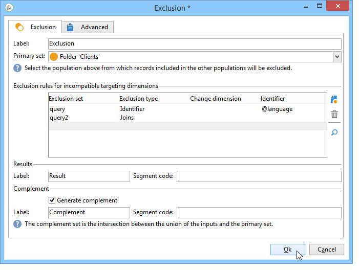
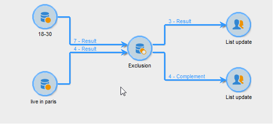

# 除外{#exclusion}

「**除外**」タイプのアクティビティでは、別のターゲットを 1 つ以上抽出したメインターゲットからターゲットを作成します。

このアクティビティを設定するには、ラベルを入力してメインの受信者セットを選択します。メインセットから生成した母集団により、結果を構築できます。 メインセットおよびエントリアクティビティの最低 1 つに共通するプロファイルが除外されます。

>[!NOTE]
>
>除外アクティビティの設定と使用について詳しくは、[母集団の除外（除外）](targeting-workflows.md#excluding-a-population--exclusion-)を参照してください。

残りの母集団を利用するには、「**[!UICONTROL 補集合を生成]**」オプションをチェックします。 補集合には、メインの入力母集団から出力母集団を引いたものが含まれます。 その後、次の図のように、追加の出力トランジションがアクティビティに追加されます。

## 除外の例 {#exclusion-examples}

次の例では、年齢が 18 歳から 30 歳で、パリに住んでいる人を除く受信者のリストを作成しようとしています。

1. 2 つのクエリの後に、「**[!UICONTROL 除外]**」タイプのアクティビティを挿入して開きます。 1 番目のクエリは、パリに住んでいる受信者をターゲットにしています。 2 番目のクエリは、年齢が 18 歳から 30 歳の人をターゲットにしています。
1. メインセットを入力します。 ここでは、メインセットは **18 歳から 30 歳**&#x200B;のクエリです。 2 番目のセットに属する要素は、最終結果から除外されます。
1. 実行後に残った母集団を利用するには、「**[!UICONTROL 補集合を生成]**」オプションをチェックします。 この場合の補集合は、パリに住む 18 歳から 30 歳の受信者で構成されます。
1. 除外設定を承認してから、結果にリスト更新アクティビティを挿入します。 必要に応じて、補集合に追加のリスト更新アクティビティを挿入します。
1. ワークフローを実行します。 この例では、結果は 18 歳から 30 歳、パリに住んでいない受信者から構成され、補集合に送られます。

   

## 入力パラメーター {#input-parameters}

* tableName
* スキーマ

各インバウンドイベントは、これらのパラメーターによって定義されるターゲットを指定する必要があります。

## 出力パラメーター {#output-parameters}

* tableName
* スキーマ
* recCount

この 3 つの値セットは、除外によって生成されたターゲットを識別します。 **[!UICONTROL tableName]** はターゲットの識別子を記録するテーブル名、**[!UICONTROL schema]** は母集団のスキーマ（通常は nms:recipient）、**[!UICONTROL recCount]** はテーブル内の要素の数です。

補集合に関連付けられたトランジションは、同じパラメーターを持ちます。
